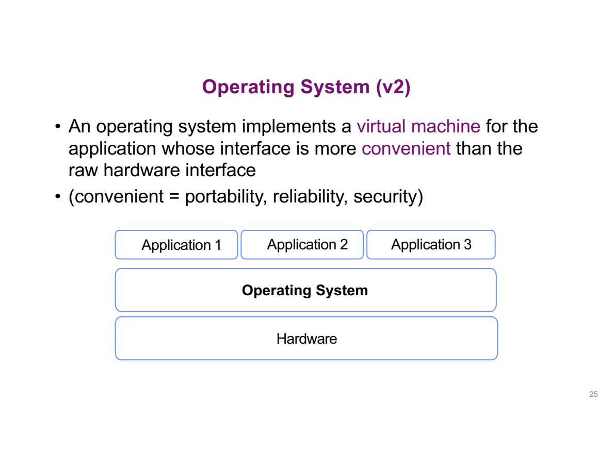
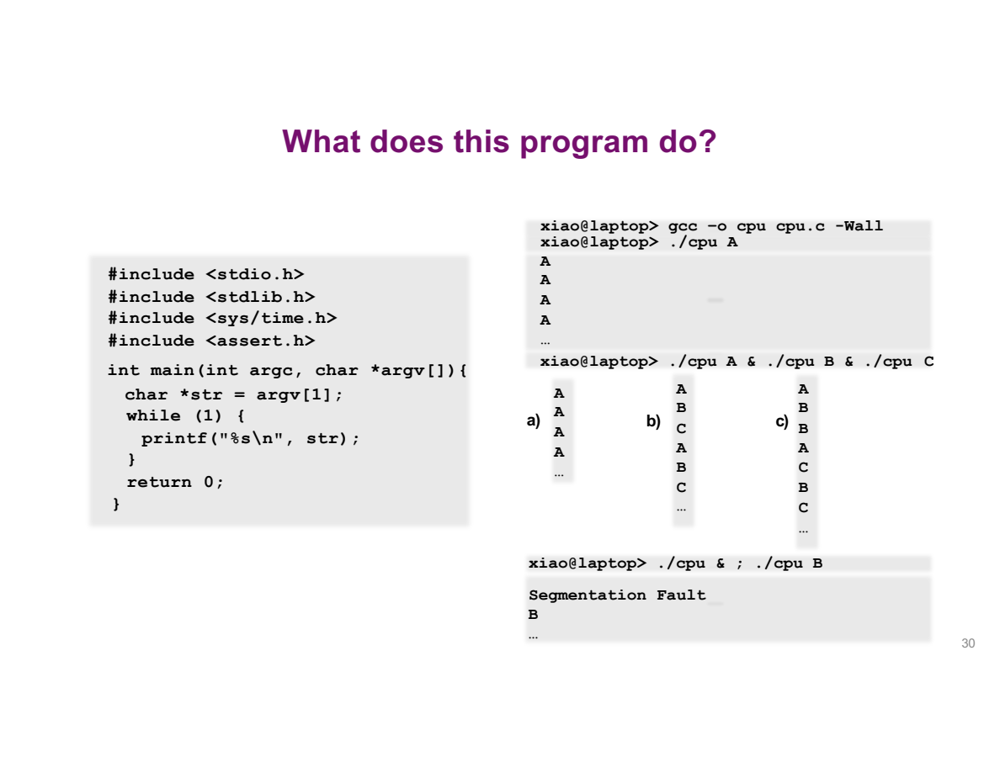
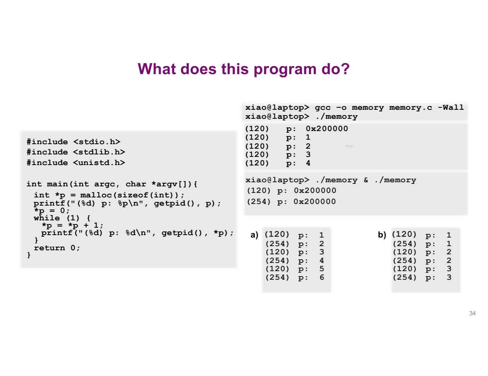

# Lecture 1 · Introduction: What Is an Operating System?

> CSC3150 · CUHK-Shenzhen · Fall 2026 · Slides adapted from Berkeley CS 162

**TL;DR**: The OS turns messy shared hardware into a **simple, private, seemingly-infinite virtual machine** for every application. It does this wearing three hats: **Referee, Illusionist, Glue**. We judge an OS by overhead, fairness, portability, reliability, security, and performance.

***

## 1. Why learn OS at all?

核心问题：这门课和我有什么关系？

* **Every program you will ever write runs on an OS.** 程序的性能和行为不只由你的代码决定，还取决于底层 OS 怎么调度、怎么管内存。想真正优化一个程序，就得理解它脚下这一层。
* **跨平台体感**：同一份逻辑跑在手机、电脑、IoT 设备上，行为差异会非常明显。懂 OS 才知道这些差异从哪来。

***

## 2. Why is OS design so hard?

核心问题：为什么写一个 OS 比写普通软件难得多？

### a) The OS is everywhere, and it is never finished (Bell's Law)


Roughly **every 10 years a new device class appears**: mainframe → PC → laptop → cell → cloud/IoT. Each one forces the OS to be rethought. OS 设计永远赶不上硬件形态的演化。

换个角度读这条定律，就是**人均设备数**的变化：从每百万人共享一台计算机，到每人一台，再到今天每人多台（家里的灯泡、空调里都是计算机）。下一个十年，这个数还会涨一个量级。

### b) One OS spans ~8 orders of magnitude in time


L1 cache reference costs **0.5 ns**; a CA↔Netherlands packet round trip costs **150,000,000 ns**. The OS must make correct decisions at *every* scale in between. 从纳秒级缓存到百毫秒级网络，调度策略没法"一刀切"。

不协调的代价很具体：**快任务会被慢任务挡住**，延迟被放大上百万倍。OS 就是在这 8 个数量级之间做协调的那一层。

### c) Complexity keeps exploding


Original Unix: **4,501 LoC**. Linux 5.6: **27.8 M**. A modern car: **~100 M**. 课堂补充的数据点：Firefox 数百万行（浏览器大到有人争论它今天算不算一个 OS）、初代 Android 约 1000 万行、Windows 7 约 4000 万行、macOS 接近 1 亿行。车载代码量大有原因：大部分是安全性代码，车不能随便 crash。

背后的驱动力：smarter hardware、higher reliability/security/efficiency expectations、以及永远不会消失的 legacy interfaces。

而且这个趋势不会停：过去程序员刻意控制代码量，是为了人能读懂、能维护；**AI agent 写代码不在乎可读性**，"能塞多少塞多少"，未来 OS 的复杂度只会涨得更快。

***

## 3. So, what *is* an OS?

**Definition v1: the resource layer**


> The layer of software interfacing **(many) applications** with **(diverse) hardware**.

**Definition v2: the virtual machine**（本课程真正的主线）

> The OS implements a **virtual machine** per application whose interface is *more convenient* than raw hardware. Convenient means **portable, reliable, secure**.



图里每个 Application 框看到的不是下面的 Hardware，而是 OS 提供给它的那台"更好用的虚拟机"，接口更 convenient（portable、reliable、secure）。

v1 说"OS 共享硬件"，v2 说"OS **改变硬件看起来的样子**"。从 v1 到 v2 的视角转换是整门课的钥匙。

***

## 4. Three hats of an OS


### 4.1 Referee 🟥 protection, isolation, sharing

核心问题：多个**互不信任**的程序如何同时安全地跑？


| Concern | Question | Mechanism（后续章节展开） |
| ---------------- | ------------------- | -------------------------------- |
| Fault isolation | 程序之间、程序与 OS 之间如何隔离？ | Process, **dual-mode execution** |
| Resource sharing | 下一个跑谁？物理资源怎么分？（1 TB 内存怎么分给 1000 个任务？平均分吗？） | Scheduling |
| Communication | 程序间如何安全地交换结果？ | Pipes / sockets |

Communication 的体感例子：你手动 copy-paste 两个程序间的数据，相当于**人自己当了总线**；Chrome 每个 tab 是独立进程，标签页之间要交换数据必须经 OS 协助。IPC（inter-process communication）解决的就是这件事。

> 💡 **Dual-mode execution**：CPU 分 user mode 和 kernel mode。用户态程序不能直接碰硬件和别人的内存，危险操作必须经 **system call** 进入内核。这是"敢跑不可信程序"的硬件地基。

#### Demo 1 · `cpu.c`: the many-CPUs illusion

**先读懂参数**：`argc` 是命令行参数个数，`argv` 是参数数组。**`argv[0]` 永远是可执行文件自己的名字**，所以 `./cpu A` 时 argc = 2，`argv[1]` 才是 `"A"`。

**What the code does**（逐行拆解）:

```c
int main(int argc, char *argv[]) {
    char *str = argv[1];            /* 命令行第一个参数，如 "A" */
    while (1) { printf("%s\n", str); }   /* 无限循环打印它 */
}
```

这个程序一旦启动就**永远不会自己结束**，是观察 OS 行为的完美"探针"。



这张图的信息量很大：右上是单进程运行，全是 `A`；中间 a/b/c 是三个候选输出（全 A / 整齐 `ABCABC` / 无规律混合）；最下面还藏着一个小实验，`./cpu & ; ./cpu B` 直接 **Segmentation Fault**，因为第一条命令没带参数，`argv[1]` 不存在。

> ⚠️ 这段代码其实**不安全**：直接访问 `argv[1]` 却没有检查 `argc`。不带参数运行 `./cpu`，`argv[1]` 根本不存在，程序立刻 segfault。这里为了演示故意从简，正经代码必须先判 `argc >= 2`。

**先预测，再看结果**：三个死循环一起跑，输出会是什么样？

* A：全是 `A`（谁先跑谁霸占 CPU）
* B：整齐的 `ABCABC`
* C：无规律混合

**The experiment**:

```bash
clang -o cpu cpu.c
./cpu A & ./cpu B & ./cpu C &    # shell 的 & = 后台运行，同时存在 3 个进程
```

Actual output captured on macOS（0.15 s 内的尾部切片）:

```
A B A A C A C B C B B A C B C B B A B C B C B C B C B A B A A C A C B ...
```

现代 OS 上答案是 **C**。但注意，**这个答案是"现代 OS"的答案**：回到 1980 年代，OS 一次只能跑一个任务，答案会是 A；在 Mac OS 9 / Win 3.1 这类 cooperative 系统上，答案同样是 A。选项和年代的对应关系，正是 preemptive scheduling 演化出来的证据。

**How to read this output**:

1. 三个程序各自陷入死循环。理论上谁"先跑"谁就该永远霸占 CPU，输出应该全是 `A`。
2. 实际却是无规律的交替。这说明有"第三者"在**反复打断**当前程序，把 CPU 交给下一个。这个第三者就是 OS。
3. 交替无固定模式（不是整齐的 `ABCABC`），因为调度由 **timer interrupt** 触发，时机对程序不可见。

**The mechanism**: 每次 timer interrupt 到来，CPU 自动跳转到内核。OS 保存当前进程的寄存器现场（**context**），加载另一个进程的现场继续跑。这就是 **context switch**。切换足够快（毫秒级），每个进程就感觉自己在连续执行，这就是 **virtualized CPU**。

> 💡 **Cooperative vs preemptive**：如果 OS 只能*等程序主动*交出 CPU，即 **cooperative multitasking**（Mac OS 9 / Win 3.1 时代），这个 `while(1)` 程序会永远霸住处理器，**整机卡死**。现代 OS 用 **preemptive multitasking**：timer interrupt 是硬件行为，不需要程序配合，OS 随时能夺回控制权。一个死循环最多占满它自己的时间片，拖不垮系统。

### 4.2 Illusionist 🎩 hide hardware limits via virtualization

核心问题：如何让每个程序都觉得自己独占一台无限强的机器？

* **All alone**: exclusive use of the machine
* **All powerful**: resources feel infinite
* **All expressive**: capabilities that don't physically exist

注意 all powerful 是假象而不是承诺：在一块智能手表上 `malloc` 100 GB，大概率失败，但*偶尔*真能成功（有 swap 和虚拟内存时）。假象的边界本身就是设计的艺术。

#### Demo 2 · `memory.c`: the private-memory illusion

**What the code does**（逐行拆解）:

```c
int *p = malloc(sizeof(int));              /* 堆上申请 4 字节，p 存其地址；malloc ≈ C++ 的 new */
printf("(%d) p: %p\n", getpid(), p);       /* getpid() = 进程 ID；%p 打印 p 里的地址值 */
*p = 0;
while (1) { *p += 1; printf("(%d) p: %d\n", getpid(), *p); }   /* 反复给 *p 加 1 并打印 */
```

注意区分两个东西：`p` 是**地址**（这 4 字节"在哪里"），`*p` 是**值**（那 4 字节里"存了什么"）。

`getpid()` 返回的 PID 是 OS 给每个进程分配的身份证号。课后可以在终端跑 `ps` 亲眼看看：系统里每个进程都有自己的 PID，Chrome 每开一个 tab 就多一个进程。

**先预测**：两个进程打印同一个地址，各自的计数器会怎样？混在一起互相覆盖，还是各自独立增长？



a) 是"共享内存"的预测：计数器交叉混成 1, 2, 3, 4, 5, 6。b) 是"各自独立"的预测：两边各数各的 1, 2, 3。右上已经剧透了关键事实：两个进程 PID 不同（120 和 254），打印的地址却都是 `0x200000`。

**The experiment**（本机真实运行，两个进程同时跑）:

```
(5536) p: 0x102b9da60      (5535) p: 0x104d45a60
(5536) p: 1                (5535) p: 1
(5536) p: 2                (5535) p: 2     ← 两个计数器完全独立
(5536) p: 3                (5535) p: 3
```

课件里 Linux 上的版本更戏剧化：两个进程打印出**完全相同的地址** `0x200000`，计数器却互不干扰。（macOS 上实测地址不同，因为 macOS 默认开 ASLR 随机化地址，但结论一样：各自的计数器互不可见。）

**Why this is astonishing**: 两个进程都在对"自己看到的那个地址"读写。如果程序直接操作**物理内存**，相同地址就是同一个内存单元，两个计数器必然互相覆盖（你加 1 我也加 1，数字会翻倍乱跳）。事实没有发生，所以程序看到的地址**不是**物理地址。

> 💡 **Virtual memory**：每个进程看到的地址是**虚拟地址**，OS 借助硬件 **MMU** 和 **page table** 把它翻译成各自不同的物理位置。效果：每个进程都以为自己独享一块从熟悉地址开始的连续内存。**隔离性**（谁也碰不到谁）和**便利性**（不用关心物理内存在哪）一次搞定。Address Space 章节会完整展开翻译机制。

**反向验证**：如果没有 virtual memory，任何程序的一个野指针 bug 就可能改写别的进程、甚至内核的内存，multiprogramming（多程序共存）根本不可能安全实现。这也是为什么 virtual memory 是 Referee（隔离）和 Illusionist（假象）两顶帽子的交汇点。

### 4.3 Glue 🩹 common services

核心问题：如何避免每个程序都重造轮子？

File system、UI、networking 等标准服务带来三个好处：sharing easier（大家用同一套 primitives）、reuse maximized、components evolve independently。

三顶帽子之外记住一个定位：**OS 终究是应用的仆人（servant）**。裁判、魔术师、胶水，所有机制最终都是为应用服务的。

### Putting it together


左边是现实：一堆杂乱的 processor、memory、storage、networks。右边是每个程序*看到*的世界：infinite processors、infinite memory、标准服务。**这个从"杂乱共享"到"私有虚拟机"的变换，就是 OS 本身。**

***

## 5. How do we judge an OS?

核心问题："好 OS"的标准是什么？abstractions must be **efficient, low-overhead, equitable**。

| Criterion | Meaning | 关键词 |
| ----------- | -------------------- | ----------------------------------------- |
| Overhead | 提供 abstraction 的额外代价 | virtualization is not free |
| Fairness | 资源在应用间分配是否公平 | scheduling policy |
| Portability | 硬件变了，app/OS 要改多少 | **AMI / HAL**（见下图） |
| Reliability | 系统做它该做的；OS 挂掉是灾难性的 | availability = f(MTTF, MTTR) |
| Security | 攻击下维持正常功能 | integrity + privacy |
| Performance | 满足用户与管理员预期 | response time, throughput, predictability |

Reliability 有一个现实锚点：**2024 年 7 月 19 日的 CrowdStrike 事件**。一个安全软件的故障更新让全球约 850 万台 Windows 机器蓝屏，机场值机、医院、银行大面积停摆，被称为史上最大规模的 IT 事故。这就是为什么 OS 级故障是 catastrophic 的，也解释了为什么要同时量化两个指标：**MTTF**（mean time to failure，多久坏一次）和 **MTTR**（mean time to repair，坏了多久能修好）。故障不可能完全避免时，修得快和坏得少同样重要。

Portability 值得单独看，它解释了所有现代 OS 的分层设计：


* **AMI (Abstract Machine Interface)**: 面向应用的 syscall 接口，硬件变了它也**保持稳定**。
* **HAL (Hardware Abstraction Layer)**: 面向设备的一层，吸收硬件差异。
* 不可能每出一款新硬件就重写所有 app，而且必须**为还不存在的硬件做设计**。

***

## 6. Why this course matters more in the AI age

Rich Sutton (Turing Award 2024), *The Bitter Lesson*: **handcrafted knowledge plateaus; learning + search scale with computation.**

国际象棋是最好的例证：早期人们把手写的下棋技巧塞进机器，全部撞上瓶颈；只有等算力增长、让机器自己学，才真正成功。这条脉络一路从 AlphaGo 走到 deep learning 再到今天的 LLM。

本课的补充视角：**systems unlock that computation**。


AI 训练需求每 18 个月涨 **10×**，Moore's Law 只给 **2×**，缺口越来越大。GPU/专用芯片、从 server 到 pod 的规模化，全都依赖更好的 scheduling、memory、parallelism、networking。全是 OS 的活。

> Takeaway: **More efficient computation creates more room for intelligence.** Scale changes, hardware changes, application changes, so the OS will keep changing.

***

## 7. Self-check

1. 用一句话向没学过 CS 的人解释 OS 是什么。
2. `memory.c` 里两个进程地址相同却互不干扰，靠的是什么机制？如果关掉它会发生什么？
3. Preemptive vs cooperative multitasking 的区别？哪一种能让一个死循环程序冻住整机？
4. Referee / Illusionist / Glue 各管什么？dual-mode execution 属于哪一顶 hat 的职责？
5. 为什么 portability 要求 AMI 稳定而 HAL 可变？

<br />

**A1.** OS 是一层软件，把杂乱共享的硬件变成每个程序眼中一台**简单、私有、看起来无限大的专属电脑（virtual machine）**。

**A2.** 靠 **virtual memory**：程序看到的地址是虚拟地址，OS 借助硬件 **MMU** 和 **page table**（虚拟地址 → 物理地址的字典）把每个进程的虚拟地址翻译到**不同的物理位置**，所以同地址、不同内存。**如果关掉它**（程序直接用物理地址）：两个进程写同一地址 = 写同一内存单元，计数器互相覆盖；更糟的是任何程序的野指针 bug 都能改写别的进程甚至内核，multiprogramming 根本没法安全实现。

**A3.** 区别在于**谁收回 CPU 控制权**：

| | Cooperative | Preemptive |
| ------ | ------------------ | ------------------------------- |
| 谁决定切换 | 程序**主动**交出 CPU | OS 靠硬件 **timer interrupt 强制**收回 |
| 死循环后果 | **整机卡死**（永不 yield） | 只占满自己的时间片，系统照常 |
| 代表 | Mac OS 9 / Win 3.1 | 所有现代 OS |

会冻住整机的是 **cooperative**。

**A4.** **Referee** = protection / isolation / sharing（process、dual-mode execution、scheduling、pipes）；**Illusionist** = virtualization 假象（virtual memory、virtualized CPU）；**Glue** = common services（file system、network、UI）。**Dual-mode execution 属于 Referee**：user mode 下程序碰不了硬件和别人内存，危险操作必须走 system call 进 kernel mode，裁判靠这条红线执法。

**A5.** **AMI** 是 OS 对**应用程序**的承诺（`fork()`、`read()` 等 syscall），全世界软件都照着它写。它跟着硬件变，生态就会崩溃，所以必须**几十年稳定**。**HAL** 是 OS 内部面向硬件的一层，新设备来了只改 HAL/驱动，应用无感。一句话：**对上用不变的接口稳住应用生态，对下用可换的一层吸收硬件变化**，这就是"为还不存在的硬件做设计"。

***

*Images extracted from the official Lecture 1 slides. Notes rewritten in my own words for review; errors are mine.*
