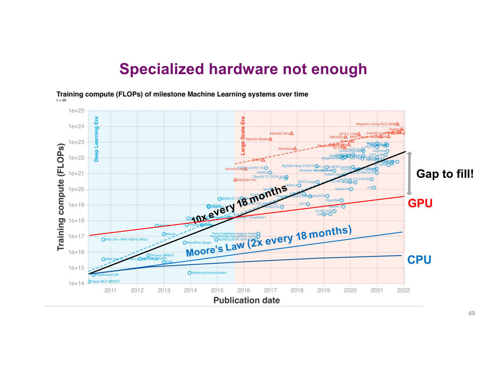

# Lecture 1 · OS 导论 {#lecture-1-·-why-operating-systems-exist}

**TL;DR**

- OS 一边分配和保护硬件资源，一边提供程序容易使用的接口。
- Referee 管共享规则，illusionist 提供抽象，glue 提供共同服务。
- 评价一个设计，要分清它改善了响应时间、吞吐量，还是可靠性等其他指标。

## 1. 设计难题 {#_1-why-os-design-is-hard-·-设备、时间尺度与复杂性}

**核心问题：为什么 OS 不能用一种策略让所有指标同时最好？**


设备类别不断扩展，资源预算从服务器到小型设备差异很大。历史上的周期性观察说明设计环境会变化，不是保证未来固定每十年出现某类产品的规律。

这张图同时比较两件事：

- **横向看设备变化**：从 mainframe 到 PC、移动设备，再到更小的联网设备，计算机逐渐进入更多使用场景。
- **纵向看每人可用的设备数量**：早期是许多人共享一台大机器，后来是一人一台，再到一个人同时使用多台设备。
- **对 OS 的要求**：同样是管理 CPU、内存和设备，大型服务器强调吞吐量，小型设备可能更受电量和内存限制。因此，“都是计算机”不等于适合同一套资源策略。


按“CPU 能做多少工作”来理解等待：

- 历史示例中，main memory reference 约 100 ns，disk seek 约 10,000,000 ns，即 10 ms。
- `10,000,000 / 100 = 100,000`：一次寻道的延迟，约为一次内存访问的十万倍。
- 因此“人只等了很短一下”不表示 CPU 没有浪费大量可用时间。这正是后续 compute / I/O overlap 的动机。

Cache、main memory、storage、network 的访问延迟跨越多个数量级。图中是历史参考数量，不是当前机器的实测参数；学习目标是理解“等待慢设备时 CPU 可能有机会推进别的工作”。

假设任务计算 2 ms 后等待 I/O 20 ms。如果这段等待没有其他 ready 工作，CPU 会闲置；若另一个任务可运行，调度可以利用这段时间。等待和计算的具体重叠还受设备、依赖关系和 CPU 工作量限制。


复杂性为什么会增加？不只是“功能越来越多”：

- **硬件不同**：服务器更关心吞吐量，小型电池设备还必须节能，不能简单照搬同一套策略。
- **目标更多**：除了把程序跑完，还要及时响应、限制故障影响、防止越权访问。
- **并行更多**：多核能一起工作，但共享数据也需要协调。
- **兼容旧软件（legacy）**：新增功能时，往往还要让原来的程序和接口继续工作。

这些要求需要更多机制配合。图中的代码规模是历史背景，不能直接把代码更多理解成质量更好。

**Safety-critical（安全关键）设备为什么更难设计？** 对普通编辑器，一次故障可能丢失未保存的内容；对车辆控制等系统，错误结果或错过响应时刻还可能影响人身安全。因此，不能只优化“平均多快”，还需要考虑最坏情况下能否及时完成、出错后如何限制影响。设备之间还通过网络交换数据，单机之外也需要共同的通信接口。

## 2. OS 是什么 {#_2-os-的位置与职责}

**核心问题：有了 CPU 和 memory，为什么还需要 OS？**

CPU 能执行指令，memory 能存储数据，设备能完成 I/O。但这些硬件能力没有直接回答：谁先用 CPU，程序能写哪些地址，文件怎样组织，设备怎样被不同应用使用。

**An operating system is system software that manages hardware resources and provides services and abstractions to applications.**

Kernel 是其中以特权运行、负责关键资源与保护机制的核心；完整 OS 还可以包含 libraries、utilities 等组件。


Applications 使用接口请求服务；OS 管理 CPU、memory 和 devices。普通用户指令通常直接由 CPU 执行，并非每一步都由 OS 软件解释。只有需要受控服务或发生特定事件时，执行才进入 kernel。

例如读取文件：应用请求“读取这个文件的下一段”，不必自己决定磁盘控制器命令、设备中断或其他进程能否同时访问设备。这种分工既降低编程负担，也让共享规则有统一执行者。

## 3. 三个角色 {#_3-three-roles-·-分配、抽象、接口}

**核心问题：多个应用共用硬件时，OS 要解决哪三类问题？**


| Role | 先问的问题 | OS 提供的回答 |
|---|---|---|
| Referee | 谁可以用哪些资源？发生冲突怎么办？ | 分配规则、保护边界、受控通信 |
| Illusionist | 应用能否用更简单的方式理解硬件？ | 独立执行流、地址空间等抽象 |
| Glue | 不同应用怎样复用共同能力？ | 文件、网络、界面等标准服务 |

### Referee：分配与保护 {#referee-·-分配与保护}

**核心问题：一个程序一直计算，其他程序还有机会运行吗？**


假设 A、B 两个程序同时运行，会出现三类问题：

- **Resource allocation（资源分配）**：只有一个 CPU 可用时，先运行 A 还是 B？各运行多久？
- **Protection（保护）**：A 写错一个地址，能不能把 B 的数据也改坏？OS 要限制这种破坏。
- **Communication（通信）**：如果 A 本来就需要把结果交给 B，OS 又要提供允许它们合作的途径。

这就是 referee 的作用：既制定共享规则，也执行保护边界。

**先读程序：为什么一个 A 会被打印很多次？**

下面是 `cpu.c` 的主体，头文件为 `<stdio.h>` 和 `<stdlib.h>`：

```c
int main(int argc, char *argv[]) {
    if (argc != 2) {
        fprintf(stderr, "usage: cpu LABEL\n");
        return EXIT_FAILURE;
    }
    char *str = argv[1];
    while (1) {
        printf("%s\n", str);
        fflush(stdout);
    }
}
```

执行 `./cpu A` 时，从第一行往下跟：

1. Shell 启动程序，把命令行拆成字符串参数：`argv[0]` 是 `"./cpu"`，`argv[1]` 是 `"A"`，所以 `argc = 2`。
2. `argc != 2` 为假，跳过报错分支。如果只输入 `./cpu`，就会报错退出，避免把缺失参数交给 printf。
3. `str = argv[1]`：str 保存字符串 A 的地址。这里没有打印，也没有把 A 转成数字。
4. `while (1)`：条件一直为真，所以循环没有正常结束的出口。
5. `printf("%s\n", str)`：沿 str 找到字符串，打印 A 并换行。`fflush(stdout)` 把暂存在输出缓冲里的内容交出去。
6. 回到 while，再次打印 A。str 没变，因此这个程序自己不会突然打印 B 或 C。

参数数组末尾还有 `argv[2] = NULL`，它是结束标记，不算第三个参数。类似地，`./cpu 12` 传入的是字符串 `"12"`，要做整数运算还需解析。

**接着预测：三个这样的程序一起运行，会看到什么？**

- 只有 A：第一个程序一直循环，B 和 C 没机会执行？
- 严格 `ABCABC`：OS 每打印一个字母就换一个程序？
- A、B、C 都出现，但顺序和连续次数不固定？

本机将三个实例的输出写到同一个文件，截取了连续 24 行。为方便比较，下列用空格代替换行，顺序保持不变：

```text
A A B B A A A C C A A A C C C B B A A A C C C B
```

这次观察对应第三种。**三个程序都有进展，但 OS 没有承诺按字母轮流。** 要理解原因，先设想只有一个 CPU core：

1. A 正在运行时，这个 core 不能同时执行 B。
2. 要让 B 前进，就必须暂时停下 A，记住 A 执行到哪里。
3. 之后让 B 运行，再恢复 A。A 继续自己的循环，不必从 main 重新开始。
4. 这种保存、恢复执行状态的过程叫 **context switch（上下文切换）**。

**但 A 的循环没有主动写“让 B 运行”，谁取回 CPU？**

- **Cooperative scheduling（协作式调度）**：依靠当前程序主动让出控制。若它一直计算且不让出，其他任务就可能一直等。
- **Preemptive scheduling（抢占式调度）**：OS 预先设置 timer；时间到，硬件产生 interrupt，使 CPU 进入内核。OS 获得机会保存当前状态，选择接下来运行的任务。

> 💡 Timer 不需要 while 循环同意，也不必等循环结束。因此，“程序逻辑上一直运行”可以由“获得 CPU → 暂停 → 恢复”的许多小段实现。程序看到持续的执行流，底层 CPU 却可以被多个任务共用。

**如果没有传入 A，会发生什么？** 原先不检查参数的写法会把 `argv[1]` 当字符串使用。对于这里正常启动且 `argc == 1` 的情况，`argv[1]` 是 NULL；把它交给 `%s` 不是合法的字符串访问，行为未定义。它可能崩溃，也可能在某些库上显示 `(null)`，不能把某一种现象当成 C 保证。上面的 argc 检查让这条错误路径明确报错退出。

这个打印实验还有两点观察边界：输出可能因 I/O 等待而切换，不是每次换字母都代表 timer 到期；多核也可能同时执行多个实例，所以仅凭日志不能判断机器是否在单核交替。

**自己运行时怎样观察？**

```sh
cc -std=c11 -Wall -Wextra demos/lec01/cpu.c -o /tmp/os-cpu-review
/tmp/os-cpu-review A
```

一个实例会持续打印 A，Ctrl-C 结束。在 shell 中，`&` 表示后台运行，例如 `./cpu A &`；它不是 C 中取地址的 `&`。后台进程需单独管理，初次实验可以先在两个终端分别运行 A、B，观察两者都能持续推进。

从这个实验回到 referee：**共享 CPU 不只是在内存中放几个程序，还要有让出或取回控制、保存进度、选择下一项工作的机制。**

### Illusionist：提供抽象 {#illusionist-·-提供抽象}

**核心问题：应用为什么不必知道其他程序占了哪些物理地址？**


OS 给应用提供便于使用的抽象：thread 看起来有持续的执行流，process 看起来有自己的 address space，file 看起来是有名称的持久数据。这里的 “virtual machine” 是广义抽象，不专指运行另一个 guest OS 的完整虚拟机。

**先读程序：这次不断变化的是什么？**

下面保留 `memory.c` 的计数逻辑，省略演示用的延时与整数上限处理；运行时使用仓库里的完整版本：

```c
int *p = malloc(sizeof *p);
if (p == NULL) return 1;
printf("(%ld) address: %p\n", (long)getpid(), (void *)p);
*p = 0;
while (1) {
    *p = *p + 1;
    printf("(%ld) value: %d\n", (long)getpid(), *p);
}
```

1. `sizeof *p` 求一个 int 对象需要的字节数；`malloc` 申请这些空间，返回地址。失败时返回 NULL，因此先检查。
2. `p` 存地址，`*p` 表示这个地址上的 int。第一条 printf 的 `%p` 打印地址，括号里则是 `getpid()` 查到的进程编号。
3. `*p = 0` 沿 p 找到对象，把其中的值设为 0。p 本身没有变成 0。
4. 第一次循环读取 0，加 1，再写回，所以 value 输出 1。第二次同理得到 2。
5. 程序没有重新给 p 赋值，也没有再次 malloc；始终在修改最初申请的那个 int。

**再预测：启动两个实例，是共同数到 6，还是各自数到 3？**

如果它们修改的是同一个 int，那么一边的更新就会影响另一边。如果是两个独立对象，就应当各自从 0 开始。

本机实际同时启动两个实例，前几行如下：

```text
实例一                         实例二
(18291) p: 0x100b39b10         (18292) p: 0x1023d9b10
(18291) p: 1                  (18292) p: 1
(18291) p: 2                  (18292) p: 2
(18291) p: 3                  (18292) p: 3
```

两边各有自己的计数器。不过，这次地址不同还不够回答更关键的问题：**如果两个实例打印的地址数值相同，会不会变成同一个计数器？**

答案仍然不一定相同。普通进程私有内存可以这样理解：

<StudyDiagram id="lec01-introduction-2" />

- **如果是同一个物理地址**，就指向同一个存储位置。
- 但程序使用的是自己 address space 中的 **virtual address（虚拟地址）**。同一个编号放在两个不同地址空间里，可以翻译到不同位置。
- OS 设置映射，由地址翻译硬件在访问时执行。程序不用先打听“别的程序把哪里占了”，仍能访问自己的对象。

> 💡 比较指针时，要同时问“哪个进程中的地址”。两个家庭都有 101 房间，不意味着同一间房。Virtual memory 让程序使用便于理解的地址视图，也为限制访问范围提供机制。

本次实测地址不同，说明不能把“两个进程地址必须一样”当成实验要求；ASLR、分配器和运行环境都可能影响数值。**需要解释的是地址属于谁、对应哪个对象，而不是记住某个十六进制数字。**

**Illusionist 的三个侧面：**

- **All alone**：应用以自己的执行流和地址空间工作，不必手工避开其他程序的普通变量。
- **All powerful**：以可申请资源的抽象编程，不必预先知道每一块物理资源在哪；资源仍可能不足。
- **All expressive**：软件组合已有硬件能力，提供硬件本身没有直接提供的接口，例如 file、socket。抽象能力不等于没有实现成本。

**运行 memory 示例**

```sh
cc -std=c11 -Wall -Wextra demos/lec01/memory.c -o /tmp/os-memory-review
/tmp/os-memory-review
```

在两个终端各运行一次即可比较；用 Ctrl-C 结束。完整版本把输出放慢以便阅读，并避免计数持续增长导致有符号整数溢出。

想单独确认命令行参数，可以运行 `demos/lec01/arguments.c`：

```sh
cc -std=c11 -Wall -Wextra demos/lec01/arguments.c -o /tmp/os-arguments
/tmp/os-arguments A 12
```

实际输出：

```text
argc = 3
argv[0] = /tmp/os-arguments
argv[1] = A
argv[2] = 12
argv[argc] is NULL: yes
```

### Glue：共同服务 {#glue-·-统一接口}

**核心问题：为什么应用不必为每一种磁盘写一套读文件逻辑？**

例如，编辑器想把文字保存到文件，不应为每一种磁盘重新写一套保存逻辑：

1. 编辑器调用系统提供的文件接口，表达“把这些内容写入这个文件”。
2. OS 处理文件位置、访问权限等共同问题。
3. **Device driver（设备驱动）** 再把请求转成具体设备能执行的操作。

应用使用共同接口，设备差异由下层处理。这样既能复用文件服务，也更容易更换硬件。


把层次中的两条边界分开：

1. **AMI（Abstract Machine Interface）面向应用**：规定应用怎样请求服务。例如“打开文件、读取内容”，不要求应用自己发送磁盘控制命令。
2. **HAL（Hardware Abstraction Layer）面向硬件**：下层实现适配具体设备，让上层尽量使用共同的操作方式。
3. **换硬件时**：尽量改动驱动等适配部分，保持应用依赖的接口。这就是 portability（可移植性）的设计方向。

这里说的是减少改动，不是保证任意二进制文件跨平台直接运行；指令集、二进制接口和系统 API 仍需兼容。

### 三个角色的配合 {#三个角色如何一起工作}


- **物理层**：processor、memory、storage、network 和 input/output devices 是共同的底层资源。
- **应用视图**：每个 program 使用自己的执行与内存抽象，并通过 storage / network manager、GUI 等接口请求服务。
- **OS 的工作**：把多个应用的请求映射到同一套硬件，同时实施分配和保护。
- **Infinite 的边界**：表示编程视图隐藏部分资源限制，不是承诺无限实际容量或计算速度。

以两个程序同时“读文件并处理数据”为例，可以把左右两侧接起来：

1. 每个程序各自调用文件接口，这体现 **glue** 提供共同服务。
2. 处理数据时各用自己的变量与执行流，这体现 **illusionist** 提供便于编程的视图。
3. 底下仍共用 CPU、内存和存储设备；谁先用、谁能访问哪些内容，由 **referee** 实施分配和保护。

所以三个角色会出现在同一次操作中，不是三套互不相干的 OS。

## 4. 评价标准 {#_4-evaluation-·-怎样评价设计}

**核心问题：为什么需要权衡，如何判断一种设计是否合适？**

### 性能与可靠性 {#评价指标与可用性}

**核心问题：说一个 OS “更好”，具体是哪个指标更好？**

| Criterion | Meaning | Example / tradeoff |
|---|---|---|
| Correctness | 满足定义的行为与约束 | 一个 process 不能任意写另一个的私有内存 |
| Response time | 单次请求从发起到完成的时间 | 编辑器按键何时显示 |
| Throughput | 单位时间完成的工作量 | 每秒处理多少请求 |
| Predictability | 延迟或行为变化是否可控 | 平均快但偶尔卡很久仍可能不可接受 |
| Overhead | 实现抽象额外花费的资源 | 调度、地址管理也消耗时间与内存，OS 自身不应成为主要负担 |
| Fairness | 分配是否符合选定的公平目标 | 长任务不应使其他任务无限等待 |
| Reliability | 持续正确运行的能力 | 故障发生频率 |
| Availability | 需要时可提供服务的比例 | 故障恢复速度也重要 |
| Security / privacy | 防止未授权操作或信息泄露 | 文件访问权限、内存隔离 |
| Portability | 适配不同平台的难易程度 | 把硬件相关部分隔离到清晰接口后面 |
| Energy efficiency | 完成工作消耗的能量 | 空闲时进入低功耗状态 |

**Fairness 不等于机械地平均分。** 如果 A 需要 10 GB、B 只需要 1 GB，把每个进程都分配相同容量未必合理。公平要先说明规则，例如是否按需求分配、是否保证任务不会一直得不到 CPU。

**为什么要特别保护 OS 本身？** 应用通常只能影响自己的私有内存；kernel 却管理各进程的映射、调度和设备。内核的关键状态损坏，可能影响许多原本没有错误的应用。这就是为什么“应用之间互相隔离”之外，还必须有“应用不能破坏 OS”的边界。

Security 也有不同侧面：**integrity（完整性）**关注数据和执行不被非法篡改；**privacy（隐私）**关注数据不被未授权者读取。

在简单稳定的故障与修复模型中：

```text
Availability ≈ MTTF / (MTTF + MTTR)
MTTF = mean time to failure
MTTR = mean time to repair
```

例如平均运行 99 小时后故障、平均修复 1 小时，availability 约为 99%。提高可靠性和缩短恢复时间都能提高可用性。现实系统更复杂，不能把这个近似当作适用于所有服务的测量定义。

**用打印任务区分三个性能指标：**

- **Response time（响应时间）**：提交一份文件后，多久能拿到结果？关注一次请求等多久。
- **Throughput（吞吐量）**：一小时总共打印多少份？关注完成工作的总速度。
- **Predictability（可预测性）**：同样的小文件，是通常都等几秒，还是有时等几分钟？关注表现是否稳定。

把很多任务攒成一批，可能减少切换成本、提高吞吐量，但先提交的小任务也可能因此等得更久。**评价设计前，要先明确希望改善哪个指标。**

## 5. AI 与系统 {#_5-os-in-the-ai-age-·-新负载带来什么挑战}

**核心问题：硬件和应用变了，OS 的问题是否消失？**

AI 工作负载扩展了 accelerator、memory bandwidth、distributed communication 等资源需求。CPU、GPU、网络和存储需要协调；运行多个任务时仍需要分配、隔离、通信与故障处理。

“The Bitter Lesson” 在这里提供一个背景观点：能够利用更多 computation 的通用 search / learning 方法具有扩展优势，系统效率决定可用计算能否转化为实际工作。这不是 OS 的定义，也不是对所有 AI 方法效果的无条件保证。



需求趋势与单处理器能力增长之间可能出现缺口。GPU 等 accelerator 提高特定计算的供给，但单设备的提升不自动解决规模问题；扩展到多设备、多个服务器后，又要管理数据移动、网络通信、并行执行和故障。

把需求与供给的差距拆成三步：

1. **单设备的增长不一定追得上需求**：用示意中的需求每阶段乘 10、供给乘 2 来算，需求/供给的比值每阶段乘 5。两条线都上升，也不代表差距在缩小。这是理解增长率的例子，不是对未来速度的保证。
2. **Specialized hardware（专用硬件）改善特定工作**：GPU、TPU 等适合不同计算模式；现在要决定哪项任务放在哪种硬件，以及数据何时搬过去。
3. **从 server 扩展到 pod / cluster**：更多处理器需要协同，数据经内存与网络流动。某个设备在等数据时，再强的计算能力也可能闲置；分配、通信和故障恢复就成了系统问题。

“The Bitter Lesson” 的论证重点是：为当前任务手工加入的规则可能很快遇到上限，而能利用更多计算的通用学习、搜索方法有更大的扩展空间。系统通过减少空等、提高并行利用率，让已有计算资源产生更多有效工作。

专用硬件和集群可以提高特定工作的能力，也带来不同的资源瓶颈。历史增长曲线和未来预测用于说明这种变化方向，不作为永远有效的性能承诺。

本节与前三个角色的关系是：资源种类增多，referee 的分配问题更复杂；新的硬件需要合适的 abstractions；接口仍要连接应用与实现。

## 6. 后续机制 {#_6-从职责到机制}

**核心问题：三个角色如何变成具体机制？**

| Role | Next mechanism |
|---|---|
| Illusionist | Thread 与 address space 描述应用看到的运行环境 |
| Referee | Process isolation、dual mode 与地址检查落实保护 |
| Glue | System call interface 提供受控服务入口 |

阅读下一讲时始终问：这是在保存执行状态，还是在限制访问权限？前者通向 thread 与 scheduling，后者通向 address space 与 protection。

## Self-check

1. 两个计算程序都有输出，是否证明 parallelism？
2. 若一个程序不主动 yield，OS 如何重新获得控制？
3. 两个 process 的指针数值相同，是否操作同一对象？
4. Response time 与 throughput 有何区别？
5. 一个文件读取 API 如何同时体现 referee、illusionist、glue？

6. 同一个程序在不同硬件上可移植，是否意味着同一个二进制文件必定能直接运行？
7. 某设计的吞吐量提高了，但交互请求等得更久，能否说它在所有性能指标上都更好？
8. 为什么换成更快的 GPU 后，系统仍可能花很多时间等待？

**A1.** 不证明。单核交替执行也可以产生交错输出。Parallelism 要求执行在时间上真正重叠。

**A2.** 配置 timer interrupt，硬件把控制交给受保护的 kernel 入口，由内核决定继续或切换。用户程序不能拥有任意关闭这项保护的权限。

**A3.** 不一定。指针是所在 address space 中的 virtual address，翻译结果可以不同。显式共享映射需另行分析。

**A4.** 前者描述一次请求等待多久，后者描述单位时间完成多少工作。优化一个可能损害另一个。

**A5.** Referee 检查权限并协调资源；illusionist 把设备块与控制器抽象成文件；glue 提供应用和多种设备实现共同使用的接口。

**A6.** 不意味着。共同接口减少源代码适配工作，但二进制运行还要求指令集、ABI 等兼容。要区分 source portability 与 binary compatibility。

**A7.** 不能。Throughput 衡量单位时间完成量，response time 衡量单次请求等待时间。还要结合可预测性与任务目标判断这个权衡是否合适。

**A8.** 计算只是执行链的一部分。数据供应、内存带宽、设备间传输和跨机器通信都可能成为限制；系统仍要协调这些资源，不能只看计算峰值。
