# Lecture 2 · Four Fundamental Concepts: Thread, Address Space, Process, Dual Mode

> CSC3150 · CUHK-Shenzhen · Fall 2026 · Slides adapted from Berkeley CS 162

**TL;DR**: 一个运行中的程序 = **Address Space**（内存视图）+ 一个或多个 **Thread**（执行上下文）。OS 用时间复用把单核变成多个 vCPU（illusionist 的工作），用 **dual mode** + 地址翻译把进程彼此隔离（referee 的工作）。这四个概念是后面所有章节的基本词汇。

***

## 1. Recap: virtualization at two levels

上节课的结论：OS 给每个 process 提供"独占机器"的假象。

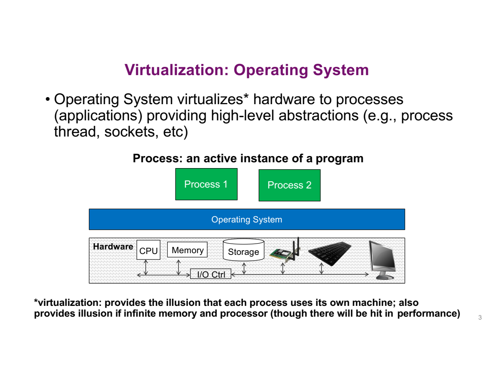

进程（Process 1 / 2）坐在 OS 层之上，OS 坐在硬件（CPU、Memory、Storage、网卡、键盘、显示器）之上，所有硬件通过 **I/O Ctrl**（I/O controller）互联。注意幻灯片底部对 virtualization 的定义：提供"独占机器 + 无限内存和处理器"的假象，但 **performance 会有损失**。假象不是免费的。

同样的思路可以再叠一层，把 OS 自己也变成被虚拟化的对象：

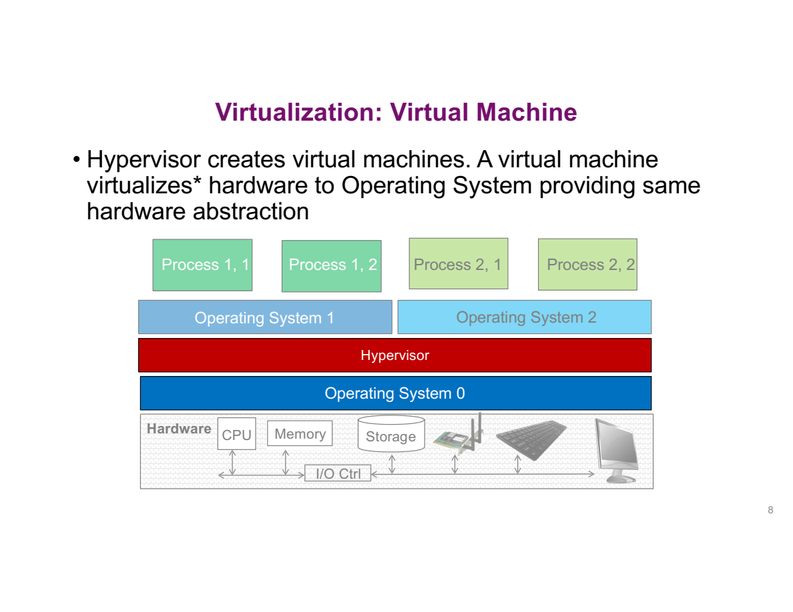

* 最顶层 `Process 1,1`、`Process 1,2`、`Process 2,1`、`Process 2,2`：命名规则是"虚拟机编号, 进程编号"，即 VM1 里跑两个进程、VM2 里跑两个进程。
* **Operating System 1 / 2**：两个 guest OS，各自以为自己独占整台机器。
* **Hypervisor**（红色）：对 guest OS 扮演"硬件"的角色，提供和真实硬件**相同**的抽象。
* **Operating System 0**：host OS，真正贴着硬件跑。你在 Mac 上用 VMware/UTM 跑 Linux 就是这个结构。
* 价值：**fault isolation**。一个 VM 里的 OS 崩了，其他 VM 完全不受影响。云计算把一台物理机切成几百台卖，靠的就是这一层。

***

## 2. 四个基本概念

| Concept | 一句话定义 | 角色 |
|---|---|---|
| **Thread** | execution context：PC + registers + stack + flags，完整描述"程序跑到哪了" | 并发的载体（active） |
| **Address space** | 程序可访问的内存地址集合及其内容 | 保护的边界（passive） |
| **Process** | address space + 1 个或多个 thread，且权限受限 | 程序运行的容器 |
| **Dual mode** | CPU 分 user/kernel 两态，配合地址翻译做隔离 | 保护的硬件地基 |

注意 address space 定义里的一句：它**可能**不同于机器的物理内存（distinct from memory space of the physical machine），此时程序就活在 **virtual address space** 里。这正是 lec01 `memory.c` 背后的机制。

***

## 3. 一个程序是怎么跑起来的

### 3.1 从源代码到进程

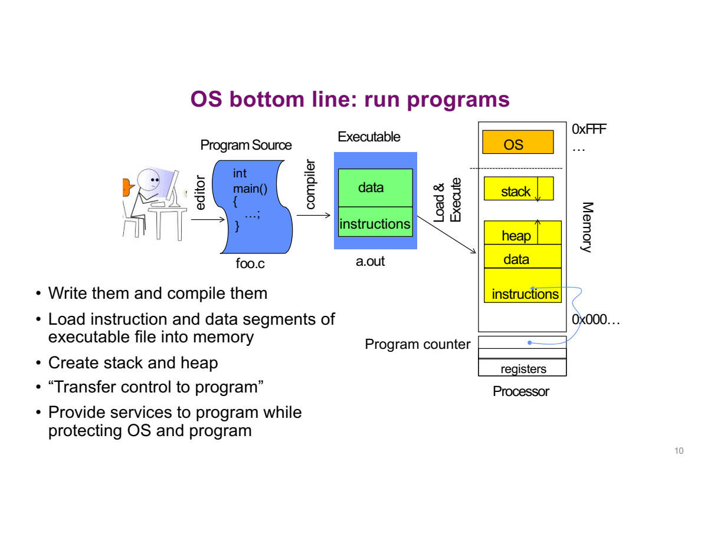

1. **Program Source**（`foo.c`）：你在 editor 里写的 `int main(){...}`。
2. **compiler**：编译成 **Executable**（`a.out`）。可执行文件内部已经分好两块：**instructions**（机器码）和 **data**（全局变量的初始值）。
3. **Load & Execute**：OS 把这两块装进内存，再创建 stack 和 heap，最后把控制权交给程序。

右侧的内存布局图从下往上读：

* `0x000…`（低地址）在**底部**，`0xFFF…`（高地址）在**顶部**。
* 最底部是 **instructions**，往上依次 **data → heap → stack**。
* heap 的箭头**朝上**（向高地址增长），stack 的箭头**朝下**（向低地址增长）。两者向对方生长，中间的空隙就是各自的余量。
* 最顶部橙色区域是 **OS** 自己占的内存。
* 下方 Processor 框里，**Program counter** 指向 instructions 区域：PC 正指着程序的第一条指令，程序即将开始执行。

### 3.2 CPU 内部：Fetch / Decode / Execute 循环

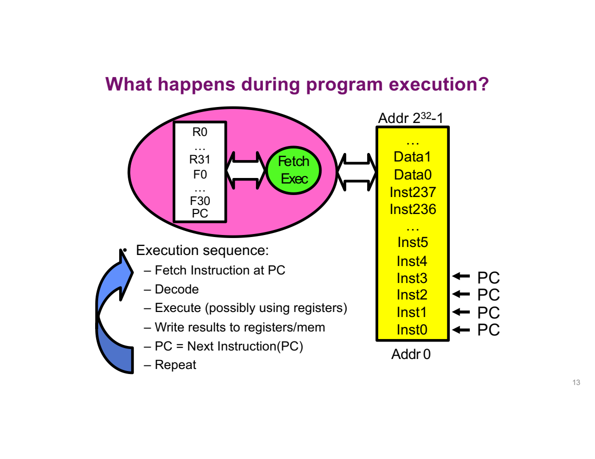

* Processor 里的寄存器分三类：**R0…R31**（32 个通用寄存器）、**F0…F30**（浮点寄存器）、**PC**（program counter）。
* 内存从 `Addr 0` 到 `Addr 2³²-1`（32 位机的例子，地址空间 4 GB）。
* 关键观察：内存里 `Inst0、Inst1…Inst237`（指令）和 `Data0、Data1`（数据）**混放在同一块内存**。这就是 **von Neumann architecture** 的定义性特征：指令和数据同台，程序因此可以被当成数据来加载、修改、存储。
* 右侧一排 `←PC` 箭头是 PC 的移动轨迹：指向 `Inst0`，执行完指向 `Inst1`，一路向下"行军"。
* 执行序列：**Fetch（按 PC 取指）→ Decode → Execute（可能用寄存器）→ 写回寄存器/内存 → PC = 下一条 → Repeat**。这个循环就是程序运行的全部。

***

## 4. Concept 1: Thread（执行上下文）

**定义**：thread 是 single unique execution context，包含 **PC、registers、execution flags、stack、memory state**。它完整回答一个问题："这个程序此刻跑到哪、手上拿着什么？"

一个 thread 只有两种状态：

* **Executing（resident）**：thread 的 context 正装在 CPU 寄存器里。PC 指向它的下一条指令，SP（stack pointer）指向它的栈顶。
* **Suspended**：context 不在寄存器里，而是**被复制一份存到了内存**。PC 寄存器此时正指着别的 thread 的指令。

推论：切换 thread 没有神秘操作，就是把当前寄存器组**存**进内存、把另一个 thread 的存档**读**回寄存器。这就是 lec01 说的 context switch 的精确含义。

### 单线程 vs 多线程进程

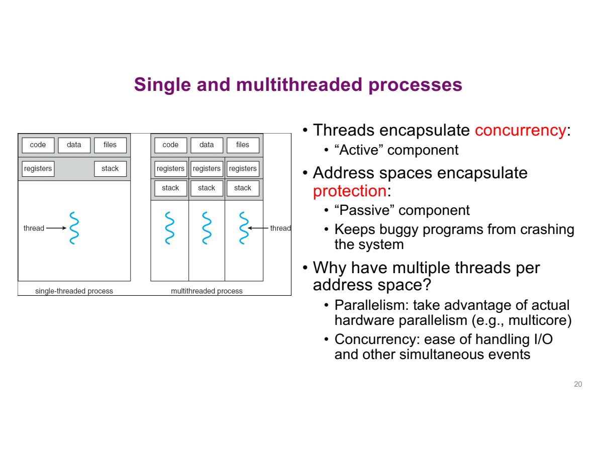

* 单线程进程：`code / data / files` 一份，配 `registers + stack` 一套，只有一条执行流。
* 多线程进程：`code / data / files` 仍是**一份**（所有线程共享），但 `registers` 和 `stack` 变成**多套**，多条执行流在同一个进程里并行穿梭。
* 所以每个线程独享的只有两样：**寄存器现场**和**栈**。堆、全局变量、打开的文件全部共享。这正是多线程编程里 data race 问题的根源（Synchronization 章节的主战场）。

两个官方定位：**Threads encapsulate concurrency（active component）；Address spaces encapsulate protection（passive component）**。

一个进程里为什么要多个线程？**Parallelism**（利用多核真并行）+ **Concurrency**（更方便地处理 I/O 等同时发生的事件）。

***

## 5. Concept 2: Address Space（内存视图）

**定义**：the set of accessible addresses + 与之关联的状态。32 位机有 2³² ≈ 4 billion 个地址，64 位机有 2⁶⁴ 个。

对一个地址读/写时，不止"读写内存"一种结果：

* 普通内存访问
* 写入被忽略（只读区域）
* 触发一次 I/O 操作（**Memory-mapped I/O**：设备寄存器被映射成内存地址）
* 触发异常 **fault**（访问了无权限地址，即 Segmentation Fault）

### 四段布局

::: tip 基础补充
对内存里的 stack 和 heap 本身不熟？先读 [Stack vs Heap 补充篇](../foundations/stack-vs-heap.md)，再回来会顺很多。
:::

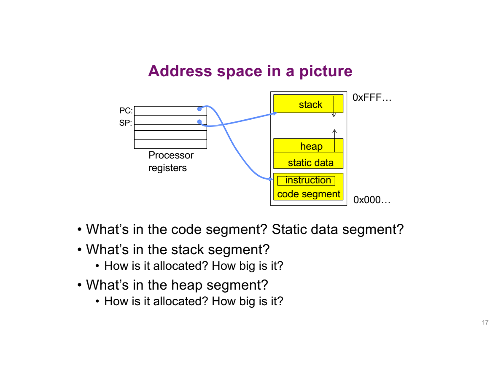

从 `0x000…` 往上依次是 **code segment → static data → heap**，中间留空，最顶部 `0xFFF…` 附近是 **stack**。heap 向上长，stack 向下长。左侧寄存器里，**PC** 指向 code segment 中正在执行的 `instruction`，**SP** 指向 stack 顶部。

四段分别装什么：

| Segment | 里面是什么 | 怎么分配 | 大小 |
|---|---|---|---|
| code | 编译后的机器指令 | 加载时从可执行文件读入 | 固定 |
| static data | 全局变量、静态变量 | 加载时从可执行文件读入 | 固定 |
| heap | `malloc` 出来的动态内存 | 程序员手动申请/释放 | 运行时变化，向上长 |
| stack | 函数的局部变量、返回地址、调用帧 | 函数调用自动压栈/弹栈 | 运行时变化，向下长 |

### 用代码对号入座

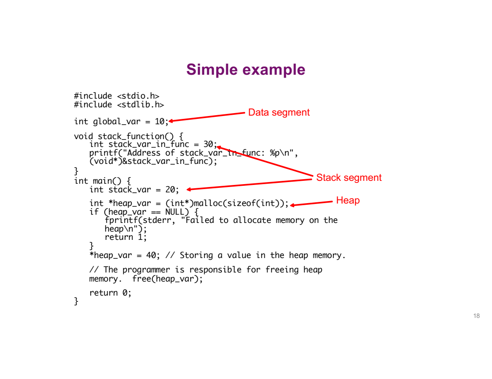

* `int global_var = 10;`（函数外的全局变量）→ **Data segment**
* `stack_var_in_func` 和 `main` 里的 `stack_var`（函数内的局部变量）→ **Stack segment**
* `malloc(sizeof(int))` 返回的那块内存 → **Heap**

注意代码里的注释：`The programmer is responsible for freeing heap memory.` 栈变量随函数返回自动消失，堆内存不 `free` 就泄漏。这是 C 和带 GC 的语言最大的区别之一。

**本机实测**（`demos/lec02/segments.c`，四类地址各打印一个）：

```
code   (main):    0x1000a44f8     ← 最低
data   (global):  0x1000ac000
heap   (malloc):  0x100945a80
stack  (local):   0x16fd5a648     ← 远远最高
```

四类地址的相对高低和布局图完全吻合：code 垫底，stack 站在高地址顶端。

***

## 6. Concept 3: Process（受限的运行环境）

**定义**：execution environment for a program **with restricted rights**。组成 = address space + 一个或多个 thread + 进程拥有的资源（file descriptors、文件系统上下文等）。

为什么要发明 process 这个概念？一个词的答案：**protection**。

* 进程互相保护（一个程序崩了不该带走其他程序）
* OS 保护自己不被进程伤害
* 代价：**protection 和 efficiency 天生矛盾**。同进程内通信很容易（共享内存直接读写），跨进程通信必须走 OS 提供的 pipe/socket 等机制。

### 单核如何变出多个处理器

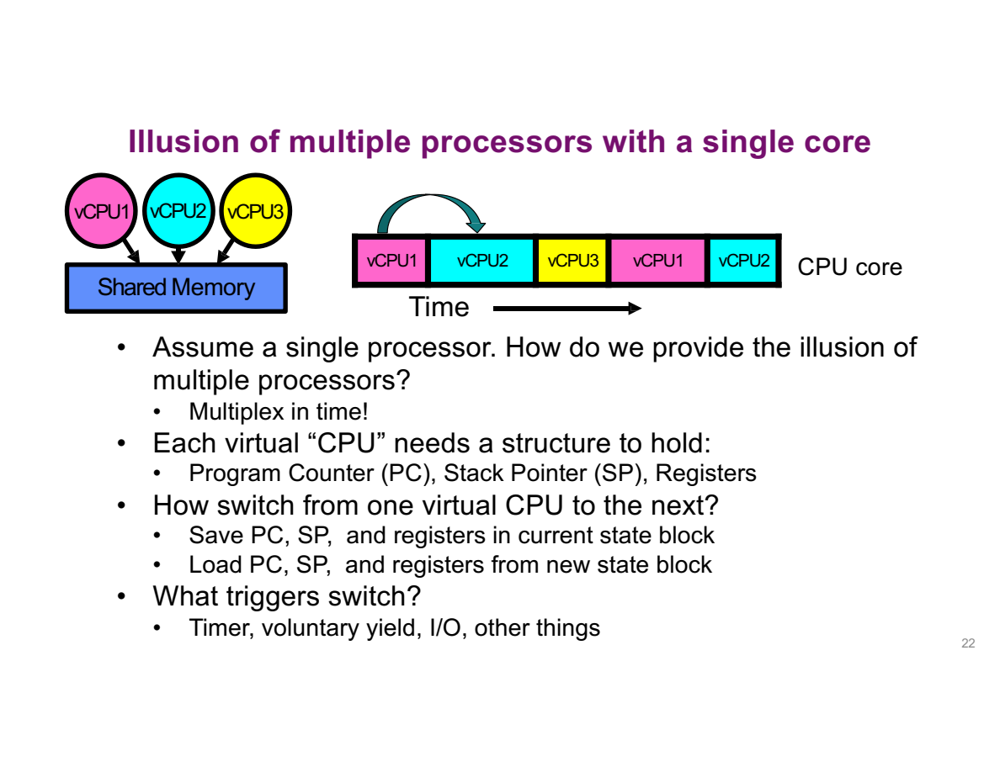

答案：**multiplex in time**（时间上复用）。

* 每个 vCPU 对应一个 **state block**，保存 PC、SP、registers（就是第 4 节的 thread context）。
* 真实的 CPU core 按 `vCPU1 → vCPU2 → vCPU3 → vCPU1 …` 轮流服务，每个 vCPU 占一小段时间片。
* 切换动作只有两步：**save** 当前的 PC/SP/registers 到 state block，**load** 下一个 state block 的值进寄存器。
* 触发切换的三类事件：**timer**（抢占）、**voluntary yield**（程序主动让出）、**I/O**（程序等磁盘/网络时让出）。

**历史教训**：如果所有 vCPU 共享内存且没有保护，每个线程都能读写其他线程的数据。这种无保护模型真实存在过：embedded 系统、Windows 3.1/早期 Mac（只有 yield 切换）、Windows 95–ME（yield + timer）。它们的稳定性口碑说明 protection 不能省。

***

## 7. Protection: OS 到底在防什么

按动机分类：

| 动机 | 含义 |
|---|---|
| **Reliability** | bug 只能搞坏自己进程的内存；OS 被攻破通常等于整机崩溃 |
| **Security** | 恶意进程不能读/写其他进程的数据 |
| **Privacy** | 每个进程只能访问被授权的数据 |
| **Fairness** | 每个进程只能拿自己那份 CPU/内存/I/O |

实现手段分两层：

* **Primary mechanism**：限制"程序地址空间 → 物理内存"的翻译。进程只能碰映射进自己地址空间的东西。
* **Additional mechanisms**：privileged instructions、I/O 指令和特殊寄存器的访问控制、syscall 检查、文件权限等。

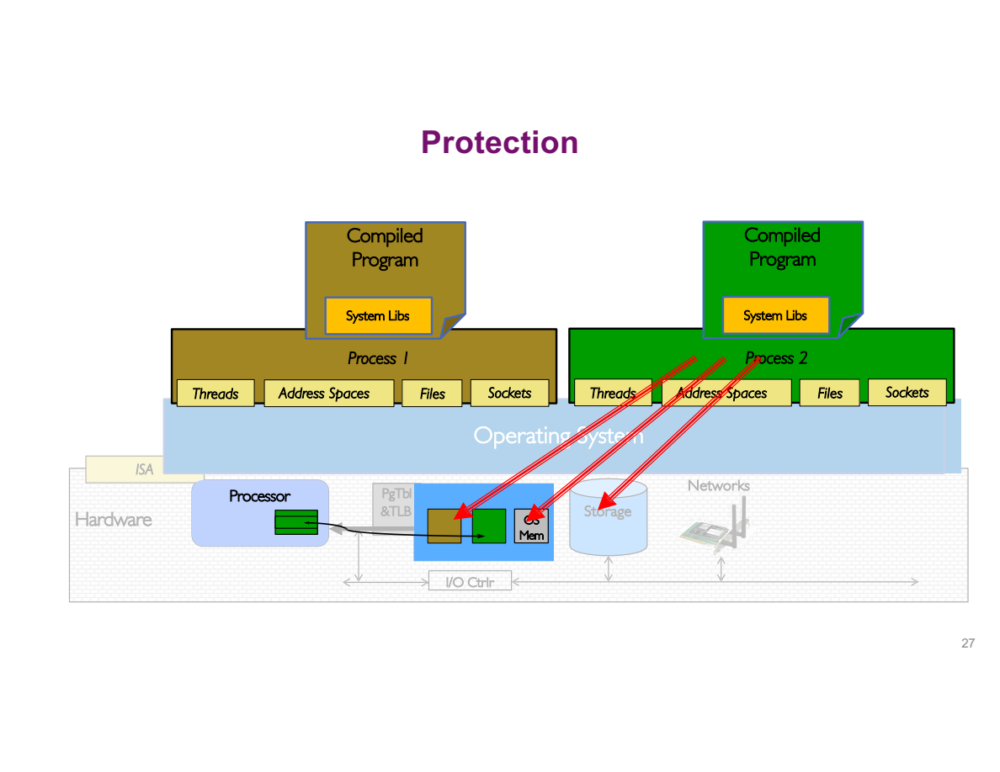

每个 Process 框里有 `Threads / Address Spaces / Files / Sockets` 四样资源。红色箭头从 Process 2 出发，指向**别的进程的内存、OS 自己的内存和 Storage**：这些全是被禁止的访问，进程不许绕过 OS 直接碰。注意 Processor 旁边的 `PgTbl & TLB`：地址翻译硬件（页表 + TLB 缓存）守在内存访问的必经之路上。

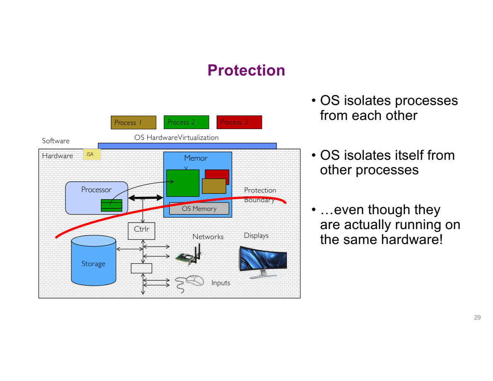

红色弧线是 **Protection Boundary**，把三个 Process 和下方的 OS Memory、硬件（Storage、Networks、Displays、Inputs）隔开。它们其实跑在同一块硬件上，隔离完全是 OS + 硬件机制实现的。

***

## 8. Concept 4: Dual-mode operation（两态运行）

硬件提供至少两种模式（至少 1 个 mode bit）：

* **Kernel mode**（supervisor mode）：什么都能干
* **User mode**：一批操作被禁止，例如**修改页表指针、关中断、直接操作硬件、写内核内存**

mode bit 存在 CPU 的特殊寄存器里，每条指令执行时硬件都在查它。用户态程序执行禁令操作，硬件直接拒绝并触发异常。

### 模式切换全景图

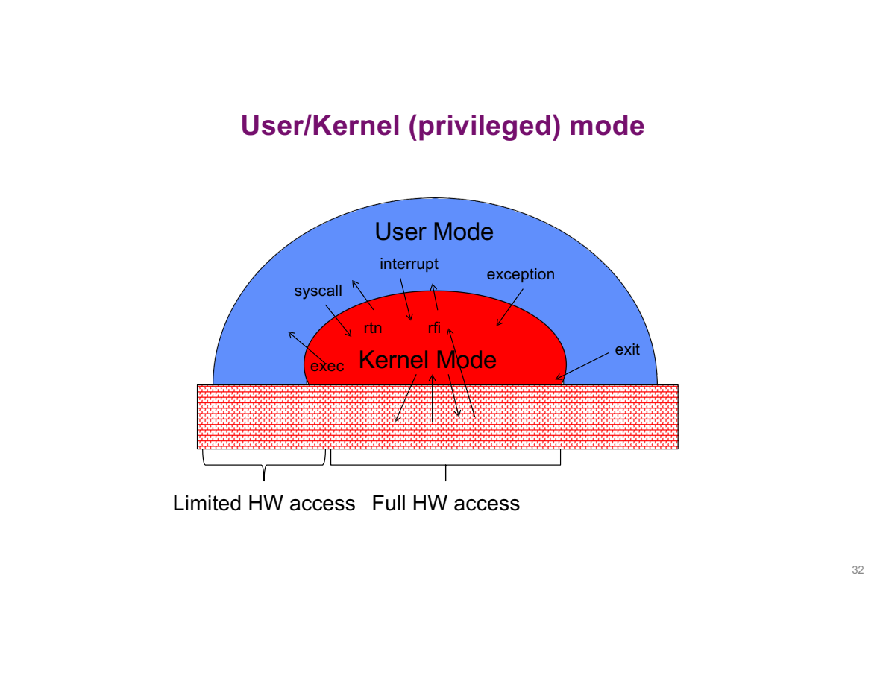

* 蓝色大半圆 = **User Mode**（Limited HW access），红色内圆 = **Kernel Mode**（Full HW access）。内核权限是用户权限的超集。底部红色砖墙是硬件边界。
* 进入内核的三个箭头：
  * `syscall`：程序**主动**请求系统服务
  * `interrupt`：外部异步事件（timer、I/O 设备）**被动**打断
  * `exception`：程序自己出事（除零、非法地址）**被动**陷入
* 返回用户的两个箭头：`rtn`（return from syscall）、`rfi`（return from interrupt）。
* `exec`：在内核里加载新程序，之后以用户态跑起来。`exit`：进程结束，**只进不出**，没有返回箭头。

### 三种 user → kernel 转移的区分

| 类型 | 触发方 | 同步/异步 | 例子 |
|---|---|---|---|
| **Syscall** | 进程主动请求服务 | 同步 | `exit`、读写文件 |
| **Interrupt** | 外部硬件事件 | 异步（和进程在干嘛无关） | timer、I/O 设备完成 |
| **Trap / Exception** | 进程内部出错 | 同步（由当前指令直接引起） | segmentation fault、除零 |

Syscall 有个精妙之处：它**像函数调用，但进程手里没有内核函数的地址**。调用方只能把 **syscall id 和参数放进寄存器**（marshal），执行 `syscall` 指令，剩下的由硬件和内核接手。课件把它类比成 RPC（远程过程调用），分布式章节会回收这个伏笔。

三种转移合称 **unprogrammed control transfer**：跳转目标**不是**由正在运行的程序指定的。程序没法喊"跳转到内核任意地址"，否则保护形同虚设。

### 跳转地址从哪来：interrupt vector

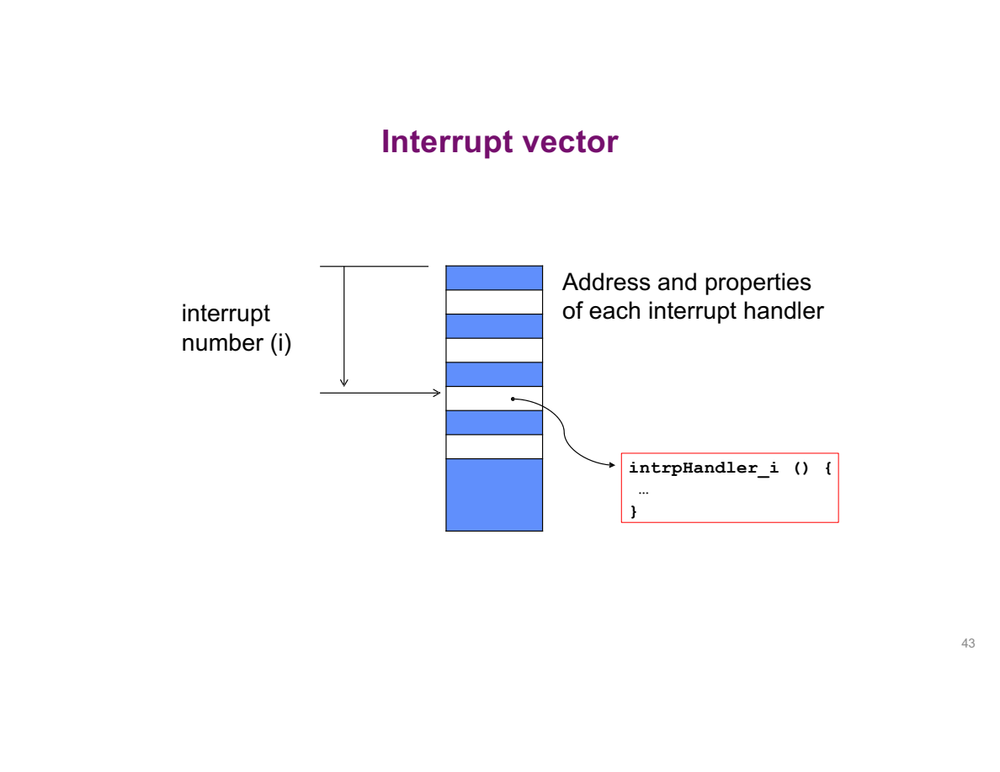

* **Interrupt vector** 是内存里的一张表，每个表项存着某个 handler 的**地址和属性**（如 `intrpHandler_i ()`）。
* 事件发生时，硬件拿到 **interrupt number (i)**，用它作下标查表，取出 handler 地址，切到 kernel mode 跳过去。
* 安全闭环：这张表由 **OS 在启动时填写**，放在内核保护区，用户程序改不了。程序只能选择"触发几号事件"，不能选择"跳到哪去"，决定权永远在 OS 手里。

***

## 9. Base & Bound: 最朴素的内存保护方案

理解了 dual mode，来看早期 OS 怎么用它做内存保护。思想极简：给每个进程划一段连续物理内存，用两个寄存器看住它。

### 9.1 版本 A：加载时翻译（static relocation）

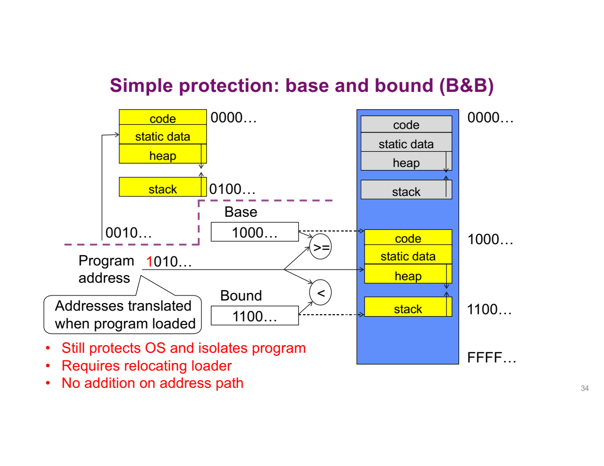

* 左侧黄色块是**程序视角**的地址空间：从 `0000…` 到 `0100…`，code → static data → heap → stack。
* 右侧蓝色大条是**物理内存**：`0000…` 处已有另一个程序（灰色），我们的程序装在 `1000…` 到 `1100…`。
* **Base = 1000…，Bound = 1100…**，都是物理地址。
* 加载器（**relocating loader**）在装程序时把代码里的地址**一次性改写**好（`0010` → `1010`）。运行时 CPU 只做两个比较：地址 `>= Base` 且 `< Bound`，越界就 fault。
* 优点：仍然保护 OS、仍然隔离程序，且 **no addition on address path**（运行时不用做加法，快）。
* 缺点：程序一旦加载就**动不了**（地址已写死），还需要专门的 relocating loader。

### 9.2 版本 B：运行时翻译（dynamic relocation）

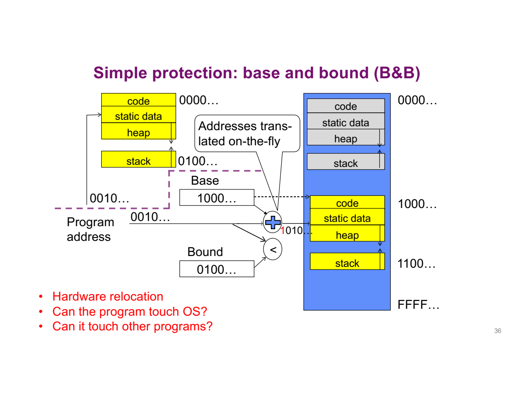

与版本 A 的两处关键差异：

* 程序地址**不改写**，每次访问经过硬件加法器：physical = program address + Base。图中 `0010… + 1000… = 1010…`。
* **Bound 变成了长度**（`0100…` 而非 `1100…`）：比较发生在加 Base **之前**，查的是偏移量 `0010 < 0100` 是否成立。
* 好处：程序运行中也能被 OS **搬家**（改一下 Base 即可），内存管理灵活得多。
* 两个自测问题：程序能碰到 OS 吗？能碰到其他程序吗？都不能。它的地址恒等于"自己的偏移 + Base"，偏移又被 Bound 卡住，永远落在 `[1000, 1100)` 区间里。

### 9.3 完整流程：OS 加载并启动一个进程

下面三张图把本讲所有概念串成一条时间线。

**第 1 步：OS load process**

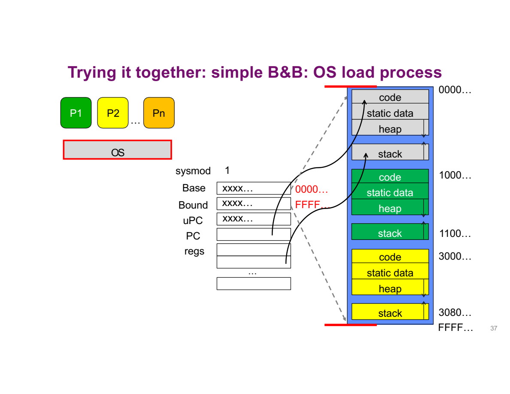

* 内存里：OS 占 `0000…` 起的灰色区，P1（绿）装在 `1000…`–`1100…`，P2（黄）装在 `3000…`–`3080…`。
* 中间是 CPU 的特殊寄存器组：
  * `sysmod = 1`：**system mode 位**，1 表示当前在内核态。
  * `Base / Bound / uPC = xxxx…`：尚未填写，OS 马上要填。
  * `PC / regs`：当前装着**内核自己**正在执行的现场。
  * `uPC`（user PC）：一个**保存槽**，存"等下用户程序该从哪条指令开始跑"。

**第 2 步：OS gets ready**

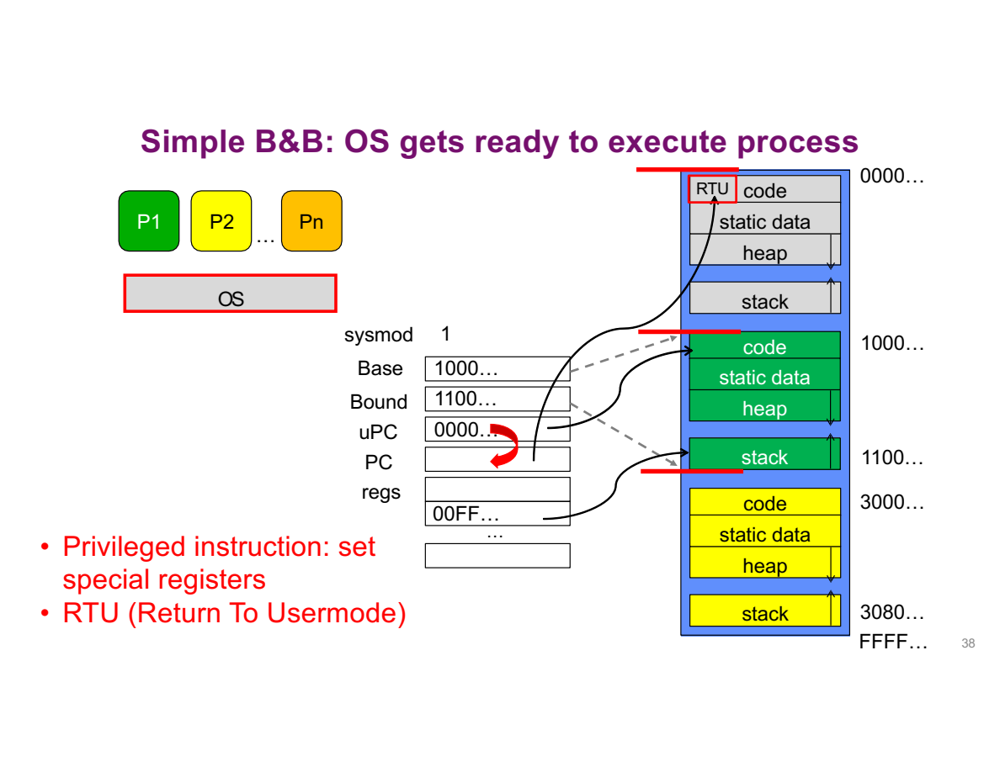

* OS 用 **privileged instruction**（特权指令，用户态禁用）填好：`Base = 1000…`、`Bound = 1100…`（P1 的地盘）、`uPC = 0000…`（P1 从自己视角的 0 地址开始）、`regs = 00FF…`（P1 的初始寄存器值）。
* PC 处的红框 **RTU**（Return To Usermode）是 OS 执行的最后一条内核指令，它做两件事：`sysmod` 翻成 0，`PC ← uPC`。
* 设置 Base/Bound 是"改写保护边界"的操作，只有内核能干，这就是特权指令存在的意义。

**第 3 步：user code running**

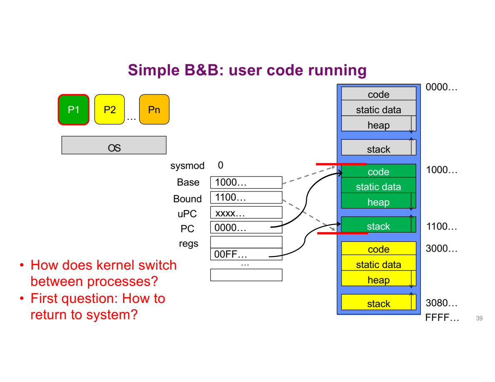

* `sysmod = 0`：现在是**用户态**。`PC = 0000…`：从 P1 视角的 0 地址开始跑（物理上落在 Base + 0 处）。
* P1 运行期间的每次内存访问，都被 Base/Bound 自动看守。
* 最后一个问题：**kernel 怎么夺回控制权？** 答案就是第 8 节的三种转移：程序主动 syscall、timer interrupt 把它打断、或者它自己犯错 exception。无论哪种，CPU 都经 interrupt vector 跳进内核，`sysmod` 翻回 1，调度器再决定下一个 RTU 给谁。

***

## 10. Summary

| 概念 | 组成 | 一句话 |
|---|---|---|
| Thread | PC + registers + stack + flags | 程序"跑到哪了"的完整快照；切换 = 存/取这个快照 |
| Address space | 可访问地址集合 + 内容 | code/data/heap 在低地址向上，stack 在高地址向下；可与物理内存不同（virtual） |
| Process | address space + ≥1 thread + 受限权限 | 保护容器：进程间难通信是特性不是缺陷 |
| Dual mode | user / kernel + mode bit | 禁令操作只能在内核态做；三个受控入口：syscall / interrupt / exception，跳转目标由 OS 的 interrupt vector 决定 |

***

## 11. Self-check

1. Thread、address space、process 三者的定义和包含关系是什么？同一个进程里的多个线程，哪些资源独享、哪些共享？
2. 地址空间四段（code / static data / heap / stack）各放什么？增长方向？`int g;`、函数里的 `int x;`、`malloc` 返回的内存、函数返回地址各在哪一段？
3. 单核上如何变出多个 vCPU 的假象？一次切换具体 save/load 什么？哪三类事件能触发切换？
4. 三种 user → kernel 转移分别是什么、各举一个例？为什么叫 unprogrammed control transfer？interrupt vector 如何保证跳转目标是安全的？
5. 运行时翻译版 B&B 中，Base = 1000、Bound = 0100（长度）。程序访问 `00F0` 时物理地址是多少？访问 `0200` 会发生什么？为什么用户程序不能直接改 Base 寄存器来越狱？

<br />

**A1.** Thread 是执行上下文（PC、registers、stack、flags），回答"跑到哪了"。Address space 是可访问的内存地址集合及内容。Process = address space + 至少一个 thread + 受限权限，是运行容器。同进程多线程**独享**的只有各自的寄存器现场和栈；code、static data、heap、打开的文件全部**共享**（这正是 data race 的温床）。

**A2.** code 放机器指令（加载时读入，固定）；static data 放全局/静态变量（加载时读入，固定）；heap 放 `malloc` 的动态内存（手动申请释放，向高地址长）；stack 放局部变量、调用帧和返回地址（函数调用自动压栈弹栈，向低地址长）。对号入座：`int g;` 在 static data，`int x;` 在 stack，`malloc` 的在 heap，返回地址在 stack（调用帧里）。

**A3.** 时间复用（multiplex in time）：每个 vCPU 对应一个 state block（PC、SP、registers），CPU 轮流把各 state block 装进真实寄存器运行一小段。切换 = save 当前寄存器组到内存 + load 下一个 state block。触发源：timer interrupt（抢占）、程序主动 yield、程序阻塞等 I/O。

**A4.** Syscall（进程主动求服务，同步，如 `exit`）、interrupt（外部硬件异步事件，如 timer）、trap/exception（当前指令引起的同步事件，如除零、segfault）。叫 unprogrammed 是因为**跳转目标不是程序指定的**，程序没有内核函数的地址。Interrupt vector 是 OS 启动时填写、放在内核保护区的表；硬件用 interrupt number 查表取 handler 地址。程序只能选"几号事件"，选不了"跳到哪"，所以安全。

**A5.** `00F0 + 1000 = 10F0`，且 `00F0 < 0100` 合法，访问成功。`0200 > Bound(0100)`，硬件比较器拒绝，触发 protection fault（segfault），OS 介入。改 Base 是 privileged instruction，只能在 kernel mode 执行；用户态（sysmod = 0）执行它会被硬件直接拒绝并产生异常。保护边界因此无法从内部突破。

***

*Images extracted from the official Lecture 2 slides. Notes rewritten in my own words for review; errors are mine.*
