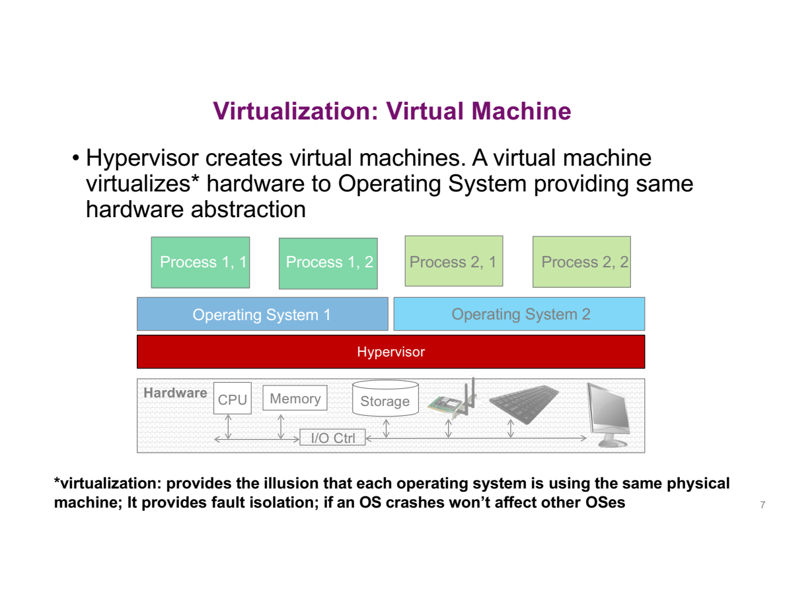
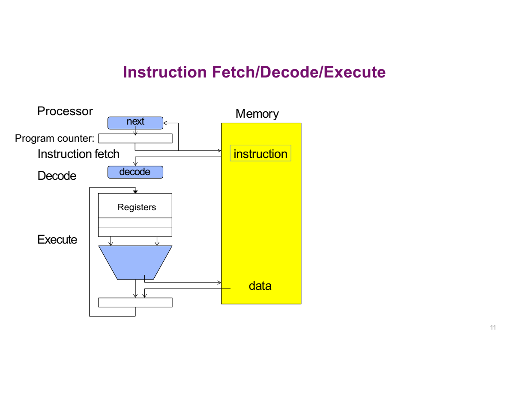
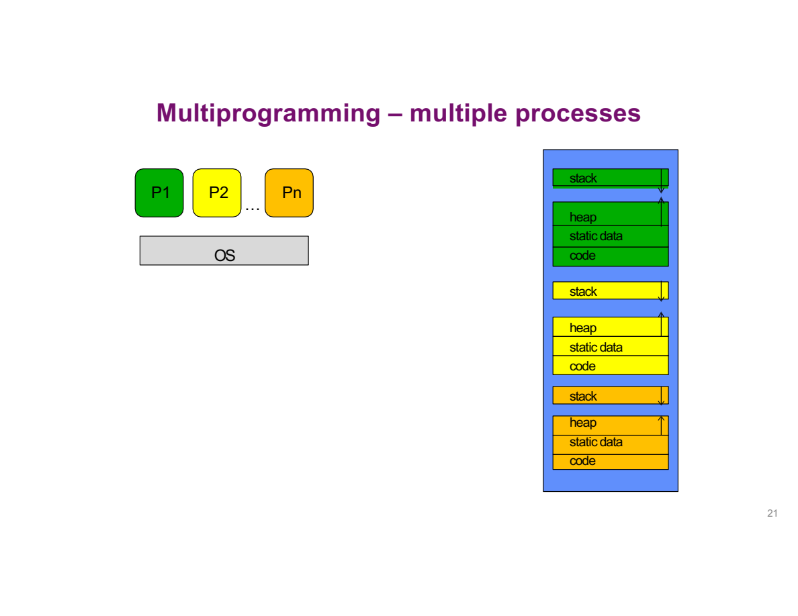

---
prev:
  text: 'Lecture 1 · Introduction'
  link: /notes/lec01-introduction
next:
  text: 'Lecture 3 · Threads & Processes'
  link: /notes/lec03-thread-process
---
# Lecture 2 · 四个概念 {#lecture-2-·-execution-and-protection}

**TL;DR**

- Thread 记录执行进度，address space 描述内存视图，process 把它们组织成运行环境。
- 程序使用虚拟地址，硬件根据 OS 设置的规则完成翻译和检查。
- User / kernel mode 限制谁能修改这些保护规则。

## 1. 虚拟化 {#_1-virtualization-·-从-os-抽象进入四个概念}

**核心问题：能否把完整 OS 也放进一个虚拟运行环境？**


1. **Applications → OS**：不同 process 请求共同硬件的服务。
2. **OS → hardware**：OS 管理 CPU、memory、storage 与 I/O controller，向上提供较高层抽象。
3. **继续抽象**：如果上层运行的也是一个 OS，就需要向它提供虚拟硬件接口，这一层由 hypervisor 实现。



- `Operating System 1 / 2` 是两个 guest，各自管理自己的 processes。
- Hypervisor 管理它们使用的共同硬件资源；bare-metal 结构中，它直接位于 hardware 之上。
- Hosted 结构则多一层 host OS。层数改变了，核心问题仍是“给谁提供什么接口、谁负责隔离与分配”。


| Layer | 服务对象 | 提供的抽象 |
|---|---|---|
| OS | Application / process | 执行流、地址空间、文件等 |
| Hypervisor | Guest OS | 虚拟硬件环境 |

- **Hosted**：hypervisor 运行在 host OS 之上。
- **Bare-metal**：hypervisor 直接管理硬件。

多个 guest 有各自的 processes。隔离可以限制故障传播，但不是“其他 VM 绝对不受影响”的保证：它们仍可能竞争底层资源，也依赖共同的 hypervisor 和硬件。

## 2. 程序执行 {#_2-execution-·-程序如何运行}

**核心问题：磁盘上的程序怎样变成 CPU 正在执行的工作？**


1. **Compile / link**：把 source code 转为 executable。
2. **Load**：建立 address space，映射代码和数据，准备初始 stack 等状态。
3. **Start**：从程序入口开始执行，runtime 初始化后调用 `main`。

这是一幅概念布局：实际系统可能按需加载，有多个 mappings，未初始化的 static storage 可以零初始化而不把所有零逐字保存在 executable 中。



**把取指与处理数据分开：**

1. **Fetch**：按 PC 从 memory 取 instruction。
2. **Decode**：control logic 识别要做什么，例如 add、load 或 branch。
3. **Execute**：读取所需 registers，完成运算或发起 memory access。
4. **Write back / next PC**：把结果写回相应位置，再决定下一条 instruction。

Instructions 和 data 都在 memory 中，但作用不同：前者决定“做什么”，后者是被读取、计算或修改的内容。

用一条简化机器指令 `ADD R3, R1, R2` 对照这些箭头。它表示“把 R1 与 R2 相加，结果放进 R3”：

1. PC 保存**指令的地址**。从 PC 通向 memory 的箭头用于找到 ADD 指令，不是去找加法结果。
2. Decode 识别出 ADD，并知道要读取 R1、R2。
3. Registers 向运算单元提供两个值，例如 3 和 4；运算结果 7 写入 R3。
4. 这条 ADD 不需要把结果立即写回普通内存。若之后执行 store 指令，才沿数据通路把值写入指定内存位置。
5. 控制逻辑更新 PC，继续取下一条指令。遇到 branch、call、return 时，下一条位置可能改变。

**PC 中存的是“去哪里取指令”，R1、R2 中存的是“这次拿什么来算”。** 它们都属于执行现场，但作用不同。


<StudyDiagram id="lec02-concepts-0" />

- **PC (program counter)**：记录取指位置，回答“接下来执行哪里”。
- **Registers**：保存当前运算使用的数据。
- **SP (stack pointer)**：记录当前栈位置。
- **Branch / call / return**：改变执行路径，因此 PC 不一定顺序前进。

Von Neumann 的核心思想是指令和数据都存储在内存中。寄存器数量、指令长度、访问细节因 architecture 而异。32-bit byte addressing 的理论编号范围是 `0 .. 2^32-1`，即 4 GiB；这不保证所有编号都有可访问存储。

## 3. 执行与内存 {#_3-thread、address-space-与-process}

**核心问题：怎样分别描述执行进度、内存视图和资源归属？**

| Concept | 回答的问题 | 关键状态 |
|---|---|---|
| Thread | 执行到哪里，怎样继续？ | PC、registers、stack |
| Address space | 哪些地址可访问？ | 地址映射、内容与权限 |
| Process | 哪些执行流和资源属于同一个运行环境？ | Address space、threads、资源 |

用同一个例子区分它们：

1. 磁盘上存着一个编辑器程序，这是 **program**，尚不等于正在运行。
2. 启动它后，OS 为这次运行建立 **process（进程）**，管理它的内存和资源。
3. 其中一条 **thread（线程）** 正在处理键盘输入；另一条可以负责后台读取文件。
4. 两条线程都在这个进程的 **address space（地址空间）** 中访问代码和数据。

**Process 说明“属于哪个运行环境”，thread 说明“哪条执行流正在做到哪一步”。** CPU 则是真正执行这些指令的硬件。

### Thread：执行现场 {#thread-·-执行上下文}

**核心问题：计算到一半被暂停，恢复时需要什么？**

**A thread is an execution context.** 核心状态包含 PC、registers、SP 及相关 execution flags，并关联它的调用栈。只有保存“继续执行需要的状态”，才能恢复原来的计算。

| Situation | Register state | Stack / other memory |
|---|---|---|
| Running | 当前使用 CPU registers | 位于内存中，按需访问 |
| Not running | 恢复所需状态保存于内存 | 通常仍存在，不会整体搬进 CPU |

“驻留在 CPU”与“现场已保存”是简化观察角度。完整调度还要区分 ready、running、blocked，见 Lecture 3。保存现场不是复制整个 address space。

**只有一套硬件寄存器，怎么记住两个线程的进度？**

- A 运行时，硬件寄存器中放 A 的当前值。
- 暂停 A 时，把恢复所需的值保存到内存中的管理记录，再装入 B 的值。
- 此时寄存器用于 B，但 A 的代码、数据和栈仍留在内存中；保存的现场记录着怎样继续使用它们。
- 轮到 A 时，再恢复 A 的现场。A 继续自己的计算，而不是从第一行重新运行。

因此，两份 **register state（寄存器状态）** 不等于两套物理寄存器。前者可以作为数据保存在内存中，后者才是 CPU 内的硬件。


同一 process 的 threads 共享 code、global objects、heap 和 process-level resources，各自有执行现场、stack，以及 thread-local state。多个线程可能交替运行，也可能在多核上并行。

**同一个进程，为什么能有多个执行位置？**

- Code 可以只有一份，Thread A 的 PC 指向函数 f，Thread B 的 PC 指向函数 g；也可以都执行 f 的不同位置。
- 每个 thread 保存自己的 registers 和调用链，因此暂停 A 不会把 B 的执行进度当作 A 的进度。
- Shared objects 仍只有共同的一份，所以一个 thread 的写入可能影响另一个 thread 的读取。

> 💡 “每线程独立栈”描述调用状态的归属，不是硬件隔离。一个有效指针可以让同进程的另一个线程访问该栈中的对象；对象必须仍存活，冲突访问必须同步。

**Execution flags 为什么也需要保存？** 在使用条件标志的 CPU 上，比较指令可能先记录“结果是否为零”等状态，后续条件跳转再读取它。若中间换线程却没有恢复相关标志，即使恢复了 PC 和普通数据，也可能走错分支。具体哪些状态由独立 flags 保存、哪些由普通寄存器表示，取决于指令集。

### Address space：内存视图 {#address-space-·-内存视图}

**核心问题：程序看到的地址怎样对应到实际存储？**

**An address space is a set of addresses and their associated state.**

地址可以理解为程序用来找到数据的编号，但必须同时知道这个编号属于哪个进程：

<StudyDiagram id="lec02-concepts-1" />

- 程序使用的编号叫 **virtual address（虚拟地址，VA）**。
- 实际内存中的位置用 **physical address（物理地址，PA）** 表示。
- **Address translation（地址翻译）** 把前者对应到后者。
- 一个地址能否访问，还要看是否有对应的存储以及读、写等权限。地址存在于编号范围内，不等于一定可以使用。

| Access | Possible result |
|---|---|
| Mapped ordinary memory with permission | 读取或写入数据 |
| Read-only mapping written by user code | 通常产生 protection fault |
| Unmapped / invalid address | 产生 fault；由 OS 按原因处理 |
| Authorized memory-mapped device register | 按设备规则触发 I/O 行为 |

还可能是 **shared memory mapping**：两个进程经授权把各自某段 VA 映射到共同存储，一方写入可供另一方读取。共享来自映射关系，而不是因为两个指针数字恰好相同；共享后仍要协调访问顺序。

**地址位数不等于已经安装的内存容量。** 若按 byte 编址，n 位地址最多表达 `2^n` 个不同编号：

| 理论地址宽度 | 编号数量 | 若每个编号对应 1 byte |
|---|---:|---:|
| 32 bits | `2^32` | 4 GiB |
| 64 bits | `2^64` | 16 EiB |

它描述可表达的编号空间，不保证每个编号都已映射，更不表示一台 64-bit 计算机装有 16 EiB RAM。实际实现还可能只使用其中一部分地址位。

设备寄存器可能忽略某些写入；不能把“只读内存通常静默忽略写入”当成保护规则。Fault 也不一律导致终止，例如 demand paging 可以处理某些 fault 后继续执行。

**把内存区域和代码中的对象对应起来**


| Region | Typical contents | Lifetime / purpose |
|---|---|---|
| Code | Machine instructions | 可执行映射，通常不允许普通写入 |
| Static data | Global and static objects | 整个程序执行期间 |
| Heap | Dynamically allocated objects | 从成功分配到释放 |
| Stack | Call-related state | 随调用活动变化 |

图中的 heap 向上、stack 向下是便于理解的布局模型，不是 C 对实际地址的保证。多线程有多个栈，分配器也可能使用多个映射区域。

**Static data 的 static 不是“值不能变”。** `global = 11` 可以改变一个可写全局变量的值；它仍属于静态存储，因为其生命周期不随某次函数调用结束。不要把 static data 与 read-only 混为一谈。

**为什么不把所有东西混在一起，而要分成这些区域？**

先问：程序运行前，哪些空间需求已经知道，哪些要运行时才知道？

1. **指令与静态对象**：对于已经加载的程序，可以知道代码和静态对象需要多少空间，适合先安排位置。
2. **函数调用**：例如输入决定递归次数，运行前不一定知道会同时存在多少层调用。每深入一层就需要保留新的调用状态，返回时则按相反顺序撤销，所以用 stack。
3. **动态对象**：例如读到文件后才知道需要多大的数组；它也可能在创建它的函数返回后继续使用，不能跟着那次调用一起撤销，所以单独用 heap 管理。

**那为什么示意图让 heap 和 stack 相向增长？** 假设中间有一块尚未使用的空间：

- 如果提前一半给 stack、一半给 heap，可能出现 stack 用完了，但 heap 那边还空着很多的情况。
- 从两端向中间增长，可以让当前需要空间的一边使用余量，少一些提前切分的浪费。
- 同时尽量让已有内容留在原位，减少为了腾空间而搬移数据的工作。这就是这里的 **minimize movement** 思路。

> 💡 先理解“不同用途与生命周期，需要不同管理方式”。相向增长是解释这一思路的简化布局；真实多线程栈和分配器不必只有这两块连续区域。动态大小也不一定要求 heap，判断时还要看对象需要存活多久。


```c
int global = 10;
void example(void) {
    int local = 20;
    int *p = malloc(sizeof *p);
    if (p == NULL) return;
    *p = 30;
    free(p);
}
```

这里省略头文件。逐个看这四个对象，尤其不要把 p 和它指向的对象合成一个：

| 代码 | 创建或修改了什么？ | 这里按什么区域理解？ |
|---|---|---|
| `int global = 10` | 一个全局 int，存 10 | Static data |
| `int local = 20` | 这次函数调用的局部 int，存 20 | Stack |
| `int *p = malloc(...)` | p 保存新分配对象的地址 | p 是局部变量；新对象在 heap |
| `*p = 30` | 沿 p 中的地址找到那个 int，写入 30 | 修改 heap 对象，不是把 p 改成 30 |
| `free(p)` | 释放先前申请的对象 | 此后不能再通过 p 读写那个对象 |

**函数返回时，局部变量 p 的生命周期结束，但这并不自动释放 malloc 申请的对象。** 因此示例在返回前明确调用 free。这里按常见布局理解局部变量；编译器也可能把它保存在寄存器中。

::: tip 基础补充
对对象和地址不熟，先读 [C Pointers](../foundations/c-pointers.md)；对生命周期不熟，先读 [Stack vs Heap](../foundations/stack-vs-heap.md)。
:::

### Process：运行环境 {#process-·-运行环境}

**核心问题：为什么“一个程序”不够描述运行状态？**

**A process is an execution environment with an address space, one or more threads, and resources under restricted rights.** Program 是静态文件，process 是实例。同一 executable 可产生多个 process；界面窗口数量与 process 数量没有固定对应关系。



不同 process 可以有独立的代码、数据、heap、stack 视图。默认私有存储的隔离不排除有意共享：OS 可以提供 shared memory、pipes、sockets 等通信机制。

Multiprogramming 表示多个程序的工作在系统中共同推进，不限定只能单核。Concurrency 表示任务的执行在时间上交叠；parallelism 表示同一时刻真的执行多个任务。接下来的单核模型只讨论一个 hardware execution context。


单核上的时间线可以是：

<StudyDiagram id="lec02-concepts-2" />

- 切走 A：保存它的 PC、SP 和寄存器值。
- 换上 B：把 B 先前保存的状态恢复到 CPU。
- 再回到 A：继续暂停前的工作，不是从头再执行。

触发切换的原因可能是计时器到期、线程主动让出 CPU，或当前工作需要等待 I/O。这里先按一个 CPU 执行位置理解。

**但是，只会轮流执行，还不等于有保护。**

1. 假如 A、B 能任意读写同一片内存，A 即使只占很短的 CPU 时间，也能把 B 的数据改坏。
2. 因而，CPU 的分时解决“谁在执行”，地址空间的保护解决“它能访问什么”。
3. 同一进程的线程选择共享，便于合作；不同进程则默认隔离私有内存。
4. 跨进程切换时，除了执行状态，还要换上目标进程的地址翻译环境。

**线程是执行单位，地址空间是保护边界的一部分。这两个问题要分别解决。**

## 4. 保护机制 {#_4-protection-·-地址与权限如何配合}

**核心问题：OS 如何在用户代码直接运行时落实访问限制？**

### Dual mode：权限 {#dual-mode-与地址检查}

**核心问题：OS 把 CPU 交出去后，程序为什么不能改掉限制？**


OS 决定哪些映射与操作被授权，hardware 在执行中落实检查。普通 memory access 不需要每次调用一个 kernel 函数来审批；地址翻译硬件利用内核建立的状态检查权限。


三类访问要分开判断：

- **其他 process 的私有 memory**：没有授权映射时，不得直接读取或写入。
- **OS memory**：不能让应用改写内核代码、映射与管理数据，否则保护规则本身会被破坏。
- **Storage / devices**：经受控接口和权限规则访问，而非任意绕过管理层操作硬件。

目的也不同：reliability 限制 bug 的破坏范围；security / privacy 阻止未授权访问；fairness 约束资源分配。它们不是同一个指标。

**Dual-mode operation** distinguishes user mode from kernel mode.

| Mode | 可以做什么 | 关键限制 |
|---|---|---|
| User mode | 普通计算、合法内存访问 | 不能任意修改保护寄存器、内核映射、关键设备状态 |
| Kernel mode | 执行资源管理所需的特权操作 | 按具体 architecture 的规则运行 |

> 💡 **检查访问范围，和保护检查规则，是两件相配合的事。** Base / Limit 限制程序能访问哪里；user / kernel mode 则防止程序自己改掉 Base / Limit。如果用户代码能改范围，检查就失去意义。

同样，不能让用户随意关闭用于抢占的时钟中断，否则它就可能一直占着 CPU，OS 无法按原定机制取回控制。

### 地址翻译

**核心问题：最简单的地址检查和重定位如何工作？**


左边表示程序原本使用的相对布局，右边是整块物理内存：黄色区域分给这个程序，其他区域不能由它随意访问。

- 指向右边黄色区域的箭头，是一次实际内存访问。
- `>=` 检查有没有越过区域的下界，`<` 检查有没有越过上界。
- 两个检查都通过，才允许访问。**有地址并不意味着有权限。**

**方案 A：load-time relocation。**

1. Loader 知道程序被放到哪里后，完成所需地址重定位。
2. 执行时的地址已经处于目标物理区域。
3. Hardware 仍检查下界与上界，防止越界；只是这条访问路径不再为重定位额外加 Base。

Static protection 可以直接检查程序使用的地址是否处于物理区间：

```text
Base <= address < Bound
```

这里 Bound 是结束位置，不包含该端点。若 Base=`0x1000`、Bound=`0x1100`，可访问区间是 `0x1000..0x10ff`。


这一次，进入硬件的是程序自己的偏移地址，图中加号负责把它移到实际放置的区域：

- **加号回答“实际在哪里”**：`physical address = Base + virtual address`。
- **比较器回答“有没有超出自己的范围”**：virtual address 必须小于允许的长度。
- 这两件事都需要。只有相加而不检查，程序仍可能给出过大的偏移，越过自己的区域。

两图中的 Bound 含义不同：前一图存物理结束位置；这一图存区域长度。下面统一用 Limit 表示后者，避免把数字直接混用。

**方案 B：run-time relocation。**

1. 程序仍使用自己的 virtual addresses，例如从 0 开始的偏移。
2. 每次访问先验证 VA 的范围，再由 hardware 加 Base 得到 PA。
3. 程序不需要因为放置位置改变而逐处改写地址；翻译硬件则参与每次地址访问。

| Comparison | Load-time relocation | Run-time relocation |
|---|---|---|
| 何时改变地址 | 加载时处理所需引用 | 执行时逐次翻译 |
| 程序使用的地址视图 | 已重定位到目标范围 | 独立的 virtual view |
| 需要什么 | Relocating loader + bounds checks | Translation hardware + bounds checks |
| 主要权衡 | 放置变化需要重新处理重定位 | 更灵活，但地址访问路径增加翻译工作 |

**为什么要比较这两种方案？** 加载时处理地址，把部分工作提前做完；运行时翻译，让程序使用的地址不必随物理放置位置改变。代价是每次访问都经过翻译硬件。这里比较的是灵活性和访问路径上的工作量，两种方案都不能省掉保护检查。

Dynamic relocation 让程序使用从零起的 virtual address，转换过程如下：

```text
if 0 <= VA < Limit:
    PA = Base + VA
else:
    protection fault
```

| Base | Limit | VA | Result |
|---|---|---|---|
| `0x1000` | `0x100` | `0x20` | PA = `0x1020` |
| `0x1000` | `0x100` | `0xff` | PA = `0x10ff` |
| `0x1000` | `0x100` | `0x100` | Fault: upper endpoint excluded |
| `0x3000` | `0x80` | `0x24` | PA = `0x3024` |

以第一行为例，按“先检查、再相加”做两步：

1. `0x20 < 0x100`：程序申请的偏移没有超出自己的区域，允许访问。
2. `0x1000 + 0x20 = 0x1020`：到物理内存的这个位置取数据。

第三行为什么失败？长度为 `0x100` 的区域，偏移从 0 开始，最后一个是 `0xff`。`0x100` 已经跨过末尾，不能访问。

**两个进程使用同一个 VA，为什么得到不同结果？**

<StudyDiagram id="lec02-concepts-5" />

程序指令里使用的 `0x24` 没变，切换时安装的 Base 改变了它的翻译结果。这同时解释了“自己的地址视图”与“切换 process 还要切换地址环境”。

> 💡 **检查的是整次访问。** 上面的表按 1 byte 访问演示。如果 Limit=`0x100`，从 VA=`0xff` 读取 4 bytes，即使首地址合法，后面 3 bytes 仍会越界。一般要同时保证访问起点合法、访问长度不超过剩余范围。地址翻译也不能只检查 data 而放过 instruction fetch。

以上数字都采用十六进制，前缀 `0x` 用来标明这一点。取指也需要地址翻译，因此程序的 PC 不应直接当成物理地址。

- **谁能设置？** 只有受信任的 kernel 能修改 Base / Limit。
- **何时更换？** 切换 process 时设置目标进程的地址环境，相同 VA 因而可以指向不同物理区域。
- **模型边界**：现代通用 OS 主要使用 paging；base-and-bounds 用来理解检查与翻译的基本原理。

### 启动用户程序 {#把保护机制连成一次启动}

**核心问题：设置完映射以后，怎样真正让用户程序开始运行？**

| Stage | CPU mode | PC / SP 与保护状态 |
|---|---|---|
| OS 准备环境 | Kernel | 执行内核代码，使用内核所需执行状态 |
| 准备目标 process | Kernel | 设置目标 Base / Limit、初始 user PC 与 SP |
| Return to user | 切到 User | 通过受控返回动作开始执行目标用户代码 |
| 用户程序运行 | User | 普通指令直接执行，内存访问受翻译与权限约束 |

- **设置范围在前**：不能先让用户代码拿到控制，再期待它自己限制可访问地址。
- **PC 与 SP 都要正确**：PC 决定取哪条指令；SP 决定调用使用哪份栈。
- **下一问**：用户代码开始后，OS 怎样拿回控制？这就需要 syscall、interrupt 与 exception 的受控入口。

可以用三个“如果忘了”检查是否理解：

- **忘了设置 PC**：CPU 不知道应从用户程序的哪条指令开始。
- **忘了设置 SP**：即使取对了指令，函数调用也可能使用错误的栈位置。
- **忘了设置保护状态或降低权限**：用户程序可能越出自己的范围，甚至修改系统的管理规则。

因此启动程序不仅是“把代码放进内存”，还要一起准备执行位置、调用栈和访问权限。

**把图里的寄存器名字对应到动作：**

| 标记 | 正在保存什么 | 何时改变 |
|---|---|---|
| `sysmod` | 当前 CPU 权限状态 | 受控进入内核或返回用户时 |
| `PC` | CPU 当前接下来执行的位置 | 取指、跳转、受控转移时 |
| `uPC` | 准备恢复的 user PC | 保存或准备用户执行现场时 |
| `regs` / SP | 数据运算与调用栈的执行状态 | 保存旧执行流、恢复目标执行流时 |
| Base / Bound | 当前用户访问的区域 | 内核安装目标进程的保护环境时 |

`uPC` 是教学图中保留 user PC 的位置，不意味着每种 CPU 都有同名寄存器。Mode 的 0、1 编码也不是跨平台统一规定；需要判断的是当前是否拥有特权。

### 进入内核 {#受控入口-syscall、interrupt、exception}

**核心问题：应用需要受限服务时，怎样合法进入 kernel？**


| Event | Cause | Relation to current instruction |
|---|---|---|
| System call | 程序主动请求服务 | Synchronous |
| Interrupt | Timer 或设备等外部事件 | Asynchronous |
| Exception | 当前指令引发的特殊条件 | Synchronous |

表中的 synchronous / asynchronous 是相对**当前正在执行的指令**而言：

- 程序执行系统调用指令来请求服务，原因就在当前执行路径上，所以是 synchronous（同步）。
- 当前指令访问非法地址而触发异常，原因也在这条指令上。
- 计时器或设备完成事件可以在程序执行不同指令时到来，所以称 asynchronous（异步）。

**“Unprogrammed control transfer” 不能理解成所有事件都不是程序主动触发。** Syscall 明确由应用主动执行特殊指令发起。共同点在于：目标内核入口和权限变化由硬件与 OS 的受控机制决定，不是应用任意选择一个内核地址做普通 call。

这里的“同步”不是第四讲的“用锁协调共享数据”。Trap 的具体含义因 CPU 架构而异，有时泛指进入处理程序的事件。

以请求读取文件为例，系统调用可以按以下过程理解：

1. 程序准备**服务编号和参数**，例如读哪个文件、放到哪块缓冲区、最多读多少字节。
2. 按 CPU 的约定执行系统调用指令，硬件切换到受控的内核入口。
3. 内核根据编号找到相应服务，检查参数与权限，再执行操作。
4. 服务完成后交回结果，程序继续处理读到的数据或错误。

普通函数调用只决定跳到哪里执行，不会赋予内核权限。**即使知道内核代码的地址，也不能通过一次普通 jump 取得特权。**


进入内核后，又怎么知道该执行哪段处理代码？可以先把 **interrupt vector（中断向量）** 理解为一张由 OS 配置的入口表：

1. 发生一种事件，硬件识别它的编号。
2. 根据编号找到对应的入口信息。
3. 转去执行相应的 **handler（处理程序）**。

例如编号 i 对应某种设备事件：

<StudyDiagram id="lec02-concepts-6" />

入口项是“去哪里处理”的信息，不是把整个 handler 函数塞进一个小格子。表的存放位置和查表方式受硬件规范约束；OS 在初始化时配置可用入口，并保护它不被用户程序任意改写。

**知道表在哪里，能不能自己跳进去取得权限？** 不能。权限改变必须通过硬件认可的受控入口完成，安全性不依赖于把地址藏起来。

不同事件需要不同处理：时钟到期可能涉及调度，设备完成则需要处理 I/O 结果。应用不能随意修改这张入口表，否则就能让硬件带着内核权限执行它指定的代码。真实 CPU 也可能使用专门寄存器等方式配置入口。

以 `printf` 为例：

1. Application 调用 C library function。
2. Library 可能先把字符存入 user-space buffer。
3. 刷新 buffer 时，才可能通过 `write` 请求内核输出。

因此，**一次 library call 不必对应一次 syscall**。`malloc` 也可能直接利用已有分配区，不必每次向 kernel 申请。

> 💡 **Mode switch is not necessarily a context switch.** 线程 A 发起系统调用，kernel 完成服务后仍返回 A，这是权限切换；只有选择另一个 thread 继续，才发生线程切换。

## Self-check

1. Thread、address space、process 各解决什么描述问题？
2. Local pointer p 与 malloc 对象分别何时失效？
3. Base=`0x4000`、Limit=`0x80`，VA=`0x7f` 和 `0x80` 各怎样处理？
4. 为什么普通函数调用不能代替 syscall？
5. Timer interrupt 后返回同一 thread，是否一定发生 context switch？

6. Load-time relocation 与 run-time relocation 分别在什么时候处理地址？为什么还需要 bounds checks？

7. 一个 64-bit 地址空间是否表示已经分配了 `2^64` bytes 的物理内存？
8. Limit 为 `0x100`，从 `0xff` 开始访问 1 byte 与 4 bytes，有什么区别？
9. Syscall 是程序主动发起的，为什么仍要使用受控入口？

**A1.** Thread 记录如何继续执行；address space 记录可访问地址及状态；process 将地址空间、threads 和资源组合为受保护的运行环境。

**A2.** Automatic pointer 的生命周期随其作用域执行结束；allocated object 在 free 前继续存在。Pointer 生命周期和 pointee 生命周期独立分析。

**A3.** `0x7f < 0x80`，翻译到 `0x407f`；`0x80` 等于上界，产生 fault，不得先相加再忽略范围检查。

**A4.** 普通 call 不能改变权限。Syscall 由 hardware 和 kernel 建立受控入口并验证请求，知道某个内核地址不代表有执行权限。

**A5.** 不一定。执行进入 kernel 再回到同一个 thread，可以只有 mode transition，没有切换到另一个 thread。

**A6.** 前者在加载时重定位所需引用，后者在执行时由硬件把 VA 翻译为 PA。重定位解决放置位置的问题，bounds checks 解决越界访问的问题；完成重定位不等于自动获得保护。

**A7.** 不是。地址宽度描述理论编号能力，实际映射、访问权限和可用 RAM 是另外的问题。没有有效映射或权限时，不能因为地址能写成 64-bit 数就访问它。

**A8.** 前者只访问最后一个有效 byte；后者跨过上界。验证首地址还不够，必须覆盖整个访问范围。

**A9.** 请求服务不等于有权决定怎样执行特权代码。受控入口限制跳转目标与权限转换，内核还要检查服务编号、参数和访问权限。
