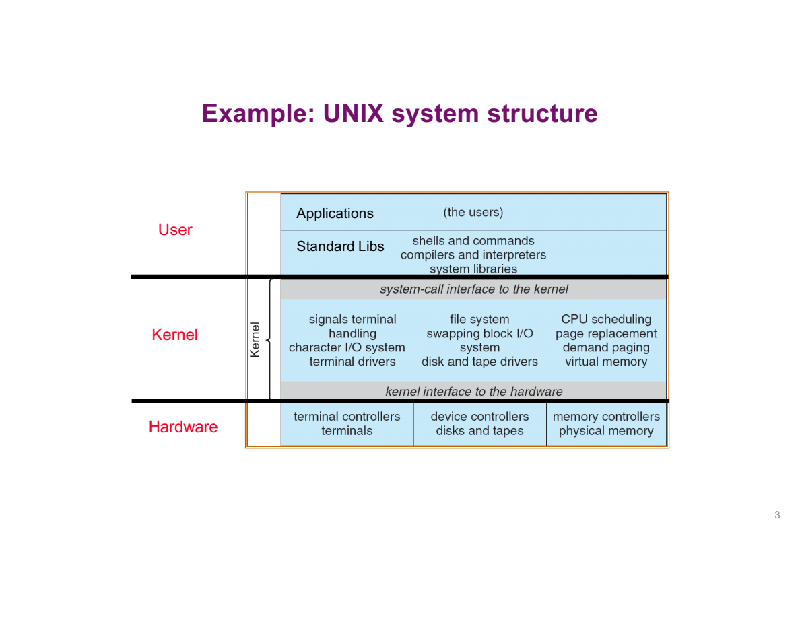
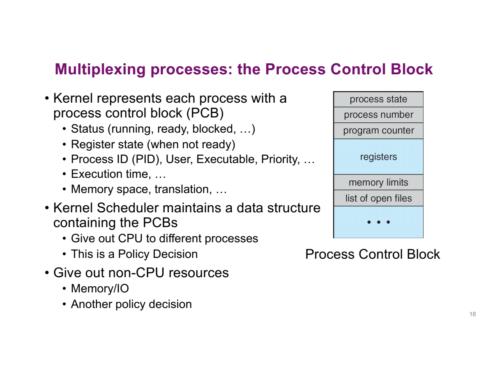
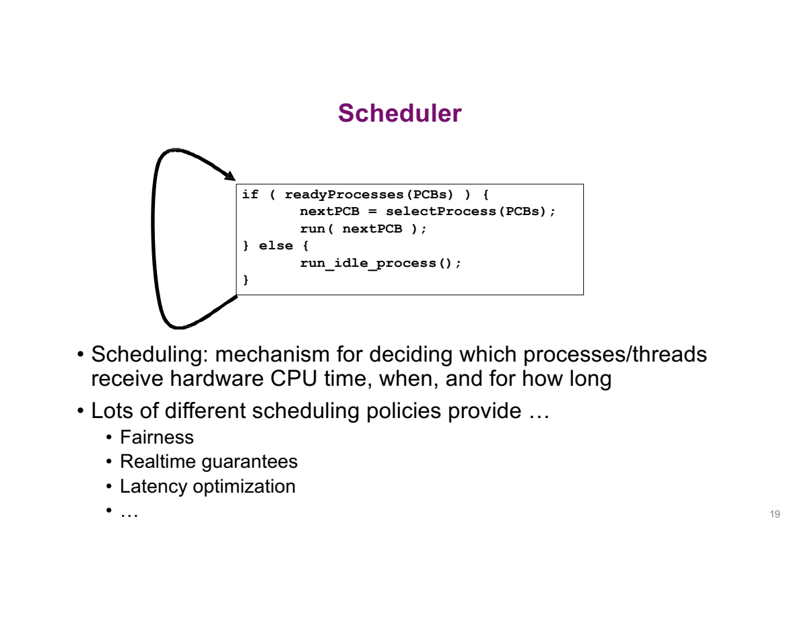
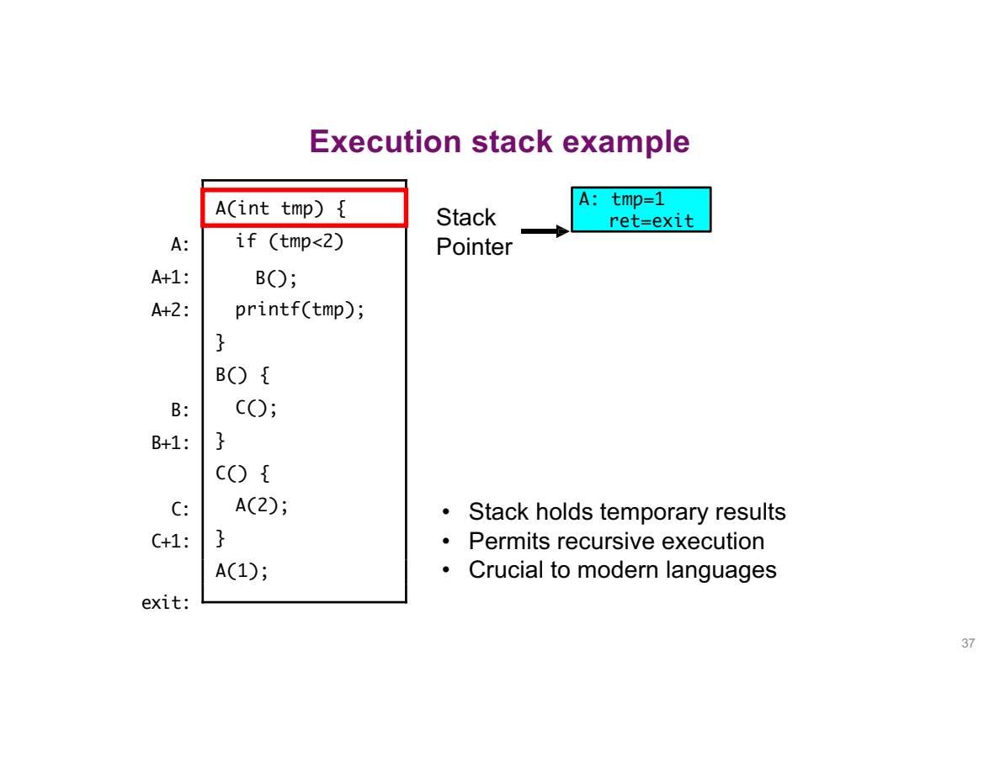
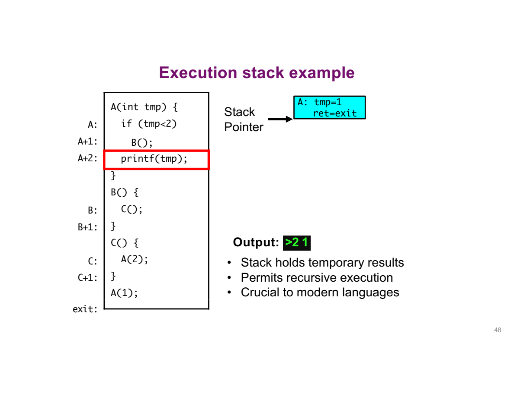

---
prev:
  text: 'Lecture 2 · Four Concepts'
  link: /notes/lec02-concepts
next:
  text: 'Lecture 4 · Process API & Locks'
  link: /notes/lec04-process
---
# Lecture 3 · 线程机制 {#lecture-3-·-switching-and-cooperating-threads}

**TL;DR**

- 暂停线程时保存执行状态，恢复后才能从原来的进度继续。
- 创建多个线程可以让独立任务推进，也能利用等待 I/O 的时间。
- Threads 共享内存，所以传参要保证对象仍然存活，共同修改数据时还需要同步。

## 1. 暂停与恢复 {#_1-context-switch-·-暂停与恢复}

**核心问题：CPU 怎样保存当前工作，再从另一个线程的断点继续？**

### 库与内核 {#application、library-与-kernel}

**核心问题：调用库函数、进入内核、切换线程分别发生在哪里？**

```text
Application code
  ↓ ordinary calls
Libraries / runtime (mostly user mode)
  ↓ controlled system calls when needed
Kernel: protection, scheduling, resource management
  ↓ manages
Hardware
```



CPU 可以执行 application、library 或 kernel 的指令。它们是代码与权限的分层，不是三个各自独立工作的 CPU。

用一次输出请求来区分三个动作：

1. 程序调用 `printf`，先进入 C 库的代码。这是 **library call（库函数调用）**。
2. C 库需要把字符交给系统输出时，可能请求 `write`。这是 **system call（系统调用）**，执行进入内核。
3. 内核完成后，可以继续运行原线程；如果当前线程需要等待，也可能改去运行另一个线程。后者才涉及线程的 **context switch（上下文切换）**。

所以，“调用了库”“进入了内核”“换了执行线程”是三个不同的问题。

| Event | Example | What follows? |
|---|---|---|
| Syscall | 请求读取文件 | 服务可能立即完成，也可能需要等待 |
| Interrupt | Timer 到期 | 内核处理事件，可能重新调度 |
| Exception | 地址访问触发 fault | 根据原因修复或报告错误 |

入口受 hardware privilege 控制。即使应用知道 kernel 地址，也不能用普通 jump 获得内核权限。

### 切换过程 {#一次完整切换}

**核心问题：P1 被打断后，CPU 怎样从 P2 上次停下的位置继续？**

使用单核、每 process 一个 thread、dynamic base-and-bounds 的教学模型。以下数字全部是 hexadecimal；Limit 表示长度，合法范围为 `0 <= VA < Limit`。

| Process | Base | Limit | Saved user PC | Saved SP |
|---|---|---|---|---|
| P1 | `0x1000` | `0x100` | `0x20` | `0xf0` |
| P2 | `0x3000` | `0x80` | `0x24` | `0x70` |

| Step | Who executes? | What changes? |
|---|---|---|
| 1 | P1, user mode | CPU 用 P1 的执行状态；VA `0x20` 对应 PA `0x1020` |
| 2 | Hardware event entry | Timer 到期，保存最低限度的恢复信息，进入受控 kernel 入口 |
| 3 | Kernel handler | 保存后续恢复所需的 registers 等状态，切到内核使用的栈处理请求 |
| 4 | Scheduler | 将仍可运行的 P1 标为 ready，选择 ready 的 P2 |
| 5 | Kernel switch code | 设置 P2 的地址空间环境，恢复 P2 的执行状态 |
| 6 | P2, user mode | 恢复 user PC=`0x24`，取指翻译为 PA=`0x3024` |

**恢复的 PC 是 P2 的 virtual PC，不是物理地址 `0x3024`。** 地址翻译是随后访问内存时发生的另一件事。

**为什么只保存 PC 还不够？**

假设 A 已经把 3 和 4 读进寄存器，准备相加，此时切走。B 也要使用寄存器，可能把这些值覆盖。若恢复 A 时只跳回原指令，却没有恢复 3 和 4，A 就会拿错误的数据继续算。

- PC 保存“执行到哪一步”。
- Registers 保存“这一步正在用什么值”。
- SP 帮助找到“目前进行到哪一层函数调用”。

这些状态合起来，才足以继续原来的工作。具体由硬件先保存哪些、内核再保存哪些，随 CPU 架构不同。

**进入内核以后，内核自己的函数调用也需要栈。** User stack 保存应用的调用链；kernel stack 用于内核处理过程，不能简单依赖一块由用户程序任意修改的栈来保存受保护的状态。


**从上往下追踪这一次往返：** 注意这里的进程名是 P0、P1，与前面数值例子的 P1、P2 只是命名不同。

1. 左侧 P0 的 executing 段：CPU 正执行 P0 的用户代码，右侧 P1 尚未获得 CPU。
2. 第一条横向箭头进入中间：interrupt 或 system call 使执行进入 kernel，并保存 P0 的现场到与 PCB0 关联的存储位置。
3. 中间恢复 PCB1 的现场：不再用 P0 的进度，而是取出 P1 上次暂停时的状态。
4. 箭头进入右侧：P1 开始执行。此时左侧 P0 的 idle 表示 **P0 没在运行**，不是整颗 CPU 闲着。
5. 下半段反向进行：保存 P1、恢复 P0，P0 才接着自己原来的工作。

为什么要先保存再恢复？如果直接用 P1 的值覆盖寄存器，P0 尚未保存的中间结果就丢了。

时间线中保存与恢复的区间没有推进用户任务，但 CPU 正在执行 kernel 工作，不是“什么都没做”。频繁切换也可能带来 cache/TLB 等额外开销，具体影响取决于实现。

> 💡 Context switch 不会把 P1 的整个 heap 和 stack 拷贝给 P2。它们的内存仍在；切换的是继续执行所需的状态与访问环境。同一 process 的线程切换通常无需更换地址空间。

“Return to user” 是概念动作，不是所有体系结构共有一个名叫 RTU 的指令。真实启动也先经过 firmware / bootloader 等阶段，这里的流程从 OS 已运行开始。

### 状态与调度 {#线程状态与调度}

**核心问题：没在运行的线程，是在排队，还是根本还不能运行？**

| State | Meaning | Can scheduler choose it now? |
|---|---|---|
| Running | 正占用某个 CPU execution context | 已在运行 |
| Ready | 除 CPU 外运行条件已满足 | 可以 |
| Blocked / waiting | 等 I/O、lock、join 等条件 | 条件满足前不能 |
| Terminated | 执行结束，可能仍待回收信息 | 不能 |

```text
Ready ──dispatch──► Running ──wait for event──► Blocked
  ▲                   │                          │
  └────preemption──────┘                          │
  └────────────────event completes───────────────┘
Running ──finish──► Terminated
```

I/O 完成通常使 thread 从 blocked 进入 ready，不保证它立刻获得 CPU。`sleep` 表示等待时间事件，不是“在 CPU 上空转同样长时间”。

| Structure | 管理层次 | 典型内容 |
|---|---|---|
| PCB (Process Control Block) | Process | PID、地址空间、资源 |
| TCB (Thread Control Block) | Thread | 线程状态、调度信息、恢复现场的关联信息 |



把“程序的数据”和“OS 管理程序的记录”分开：

- Code、global data、heap、user stack 是程序使用的地址空间内容。
- PID、运行状态、地址空间信息等让 OS 知道“这是谁、能否运行、能访问哪里”。
- 保存的 PC、SP、registers 让暂停的执行流能够继续，而不是重新调用 main。
- 多线程 process 还需要分别管理各 thread 的执行状态；PCB 与 TCB 的具体划分随实现不同。

Registers 的快照也可能保存在 trap frame / kernel stack 中，不必全部直接放进 PCB。



调度器伪代码中的三步，可以这样理解：

1. `readyProcesses(PCBs)`：先确认有没有具备运行条件的工作。正在等磁盘的任务还不能拿来继续计算。
2. `selectProcess(PCBs)`：有多个候选时，按 policy 选一个。这一步回答“给谁”。
3. `run(nextPCB)`：恢复选中者的状态，把 CPU 交给它。这一步落实“怎样交出去”。

如果一个候选也没有，就运行 idle task：CPU 可以等待中断或进入低功耗状态，等设备、计时器等事件带来新的可运行工作。Idle 不是要求用死循环白白消耗 CPU；这段伪代码也不是整个 OS 的全部实现。

- **Mechanism**：怎样保存和恢复现场，是完成切换的操作。
- **Policy**：ready 的线程中先选谁，是调度策略。
- 同一套切换机制可以配合不同 policy；“能切换”本身不能决定公平性或响应时间。

## 2. 并发的用途 {#_2-thread-·-为什么需要独立执行流}

**核心问题：一个任务等待或长期计算时，其他工作怎样继续？**

### 并发与并行 {#先分清-线程多-不等于同时执行}

**核心问题：两条线程都在推进，是否就意味着有两个 CPU？**

| Term | 描述什么？ | 例子 |
|---|---|---|
| Multiprocessing | 硬件有多个处理器或核心 | 两个核分别运行 A、B |
| Multiprogramming | 系统管理多个程序的工作 | 单核轮流运行多个进程 |
| Multithreading | 一个进程中有多条线程 | 编辑器有界面线程和读取线程 |
| Concurrency（并发） | 多项工作在一段时间内共同推进 | 单核在 A、B 之间切换 |
| Parallelism（并行） | 多项工作在同一时刻执行 | 两个核同时执行 A、B |

多线程描述程序如何组织工作，多核描述硬件能力。创建了两条线程，不会凭空制造第二个 CPU。

### 独立执行与 I/O {#并发的用途-独立推进与-i-o-重叠}

**核心问题：把工作拆成多条执行流，究竟得到什么？**

**用途一：让两项工作分别推进**


假设程序一项工作持续计算 π 的更多位数，另一项工作输出提示。若前者是不会自然结束的循环，把第二项写在它后面就不会执行到。分成两个线程，让它们分别推进，才表达出这两个活动可以独立进行。

**把输出函数调到前面不就好了？** 对这个已知例子可以，但一般情况下并不知道哪项任务耗时更长，也不希望每次都手工重排。创建独立线程后，由调度器安排各自的运行机会。

“计算 π”并非天然不会结束；这里特指持续产生更多结果的任务。若主线程创建 worker 后立即从 main 返回，整个 process 可能退出，不能以为 worker 会自动留在后台继续。

**用途二：等待设备时，让 CPU 继续做事**


两条横条画的都是 **CPU 时间归谁使用**，时间向右推进：

- 上面的 T1、T2 色块交替：两条线程都有计算可以做，轮流获得 CPU。
- 下面 T1 starts I/O 的位置：T1 已发起请求，但需要等待设备，暂时不能继续。
- 中间较长的 T2 色块：CPU 可以继续执行 T2；与此同时设备在处理 T1 的请求。
- 到 T1 I/O completes 后，T1 重新具备运行条件，随后才会再次获得 CPU。

**中间没有 T1 的 CPU 色块，不代表它的请求没有进展。** 进展发生在设备那边，这正是计算与 I/O 能够重叠的原因。

线程 A 等待磁盘数据时，线程 B 可以处理已有数据或响应 UI。设备可能借助 DMA 完成传输，并通过 interrupt 通知完成；CPU 仍需要发起、处理完成事件等工作，所以不能说 I/O 完全不需要 CPU。

按时间顺序追踪 I/O overlap：

1. A 发起读取，数据尚未到达，A 进入 blocked。
2. Scheduler 选择 ready 的 B，CPU 执行 B 的计算；设备同时处理 A 的请求。
3. 设备完成后触发通知，OS 使 A 重新 ready。
4. A 之后被调度时继续处理返回的数据，B 不一定恰好在此时结束。

例如一次设备等待约 10 million ns，即 10 ms；这段时间可能足够 CPU 做大量其他工作。收益来自减少空等，不是把同一条 CPU 指令执行得更快。

单核可以重叠“设备等待”和“CPU 计算”，但不能让两条普通线程指令流在同一 execution context 上同时执行。多核则提供真正 parallel execution。

## 3. Pthread API {#_3-pthreads-·-创建、传参、等待结果}

**核心问题：怎样创建一个 thread，传给它数据，再安全取得结果？**


这幅“中间窄、两端宽”的结构，要把两条分界线分开：

- **上端应用很多**：浏览器、数据库、编辑器做的事不同，却可以使用共同的系统服务。
- **中间的 user/system 分界**：库封装调用细节；真正请求受保护服务时，才通过 system call interface 进入内核。
- **下端硬件很多**：内核通过平台支持和 drivers 适配不同 CPU、存储、网络设备。下面 software/hardware 分界与上面的权限分界不是同一条线。

所以，写 C 时没亲手写过系统调用指令，并不表示没有使用 OS 服务。库和 runtime 可以替应用完成这一步。

- Application 使用较丰富的 library API；底层通过受控的 syscall interface 请求 OS 服务。
- `pthread_create` 是 library API。实现可以组合 runtime 工作与内核服务，不应把每个 pthread 函数直接等同于一条 syscall。
- API 的价值在于约定输入、输出与效果，让调用者不必自己编写 context-switch 代码。


沿着执行流理解 create 与 join：

1. Create 前只有原执行流；create 成功后，worker 从指定函数入口开始。
2. Caller 可以继续做自己的事，worker 与它并发推进。
3. Caller 执行 join 时，若目标尚未结束就等待；若已结束则无需再等它运行。
4. Join 之后，caller 才能依赖目标已完成。图中的分叉是线程创建，不是调用 process API `fork()`。

**蓝色分支有的短、有的长，表示它们不必同时结束。** 红色主线在汇合后继续，表示这一阶段所需的结果已经收齐。

但一次 `pthread_join(tid, ...)` 只等待 tid 指定的一条线程。要实现图中的“等全部完成”，需要对每个 worker 分别 join；不是调用一次 join 就自动等待整个进程中的所有线程。

```c
int pthread_create(pthread_t *thread, const pthread_attr_t *attr,
                   void *(*start_routine)(void *), void *arg);
int pthread_join(pthread_t thread, void **retval);
void pthread_exit(void *retval);
```

| API | Inputs | Outputs / effect |
|---|---|---|
| `pthread_create` | attributes, function, argument pointer | 通过第一个参数写出 thread ID；返回 0 表示成功 |
| `pthread_join` | thread ID | 等其结束并回收 joinable-thread 资源，可接收返回 pointer |
| `pthread_exit` | result pointer | 终止调用线程，交出结果 |

Pthread functions 通常直接返回 error number，应检查返回值，而不是只依赖 errno。创建成功后，caller 和 worker 谁先运行没有固定保证。

### 创建与传参 {#四个-create-参数怎样连起来}

**核心问题：这条调用到底让新线程执行什么？**

```c
pthread_create(&tid, NULL, worker, &input);
```

| 参数 | 作用 |
|---|---|
| `&tid` | 给一个有效位置，让函数把新线程的标识写进去 |
| `NULL` | 使用默认属性；也可以用属性对象指定栈大小等 |
| `worker` | 新线程要执行哪个函数 |
| `&input` | 交给这个函数的参数 |

从 worker 的角度看，它收到的是 `&input`，但由**新线程**执行。直接写 `worker(&input)` 则只是当前线程的一次普通函数调用。

> 💡 传的是 `worker`，不是 `worker(...)`。前者提供函数地址，后者会立即调用函数。一个入口只能接收一个 `void *` 参数；需要传多个值时，可以先放进 struct，再把 struct 的地址传进去。

### 结果传回 {#参数方向-为什么有-还有}

**核心问题：返回 error code 的函数怎样再交出 thread ID 或结果 pointer？**

Create 用 `&tid` 交出可写的位置；join 用 `tid` 指定等待对象，再用 `&result` 接收结果地址。两次调用本身的返回值都是 error code。

再把 `void **` 拆开看。假设 main 写了：

```c
void *result = NULL;
pthread_join(tid, &result);
```

1. `result` 是 main 中的一个变量，用来存地址，类型是 `void *`。
2. Join 需要修改 result，让它存下 worker 交出的地址。
3. C 函数要修改调用者的变量，就需要知道这个变量放在哪里，所以传 `&result`。
4. “存地址的变量”的地址，多一层 `*`，类型就是 `void **`。

`void *` 表示这里没有指定所指对象的类型。收到它后，要按真实对象类型使用；例如下一个示例传的是 `struct job` 的地址，就按 `struct job *` 来解释。

**把结果传回过程画出来：**

```text
worker：return job
           │ 交出一个地址值
           ▼
main：result [这个地址] ─────► 仍存活的 struct job
         ▲
         │ join 要往这个变量里写，所以接收 &result
```

- Worker 交出的是 pointer，类型可以统一表示为 `void *`。
- Main 准备一个 pointer 变量 result 来接收它。
- Join 为了修改 result，需要的是 result 的地址，也就是 `void **`。
- 双指针描述的是“写入哪个变量”，不是把结果对象复制两次，也不是创建两层线程。

> 💡 Join 交回的是地址，不会替这个地址指向的对象延长寿命。Worker 不能返回自己已经结束生命周期的局部变量地址。

::: tip 基础补充
对 `p`、`*p`、`&p` 的区别不熟？先读 [C pointers](../foundations/c-pointers.md)。
:::

### 完整示例 {#完整示例-参数与结果由谁持有}

下面是 `demos/lec03/pthread_review.c` 的完整代码。`check` 在 API 失败时打印原因并退出，避免继续使用无效结果。

```c
#include <pthread.h>
#include <stdio.h>
#include <stdlib.h>
#include <string.h>
struct job { int input; int output; };
static void check(int rc, const char *operation) {
    if (rc != 0) {
        fprintf(stderr, "%s: %s\n", operation, strerror(rc));
        exit(EXIT_FAILURE);
    }
}
static void *worker(void *arg) {
    struct job *job = arg;
    job->output = job->input * job->input;
    return job;
}
int main(void) {
    struct job jobs[2] = {{3, 0}, {4, 0}};
    pthread_t tids[2];
    for (int i = 0; i < 2; ++i)
        check(pthread_create(&tids[i], NULL, worker, &jobs[i]), "pthread_create");
    for (int i = 0; i < 2; ++i) {
        void *result = NULL;
        check(pthread_join(tids[i], &result), "pthread_join");
        struct job *job = result;
        printf("%d squared = %d\n", job->input, job->output);
    }
    return 0;
}
```

逐个对象追踪：

1. Main 建立 jobs 数组，数组在所有 joins 完成前一直存活。
2. Worker 0 收到 `&jobs[0]`，worker 1 收到 `&jobs[1]`，不是同一个循环变量的地址。
3. 每个 worker 写各自的 output，不互相修改同一对象。
4. Main 在相应 join 完成后才读取该结果，因此读取发生在该 worker 结束之后。
5. 返回的 pointer 指向仍存活的 jobs 元素，不指向 worker 已销毁的 local object。

```sh
cc -std=c11 -Wall -Wextra -pthread demos/lec03/pthread_review.c -o /tmp/os-pthread-review
/tmp/os-pthread-review
```

实际运行输出：

```text
3 squared = 9
4 squared = 16
```

**按索引 join，不等于按索引完成。** 假设实际情况是：

| 时刻 | Worker 0 | Worker 1 | Main |
|---|---|---|---|
| 1 | 计算中 | 计算中 | 等 worker 0 |
| 2 | 仍在计算 | 已完成 | 仍在等 worker 0 |
| 3 | 完成 | 已完成 | 取得 0 的结果并打印 |
| 4 | 已完成 | 已完成 | Join 1 不必等它继续计算，取得结果并打印 |

因此，输出仍是 9 在前、16 在后；这不证明 worker 0 先完成。

先 create 全部，再逐个 join，允许任务并发推进。每 create 一个就立即 join，等它结束才创建下一个，会把这些任务串行化。

> 💡 `pthread_join(tid, NULL)` 仍然等待，只是不接收结果。`pthread_create` 的第一个参数不能用 NULL 代替有效输出位置。返回值不一定要用 malloc，caller-owned object 只要生命周期足够也可以。

**结束与回收要分开看：**

| Operation | 结果 |
|---|---|
| Worker routine `return` | 结束该 thread，交出返回 pointer |
| 初始 `main` 的 `return` | 结束整个 process |
| Main 调用 `pthread_exit` | 结束主线程，其他线程可继续 |
| `pthread_join` | 等待指定 joinable thread，并回收相关资源 |
| `pthread_detach` | 让线程结束时自动回收，不再由 join 收取结果 |

Detach 不会让线程在所属 process 退出后继续存在。

## 4. 共享数据 {#_4-shared-state-·-为什么需要同步}

**核心问题：为什么 `common++` 不能按“一行代码”分析？**

先把前面的安全示例与共享变量示例连起来：前面每个 worker 修改自己的 `jobs[i].output`；如果所有 worker 都修改同一个全局 `common`，会发生什么？

下面是后者的**结构示意，不是安全的可运行模板**：

```text
全局：common = 162

main：                           worker(id)：
  创建 N 个 workers                准备本次调用的局部变量 local
  按编号依次 join                   打印 id、&local、&common
  等所有 workers 完成              执行 common++，打印取得的旧值
                                   结束线程
```

沿着这段结构，依次回答几个问题：

1. **创建 4 个 worker，程序里就只有 4 个线程吗？** 还要算上 main，因此在它们都存在时有 5 条执行流；某个 worker 提前结束后，同时存活的数量会减少。
2. **它们执行同一个 worker 函数，local 就只有一份吗？** 不是。代码可以共用，但每次调用有自己的局部对象。就像两次调用 `A(tmp)` 各自保留参数一样。
3. **为什么各自的 local 地址不同，`&common` 却相同？** local 属于不同的调用；common 是函数外的同一个全局对象，所有 worker 都能访问它。
4. **Main 先 join 0，是否要求 worker 0 先完成？** 不要求。Join 只约束 main 的等待流程，worker 1 仍可能先完成。
5. **既然最后都会 join，common 的更新就安全吗？** 不安全。两个 worker 在 main 等待期间仍可能同时修改 common，下面需要继续分析它们怎样交错。

先拆开课堂多 worker 示例中的三种对象：

| Object | 是否同一个对象？ | 观察时应怎样解释？ |
|---|---|---|
| Global `common` | 所有 workers 共享 | 各线程打印的 `&common` 指向同一对象 |
| Worker 函数中的 automatic local | 每次调用各自一份 | 同时存活的调用拥有各自局部对象，不因函数名相同而合并 |
| 给 worker 的编号参数 | 取决于传参方式 | 应给每个 worker 稳定的独立参数，不能反复传同一个变化中的循环变量 |

自行编号的 0、1、2 只是任务标签，不是 OS thread ID。

同一 process 的 global `common` 是所有 worker 访问的同一个对象。教学模型把一次 increment 拆成 read、add、write：

| Step | Thread A | Thread B | Shared common |
|---|---|---|---|
| 1 | read 0 | | 0 |
| 2 | | read 0 | 0 |
| 3 | compute 1 | | 0 |
| 4 | | compute 1 | 0 |
| 5 | write 1 | | 1 |
| 6 | | write 1 | 1 |

- **模型中的错误**：两次 increment 只保留一次，称为 lost update。
- **真实 C 的规则**：无同步的冲突非原子访问构成 data race，行为未定义；不能保证只出现表中的结果。

原始 `pthread_demo.c` 保留为不安全反例，不作为正确代码模板。观察日志时还要注意：`common++` 表达式产生旧值；先完成 increment 的线程可以晚打印。打印乱序不等于已经证明 lost update，更不能只靠某次“看起来正确”证明没有 race。

**代码检查还有另一个独立问题：分配线程数组可能失败。**

```c
pthread_t *threads = malloc(nthreads * sizeof *threads);
if (threads == NULL) {
    // 报错并结束，不再访问 threads[t]
}
```

这只是分配失败检查的片段；实际程序还需要先验证 nthreads 的范围。它与锁解决的问题不同：

- NULL 检查防止“根本没分配到对象，却继续沿地址访问”。
- 同步防止“对象存在，但多个线程的冲突操作破坏结果”。
- 修好其中一个，并不会自动修好另一个。

`join` 只让 main 在结束后读结果，不能自动协调两个 worker 之间的冲突。Lecture 4 用同一个 mutex 保护共享更新。

## 5. 线程与栈 {#_5-thread-state-stack-·-共享资源-独立进度}

**核心问题：threads 共享地址空间，为什么还能分别暂停和返回？**


左边共同的一份 code、globals、heap，解释“为什么能直接共享数据”；右边每条线程各有 TCB 和 stack，解释“为什么能记住各自进度”：

- **Stack information**：帮助系统找到并管理这条线程的栈。
- **Saved registers**：线程不在 CPU 上时，保留继续执行需要的现场。
- **Thread metadata**：例如它的运行状态与调度相关信息。
- **Stack**：实际保存调用链上的局部状态与返回位置；它和“管理栈的信息”不是同一个东西。

大框表示一个进程相关的状态集合，并不表示图中所有对象都放在用户可直接修改的内存里。TCB 中受保护的管理信息由 OS / runtime 按实现管理。

| Shared by threads | Per-thread execution state |
|---|---|
| Code、global data、heap、process resources | PC、register context、调用栈及调度状态 |
| 决定“能访问哪些共同对象” | 决定“正在做什么，之后从哪里继续” |

- “独立 stack”指每个 thread 有自己的调用链，不是其他 thread 在硬件上不能访问它。把栈对象地址交给其他线程时仍要考虑生命周期与同步。
- 保存多套 register context 不要求有同样多的 CPUs。单核也能轮流把不同线程的 context 恢复到寄存器中。
- TCB 是 OS / runtime 的管理记录；概念上属于线程，不意味着内核的 TCB 必须放在用户可读写的地址空间里。

### 递归推演 {#独立调用栈-递归推演}

**核心问题：同一函数的多次调用怎样记住各自的返回位置和局部值？**

先读完整的函数关系。下面与可运行示例 `demos/lec03/stack_review.c` 对应，省略头文件和函数声明：

```c
void A(int tmp) {
    if (tmp < 2) B();
    printf("%d\n", tmp);
}
void B(void) { C(); }
void C(void) { A(2); }
int main(void) { A(1); return 0; }
```

**暂时不要一次看完所有函数。从 main 开始，每遇到一次调用，就去执行被调用的函数：**

```text
main → A(1) → B() → C() → A(2)
```

A 在参数小于 2 时调用 B，随后打印自己的参数。

| Step | Active invocation | What happens? |
|---|---|---|
| 1 | A(1) | 保存 tmp=1，调用 B |
| 2 | B then C | 每次调用记录自己的恢复位置 |
| 3 | A(2) | 条件不成立，不再递归，打印 2 |
| 4 | C then B return | 按相反顺序恢复 caller |
| 5 | A(1) | 自己的 tmp 仍是 1，打印 1 |



- PC 表示当前执行位置；SP 标记当前栈位置。调用深度变化时，SP 随 frame 的建立与撤销变化。
- A(1) 调用 B 后还要继续执行，所以要保留它的 tmp=1 与返回位置。
- 之后再次进入 A 得到的是 A(2) 的另一次调用，不会把 A(1) 的 tmp 改成 2。


图中的 `A+2` 表示 A 调用 B 之后，接着执行打印的位置。B 的 frame 要记住这个返回地址，才能在 B 结束后回到 A 的正确位置。`B+1`、`C+1` 同理。

此时最深处的 A(2) 正在执行，四个 frame 都还存在：

| Frame | 仍要保留什么？ | 这次调用结束后回哪里？ |
|---|---|---|
| 外层 A(1) | tmp = 1，还没执行自己的打印 | 调用它的位置之后，即示意中的 exit |
| B | C 返回后还要完成 B 的返回 | A+2，继续打印外层 tmp |
| C | A(2) 返回后还要完成 C 的返回 | B+1，完成 B |
| 内层 A(2) | tmp = 2 | C+1，完成 C |

**两个 A frame 为什么不会互相覆盖？** 进入 A(2) 时建立的是新 frame；外层 A(1) 仍在等 B 返回，所以它的 tmp=1 必须留着。函数代码还是同一份，调用状态却有两份。

`printf(tmp)` 是“打印 tmp”的简写；真正的 C 格式写法是上面的 `printf("%d\n", tmp)`。

**Return address 与 return value 不同：**

- Return address（返回地址）：B 结束后，要回到 A 的哪条指令？
- Return value（返回值）：函数交给调用者什么结果？例如 `return 42` 中的 42。
- 即使 B 不返回数据，它也必须知道返回哪里，所以仍需要保存恢复执行的信息。

图按每次调用建立一个 frame（栈帧）来解释。实际机器怎样保存这些信息，由编译器和调用约定决定。



返回时按调用顺序的反向撤销 frame：

| Return | 恢复到哪里？ | 保留什么？ |
|---|---|---|
| A(2) → C | C 调用 A 后的位置 | C 的后续执行状态 |
| C → B | B 调用 C 后的位置 | B 的后续执行状态 |
| B → A(1) | A(1) 调用 B 后的位置 | 原来的 tmp=1，所以接着打印 1 |
| A(1) → main | main 调用 A 后的位置 | main 继续 |

撤销 frame 是恢复栈的使用位置，不要求把内存中的旧字节清零。对象生命周期已经结束，即使字节暂时还在，也不能继续合法访问该局部对象。


为什么每个线程需要自己的栈？A 可能停在三层调用里，B 可能已经返回到 main；两者必须分别记住各自的返回路径。

栈的容量也需要管理：

1. 嵌套调用越深，同时存在的 frame 越多，需要的栈空间越大。
2. 栈不能无限增长；过深递归或过大的局部对象可能超出可用空间。
3. 系统可以在边界设置 **guard page（保护页）**。访问到不允许使用的保护页时，硬件触发 fault，帮助发现某些越界增长。
4. 保护页不是对每个变量的边界检查，也不会让同进程线程的内存完全隔离。

**运行递归示例验证顺序：**

```sh
cc -std=c11 -Wall -Wextra demos/lec03/stack_review.c -o /tmp/os-stack-review
/tmp/os-stack-review
```

实际输出为 2、1，各占一行：最内层 A(2) 先打印，返回到外层 A(1) 后才打印 1。

## Self-check

1. 描述一次 P1 → P2 切换，分别指出 hardware、kernel、scheduler 的工作。
2. I/O 完成后，blocked thread 为什么不一定立即 running？
3. P2 Base=`0x3000`、Limit=`0x80`、saved PC=`0x24`，恢复的 PC 和取指 PA 各是什么？
4. 为什么示例两个 worker 的执行顺序不确定，输出顺序却确定？
5. 将 worker 的 return 改成返回局部 int 的地址，会有什么问题？
6. `join` 全部线程后发现 common 数值正确，是否证明程序不存在 race？

7. `pthread_create` 为什么接收 `&tid`，而 `pthread_join` 接收 `tid` 和 `&result`？
8. A(2) 返回后，为什么 A(1) 仍能打印 1？

**A1.** Hardware 提供受控入口并保存最低限度恢复信息；kernel 保存剩余必要现场；scheduler 选择 ready 的 P2；kernel 恢复地址环境和现场后返回 user mode。具体保存分工依 architecture 而异。

**A2.** 完成事件只恢复运行资格。还要经过 scheduler 选择，可能有其他 ready threads 在等待。

**A3.** 恢复 virtual PC=`0x24`，地址检查通过，取指 PA=`0x3024`。不能把 PA 当作恢复的 user PC。

**A4.** Worker 调度顺序没有保证；main 按固定索引 join 并打印。等第一个不阻止第二个提前完成。

**A5.** Worker 返回后 automatic local object 生命周期结束；join 接收地址不会延长对象生命周期，后续访问非法。

**A6.** 不能。一次运行只展示一个观察结果；无同步冲突已经构成 data race。必须通过程序的同步关系论证正确性。

**A7.** Create 要写出 ID，接收 tid 的地址；join 读取已知 ID 来选目标，同时可向 result 写出 worker 返回的 pointer，因此接收 result 的地址。两者的 int 返回值用于报告成功或错误。

**A8.** 两次调用有独立的局部状态与恢复位置。内层 frame 撤销后，外层 frame 的 tmp=1 仍在生命周期内，不会被内层 tmp=2 替代。

## 参考资料（可选）

用于核对 API 规则；本讲的解释和例子已在正文展开，无需先阅读这些文档。

- [pthread_exit](https://man7.org/linux/man-pages/man3/pthread_exit.3.html)
- [POSIX memory synchronization](https://pubs.opengroup.org/onlinepubs/9799919799/basedefs/V1_chap04.html)
