# Lecture 3 · Threads and Processes: A Programmer's Viewpoint

> CSC3150 · CUHK-Shenzhen · Fall 2026 · Slides adapted from Berkeley CS 162

**TL;DR**: 用一个 Base & Bound 玩具机把"加载进程 → 运行 → 中断 → 切换 → 恢复"完整推演一遍，搞清 syscall / interrupt / trap 三扇进内核的门和 interrupt vector 的查表机制。然后引出 thread：进程内可被独立调度的执行流，共享地址空间、私有寄存器和栈。最后落到 pthread API、fork-join 模式和 race condition。

***

## 1. Recap: 四个基本概念

这节课建立在四个基本概念上（详细展开见 [Lec 02](lec02-concepts.md)）：

| Concept | 组成 | 一句话 |
|---|---|---|
| **Process** | address space + ≥1 thread | 正在运行的程序实例，是"机器"的抽象 |
| **Thread** | PC + registers + stack + execution flags | execution context，完整描述"执行推进到哪了" |
| **Address space** | 程序可访问的内存地址集合 | 可与物理内存不同（virtual address space） |
| **Dual mode** | user / kernel 两态 + 地址翻译 | 进程彼此隔离、OS 与进程隔离的地基 |

注意两者的层次关系：

* **Process 是更大的概念**：除了执行，还管 isolation。每个进程有自己的地址空间，别的进程不能轻易访问。
* **Thread 只管 execution**：它的全部内容（PC、registers、stack、flags）就是"会被加载到 CPU 上的那些东西"。
* **共享规则**：同一进程内的所有 thread 共享这个 address space。

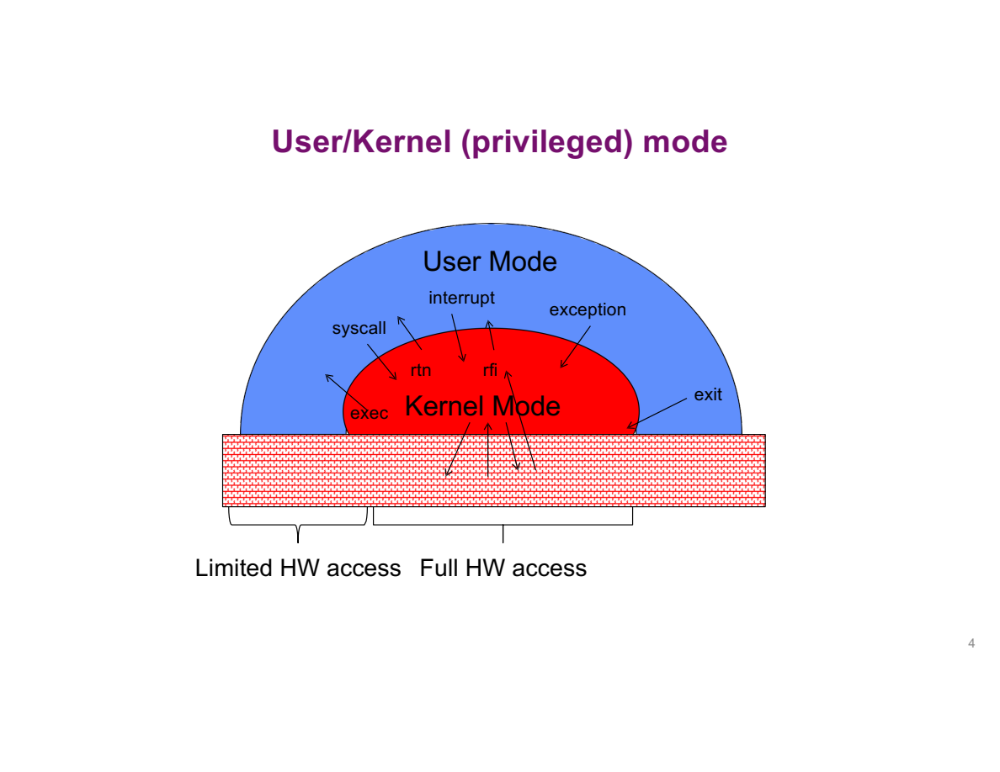

上图是本课的骨架图，按方向读：

* **蓝色大半圆** = User Mode（Limited HW access）；**内嵌红色半圆** = Kernel Mode（Full HW access）；底部砖墙 = 硬件。
* **User → Kernel 三个入口**：`syscall`、`interrupt`、`exception`。
* **Kernel → User 出口**：`rtn` / `rfi`。
* 两侧还有 `exec`（新程序进内核）和 `exit`（程序终结离开）。

UNIX 系统结构也是这个分层：

* Applications 和 Standard Libs 坐在 **system-call interface** 之上。
* Kernel（signals、file system、CPU scheduling、demand paging、virtual memory 等）坐在 hardware 之上。
* 一切对硬件的访问都必须经过 kernel。

***

## 2. Base & Bound: 一个进程的完整生命周期

**核心问题：OS 如何把控制权交给用户程序，又如何拿回来？**

先认识这台简化机器：

* **物理内存** `0000…`–`FFFF…`：顶部灰色是 OS 段，`1000…` 处是进程 P1（绿），`3000…` 处是进程 P2（黄）。
* **CPU 特殊寄存器**：
  * `sysmod`：模式位，1 = kernel，0 = user
  * `Base` / `Bound`：地址翻译与保护
  * `uPC`：user PC 保存槽
  * `PC`、`regs`：常规程序计数器与通用寄存器

### 第 1 步：OS load process

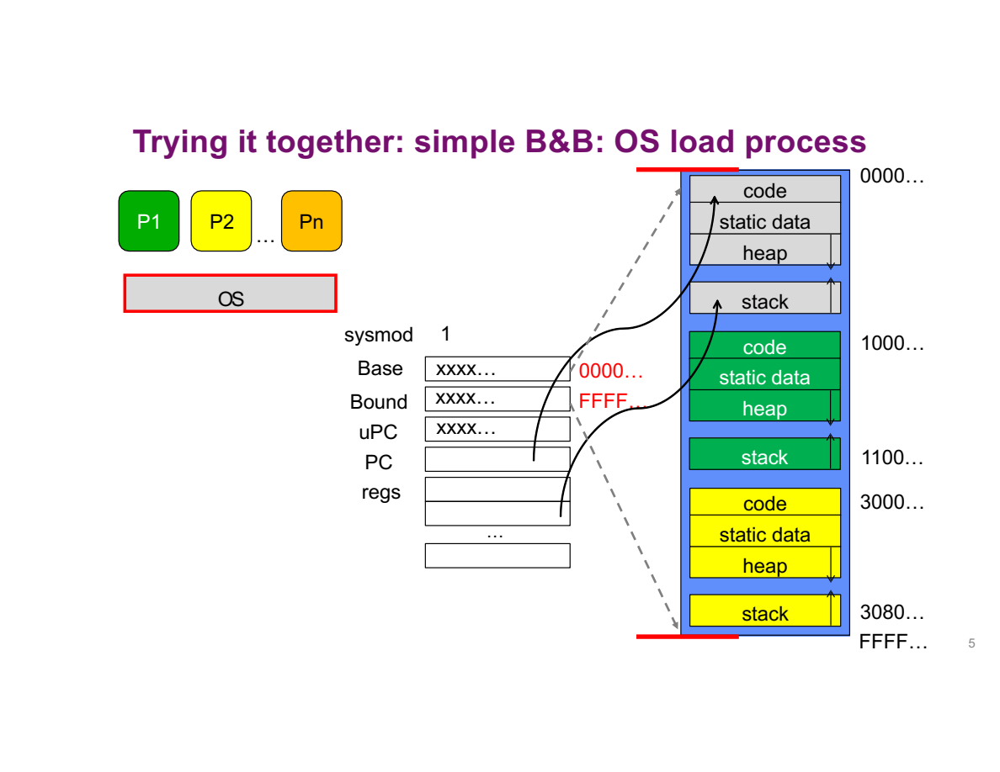

* OS 把 P1 的 code、static data 装入 `1000…`，heap 和 stack 随之布局（注意 heap 与 stack 之间的相向增长箭头）。
* 此时所有特殊寄存器还是 `xxxx…` 未初始化。
* `sysmod = 1`：现在是内核在干活。

### 第 2 步：OS gets ready, then RTU

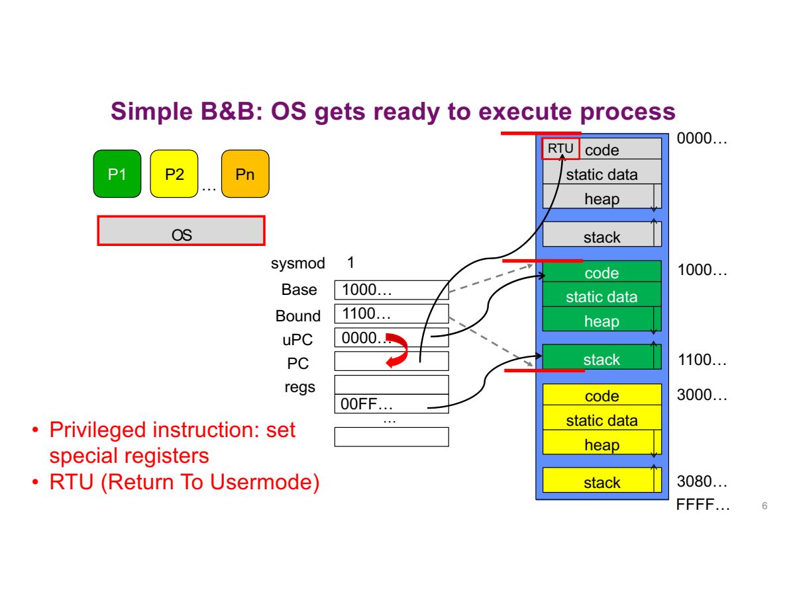

* OS 用 **privileged instruction**（特权指令）填好笼子：
  * `Base = 1000…`、`Bound = 1100…`：P1 的地盘
  * `uPC = 0000…`：P1 视角的入口地址
  * `regs = 00FF…`：P1 的初始寄存器值
* 然后执行 OS 代码段里红框标出的 **RTU（Return To Usermode）**：`sysmod` 拨成 0，`PC ← uPC`。
* 从此 CPU 以用户态跑 P1。

### 第 3 步：user code running

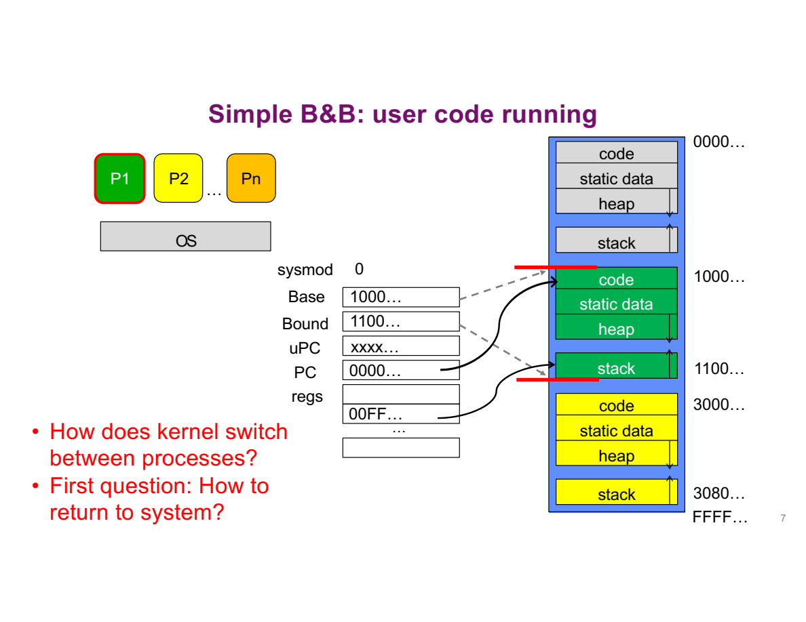

* `sysmod = 0`，PC 在 P1 的地址空间里推进。
* 虚线表示硬件在做 **Base + PC** 的重定位：程序以为自己跑在 `0000…`，实际物理地址是 `1000…`。
* 任何越出 Bound 的访问都会被硬件拦下。

问题来了：**kernel 怎么夺回控制权？** 用户程序里没有"回到内核"的代码，它连内核在哪都看不见。这就是下一节的三扇门。

### 第 4 步：interrupt 发生

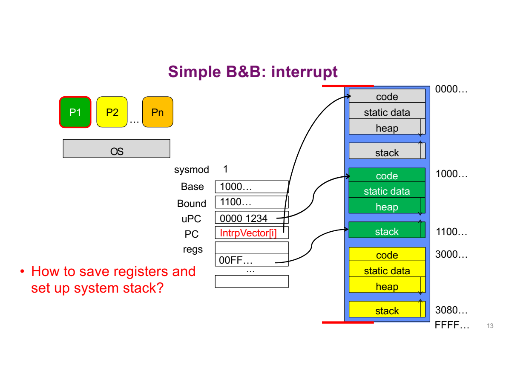

定时器中断到来的一瞬间，**硬件自动做三件事**：

1. `uPC ← 0000 1234`：把被打断的用户 PC 存起来
2. `sysmod ← 1`：切回内核态
3. `PC ← IntrpVector[i]`：查中断向量表，跳进内核 handler（下一节细讲）

> 💡 **跳到 handler 就够了吗？不够。**
>
> * 如果只改 PC，就永远回不到用户进程了，因为寄存器现场还没有人保存。
> * 分工：跳转和模式切换由**硬件**完成；保存寄存器、搭建系统栈是 **OS（软件）** 的活。handler 把 P1 的全部寄存器复制到内核里保存起来。
> * 另外，timer 是 OS 事先设好的（比如给每个进程最多 5 ms），时间一到硬件就点火，所以死循环的程序也霸占不了 CPU。

### 第 5 步：switch user process

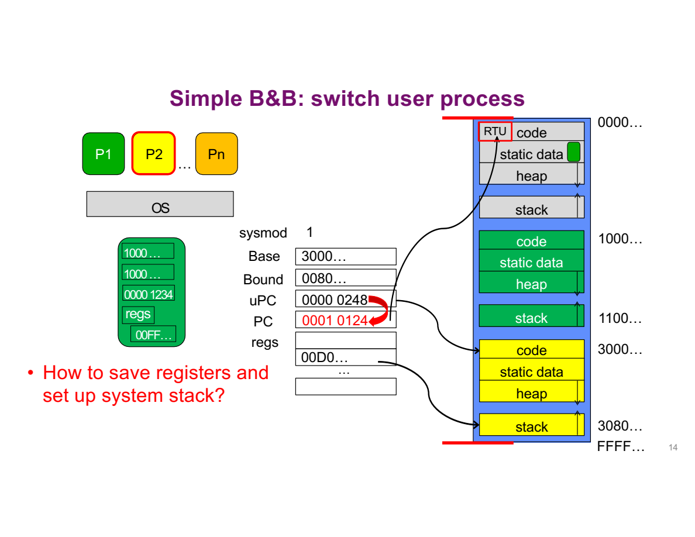

* 内核决定换 P2 上场。
* 左下角那条绿色小竖条 = **P1 被打包存档的上下文**（`1000… / 1000… / 0000 1234 / regs / 00FF…`），它是 PCB 的直观前身。
* 寄存器组被改装成 P2 的值：`Base = 3000…`、`Bound = 0080…`、`uPC = 0000 0248`、`regs = 00D0…`。

### 第 6 步：resume

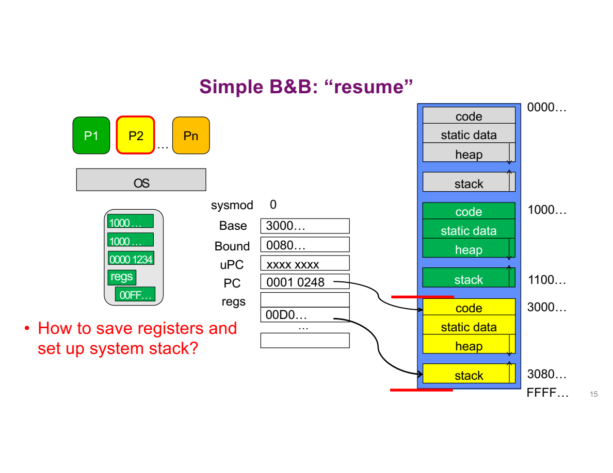

* 再次 RTU：`sysmod = 0`，`PC = 0001 0248`。
* P2 从它上次停下的地方接着跑，完全不知道自己被暂停过。
* P1 的存档条躺在内核里，等下一次被 reload。

### 另一个视角：CPU switch from P₀ to P₁

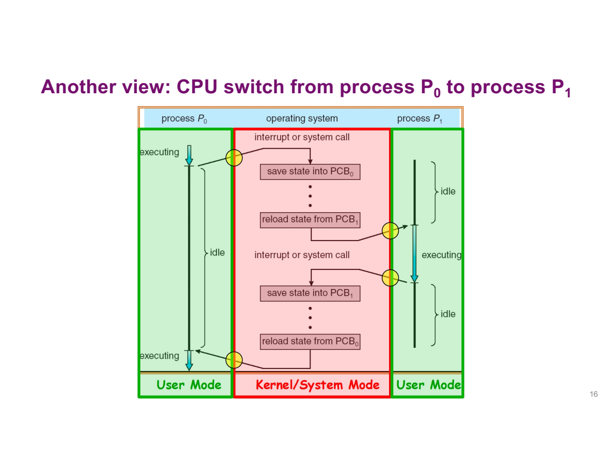

把全过程画成时序图：

1. P₀ 用户态执行
2. interrupt or system call → 进内核
3. **save state into PCB₀** → **reload state from PCB₁**
4. P₁ 用户态执行（过段时间对称地切回来）

两个要点：

* 中间两个进程都 idle 的区间 = **context switch 的纯开销**。
* 这个"进内核先存档、回用户先读档"的循环，在你的电脑里每秒发生成千上万次。

***

## 3. 三种 User → Kernel 转移 + Interrupt Vector

**核心问题：程序没有内核函数的地址，控制权怎么安全地转移？**

| 类型 | 本质 | 同步性 | 例子 |
|---|---|---|---|
| **Syscall** | 进程主动请求系统服务 | 同步、主动 | `exit`、读写文件、打印 |
| **Interrupt** | 外部硬件异步事件 | 异步、与当前进程无关 | timer、鼠标移动、键盘输入、麦克风 |
| **Trap / Exception** | 当前指令引起的内部事件 | 同步、被动 | 除零、protection violation（segfault） |

三者的共性：都是 **unprogrammed control transfer**，即切换不是运行中的程序用指令直接指定的。

关于 syscall 还有两个细节：

* 它像一次函数调用，但目标"在进程之外"：用户程序**没有**系统函数的地址，不能像普通 `call` 那样跳过去。
* 所以它采用类似 **RPC（Remote Procedure Call）** 的做法：把 **syscall 编号和参数装进约定好的寄存器**，再执行 syscall 指令，剩下的交给硬件和内核。

### Interrupt vector: 转移的目标地址从哪来

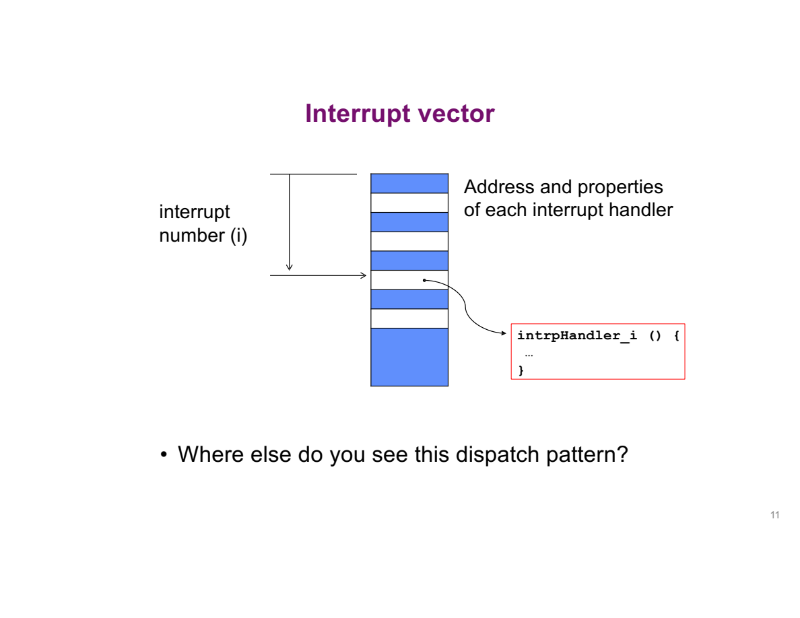

**Interrupt vector（中断向量表）**：

* 结构：一张数组，下标是 interrupt number (i)，每格存对应 handler 的地址和属性。
* 工作方式：事件发生时硬件查表，把 PC 设成 `IntrpVector[i]`，跳转到 `intrpHandler_i()`。

> 💡 **实现细节**（x86 real mode）：
>
> * 这张表固定在**物理地址 0**，共 **256 项、每项 4 字节**（4 字节只够存一个函数地址）。
> * 表的位置由**硬件制造商规定**，开机时由硬件保证其存在。
> * **OS 启动时用自己的 handler 覆盖填写**。
> * 推论：用户程序只能触发"几号事件"，改不了表，也就劫持不了跳转目标。"跳到哪"永远由 OS 决定。

这种"编号 → 查表 → 跳到处理函数"的 dispatch 模式到处可见：函数指针数组、`switch-case`、虚函数表、事件回调注册。

***

## 4. PCB 与 Scheduler

机制（mechanism）已经齐了：用户态/内核态互切、内核切换进程、双向保护。但一串管理问题随之而来：

* 怎么决定**哪个**进程上 CPU？
* 在 OS 内部**怎么表示**一个进程？
* 怎么把进程打包收起来？
* 内核自己的 stack 和 heap 从哪来？
* 是不是浪费了很多内存？

前两个本课回答，后面的是后续章节的引子。

**PCB（Process Control Block）**：内核给每个进程建的档案，内容包括：

* status（running / ready / blocked / …）
* register state（进程不在运行时保存的现场）
* PID、user、executable、priority、execution time
* memory space 与 translation 信息、打开的文件的列表

**Scheduler**：维护装着所有 PCB 的数据结构，逻辑是一个无限循环：

```c
if ( readyProcesses(PCBs) ) {
    nextPCB = selectProcess(PCBs);
    run( nextPCB );
} else {
    run_idle_process();
}
```

两点解读：

* 换句话说，CPU 本质上就是这么一个循环程序：反复检查谁 ready、跑谁、没有就 idle。
* 机制与策略的区分：**切换的机制已经建好，"挑谁"是 policy decision**。不同 policy 追求 fairness、realtime guarantees、latency optimization，这是调度章节的主题。

***

## 5. Thread: 概念澄清

**核心问题：执行、并发、并行这三个词到底分别指什么？**

Thread 的两个等价定义：

* 从表示上看：a single unique execution context（PC、registers、stack 那套数据）。
* 从抽象上看：**a single execution sequence that represents a separately schedulable task**（一个可被独立调度的执行序列）。

两个要点：

1. 线程是 **concurrency（并发，重叠执行）** 的机制，但也可以 **parallel（并行，同时执行）**。
2. **Protection 与 thread 是 orthogonal（正交）的概念**：
   * 一个 protection domain（进程）里可以有一个线程，也可以有多个。
   * 隔离墙的数量（进程）和执行流的数量（线程）是两个独立的决定。
   * 墙内没有墙：同进程的线程之间没有保护。

记住这个定位：**thread is the minimal unit of execution**。说"执行某个程序"，实际说的就是执行它的某个 thread。

### 三个 Multi

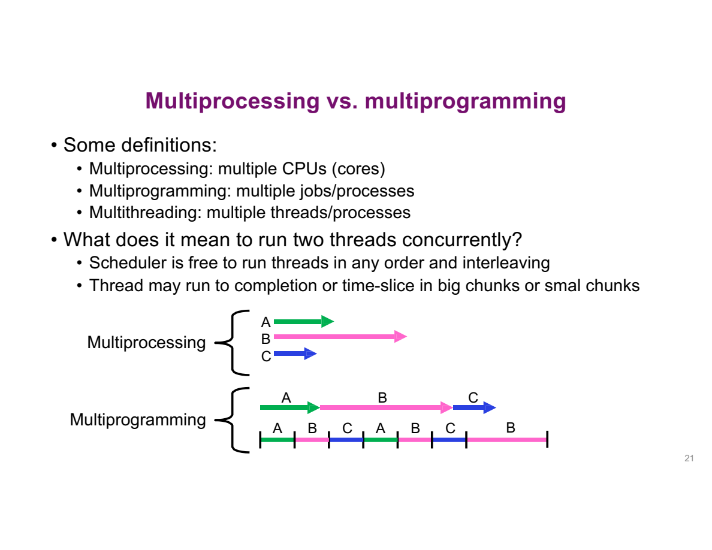

* **Multiprocessing**：多个 CPU / core。图上 A、B、C 三条箭头并排前进，真正同时。
* **Multiprogramming**：一颗 CPU 上多个 job 交替，粗粒度是 A→B→C 大块拼接，细粒度是 A|B|C|A|B|C|B 交错。
* **Multithreading**：一个进程内多个线程。

两个推论：

* 调度器可以按任意顺序、任意交错粒度运行线程。
* 只要时间片相对人的感知足够小，单核也能给人"同时在跑"的错觉。

### Concurrency is not parallelism

* **Concurrency** is about **handling** multiple things at once（结构性概念：同时*应对*多件事）。
* **Parallelism** is about **doing** multiple things simultaneously（物理性概念：同时*执行*多件事）。

例子与判定：

* 单核上的两个线程：execute concurrently but not in parallel。
* 一个月要发出 5 篇论文，并不是字面意义上同一时刻写 5 篇，而是在几件事之间切换着推进，这就是 concurrency。

***

## 6. 为什么需要线程

**核心问题：顺序执行的程序解决不了哪两类现实问题？**

### 动机一：独立任务互不阻塞

```c
main() {
    ComputePI("pi.txt");              // 永不结束
    PrintClassList("classlist.txt");  // 永远轮不到
}
```

问题出在哪：

* 单线程下，课表永远打不出来。
* 更一般地：手里有两个任务，事先不知道哪个跑得久、哪个更紧急，**根本无法决定谁先谁后**。

解法：不做决定，把决策外包给 OS 的并发机制。

```c
main() {
    create_thread(ComputePI, "pi.txt");            // T1
    create_thread(PrintClassList, "classlist.txt"); // T2
}
```

`create_thread` 的语义：**表现得就像有另一颗 CPU 在跑这个函数**。程序员不需要关心是否真的有空闲 core，那是 OS 的事。

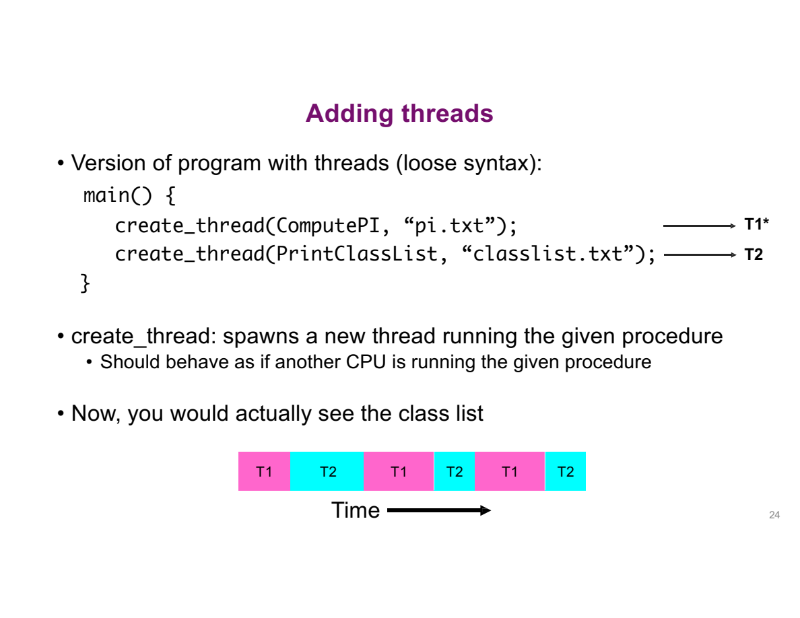

### 动机二：掩盖 I/O 延迟

Jeff Dean 的 "Numbers Everyone Should Know"，建立数量级直觉：

| 操作 | 耗时 |
|---|---|
| L1 cache reference | 0.5 ns |
| Branch mispredict | 5 ns |
| L2 cache reference | 7 ns |
| Mutex lock/unlock | 25 ns |
| Main memory reference | 100 ns |
| Compress 1K bytes with Zippy | 3,000 ns |
| Send 2K bytes over 1 Gbps network | 20,000 ns |
| Read 1 MB sequentially from memory | 250,000 ns |
| Round trip within same datacenter | 500,000 ns |
| **Disk seek** | **10,000,000 ns** |
| **Read 1 MB sequentially from disk** | **20,000,000 ns** |
| **Packet roundtrip CA → Netherlands → CA** | **150,000,000 ns** |

读表要点：

* 最后三行是被红框圈出的重点：**磁盘和网络比内存慢 2–3 个数量级**。
* 一个对人来说"几秒钟就跑完"的简单程序，在 CPU 视角里可能在 disk seek 上空等了一千万纳秒。
* 生产级代码必须认真对待这个差距。

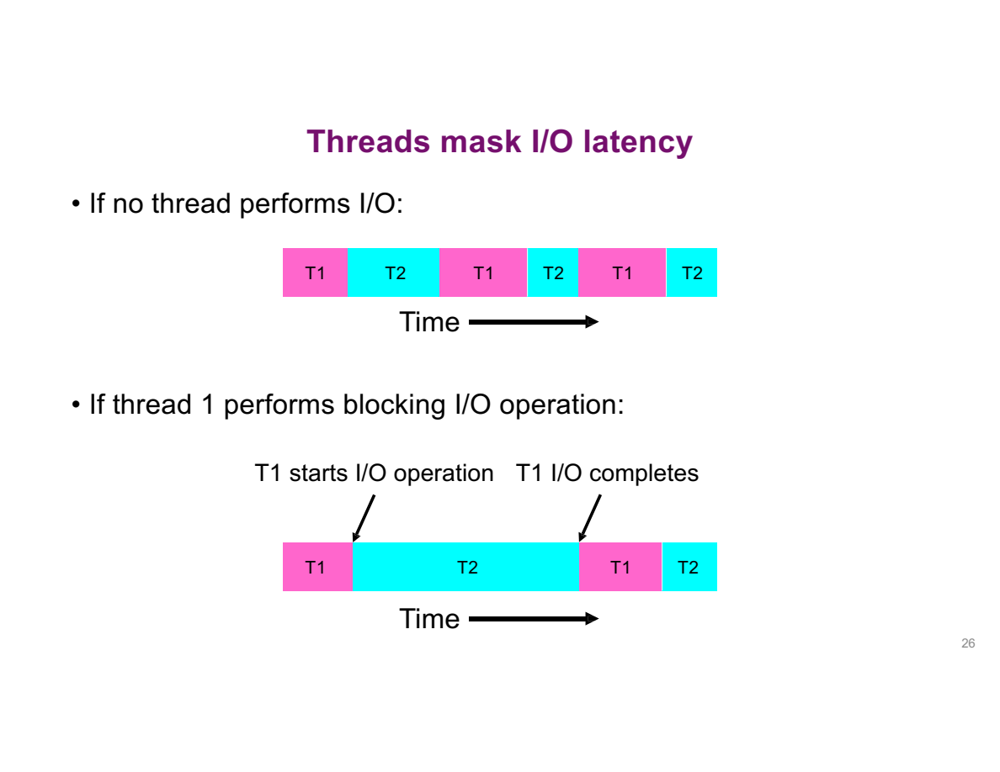

两条时间线对照：

* **上图**：两个线程都不做 I/O，CPU 满载交替。
* **下图**：T1 发起 blocking I/O 后被挂起，**T2 用一个长块覆盖了整个 I/O 窗口**，I/O 完成后恢复交替。
* 结论：CPU 没有空转，I/O 延迟被遮蔽（mask）了。

> 💡 **硬件视角**：I/O 操作其实**不需要 CPU 参与**。
>
> * 存储、网卡这些设备控制器能自己干活：CPU 把 I/O 任务 offload 给设备，设备自己慢慢处理。
> * 这期间 CPU 切换去跑别的进程。
> * 设备干完后**触发一个 hardware interrupt** 通知处理器，调度器这时才把控制权还给等 I/O 的线程。
> * 所以 ReadLargeFile + RenderUserInterface 的结构里，两个线程并不是简单地按时间片轮转：读文件的任务大部分时间在磁盘那边，CPU 主要伺候 UI 线程。
> * 在 AI workload optimization 这类系统里，compute / I/O overlap 也是最基本的优化手段。

实用版本（每个现代 GUI 程序的基本结构）：

```c
main() {
    create_thread(ReadLargeFile, "pi.txt");   // 后台读大文件
    create_thread(RenderUserInterface);        // 前台保持响应
}
```

***

## 7. 多线程进程与 OS Library

**核心问题：你从没写过 syscall 指令，那 syscall 是谁发的？**

先看一条逻辑链：

1. 编译运行一个 C 程序 → 得到一个进程。
2. 新进程**默认只有一个 main thread**，在自己的地址空间里。
3. 进程启动后通过 **system calls** 创建新线程。
4. 新线程**属于这个进程，共享它的地址空间**。

再看你写的代码：里面从来没有 syscall 指令，因为它被藏在分层结构里：

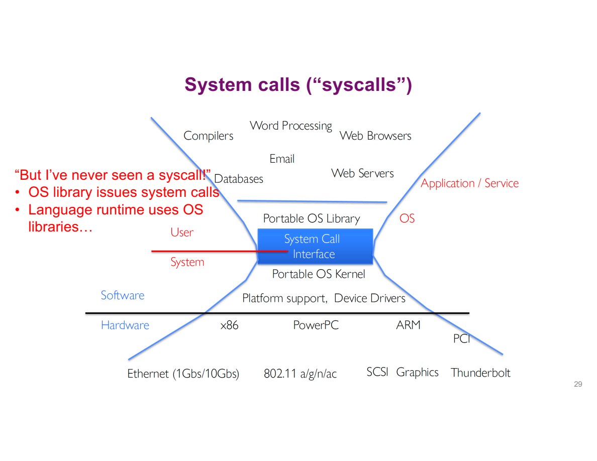

分层链条：

```text
你的程序
  → 语言 runtime
  → Portable OS Library（如 libc）
  → System Call Interface      ← User / System 分界
  → Portable OS Kernel
  → Platform support / Device Drivers
  → Hardware
```

两个要点：

* **OS library 以库的形式链进每个进程的地址空间**（Application、Login、Window Manager 每个进程内部都嵌着一条 libc），它替你打包寄存器、替你执行 syscall 指令；而内核只有一份。
* `printf`、`pthread_create` 都是库函数，内部替你发 syscall。

***

## 8. pthread API 与参数设计原理

**核心问题：管理线程的三个基本操作是什么？为什么有的参数是指针、有的是双指针？**

"p" 代表 **POSIX**（标准化 API 的一部分）。三个核心函数：

```c
int pthread_create(pthread_t *thread, const pthread_attr_t *attr,
                   void *(*start_routine)(void*), void *arg);
```

* 新线程执行 `start_routine(arg)`。
* `thread` 是**句柄（handle）**：创建后 main 靠它管理这个线程（查状态、join 等）。
* `attr` 携带栈大小、调度策略等属性，通常传 NULL。
* 函数 `return` 等于隐式调用 `pthread_exit`。

```c
void pthread_exit(void *value_ptr);
```

* 终止调用线程。
* 把 `value_ptr` 留给之后任何一次成功的 join。

```c
int pthread_join(pthread_t thread, void **value_ptr);
```

* **挂起调用线程**，直到目标线程终止。
* `value_ptr` 非 NULL 时，目标线程 `pthread_exit` 交出的值被写入 `*value_ptr`。

### 为什么参数有的传值、有的单指针、有的双指针

这些 API 被工程师打磨了几十年，每个参数的形态都有原因（"anything happens for a reason"）。判断规则只有一条，源自 C 的值传递语义：

* **输入参数**（函数只读）：直接传值。
* **输出参数**（函数要把结果写回调用者的变量）：必须传变量的地址，形参 = 要接收的类型再加一颗 `*`。

逐个对号：

| 参数 | 流向 | 原因 |
|---|---|---|
| create 的 `thread`（`pthread_t *`） | **输出** | 线程句柄是新建的，要留给 main 以后用，函数必须写回调用者的变量 |
| join 的 `thread`（`pthread_t`） | **输入** | 只是告诉 OS"我要等这个线程"，函数不改它，按值传递即可 |
| exit 的 `value_ptr`（`void *`） | **输入，但本身是指针** | 它是线程上交的"遗物"。用 `void *` 是因为它可以是**任意类型**：一个整数、一个字符串、一个结构体 |
| join 的 `value_ptr`（`void **`） | **输出** | 调用者要接收的东西本身就是一个 `void *`，所以形参是 `void **` |

> 💡 **为什么线程能留下"任意类型的消息"？**
>
> * 机制：线程 return 前自己先 `malloc` 一块内存、把结果放进去，再把指针交给 `pthread_exit`。
> * 线程虽然死了，**那块内存还在**，join 的线程能通过指针读到它。
> * 根本原因：**所有线程共享同一个地址空间**，彼此看得见对方 allocate 的内存。
> * 对比进程：进程的 exit status（也就是 `main` 的 `return`）**只能是一个整数**。不同进程的地址空间互相隔离，留一个指针给对方毫无意义，数据必须经过 OS 的接口中转。
> * 这就是"C 的 main 为什么 return int"的深层原因。

### Fork-join pattern

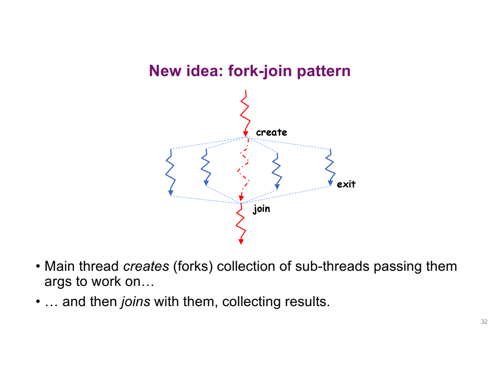

* Main thread 在 create 点**分叉**出一批子线程（fork），子线程各自 exit，在 join 点**汇聚**后主线继续。
* **join 是一个 checkpoint**：等所有人交差再进入下一阶段。

join 不是必须的：

* 任务拆分后各子任务互不依赖、全部完成即整体完成 → 可以不用 join。
* **下一阶段依赖子线程的结果** → 必须用 join 来等待和收集。

***

## 9. 完整实例：读懂这个 pthread 程序

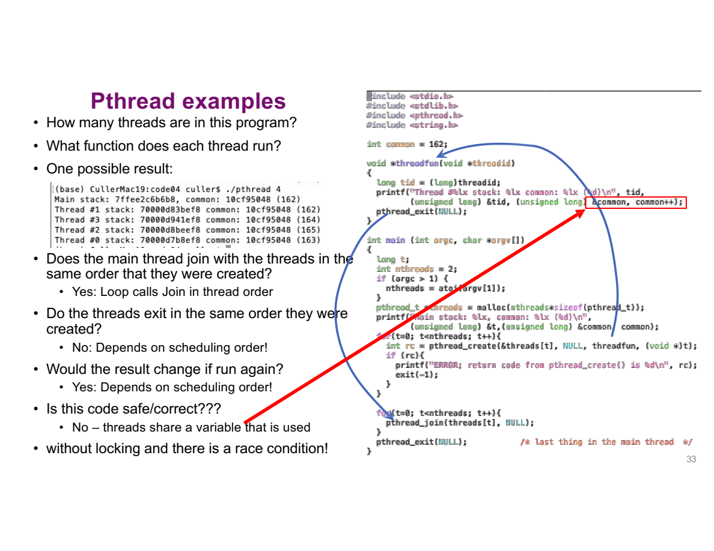

程序结构：

* 全局变量 `int common = 162;`：所有线程共享。
* 每个线程跑 `threadfun`：打印自己的 tid、自己局部变量的地址（约等于栈的位置）、`&common` 和 `common++`，然后 `pthread_exit(NULL)`。
* main 按命令行参数创建 n 个线程（fork），再按创建顺序逐个 join（join），最后自己 `pthread_exit(NULL)`。
* 图里蓝色弯箭头连接 `common` 的三处出现（强调共享），红色粗箭头指向 `common++`（race condition 的事发地）。

编译时注意要带线程库 flag：`gcc -pthread pthread_demo.c -o pthread_demo`。

本机真实运行（`./pthread_demo 4`，三次）：

```text
--- 第 1 次 ---
Main    stack: 16b6825e8, common: 104784000 (162)
Thread #0 stack: 16b70afb8, common: 104784000 (162)
Thread #1 stack: 16b796fb8, common: 104784000 (163)
Thread #2 stack: 16b822fb8, common: 104784000 (164)
Thread #3 stack: 16b8aefb8, common: 104784000 (165)

--- 第 3 次 ---
Main    stack: 16eec25e8, common: 100f44000 (162)
Thread #1 stack: 16efd6fb8, common: 100f44000 (162)
Thread #0 stack: 16ef4afb8, common: 100f44000 (162)
Thread #2 stack: 16f062fb8, common: 100f44000 (163)
Thread #3 stack: 16f0eefb8, common: 100f44000 (164)
```

对照输出回答四个关键问题：

1. **程序里有几个线程？** n + 1 个：n 个 worker + main 本身也是线程。
2. **main 按创建顺序 join 吗？** 是，join 循环固定按 0, 1, 2, 3 等待。
3. **线程按创建顺序退出吗？** 否。第 3 次运行里 1 号抢在 0 号前面打印，顺序由调度器决定，再跑一次还会变（只有在非常朴素的机器上才可能每次相同）。
4. **代码安全吗？** **不安全。** 第 3 次运行里 1 号和 0 号都读到了 162，最终值只到 164 而不是 165：一次自增被吞掉了。

另外两个可观察的事实：

* 所有线程的 `&common` **完全相同**（共享同一地址空间），每个线程的 stack 地址**各不相同**（私有栈）。
* 三次运行之间所有地址都变了（每次运行是新进程，地址空间重新分配），但同一次运行内上述规律稳定成立。

### Race condition 的成因

`common++` 不是**原子操作**，它实际是三步：从内存读出 common → 寄存器里 +1 → 写回内存。时间线还原被吞的那次自增：

```text
T1: 读出 162 → (还没来得及写回) → CPU 被切走
T2: 读出 162 → +1 → 写回 163
T1: (切回来，手里还是旧的 162) +1 → 写回 163
结果: 两个线程各加了一次，common 只涨了一次
```

要点：

* 共享变量 + 无锁 + 多线程写 = **race condition**。
* 程序有时对有时错，无法稳定复现，是最难调的 bug 类型。
* 解法是 synchronization，后面整章讲。

> 💡 **这段代码还有第二个 bug**：`malloc` 的返回值没有检查。
>
> * `malloc` 失败会返回 NULL，直接往下用就是空指针解引用。
> * 系统编程里凡是会失败的调用，返回值都要检查（这段代码检查了 `pthread_create` 的 `rc`，却漏了 `malloc`）。

***

## 10. Thread State: 共享 vs 私有

**核心问题：同一进程里的多个线程，哪些是共享的、哪些是私有的？**

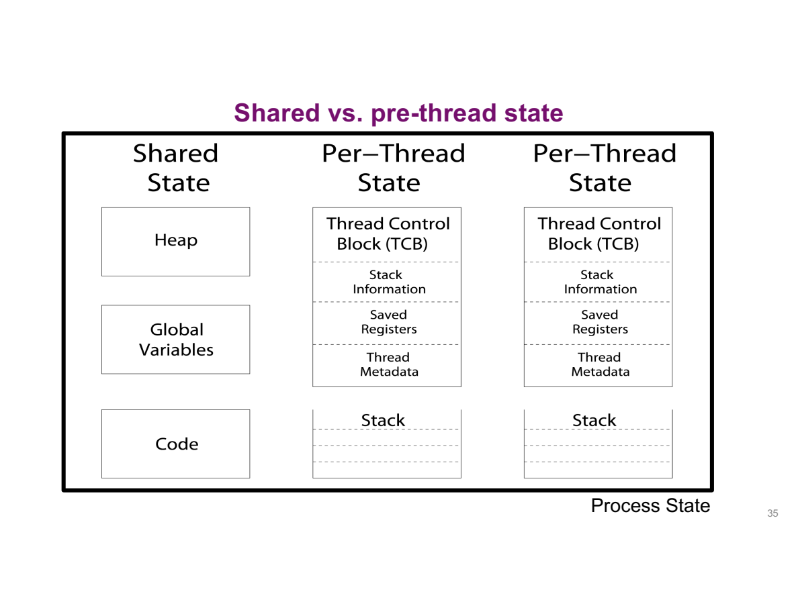

整个大框 = **Process State**：

* **Shared State**：Code、Global Variables、Heap，以及 I/O 状态（file descriptors、network connections）。
* **Per-Thread State**：每个线程一份 **TCB（Thread Control Block）**，内分 Stack Information、Saved Registers、Thread Metadata 三格，外加一个私有的 **Stack**。

一个自然的问题：两个线程就有两套 CPU registers，**不运行的那个线程的寄存器存在哪？**

* 答案：在 TCB 里。
* 原因：TCB 和 PCB 类似，thread 是 unit of execution，OS 需要管理线程级的行为。

Stack 必须私有的原因：它存的是每个函数调用的 temporary variables 和 return PCs，两个线程共用一摞就会互相踩乱（下一节展开）。

推论：**线程切换比进程切换便宜**，只需保存/恢复 TCB 里的寄存器现场，不动地址空间。

***

## 11. Execution Stack: 递归为什么能工作

**核心问题：栈帧里到底存了什么？为什么递归不会自己踩自己？**

```c
A(int tmp) {
A:   if (tmp < 2)
A+1:     B();
A+2:     printf(tmp);
}
B() { B: C(); B+1: }
C() { C: A(2); C+1: }
main: A(1);
exit:
```

调用链 main → A(1) → B() → C() → A(2)，栈的变化（Stack Pointer 跟随栈顶）：

| 步骤 | 动作 | 栈（从底到顶） | 输出 |
|---|---|---|---|
| 1 | 进入 A(1) | `A: tmp=1, ret=exit` | |
| 2 | 1<2 成立，进入 B() | 压入 `B: ret=A+2` | |
| 3 | 进入 C() | 压入 `C: ret=B+1` | |
| 4 | 进入 A(2)（递归） | 压入 `A: tmp=2, ret=C+1` | |
| 5 | 2<2 不成立，printf | 不变 | `2` |
| 6 | A(2) 返回，弹栈 | 回到 `C: ret=B+1` | |
| 7 | C 返回，弹栈 | 回到 `B: ret=A+2` | |
| 8 | B 返回，弹栈 | 回到 `A: tmp=1`，执行 A+2 | `1` |
| 9 | A(1) 返回 | 空 | |

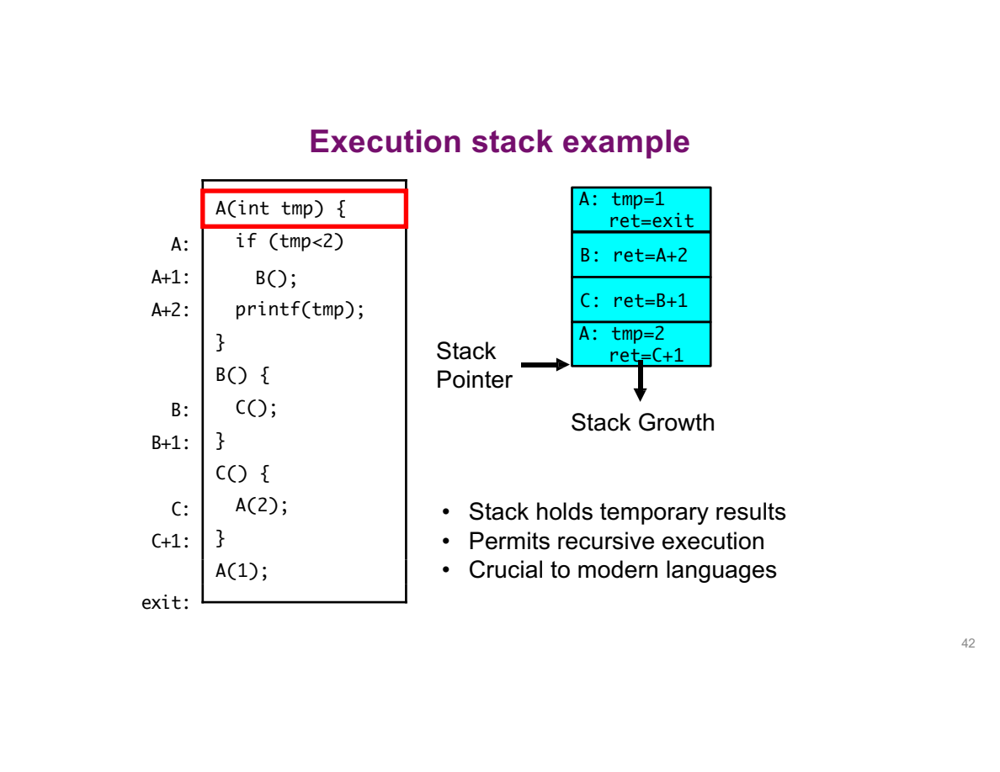

上图是栈最深的一帧（步骤 4 之后，注意 Stack Growth 箭头）。

递归能工作的本质：

* **同一函数的两次调用是栈上两个独立的帧**：`A: tmp=1` 和 `A: tmp=2` 各有自己的参数和返回地址，互不干扰。
* 最终输出 `2 1`（内层先打印）。

三条结论：

* stack holds temporary results
* permits recursive execution
* crucial to modern languages

> 💡 **一个容易误解的细节**：
>
> * 栈帧在**进入函数的一瞬间整体创建**（参数、局部变量、返回地址一次就位）。
> * 函数返回时**整体弹除**，不是一个变量一个变量地进出。
> * Stack pointer 指向栈顶，返回时按帧里的 return PC 跳回下一条指令。

***

## 12. Memory Layout with Two Threads

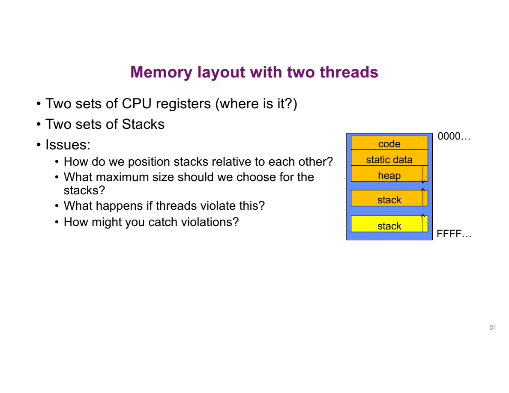

一个进程跑两个线程时的布局：

* **共享**：一份 code、一份 static data、一个 heap。
* **私有**：**两个独立的 stack**（各带增长箭头）。
* 两套 CPU registers 在哪？运行时在 CPU 上，被切走时在各自的 TCB 里。

这一节留下四个开放问题（本课只问不答）：

1. 两个栈相对位置怎么摆？
2. 每个栈的最大尺寸选多少？比如给每个线程预留 1 MB，但如果程序跑一条**深度不可预测的递归调用链**，栈就可能长爆。
3. 线程越过自己的栈边界会怎样？（无保护时：静默踩坏邻居的数据）
4. 怎么**捕获**这种越界？

这些问题与具体 CPU 和策略相关（均分、按需分配、越界后 relocate 等都有方案），留给内存管理章节。

***

## 13. Summary

| 主题 | 一句话 |
|---|---|
| 三种控制转移 | syscall（主动、同步）/ interrupt（外部、异步）/ trap（内部出错、同步），都是 unprogrammed control transfer |
| Interrupt vector | interrupt number 查表得 handler 地址；硬件保证表存在，OS 启动时填写，用户只能选编号不能选目标 |
| Context switch | save state into PCB + reload state from PCB；切换期间双进程 idle 是纯开销 |
| PCB / TCB | 内核眼中进程/线程的档案：PCB 记资源与状态，TCB 记执行现场（registers + stack info） |
| Thread | 可被独立调度的执行序列，virtual CPU core 的抽象；concurrency ≠ parallelism |
| 共享 vs 私有 | code / globals / heap / files 共享；registers + stack 每线程私有 |
| pthread | create / exit / join 三件套 + fork-join；共享数据需要 synchronization 防 data race |
| Process | address space 里的一到多个线程，是"机器"的抽象；fork / exec 等 API 管理进程 |

***

## 14. Self-check

1. Syscall、interrupt、trap 三者的区别（本质、同步性、各举一例）？为什么统称 unprogrammed control transfer？syscall 为什么不能像普通函数调用那样直接跳到内核函数？
2. 中断发生的瞬间，硬件自动做哪三件事？保存寄存器是谁的职责，为什么不能让硬件顺带做完？
3. Interrupt vector 的结构是什么？在 x86 real mode 上它放在哪、谁填的？这个设计如何保证用户程序无法劫持跳转目标？
4. 画出 CPU 从 P₀ 切到 P₁ 的完整时序。哪段时间是纯开销？PCB 里存什么？Scheduler 的主循环在做什么？
5. Multiprocessing / multiprogramming / multithreading 的区别？单核跑两个线程是 concurrency 还是 parallelism？Protection 与 thread 正交是什么意思？
6. `pthread_create` 的第一个参数为什么是 `pthread_t *`，而 `pthread_join` 的第一个参数是 `pthread_t`？`pthread_join` 的 `value_ptr` 为什么是 `void **`？
7. 为什么线程可以通过 `pthread_exit` 给 join 它的线程留一个字符串，而进程的 exit status 只能是整数？
8. 本课的 pthread 示例里：为什么所有线程打印的 `&common` 相同而栈地址不同？`common++` 为什么会导致结果跳号？除了 race condition，这段代码还有什么缺陷？

<br />

**A1.**

* Syscall：进程主动请求服务（同步，如 `exit`、读写文件）。
* Interrupt：外部硬件的异步事件（如 timer、键盘）。
* Trap：当前指令引发的同步事件（如除零、segfault）。
* 叫 unprogrammed 是因为控制权转移**不是程序显式指定的**。
* 普通 `call` 需要目标地址，而用户程序没有内核函数的地址（也绝不能有），所以只能把 syscall 编号和参数装进寄存器、执行 syscall 指令，由硬件经 interrupt vector 转入内核，类似 RPC 的"发请求"模式。

**A2.**

* 硬件做三件事：`uPC ← 被打断的用户 PC`、`sysmod ← 1`、`PC ← IntrpVector[i]`。
* 保存通用寄存器现场、搭建系统栈是 **OS（软件）** 的职责。
* 原因：保存到**哪里**、保存**哪些**、现场按什么格式组织（PCB 的结构）都是 OS 的设计决策，硬件不知道这些约定；硬件只负责最原子的"换模式 + 跳到 handler"。

**A3.**

* 结构：一张以 interrupt number 为下标的数组，每格存 handler 地址和属性。
* 位置：x86 real mode 上固定在物理地址 0，256 项 × 4 字节，位置由硬件制造商规定，OS 启动时用自己的 handler 覆盖填写。
* 安全性：表住在内核保护区，用户程序只能触发"几号事件"，无法读写表项，所以跳转目标不可能被指向恶意代码。

**A4.**

* 时序：P₀ executing → interrupt/syscall → save state into PCB₀ → reload state from PCB₁ → P₁ executing（之后对称切回）。
* 纯开销：中间两个进程都 idle 的切换窗口。
* PCB 存：状态（running/ready/blocked）、寄存器现场、PID、优先级、执行时间、内存空间与 translation 信息、打开的文件等。
* Scheduler 是一个无限循环：有 ready 的 PCB 就按 policy 挑一个运行，没有就跑 idle process。

**A5.**

* Multiprocessing = 多核硬件；multiprogramming = 单核上多进程交替；multithreading = 进程内多线程。
* 单核双线程是 concurrency 不是 parallelism。
* 正交：隔离墙（protection domain，即进程）的数量和执行流（线程）的数量可以独立变化，一个进程里可以有 1 个或 N 个线程；线程之间无保护，保护只存在于进程之间。

**A6.**

* 判断依据：参数的数据流向。
* create 的句柄是**输出**（新建的句柄要写回调用者的变量供以后使用），所以传地址。
* join 的句柄是**输入**（只读，函数不会修改它），所以按值传递。
* join 的 `value_ptr` 是输出参数，而调用者要接收的值本身是一个 `void *`（目标线程的退出值），所以形参是 `void **`：函数向"调用者的 `void *` 变量"里写入。

**A7.**

* 因为同一进程的所有线程**共享地址空间**：退出线程先 `malloc` 一块内存写入消息，线程死了内存还在，join 的线程凭指针就能读到。
* 不同进程的地址空间互相隔离，一个进程留下的指针对另一个进程没有意义，退出状态必须经过 OS 接口中转，所以只能传递一个整数。
* 这也是 `main` 的返回值类型是 `int` 的深层原因。

**A8.**

* `common` 是全局变量，住在共享的 static data 区，所有线程看到的是同一块内存，地址相同；每个线程有私有栈，局部变量地址（约等于栈位置）各不相同。
* `common++` 是"读、加、写"三步而非原子操作，两个线程交错执行时可能基于同一个旧值各加一次，最终只涨一次，于是输出跳号。
* 另一个缺陷：`malloc` 的返回值没有检查，分配失败时会拿到 NULL 并继续解引用。

***

*Images extracted from the official Lecture 3 slides. Notes rewritten in my own words for review; errors are mine. Demo code in `demos/lec03/` was compiled and run locally; outputs are real.*
