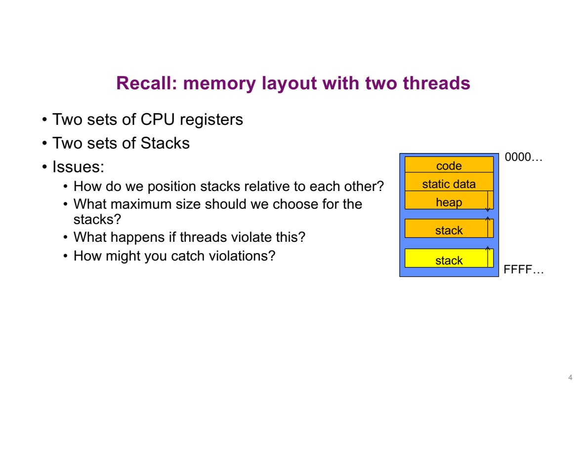

# Lecture 4 · Processes

> CSC3150 · CUHK-Shenzhen · Fall 2026 · Slides adapted from Berkeley CS 162

**TL;DR**: 这讲分两半。前半：多个线程同时改同一份数据会出错（race condition），出错的根源是"你不知道自己会在哪一句被打断"，解药是 lock。后半：进程怎么生、怎么死、怎么变身、怎么被管（`fork` / `exec` / `wait` / `exit` / `kill` / `sigaction`），学完后能完整解释 shell 每执行一条命令时发生了什么。

***

## 1. 复习：线程与内存布局

核心问题：后半讲大量使用"进程 vs 线程"的对比，先把这两个概念钉牢。

### 1.1 三个 pthread API

```c
int pthread_create(pthread_t *thread, const pthread_attr_t *attr,
                   void *(*start_routine)(void*), void *arg);
void pthread_exit(void *value_ptr);
int pthread_join(pthread_t thread, void **value_ptr);
```

不用背函数签名，只要看懂参数上的**箭头方向**：

* `pthread_create` 的 `thread` 是**输出**：传一个空口袋进去，OS 把新线程的 id 装进去。之后拿着这个 id 去 `pthread_join`，它又变成**输入**。
* `pthread_exit` 的 `value_ptr` 是**输入**：线程退场时交出的答卷。
* `pthread_join` 的 `value_ptr` 是**输出**：收卷人在这里拿到那份答卷。

三个函数合起来就是一句话：**创建、交卷、收卷**。

### 1.2 进程和线程，到底谁装谁

* **进程**是一个"资源包"：一块私有内存（address space）+ 打开的文件 + 其他资源。
* **线程**是住在进程里的"执行流"：真正在 CPU 上跑指令的是线程，不是进程。

同进程内的多个线程，共享和私有分得很清楚：

| 共享（全进程一份） | 私有（每线程一份） |
|---|---|
| code（机器码） | registers（寄存器现场，含 PC） |
| static data（全局变量） | stack（局部变量、调用链） |
| heap（`malloc` 的内存） | |
| 打开的文件 | |

> 💡 **线程的寄存器存在哪？** 不存在进程自己的内存里，而是存在 OS 手里：每个线程有一份 **TCB（Thread Control Block）**，线程被切下去时寄存器现场存进 TCB，切回来时从 TCB 恢复。所以线程永远碰不到别的线程的寄存器。

### 1.3 两个线程时的内存长什么样



和单线程的布局一样：code、static data、heap（向下长）依次排开，区别只是顶部有**两块** stack，各占一段、各自向上长。

这里埋了几个后面才回答的问题：两块 stack 怎么摆、各给多大、一个线程写疯了越过自己的 stack 会怎样、OS 怎么抓住这种越界。答案在 virtual memory 章节。

***

## 2. Interleaving

核心问题：为什么多线程程序"这次跑对、下次跑错"，而且靠测试抓不出来？

### 2.1 一个善意的谎言

写代码时的默认脑补是：每个线程像一个独立的工人，各自按顺序干活，互不打扰。物理现实是另一回事：


* **程序员看到的假象**：5 个线程配 5 个处理器，一人一台，从容执行。
* **真实世界**：只有 2 个处理器。任意瞬间最多 2 个线程在跑（running），剩下 3 个在排队（ready）。

OS 的 scheduler 不停地把线程换上去、切下来，制造"大家都在同时推进"的假象。

### 2.2 三条必须接受的铁律

1. **切换可以发生在任意两条语句之间**。线程跑到任何一句都可能被暂停，换成别人跑，过一会儿再轮到它。
2. **"一行代码"也不是安全的**。`x = y + 1` 这一行 C，编译后是"读 y、加 1、写 x"三条机器指令，切换可以插进这三条之间的任何缝隙。
3. **切换的时机完全不可预测**。调度算法对程序员不可见，这次运行和下次运行的切换方式可以完全不同。

类比：几个人接力填写同一张表格，任何人随时可能被叫停、换人接着填，换人时机不可预知。填写者没法预测自己会在哪一格被打断，只能保证"无论在哪被打断，恢复后都能接着填对"。

### 2.3 同一个程序，三种命运


同一份代码跑三次，时间线上可能是：

* (a) 三个线程依次跑完，互不重叠（纯串行）。
* (b) 三个线程同时开始同时结束（多核真并行）。
* (c) 三个线程被切成长短不一的碎块，任意交错（抢占式调度的常态）。

### 2.4 由此得出的设计原则

* **Independent threads**（不碰共享数据）：怎么交错都对，结果可复现。
* **Cooperating threads**（碰共享数据）：结果取决于交错顺序，可能对可能错。

所以写出正确并发程序的唯一出路是 **correctness by design**：从设计上保证**任意**交错下都对，而不是祈祷 scheduler 赏脸。测试在这里基本失效：跑一万次都对，第一万零一次换个交错就崩。

***

## 3. Race Condition

核心问题：共享数据 + 任意交错，具体会错成什么样？

### 3.1 先看不竞争的情况

初始 `x = 0, y = 0`。

```
Thread A:  x = 1;
Thread B:  y = 2;
```

问：两个线程都跑完后，x 是几？

一定是 1。A 写 x，B 写 y，各写各的、互不读对方的东西，谁先谁后都无所谓。**没有共享，就没有竞争。**

### 3.2 再看竞争的情况

初始 `x = 0, y = 0`。

```
Thread A:  x = y + 1;
Thread B:  y = 2;      ← 记作 B1
           y = y * 2;  ← 记作 B2
```

问：x 可能是几？把 A "读 y" 这个动作能发生的所有时机列出来：

| A 读 y 的时机 | 此刻 y 的值 | x 的结果 |
|---|---|---|
| B 还没动手 | 0 | **1** |
| B 做完 B1、还没做 B2 | 2 | **3** |
| B 全部做完 | 4 | **5** |

所以 x ∈ {1, 3, 5}，跑之前无法预知。这就是 **race condition**：Thread A races against Thread B，结果取决于谁跑赢。

再补两个推论：

* B2 `y = y * 2` 自己也是"读 y、乘 2、写 y"三步，交错不仅能发生在两行代码之间，还能发生在一行代码内部。
* **形成 race condition 的两个必要条件**：至少两个执行流碰同一份状态；其中至少一个在写。3.1 各写各的变量，两个条件都不满足，所以安全。

### 3.3 一个更真实的破坏现场


这是一棵 tree-based set：任何节点的左子节点比它小，右子节点比它大。现在 Thread A 调 `Insert(3)`，Thread B 同时调 `Insert(4)`。

慢动作还原事故：

1. A 从根往下找，发现 3 应该挂在 node 6 的 left child，**记住这个位置**，准备写入。
2. 就在此刻 A 被切走。B 也从根往下找，发现 4 也应该挂在 node 6 的 left child，也记住了这个位置。
3. A 切回来，把 3 挂上去：`node6.left = 3`。A 完工。
4. B 接着执行，把 4 挂到它记住的位置：`node6.left = 4`，**直接把 3 覆盖掉**。

结果：树里只有 4，3 凭空消失。最糟糕的是，同样的代码换个运行时机可能又对，bug 时隐时现。

***

## 4. Lock

核心问题：怎么保证"改共享数据的那几步"不会被别人插进来？

### 4.1 四个术语，一条因果链

| 术语 | 定义 | 在链条中的位置 |
|---|---|---|
| **Synchronization** | coordination among threads, usually regarding shared data | 总称：线程间的协调 |
| **Mutual Exclusion** | ensuring only one thread does a particular thing at a time | synchronization 的一种：互斥 |
| **Critical Section** | code exactly one thread can execute at once | 互斥要保护的那段代码 |
| **Lock** | an object only one thread can hold at a time | 实现互斥的工具 |

### 4.2 锁的生活模型：单人间卫生间的钥匙

整层楼只有一间单人卫生间，门口挂一把钥匙：

* 想进去，先拿钥匙（`acquire`）。钥匙在，拿走、进门、反锁；钥匙不在，就**站在门口等**，里面的人不出来就一直等。
* 出来把钥匙挂回去（`release`）。只有拿着钥匙的人才有资格还。

对应到代码：

```c
lock.acquire();      // 拿钥匙：拿不到就阻塞在这行
Insert(3);           // critical section：此刻全世界只有我碰这棵树
lock.release();      // 还钥匙
```

### 4.3 锁的两个硬性规定

* `acquire` 内部"看锁是否空闲 + 占住它"必须是 **atomic（原子）** 的：这两步合起来不可被打断。否则两个线程会同时看到"空闲"、同时认为自己拿到了钥匙，锁就形同虚设。原子性怎么实现，这讲先当黑盒，Synchronization 章节专门讲。
* `release` 只能由当前持有锁的线程调用。

### 4.4 加锁之后，树的例子变成什么样


A 的 `Insert(3)`、B 的 `Insert(4)`、甚至 B 的 `Get(6)` 都包上 `acquire → 操作 → release`。现在的执行序列是：

1. A 先拿到锁，完整地挂好 3，放锁。
2. B 拿到锁，重新从根找位置（此时 3 已经在树上），挂好 4，放锁。

为什么连只读的 `Get(6)` 也要加锁？因为 B 读树的时候 A 可能正在改指针，顺着改到一半的指针走下去，读到的就是坏结构。

### 4.5 锁保证什么、不保证什么

这是最容易误会的地方，必须分开：

* **保证**：3 和 4 最终都在树上。丢失节点这种错误被消灭。
* **不保证**：谁先插入。树可能是 3 在上 4 在下，也可能反过来，形状依然 non-deterministic。

后者**不是 bug**：两种形状都是合法结果。锁的职责是消灭"错误"，不是消灭"不确定"。把这两件事分清，这讲前半就算懂了。

> 💡 **为什么 pthread_mutex 的 API 全是指针？**
>
> ```c
> int pthread_mutex_init(pthread_mutex_t *mutex, const pthread_mutexattr_t *attr);
> int pthread_mutex_lock(pthread_mutex_t *mutex);
> int pthread_mutex_unlock(pthread_mutex_t *mutex);
> ```
>
> * `init` 要把初始化好的锁**交还**给调用者。C 没有多返回值，int 已经用来报告成败，锁本体只能靠指针带出来。
> * `lock` / `unlock` 要**修改**锁的内部状态（locked 标志位），而锁是所有线程共享的同一个对象。如果传值，函数改的是一份拷贝，原件纹丝不动，锁永远锁不上。

***

## 5. 进程管理总览

核心问题：进程怎么生、怎么死、谁在管谁？

先接受一个世界观：

* **Everything outside of the kernel is running in a process**。shell、`ls`、浏览器，全是进程。
* 于是"谁创建进程"的答案只能是：**进程创建进程**（processes are created and managed by processes）。
* 内核只亲手拉起第一个进程，之后整棵进程树都是进程生进程。

管理进程的 API 有六个，先看全景：


| Process API | 作用 | 类比线程世界 |
|---|---|---|
| `exit` | terminate a process | `pthread_exit` |
| `fork` | copy the current process | `pthread_create` |
| `wait` | wait for a process to finish | `pthread_join` |
| `exec` | change the program being run by the current process | 无对应 |
| `kill` | send a signal to another process | 无对应 |
| `sigaction` | set handlers for signals | 无对应 |

* 前三个（`exit` / `fork` / `wait`）：创建、退场、收尸，线程世界里有一一对应的 API。
* 后三个（`exec` / `kill` / `sigaction`）：进程特有的新概念。

线程编程里常见的 **fork-join pattern**（main 分出一批子线程去干活，再 join 收结果），在进程世界就对应 `fork` + `wait` 的组合，§11 会看到它的完整形态。

下面逐个攻破，每个都配能跑的真代码。

***

## 6. exit

核心问题：进程怎么"正常死亡"？一定是程序自己写代码杀的吗？

```c
#include <stdlib.h>
#include <stdio.h>
#include <unistd.h>

int main(int argc, char *argv[]) {
  pid_t pid = getpid();   /* get current process' PID */
  printf("My pid: %d\n", pid);
  exit(0);
}
```

两个新知识点：

* 每个进程有唯一编号 **pid**（process id），`getpid()` 查自己的。
* `exit(0)` 立即终止进程，0 表示"正常结束"。`exit` 和 `return` 的区别：`exit` 杀掉整个进程、抛弃一切未完成的事；`return` 只是结束当前函数。只有在 `main` 里两者效果才一样。

> 💡 **main 里不写 exit 会怎样？** 什么坏事都不会发生，这是本讲第一个反直觉点。程序真正的入口不是 `main`，而是 OS library（C 运行时库）里的一段启动代码：它先做初始化，再去调 `main`，`main` 一返回，**它替程序调 `exit()`**。所以 `exit` 永远会被执行到，写不写都一样。这也说明 `main` 并不是程序的第一行代码，它之前和之后都有 library 的代码在跑。

***

## 7. fork

核心问题：一个正在运行的进程，怎么凭空多出一个？

### 7.1 fork 做什么

`pid_t fork()`：把当前进程**整个复制一份**，造出 child process。复制得极其彻底：

* 整个 address space：code、data、heap、stack 全拷贝
* file descriptors 等进程资源
* 当前所有变量的值

不复制的只有两样：

* **pid**：child 有自己的新编号
* **线程数量**：child 里**只有调用 fork 的那一个线程**（哪怕 parent 有一百个线程）

从 fork 返回那一刻起，父子是两个独立进程：各改各的内存，互不影响。

### 7.2 调用一次，返回两次

普通函数调用一次返回一次。fork **调用一次、返回两次**：在 parent 里返回一次，在 child 里也返回一次，而且返回值不一样：

| 返回值 | 你在哪里 | 含义 |
|---|---|---|
| `> 0` | parent | 这个数字就是 child 的 pid |
| `= 0` | child | 新出生的那个进程 |
| `< 0` | parent | fork 失败 |

为什么要有这张"身份牌"？

* 父子执行的是**同一份代码**，代码必须有个办法知道"此刻是 parent 还是 child"，才能分流干不同的事。返回值就是唯一的区分手段。
* parent 拿到 child 的 pid，是因为进程是层级管理的：parent 凭 pid 才能 wait、kill 自己的 child；child 不参与管理 parent。

### 7.3 用图看懂 fork 的瞬间

```
fork 之前：               fork 之后：
┌─────────────┐          ┌─────────────┐   ┌─────────────┐
│ pid = 13861 │          │ pid = 13861 │   │ pid = 13865 │
│ i = 0       │   fork   │ i = 0       │   │ i = 0       │
│             │ ───────► │ cpid = 13865│   │ cpid = 0    │
└─────────────┘          └─────────────┘   └─────────────┘
                            parent            child
                          两个进程都从 fork 的下一行继续执行
```

### 7.4 代码与真实运行

```c
pid_t cpid, mypid;
pid_t pid = getpid();
printf("Parent pid: %d\n", pid);
cpid = fork();
if (cpid > 0) {              /* parent process */
  mypid = getpid();
  printf("[%d] parent of [%d]\n", mypid, cpid);
} else if (cpid == 0) {      /* child process */
  mypid = getpid();
  printf("[%d] child\n", mypid);
} else {
  perror("Fork failed");
}
```

本机实测（`demos/lec04/fork1.c`）：

```
Parent pid: 13861
[13861] parent of [13865]
Parent pid: 13861
[13865] child
```

逐行对号入座：

1. 进程 13861 打印 "Parent pid"，然后调 `fork()`。
2. fork 之后世界上有两个进程：13861（parent）和 13865（child），都从 fork 的下一行继续跑。
3. parent 里 `cpid = 13865 > 0`，进 if 分支，打印 "parent of [13865]"。
4. child 里 `cpid = 0`，进 else if 分支，打印 "child"。

> 💡 **为什么 "Parent pid" 出现了两次？** 这是"fork 复制一切"最生动的证据。`printf` 的内容先存在内存缓冲区里，fork 时这个缓冲区**连同没来得及显示的文字**一起被复制给了 child，child 退出时把自己那份缓冲也倒了出来，于是同一句话出现两遍。直接在终端跑通常只看到一次（终端是行缓冲，遇到换行立即显示），重定向到管道或文件才会看到这种重复。

***

## 8. fork_race.c

核心问题：两个进程同时改"同一个变量"，算 race condition 吗？

```c
int i;
pid_t cpid = fork();
if (cpid > 0) {
  for (i = 0; i < 10; i++)  { printf("Parent: %d\n", i); /* sleep(1); */ }
} else if (cpid == 0) {
  for (i = 0; i > -10; i--) { printf("Child: %d\n", i);  /* sleep(1); */ }
}
```

### 8.1 先回答：这不是 race condition

问：父子都在改 `i`、都在打印，竞争吗？**不竞争**。

* 父子是两个进程，各有独立的 address space。
* fork 时 `i` 被复制成**两份**，parent 改自己那份，child 改自己那份。
* 看起来像"同一个变量"，实际上是住在两套房子里的两个变量。

反过来说，如果这是同进程内的两个线程共享全局变量 `i`，那就是真 race：读、改、写三步交错，结果出错，必须加锁。

### 8.2 输出里什么确定、什么不确定

* **确定**：parent 一定按序打印 0 到 9；child 一定按序打印 0 到 -9。单个进程内代码顺序执行，不会自己打乱自己。
* **不确定**：两组行**彼此之间**谁先谁后，由 scheduler 决定，每次运行都可能不同。

### 8.3 真实运行：缓冲会把交错藏起来

本机实测（`demos/lec04/fork_race.c`，每行后 `sleep(1)`）跑了两次。

第一次（默认设置）：child 的十行全部扎堆出现，然后 parent 的十行扎堆出现，看起来毫无交错。原因还是缓冲区：输出攒在各自进程的缓冲里，退出时才一次性倒出来。

第二次用 `stdbuf -oL` 关掉缓冲，交错立刻现形：

```
Parent: 0
Child: 0
Child: -1
Parent: 1
Child: -2
Parent: 2
...
```

`sleep(1)` 的作用是放大交错：两个进程都跑不快，scheduler 频繁在它们之间切换，一行 parent 一行 child 就清晰可见。它只改变观察到的顺序，不改变各自序列的内容。

***

## 9. exec

核心问题：fork 出来的 child 跑的还是同一份代码，怎么让它去跑**别的程序**？

### 9.1 exec 做什么：夺舍

```c
char *args[] = {"ls", "-l", NULL};
execv("/bin/ls", args);
/* execv doesn't return when it works.
   So, if we got here, it failed! */
perror("execv");
exit(1);
```

`execv` 把当前进程的 address space **整个扔掉**：code、data、heap、stack 全部清空，装入新程序，从新程序的入口开始跑。像夺舍：身体（pid）不变，灵魂（程序）整个换掉。

```
exec 之前：pid 13873 这个壳子里装的是原来的代码
exec 之后：pid 13873 这个壳子里装的是 /bin/ls，原来的代码一行都不剩
```

### 9.2 三条规则

1. **exec 成功时永不返回**。旧代码已经不存在，没有"回去"一说。
2. 所以 `execv` 的下一行**只在失败时能执行到**，固定写法就是紧跟 `perror` + `exit(1)`。
3. 整个进程唯一不变的是 **pid**。parent 凭这个 pid 照样 wait、管理它，哪怕里面的程序已经面目全非。

`args` 数组以 `NULL` 结尾（exec 靠它判断参数结束），约定 `args[0]` 是程序名。exec 有一族变体（`execl` / `execvp` 等），区别只在参数写法和是否搜索 PATH。

> 💡 **exit(100) 去哪了？** 假设把失败路径写成 `exit(100)`，parent 拿到的退出状态会是 100 吗？实测是 **0**。原因：`execv` 成功了，`exit(100)` 那一行已经随旧地址空间一起被覆盖，永远不会执行。child 的退出状态由新程序决定：`ls` 正常结束，返回 0。反过来，只有 exec **失败**时，那个 `exit(100)` 才有机会跑出来。

***

## 10. wait

核心问题：parent 怎么知道 child 干完了、干得好不好？

```c
int status;
pid_t tcpid;
...
tcpid = wait(&status);
printf("[%d] bye %d(%d)\n", mypid, tcpid, status);
```

`wait(&status)` 让 parent **阻塞**（挂起不动），直到自己的某个 child 结束。醒来后拿到两样东西：

* 返回值 `tcpid`：刚结束的那个 child 的 pid（对应 join 收卷时知道收的是谁的卷）。
* `status`：child 的退出状态，编码在一个整数里（实际代码用 `WIFEXITED` / `WEXITSTATUS` 等宏解码，知道有这回事即可）。

两个补充：

* 为什么只能拿回一个整数？进程一退出，它的 address space 就消失了，不存在"返回一个指针或结构体"的通道，一个整数就是 parent 能拿到的全部死因报告。
* 语义上 `wait` 就是进程版的 `pthread_join`：阻塞、收尸、看死因。

***

## 11. Shell Pattern

核心问题：在终端敲一条命令，操作系统层面到底发生了什么？

答案就是三件套合体：**fork + exec + wait**。


```c
pid = fork();
if (pid == 0) exec(...);   /* child：变身成目标程序 */
else          wait(&stat); /* parent（shell 自己）：等命令结束 */
```

敲 `ls -l` 回车，逐步发生：

1. shell `fork` 出一个自己的副本。此刻内存里有两个"shell"。
2. child 走 if 分支，`exec` 成 `/bin/ls`：这个 shell 副本从此变成 ls 进程，开始列目录。
3. parent（真正的 shell）走 else 分支，在 `wait` 上阻塞。所以命令运行期间看不到提示符。
4. ls 打印完、退出，`wait` 醒来，shell 打印下一个提示符。

命令末尾加 `&` 变后台运行，本质就是 shell 跳过第 3 步，不 wait。

本机实测（`demos/lec04/fork2.c`，child exec 成 `ls -l`）：

```
[13872] parent of [13873]
（child 已变身成 ls，输出当前目录的文件列表）
[13872] bye 13873(0)
```

`bye` 后面的 13873 是 `wait` 返回的 child pid，`(0)` 是 status，`ls` 正常结束所以是 0。（真实运行时由于 printf 缓冲，这两行日志可能出现在 ls 列表之后，内容不变。）

把镜头再拉远一层：

* 内核启动时拉起 root process（pid 0 或 1）。
* 它 fork 自己、exec 成各种系统进程，这些进程再生自己的 child。
* 最终整台机器的所有进程构成**一棵进程树**，每个 parent 凭 pid 管理自己的子树。

这就是 "processes manage processes" 的完整图景，也是 shell 里每个命令的身世。

***

## 12. Signal

核心问题：进程在外面跑，别人（OS、其他进程、按键盘的用户）怎么隔空影响它？

### 12.1 两个名词先摆正

* **Signal** 是 OS 给进程发的一种**异步通知**：不管代码跑到哪，信号来了就先打断，转去执行这个信号对应的处理逻辑。它和代码的执行流无关，随时可能到来。
* **`kill` 不是"杀死"，是"发信号"**。杀不杀得死，取决于发的是哪种信号、对方怎么处理。

每个信号都有系统预装的 **default handler**。所以哪怕程序从没注册过任何 handler，按 Ctrl-C 照样能杀掉它：默认动作（终止进程）替它处理了。

### 12.2 自定义反应：sigaction

```c
#include <stdlib.h>
#include <stdio.h>
#include <signal.h>

void signal_callback_handler(int signum) {
  printf("Caught signal!\n");
  exit(1);
}

int main() {
  struct sigaction sa;
  sa.sa_flags = 0;
  sigemptyset(&sa.sa_mask);
  sa.sa_handler = signal_callback_handler;   /* 指定回调函数 */
  sigaction(SIGINT, &sa, NULL);              /* 完成注册：SIGINT → handler */

  while (1) {}
}
```

注册分两步：

1. `sa.sa_handler = signal_callback_handler`：把回调函数的地址填进结构体。
2. `sigaction(SIGINT, &sa, NULL)`：把"SIGINT 来了就调这个函数"的对应关系告诉内核。

注册完程序进入死循环。

### 12.3 真实运行：两组对照实验

**实验一**（`demos/lec04/inf_loop.c`，注册了 handler）：给它发 SIGINT（等价于按 Ctrl-C）：

```
Caught signal!
进程已退出，exit code = 1
```

进程没有被直接杀死，而是执行了注册的 handler：打印一句话，然后 handler 里主动 `exit(1)`，退出码正是 handler 里写的 1。**进程接管了对自己死因的处理权**。真实场景常用这个窗口做清理（存盘、关连接）再体面退出。

**实验二**（没注册 handler 的普通死循环）：收到 SIGINT：

```
进程被默认动作杀死，exit code = 130
```

130 = 128 + 2，2 是 SIGINT 的编号。默认 handler 直接终止进程，没有任何告别机会。两组输出并排，"默认 handler"和"自定义 handler"的区别就再也不是抽象概念。

### 12.4 常见信号与一条铁规

| Signal | 触发方式 | 默认动作 |
|---|---|---|
| `SIGINT` | Ctrl-C | 终止进程 |
| `SIGTERM` | shell 命令 `kill <pid>` 的默认信号 | 终止进程 |
| `SIGSTOP` | Ctrl-Z | 暂停进程 |
| `SIGKILL` | `kill -9 <pid>` | 强制终止 |

铁规：**`SIGKILL` 和 `SIGSTOP` 不能用 `sigaction` 改**。为什么？

* 设想在 handler 里也写一个死循环：信号来了进程不死，那就再也没有任何办法终止它。
* 所以系统必须保留一条任何进程都无法屏蔽的最后手段，`kill -9` 是杀手锏就靠这条规矩。

***

## 13. Why fork + exec

核心问题：线程创建一个 `pthread_create` 就完事，进程为什么要"先复制、再变身"两个调用？

两个理由：

1. **fork 不配 exec 也很好用**。想让父子跑同一份代码的不同分支（fork_race 就是），一个可执行文件就够，不用拆成两个程序。
2. **两步之间可以插代码**（更重要的理由）。child 在 exec 之前有机会先执行一段代码、调整自身状态。后面 File I/O 章节会看到：shell 实现 `ls > out.txt` 重定向和管道，靠的就是 fork 之后、exec 之前先把 child 的 file descriptors 改掉。

对比 Windows 的 `CreateProcess()`：创建和装载揉成一个调用，也能工作，但接口复杂得多（所有设置都得塞进一个几十参数的函数）。Unix 的取舍：**两个小工具自由组合，胜过一个大而全的调用**。

***

## 14. Threads vs Processes

核心问题：两个任务要并发跑，开两个线程还是两个进程？

| 维度 | Threads（同进程） | Processes（不同进程） |
|---|---|---|
| 通信 | 容易：共享内存直接读写（配好锁） | 麻烦：地址空间隔离，得走文件、pipe 等机制 |
| 创建与切换成本 | 低：不用新建地址空间，切换只换寄存器现场 | 高：fork 要复制整个地址空间，切换要保存恢复更多状态 |
| 故障隔离 | 差：一个线程崩溃，整个进程连同所有线程一起死 | 好：一个进程崩了只死自己，parent 还能从 wait 的 status 知道死因 |
| 适用场景 | 同一个大任务内部的紧密协作 | 相互独立、需要互相防身的任务 |

故障隔离那条值得展开：

* 某线程算了一个 `1 / 0`，异常直接终结**整个进程**，同进程的其他线程全部陪葬。
* 如果这两个任务分属两个进程，死的只有犯错的那一个，另一个毫发无损。

一句话：**线程用"低成本协作"换"风险共担"，进程用"高成本通信"换"故障隔离"**。isolation 就是操作系统愿意容忍进程高成本的根本原因。

***

## 15. （可选）Goroutine

进程和线程之外，还能不能有第三层并发抽象？Go 的答案是 **goroutine**：

* 在代码和 OS threads 之间加了一个 **runtime layer**。
* 成千上万个 goroutine 怎么映射到少数几个 OS 线程、什么时候切换，由 runtime 在用户态自己决定，OS 不参与。OS 眼里这个 Go 程序只有寥寥几个线程。
* 取舍：用 **direct OS control** 换 **simplicity and scale**。切换更便宜，写并发程序的门槛更低。

***

## 16. 总结

| 主题 | 一句话 |
|---|---|
| Non-determinism | scheduler 可在任意两条语句间切换线程，程序必须对任意调度正确，测试无法穷举 |
| Race condition | 多个执行流碰同一份状态且至少一个在写，结果取决于交错顺序 |
| Lock | acquire / release 两个原子操作包住 critical section；保证"操作不丢"，不保证顺序 |
| `fork` | 复制整个进程；调用一次返回两次，parent 拿 child pid，child 拿 0 |
| `exec` | 整个 address space 换成新程序，只保留 pid；成功不返回 |
| `wait` | parent 阻塞回收 child，拿回 child pid 和一个整数 status |
| `kill` / `sigaction` | 发信号 / 注册 handler；每个信号有默认动作，SIGKILL 和 SIGSTOP 不可改 |
| Shell | 每条命令 = fork + exec + wait；所有进程构成一棵以 root process 为根的树 |

课件结尾还有一条回收 lec02/lec03 的总结：system call interface 是用户程序和内核之间的 **"narrow waist"**（细腰），所有系统服务都从这少数几个入口走；而且进内核必须是**原子**的，"PC 跳转到内核代码"和"CPU 切到 kernel mode"两件事同时发生，不能分开，否则就会出现用户态执行内核代码的漏洞。

***

## 17. Self-check

1. 初始 `x = 0, y = 0`。Thread A 执行 `x = y + 1;`，Thread B 执行 `y = 2; y = y * 2;`。x 可能取哪些值？把每种值对应的交错顺序写出来。改成 A 执行 `x = 1;`、B 执行 `y = 2;` 呢？
2. Synchronization、mutual exclusion、critical section、lock 四个概念的关系是什么？为什么 `acquire` 内部"检查 + 占用"必须是原子的？
3. 并发向一棵树 insert 两个节点，不加锁最坏的后果是什么？加了锁之后，结果里还有什么是 non-deterministic 的？这算 bug 吗？
4. `fork` 的返回值有哪三种情况，分别意味着什么？fork_race.c 里父子都在改 `i`，为什么不是 race condition？什么情况下它就变成 race condition 了？
5. `execv` 成功和失败时，紧随其后的那行代码分别会不会执行？demo 里 child 写了 `exit(100)`，parent 拿到的 status 为什么是 0？
6. 在 shell 里敲 `ls -l` 回车，把 shell 内部发生的系统调用按顺序写出来。命令末尾加 `&`，对应哪一步的变化？
7. 进程收到一个没有注册 handler 的信号会怎样？为什么系统不允许用 `sigaction` 改掉 `SIGKILL` 和 `SIGSTOP`？

<br />

**A1.** x ∈ {1, 3, 5}。A 在 B 开始前读 y（y = 0）得 1；B 执行完 `y = 2` 后、`y = y * 2` 前 A 读 y（y = 2）得 3；B 全部执行完（y = 4）A 再读得 5。改成各写各的变量后 x 恒为 1：没有共享状态就没有竞争。

**A2.** Synchronization 是线程间协调的总称；mutual exclusion 是它的一种，要求同一时刻只有一个线程做某件事；被互斥保护的代码段叫 critical section；lock 是实现互斥的工具。如果"检查锁空闲"和"标记占用"之间能被打断，两个线程会同时看到空闲、同时占锁，critical section 里就会挤进两个线程，锁失去意义。

**A3.** 最坏后果：两个线程都定位到同一个插入点，先后写入时后者覆盖前者，一个节点凭空丢失。加锁后两个节点一定都在树上，但谁先插入、树的最终形状仍然 non-deterministic。这不算 bug：两种形状都是合法结果，lock 的职责是消灭"丢失"这种错误，不是固定顺序。

**A4.** `> 0`：在 parent 中，值是 child 的 pid；`= 0`：在 child 中；`< 0`：失败，仍在原进程。fork_race 里父子是两个进程，各有独立 address space，`i` 被复制成两份，各改各的，不构成共享状态，所以不是 race condition。如果改成同进程内两个线程共享全局变量 `i`，读、改、写交错就会出错，必须用 lock 保护。

**A5.** `execv` 成功时整个 address space 被新程序替换，旧代码不复存在，后面那行不会执行；失败时才会执行到（所以固定写 `perror` + `exit(1)`）。demo 里 `execv("/bin/ls", ...)` 成功了，`exit(100)` 那行已随旧程序一起被覆盖，child 的退出状态由 `ls` 决定，`ls` 正常结束返回 0。

**A6.** shell 先 `fork()` 复制自己；child 走 `pid == 0` 分支调 `exec` 变身成 `ls`；parent（shell 本体）调 `wait(&status)` 阻塞，直到 `ls` 结束才回到提示符。加 `&` 对应 parent 不立即 wait，直接回到提示符，child 在后台跑。

**A7.** 执行系统为该信号定义的 default handler，对 SIGINT、SIGTERM 这类信号默认动作是终止进程。不允许改 SIGKILL 和 SIGSTOP 是为了保留最后的管理手段：如果 handler 可以任意改写，进程在 handler 里写个死循环就能让任何信号都杀不死自己，失控进程将无法被终止或暂停。

***

*Images extracted from the official Lecture 4 slides. Notes rewritten in my own words for review; errors are mine. Demo code in `demos/lec04/` was compiled and run locally; outputs are real.*
