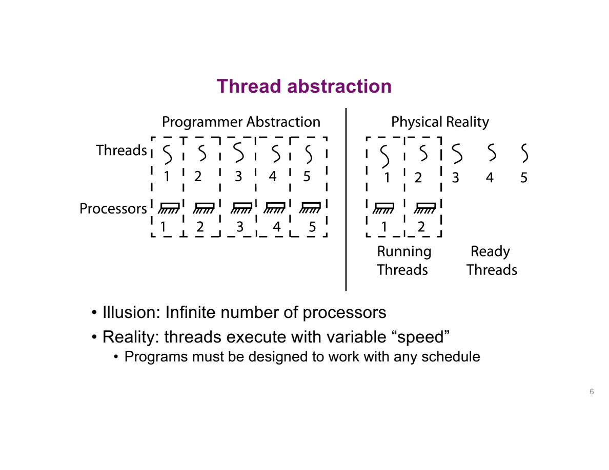
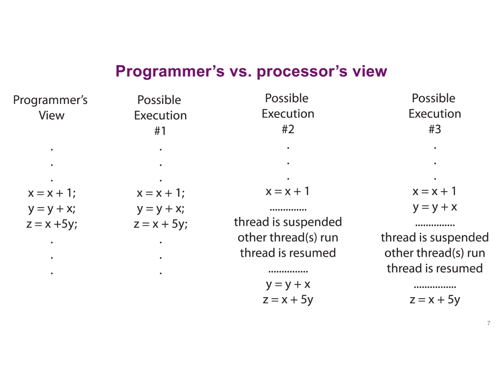
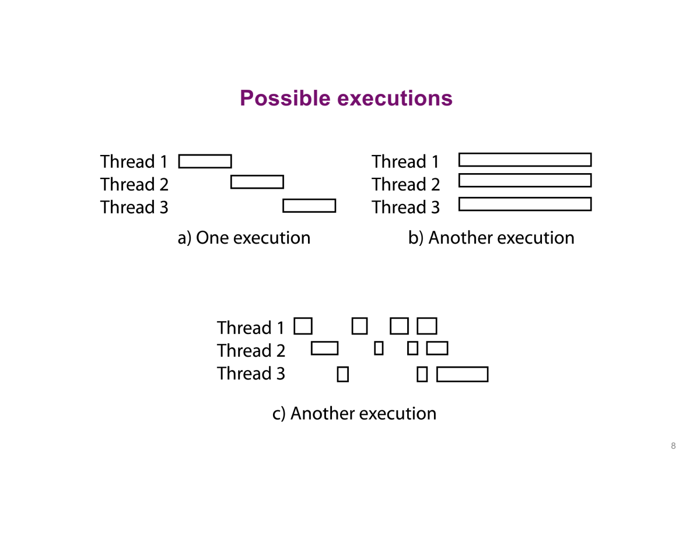
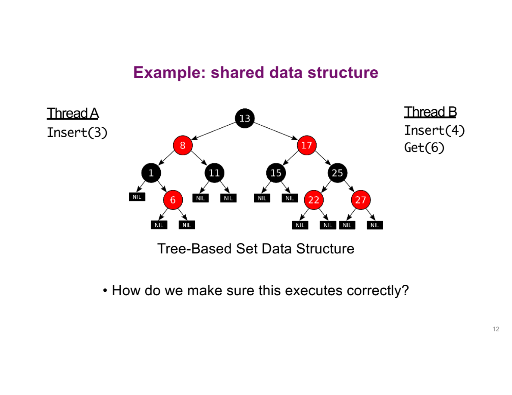
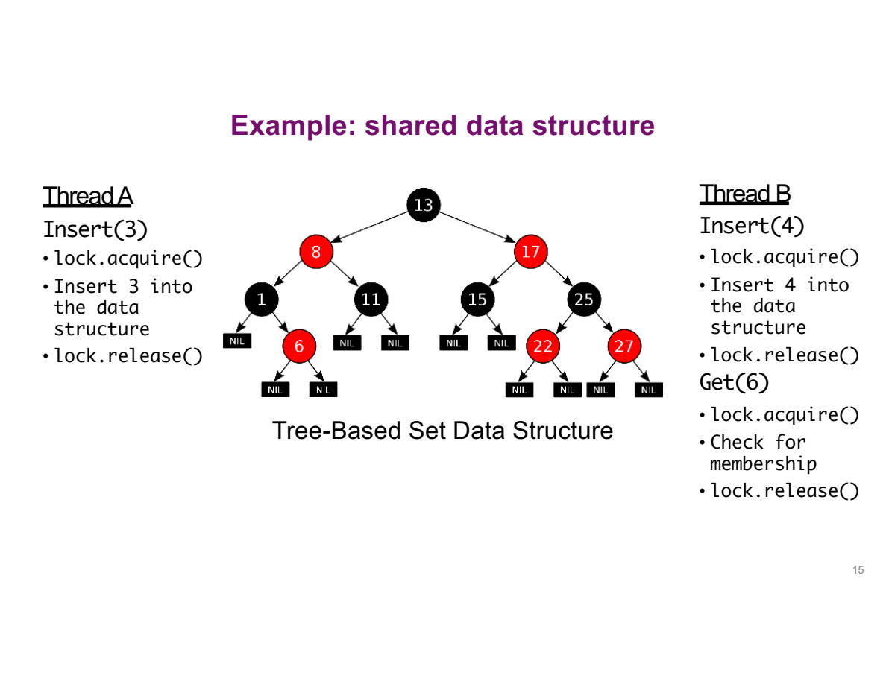
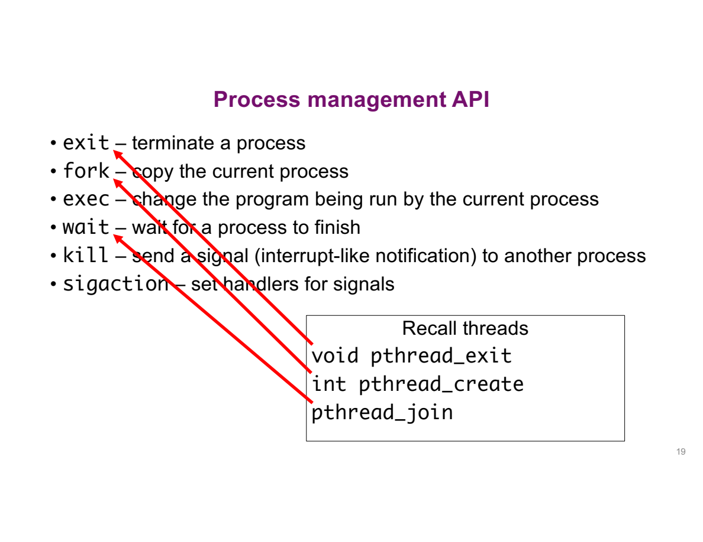
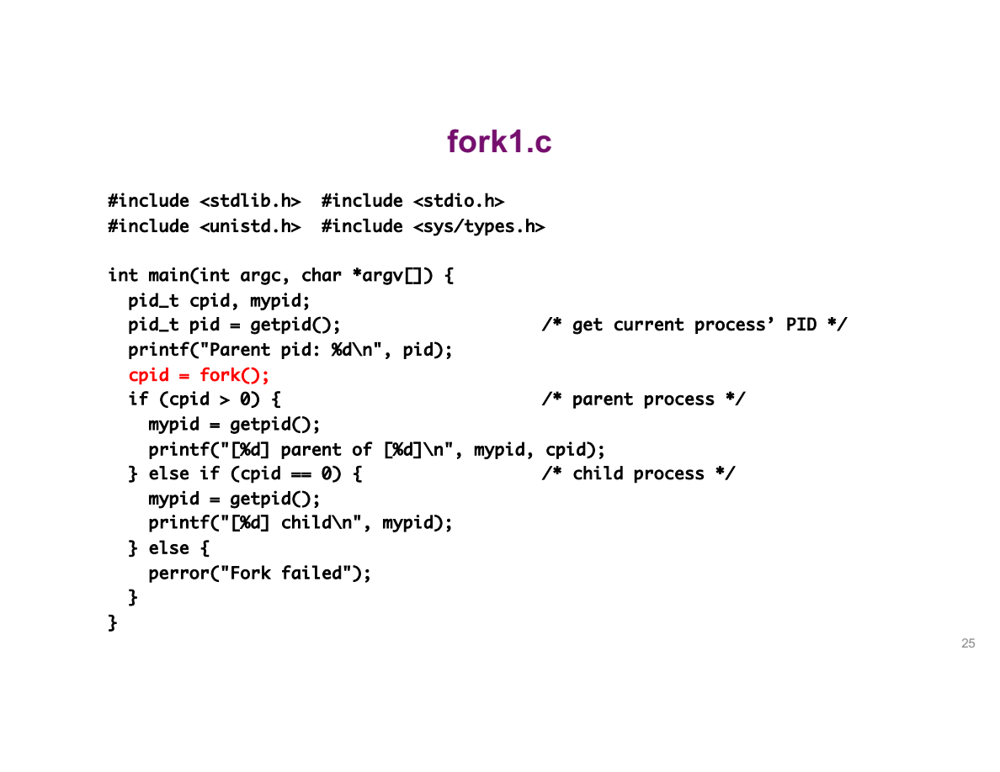
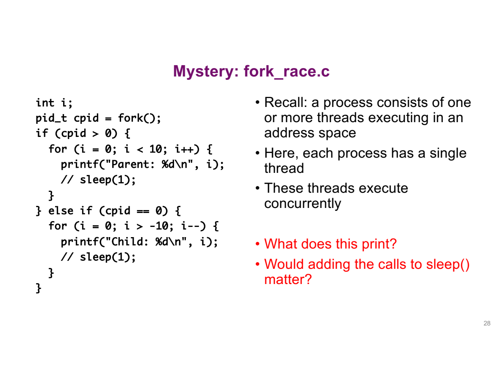
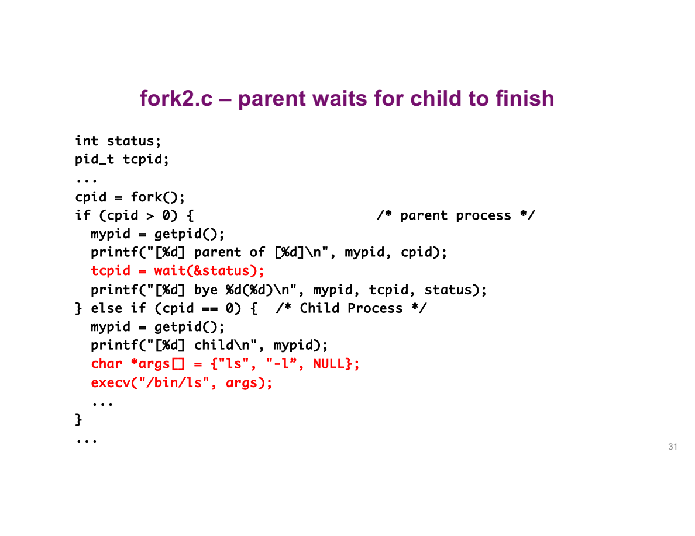
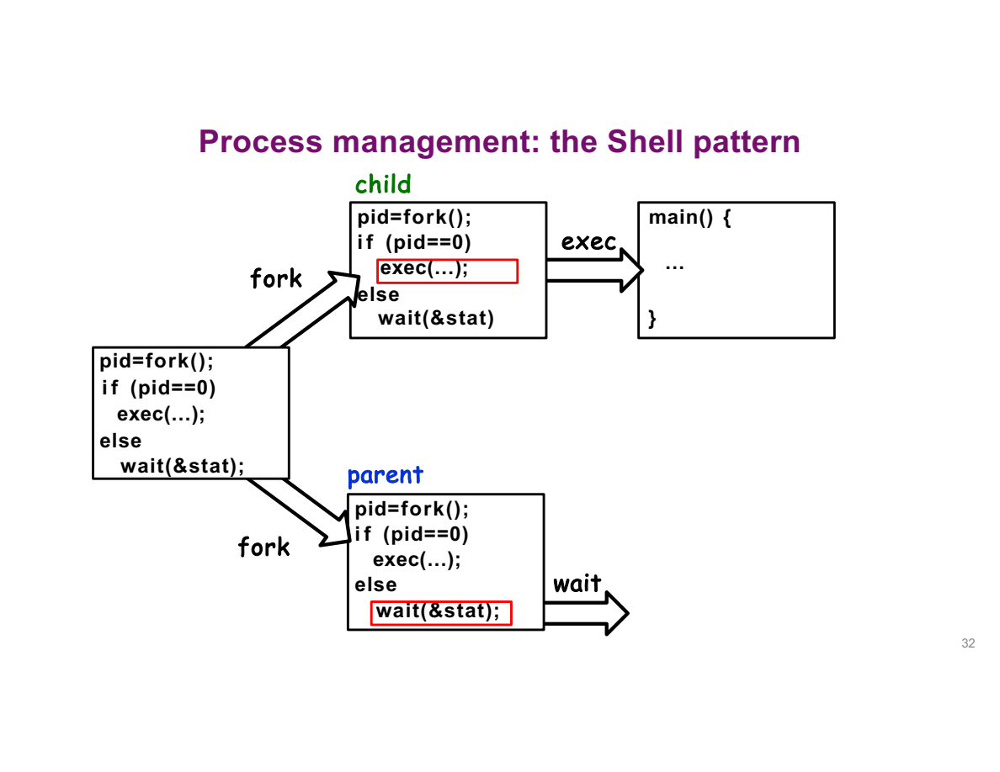

---
prev:
  text: 'Lecture 3 · Threads & Processes'
  link: /notes/lec03-thread-process
next:
  text: 'Lecture 5 · Files & I/O'
  link: /notes/lec05-files
---
# Lecture 4 · 同步与进程 {#lecture-4-·-shared-data-and-process-lifecycle}

**TL;DR**

- Mutex 让冲突操作轮流进入临界区，保护共享数据。
- Fork 创建子进程，exec 让当前进程换一个程序运行，wait 让父进程取得子进程的终止信息。
- Signal 用来通知进程处理事件，收到后做什么取决于信号种类和处理设置。

## 1. 同步与锁 {#_1-synchronization-·-共享数据如何保持正确}

**核心问题：任意执行交错下，怎样保护一项完整更新？**

### 执行交错 {#interleaving-·-先确定执行顺序}

**核心问题：为什么不能假设一个线程把一行代码执行完才轮到另一个？**



例如有 5 个线程，却只有 2 个 CPU 执行位置：

- 某一时刻只能有 2 个线程正在执行，其他可运行的线程要等待。
- 一段时间后，OS 可以暂停其中一个，让等待的线程接着运行。
- 程序不能假定“线程 A 总比 B 快”或“A 创建得早，所以一定先完成”。

**一行 C 代码也不一定是一个不可拆开的动作。** 例如 `x = x + 1` 可能先读 x，再加 1，最后写回；中间就可能穿插其他线程的操作。



- 同一 thread 的某段代码可能连续执行，也可能执行一部分后暂停。
- 暂停期间，其他 threads 可以改变共享状态；恢复后继续执行不等于外部条件保持原样。
- 分析正确性要覆盖允许的交错，不能把某次看到的调度顺序当成保证。



Serial 表示一项完成再做另一项；interleaving 表示交替推进；parallel execution 表示同一时刻执行不同工作。单核仍然可能出现共享数据的 race，增加 CPU 数量不是 race 的必要条件。

三种排列不是三段不同的源代码，而是同一组线程可能得到的运行安排：

- **a：先后完成**。Thread 1 先结束，再轮到 2、3；并发程序也可能恰好出现这种执行。
- **b：时间重叠**。多个处理器执行不同线程，才能真正同时计算。
- **c：分段交错**。每条线程分成多段，暂停的位置和每段长度都不固定，也不保证总按 1、2、3 轮转。

因此需要证明的是“允许的安排都不会破坏结果”，而不是“这次机器恰好按期望顺序执行了”。

**逐步推演：x 为什么可能是 1、3、5？**

**核心问题：写入发生的时间如何改变读取结果？**

先按一个简化模型推演：x、y 起初都是 0，每次读取或写入看成不可拆开的动作，各线程内部仍按代码顺序执行。下面是伪代码，不是可以直接照抄的无锁 C 程序。

**只追踪一个问题：A 读取 y 的那一刻，B 已经做到哪一步？**

```text
Thread A             Thread B
x = y + 1            y = 2
                     y = y * 2
```

| A reads y | Why | Final x |
|---|---|---|
| 0 | B 尚未写入 | 1 |
| 2 | B 完成第一句，未完成第二句 | 3 |
| 4 | B 完成两句 | 5 |

若 A 改成 `x = 1`，B 仍只修改 y，x 就始终为 1。先确认“哪个线程写哪个变量”，再枚举顺序。

> 💡 以上结果属于明确的教学模型。直接用普通 C globals 写出相同的无同步代码，会产生 data race，不能声称 C 只允许这三个结果。`volatile` 也不能代替线程同步。

### 插入为什么丢失 {#race-condition-·-bst-插入为何丢失}

**核心问题：为什么只保护最后一次赋值，仍可能损坏一个操作？**



**BST（binary search tree，二叉搜索树）** 的规则是：一个节点左侧子树的值比它小，右侧子树的值比它大。插入新值时，就按大小一路寻找空位置。

以插入 3 为例：

1. `3 < 13`，从 13 向左到 8。
2. `3 < 8`，向左到 1。
3. `3 > 1`，向右到 6。
4. `3 < 6`，应该继续向左；这里为空，就准备放入新节点。

插入 4 也会走到同一个空位置。`6.left` 表示节点 6 通向左孩子的链接；`NULL` 表示目前没有左孩子。

**问题出在：两个线程可能都在对方写入之前，看到了“这里为空”。**

| Step | Insert(3) | Insert(4) |
|---|---|---|
| 1 | 搜索到 6.left 为空 | |
| 2 | | 也观察到 6.left 为空 |
| 3 | 将 6.left 指向新节点 3 | |
| 4 | | 将 6.left 改成指向新节点 4 |

最后 `6.left` 只指向 4。从树根沿链接往下找，已经找不到刚插入的 3。

两个线程分别执行时都可能正确，交错后却丢了一个结果。这就是这里的 **race condition（竞态条件）**：结果依赖于它们碰巧怎样交错。

**“创建了节点”为什么仍可能丢失插入？** 要区分节点对象和树中的链接：

```text
A 写入后：6.left → 节点 3
B 写入后：6.left → 节点 4      节点 3 不再通过这条链接连在树上
```

创建节点只得到一块保存值的内存；把它接到树上，靠的是修改父节点中的 pointer。6 只有一个 left 字段，后一次赋值会覆盖前一次。节点 3 未必被释放，但已经不能通过这棵树的链接找到，插入结果就丢了。

**这一操作要保证：插入成功的 3 和 4 都留在树里，而且位置符合大小规则。** 这种需要维持的性质叫 invariant（不变量）。

只保护最后的赋值还不够：即使两次赋值轮流执行，第二个线程仍可能拿着之前“这里为空”的旧判断覆盖链接。因此，要把“寻找位置 + 修改链接”一起保护。

### 互斥锁 {#mutex-·-保护完整操作}

**核心问题：怎样让一整个逻辑操作不被另一个冲突操作插进来？**

继续用插入 3 和 4 的例子：

1. A 先取得保护这棵树的锁。
2. A 从查找位置到插入 3 一起完成；B 想进行冲突操作，必须先等。
3. A 释放锁，B 才能取得它。
4. B 从更新后的树重新查找位置，再插入 4，所以不会覆盖 3。

| Term | 在这个例子中是什么意思？ |
|---|---|
| Synchronization（同步） | 协调 A、B 怎样访问共享的树 |
| Mutual exclusion（互斥） | 同一时刻只允许一个线程执行受保护的操作 |
| Critical section（临界区） | 需要一起保护的“查找 + 插入”代码 |
| Mutex（互斥锁） | 用来实施这个进入规则的对象 |

```text
lock(m)
    search and update the shared tree
unlock(m)
```



**Acquire（获取）必须保证：竞争同一把空闲锁时，不能有两个线程都成功成为持有者。**

不能自己用“先看 locked 是否为 0，再把它设为 1”这两步普通操作代替锁：A、B 可能同时看见 0，然后都认为自己拿到了锁。Mutex 内部必须用能够正确处理竞争的机制；本讲先使用这个保证，后续再研究实现。

- `lock` 成功返回：当前线程持有锁，才能继续访问临界区。
- 锁已被占用：等待取得锁，不能跳过等待直接进入。
- `unlock`：持有者释放锁，使其他线程有机会取得它。

所有参与者必须使用保护这个结构的**同一个** lock。若 reader 可能与 writer 冲突，读取也需要遵守适当同步协议。各线程各拿一把独立的锁不构成互斥。

同一把锁允许两种合法插入顺序：

```text
Insert(3), then Insert(4)       Insert(4), then Insert(3)
          6                              6
         /                              /
        3                              4
         \                            /
          4                          3
```

- 3 先进入：它成为 6 的左孩子；4 随后重新搜索，成为 3 的右孩子。
- 4 先进入：它成为 6 的左孩子；3 随后重新搜索，成为 4 的左孩子。
- 两棵树形状不同，但都保留 3 和 4，也都满足 BST ordering。**正确性要求相同，不等于最终形状必须唯一。**
- `Get(6)` 等读取若与修改并发，也要遵守同一同步规则，避免读到中间状态。

> 💡 **拿着锁，不等于一直占着 CPU。** A 可能拿锁后被 OS 暂停；此时 B 即使获得 CPU，也不能通过这把锁进入临界区。等 A 恢复并解锁，B 才有机会进入。锁保护的是进入资格，不是连续运行时间。

**运行示例：两个线程共同累加**

`demos/lec04/mutex_counter.c` 创建两个 workers，各执行 100000 次：

```c
pthread_mutex_lock(&mutex);
++counter;
pthread_mutex_unlock(&mutex);
```

Main 在 join 两个 workers 后读取结果。Mutex 负责 worker 之间的更新安全，join 负责 main 的读取发生在工作完成之后，两个机制解决不同问题。

```sh
cc -std=c11 -Wall -Wextra -pthread demos/lec04/mutex_counter.c -o /tmp/os-mutex-review
/tmp/os-mutex-review
```

实际运行输出：

```text
counter = 200000 (expected 200000)
```

正确性的理由是所有 counter 更新都由同一 mutex 保护，并且最终读取在全部 join 后。结果恰好正确的一次实验本身不是证明。

Mutex 的使用顺序：

1. **Initialize**：静态对象可用 `PTHREAD_MUTEX_INITIALIZER`，或调用 `pthread_mutex_init`。
2. **Lock → access → unlock**：所有冲突访问遵守同一锁协议，由 owner 解锁。
3. **Destroy**：确定没有线程再使用后，调用 `pthread_mutex_destroy`。

三个 API 的形式是：

```c
int pthread_mutex_init(pthread_mutex_t *mutex,
                       const pthread_mutexattr_t *attr);
int pthread_mutex_lock(pthread_mutex_t *mutex);
int pthread_mutex_unlock(pthread_mutex_t *mutex);
```

- `init(&mutex, NULL)` 初始化已经提供存储位置的 mutex，NULL 表示默认属性；它不是返回一把锁。
- 三者的 int 返回值表示成功或错误，**0 表示成功**。
- Lock / unlock 都传 `&mutex`，因为它们要操作同一个锁对象的状态。
- 不是所有指针都代表输出参数。这里的方向取决于 API 的用途，不能只看见 `*` 就认定“这是输出”。

**为什么 lock / unlock 不能只收到 mutex 的一份副本？**

1. A 获取锁后，必须让 B 也能观察到“这把锁已被持有”的状态。
2. 若只修改各自副本，A 只把自己的副本标为忙，B 的副本仍是空闲；两边可能同时进入。
3. 传同一个 mutex 的地址，才能操作同一个同步对象。实际 mutex 的内部结构不应被应用自行读写或复制。

完整 counter 示例检查每一次 pthread 调用的返回值。

`pthread_mutex_lock(&mutex)` 传地址，因为函数要操作同一个 mutex 对象。复制 mutex 到每个 thread 或在使用中随意复制其内部状态都不是正确同步方式。

## 2. 进程 API {#_2-process-lifecycle-·-创建、替换、回收}

**核心问题：Shell 如何运行新程序，同时保留自己并取得结果？**



| Operation | Process API | Thread-related comparison |
|---|---|---|
| Create | `fork` | `pthread_create` starts a function in shared address space |
| Finish | `exit` / `_exit` | `pthread_exit` terminates calling thread |
| Wait for completion | `wait` / `waitpid` | `pthread_join` waits for a joinable thread |
| Replace program | `exec` family | 没有等价的“只替换某线程地址空间” |
| Signal handling | `kill`, `sigaction` | 也存在 thread-directed signal APIs，不能简单视为完全无对应 |

这些是帮助理解的对照，不是逐项完全等价。Process 有独立地址环境；threads 在所属 process 内共享资源。

### fork：创建进程 {#fork-·-创建新的执行分支}

**核心问题：调用后谁从哪一行继续，哪份数据被复制？**

先记住这一件事：**`fork()` 成功后，多出一个子进程。父子从同一个位置往下执行，但各自拥有一份普通变量。**

原来的进程叫 **parent process（父进程）**，新建的叫 **child process（子进程）**。下面只讨论父进程原本只有一个线程的情况。

**① 调用前：只有一个进程**

```text
Parent (PID 100)
    x = 10
    执行到 fork()
```

PID 是进程的编号。这里的 100 和后面的 101 都是便于推演的假设值。

**② 调用成功后：两份代码继续执行，两份变量分别变化**

下面摘出示例中的分支逻辑，省略输出和错误报告：

```c
int x = 10;
pid_t child = fork();

if (child < 0) {
    return 1;       // 创建失败，只有原来的进程
} else if (child == 0) {
    ++x;            // 子进程把自己的 x 改成 11
} else {
    // 父进程的 x 仍然是 10
}
```

```text
                          fork()
                  ↙                  ↘
          Parent (PID 100)        Child (PID 101)
          child = 101             child = 0
          x = 10                  x = 10 → 11
```

**③ 为什么同一段 if，父子走不同分支？**

1. Parent 收到的 fork 返回值是 **101**，即新 child 的 PID，所以走 `else`。
2. Child 收到的 fork 返回值是 **0**，所以走 `child == 0`。
3. Child 执行 `++x`，改的是自己的副本；parent 的 x 没被修改。
4. 两者都从 fork 的返回位置继续。Child 不会重新执行前面的 `int x = 10`，也不会从 main 开头再跑一遍。

> 💡 `child == 0` 表示“当前正在子进程里”，不是说子进程的 PID 是 0。调用 `getpid()` 查询它的真实 PID，才会得到这里假设的 101。

**④ 三个容易混淆的值：pid、cpid、mypid**



这段代码最容易混淆的是：**只写了一份源文件，fork 后却有两个执行者各自读同一段 if。** 把关键语句摘出来：

```c
pid_t pid = getpid();
pid_t cpid = fork();
if (cpid > 0) {
    pid_t mypid = getpid();  // parent 重新查询自己
    // 打印 mypid 和 cpid
} else if (cpid == 0) {
    pid_t mypid = getpid();  // child 重新查询自己
    // 打印 mypid
} else {
    // fork 失败，只有原进程处理错误
}
```

- Fork 之前，只有一个执行者，已经把自己的 PID 存进 pid。
- Fork 成功后，两个执行者都要完成 `cpid = fork()`，但拿到不同返回值。
- 接下来不是“先执行 if，再执行 else if”，而是父子**各自在自己的执行流里判断条件**，分别选择一个分支。
- 因此 parent 打印的 cpid 与 child 调用 getpid 得到的值相同：它们说的是同一个 child。

这里先用 `pid = getpid()` 保存原进程编号，再调用 fork，最后父子各调用一次 getpid：

| 变量怎样赋值 | Parent 中的值 | Child 中的值 | 原因 |
|---|---|---|---|
| Fork 前 `pid = getpid()` | 100 | 100 | Child 复制了已经保存的数值 |
| `cpid = fork()` | 101 | 0 | Fork 向父子返回不同结果 |
| Fork 后 `mypid = getpid()` | 100 | 101 | 重新查询各自当前的身份 |

**变量不会自动追踪身份变化。** `pid` 只是存着 100 的一块内存；只有再次调用 getpid，才会查到当前进程的编号。

**⑤ 两个循环：输出可以交错，计数器并不共享**



| Parent 的循环 | Child 的循环 |
|---|---|
| i 从 0 开始，每次加 1 | i 从 0 开始，每次减 1 |
| 自己的输出依次是 0、1、…、9 | 自己的输出依次是 0、-1、…、-9 |

- Parent 打印 2 时，child 可能还在打印 0，也可能已经打印到 -5。谁推进得更快由调度决定。
- 两边都叫 i，但它们是两个进程中的不同对象。Child 的 `--i` 不会把 parent 的 i 减小。
- 加 `sleep` 只是让某个进程暂时等待，不能保证父子严格轮流输出。

如果改成 threads，要重新看 i 在哪里：每个 worker 自己声明的局部 i 仍各有一份；共同修改一个全局 i，才是共享访问。

::: info 实现补充：为什么复制进程不一定马上复制全部内存？
**Copy-on-write（写时复制）** 可以先让父子共享受保护的物理页；一方要写入时，再分开需要修改的页。对普通私有变量而言，程序看到的效果仍是各有一份。

打开的文件还有另一套共享规则：父子的文件描述符可能指向同一个已打开文件，因而共享读取位置。不要把“变量独立”理解成“所有资源都毫无关联”。
:::

**Fork 前的输出为什么有时重复？**

**核心问题：为什么 fork 之前 printf 的一段文字有时出现两次？**

先区分两个动作：**程序执行了 printf**，以及**字符已经真正交给输出目标**。它们不一定同时完成。

```c
printf("before fork\n");
pid_t child = fork();
```

假设输出被重定向，fork 时这行文字还在 stdio 的内存缓冲区中：

1. Fork 前，只有一个进程执行了 printf，把文字暂存在自己的内存里。
2. Fork 复制进程内存，child 也拿到了一份尚未刷出的文字。
3. Parent 正常退出时刷新自己的缓冲，输出一次。
4. Child 正常退出时刷新自己的副本，再输出一次。

**因此，看到两份文字不表示 fork 前的代码执行了两次；可能只是同一份未刷出的内容被复制了。**

在终端上，stdout 通常是行缓冲，换行可能已经触发刷新，于是不会重复。若要消除这类重复，可在 fork 前执行 `fflush(stdout)` 并检查结果：先交出缓冲内容，再复制进程。

同样，看到 parent 的多行输出聚在一起，也不能断言它连续独占 CPU。两边可能都执行过，只是各自攒着文字，稍后才成批交出。`stdbuf -oL` 指定行缓冲，并非完全关闭缓冲；它也不是所有平台都有的命令。

### exec：替换程序 {#exec-·-替换当前程序}

**核心问题：为什么 child 调用 exec 成功后，不会再回到原来的下一行？**

```c
char *args[] = {"echo", "child: new program", NULL};
execv("/bin/echo", args);
perror("execv");  // reached only on failure
_exit(127);
```

**把 process 理解为“这一次运行的身份”，把 program 理解为“它正在执行的代码”。Exec 保留前者，换掉后者。**

```text
Exec 前：Child，PID 101，执行原来的 C 程序
                         ↓ execv 成功
Exec 后：仍是 PID 101，开始执行 echo 程序
```

- 原程序的代码、普通变量和调用栈被新程序替换。
- 因为旧代码已经被替换，echo 结束后也不会回来执行 `perror`。
- 只有 exec 失败，旧程序才保留下来，继续执行错误处理。

| Outcome | Program image | Return / retained state |
|---|---|---|
| Success | 替换为新程序 | 不返回旧调用点；保留 PID、working directory、非 CLOEXEC file descriptors 等 |
| Failure | 旧程序继续存在 | 返回 -1，检查错误并处理 |

逐项读参数：

- `"/bin/echo"`：要加载哪个可执行文件。
- `args[0] = "echo"`：新程序收到的名称，放在它的 argv[0] 中。
- `args[1] = "child: new program"`：传给 echo 的文字。
- 最后的 `NULL`：参数数组到这里结束。

`execv` 使用指定路径；`execvp` 可以按 PATH 查找程序。它们的共同点都是成功后不返回旧代码。



先回答这个容易选错的问题：**child 中明明有 `exit(100)`，parent 为什么可能读到退出码 0？**

不要把 exec 当成“调用 ls 函数，等它返回”：

- 普通函数调用保留 caller，函数结束后还要返回 caller 的下一行。
- Exec 成功会替换当前程序。旧 caller 的代码和调用栈已经不再是这次运行的程序，后面的 `exit(100)` 也不会作为后续步骤执行。
- 新程序 ls 决定自己的退出状态。Ls 成功结束时为 0；exec 失败才会留在旧代码中处理错误。

接着把父子两条执行流分开跟，不能从上到下当成单线程程序读。

把 `/bin/ls -l` 的例子按执行者分开：

1. Parent 进入 `wait(&status)`，等待 child 的终止信息；wait 的返回值是被回收 child 的 PID。
2. Child 构造 `{"ls", "-l", NULL}`，其中 `-l` 是交给新程序的 argument。
3. Exec 成功后，child 运行 ls；原代码后面即使有 `exit(100)`，也不会执行。
4. Ls 正常成功退出时，其 exit status 为 0；parent 应解码 status，不能把 raw status 直接当退出码。
5. Exec 失败时才返回旧代码。这条路径必须明确报错并退出，避免误走后续 parent / shell 逻辑。

> 💡 若 `execv` 后写了 `_exit(100)`，它只会在失败路径执行。成功后 child 的退出结果由新程序决定，不能继续按旧程序的 100 推算。

### exit 与 wait {#exit-wait-·-结束与回收}

**核心问题：进程结束后，parent 怎样知道它是正常返回还是被信号终止？**

| Operation | Scope | Cleanup |
|---|---|---|
| 普通函数 `return` | 当前函数 | 返回 caller，程序可以继续 |
| 初始 `main` 的 `return` | 整个 process | 正常退出清理 |
| `exit` | 整个 process，包含所有 threads | atexit handlers、stdio flushing 等 |
| `_exit` | 整个 process | 跳过上述 user-space 清理，常用于 fork 后的失败路径 |

**为什么 main 里只写 return，也能结束进程？**

```text
程序入口 → C 运行时准备环境 → 调用 main
                               ↓ main 返回
                         正常退出与清理
```

Main 是应用代码的主要入口，但不是启动时执行的第一条机器指令。初始 main 返回相当于以该返回值进行正常退出；普通辅助函数 return 只会回到它的调用者。

被致命信号直接终止属于另一条路径，不保证执行正常退出清理。

**Wait 是 parent 做的事，不是 child 退出前要调用的函数。**

1. Parent 调用 `waitpid(child, &status, 0)`，指定要等哪个 child。
2. Child 还没结束：parent 暂停等待，CPU 可以运行别的任务。
3. Child 已经结束：parent 取得它的终止信息，回收 OS 为它保留的退出记录。
4. Parent 从 waitpid 返回，继续执行后面的代码。

Child 已结束、退出记录却还没被回收的阶段，称为 **zombie（僵尸进程）**。它不是继续运行的程序，而是等待 parent 收取的一份记录。

**一个调用，两种结果：**

| 位置 | 得到什么？ |
|---|---|
| `waitpid` 的返回值 | 成功时是被回收 child 的 PID；失败时是 -1 |
| `status` 变量 | 终止方式及相关信息，通过 `&status` 写入 |

`wait(&status)` 不指定一个具体 PID，而是等待符合条件的任意一个子进程。

```c
if (WIFEXITED(status)) {
    printf("child exit = %d\n", WEXITSTATUS(status));
} else if (WIFSIGNALED(status)) {
    printf("child signal = %d\n", WTERMSIG(status));
}
```

为什么要分两步读 status？因为 OS 需要区分“程序自己退出”和“被信号终止”：

- Child 执行 `exit(7)`：先确认 `WIFEXITED(status)` 为真，再用 `WEXITSTATUS(status)` 得到 7。
- Child 被终止信号结束：检查 `WIFSIGNALED(status)`，再用 `WTERMSIG(status)` 取得信号编号。

**不要直接打印 status，就把它当成 child 的退出码。** 完整示例也处理了 waitpid 失败和等待被信号打断的情况。

### Shell 执行命令 {#shell-·-串起完整流程}

**核心问题：为什么 shell 执行外部命令后还能继续接收命令？**



图中看起来有三个装着相似代码的框，但含义不同：

1. 左边是 fork 之前的 shell。
2. 向上、向下分叉后，分别是 child 和 parent；两边都有同样的分支代码，但判断结果不同。
3. 上方 child 沿 exec 箭头变成右边的新程序；箭头不是再创建一个进程，所以此时仍是这对父子。
4. 下方 parent 停在 wait；它没有变成 ls，命令结束后仍由它继续提供交互。

**如果 shell 自己直接 exec 成 ls 会怎样？** 原 shell 会被替换。Ls 结束后，没有那份旧 shell 代码回来打印下一个提示符。这就是通常先 fork，让 child exec 的原因。

```text
Shell P                         Child C
  fork ───────────────────────► returns 0
  receives C's PID              exec external command
  waitpid(C)                    command runs
  blocked                       command exits
  wait returns ◄─────────────── termination collected
  next prompt
```

若 shell 自己直接成功 exec，它就被替换，无法按原代码继续显示提示符。因此先 fork，再让 child exec。

后台命令让 shell 不在此处同步等待，但 shell 仍应在之后回收 child。内建命令也不一定采用这条路径：例如改变 shell 自己的 working directory，需要在 shell 的上下文完成。

**为什么进程需要 fork 和 exec 两步，而线程用一次 create？**

- 新线程仍在原进程里，可以直接指定已有代码中的 worker 函数作为入口。
- Fork 创建一个仍执行原程序的 child；它可以直接做事，不一定调用 exec。
- 若要运行另一程序，child 可以先准备环境，例如调整输出文件，再 exec。新程序继承准备好的相关环境。

例如执行 `ls > result.txt`，shell 可以先让 child 把标准输出接到文件，再启动 ls。Ls 仍然向标准输出写，内容却进入文件。这里只理解两步之间为什么有用，文件描述符的细节留到 I/O 章节。

**运行示例：把 fork、exec、wait 连起来**

```sh
cc -std=c11 -Wall -Wextra demos/lec04/process_review.c -o /tmp/os-process-review
/tmp/os-process-review
```

实际输出：

```text
before fork: x=10
child before exec: x=11
child: new program
parent after wait: x=10, child exit=0
```

这个示例通过代码保证输出顺序：fork 前先刷出提示；子进程换程序前也先刷出提示；父进程等子进程结束后才打印最后一行。其他没有这些安排的 fork 程序，输出顺序可能不同。

## 3. 信号 {#_3-signals-·-通知、停止与终止}

**核心问题：另一个进程或终端怎样请求目标进程停止、继续或处理事件？**

假设一个程序一直循环，终端里按下 Ctrl-C 后它为什么会停？

1. 终端向前台进程组发送 **SIGINT**，这是一种 signal（信号）。
2. 若程序没有改变处理方式，系统按 SIGINT 的默认行为终止它。
3. 若程序通过 `sigaction` 注册了处理函数，收到信号时就可以运行这个函数。它叫 **signal handler**。

**注册不等于执行。** `sigaction` 是提前告诉系统“以后收到这种信号时怎么办”；真正收到信号后，handler 才有机会运行。

`kill(pid, signal)` 也可以发送信号。名字虽然叫 kill，效果却取决于发的是什么信号，并不总是结束进程；发送者还需要具备相应权限。

| Signal | 常见来源或用途 | 默认行为 |
|---|---|---|
| `SIGINT` | 终端 Ctrl-C，发给前台进程组 | 终止 |
| `SIGTERM` | 常规终止请求，例如 kill 命令默认发送它 | 终止 |
| `SIGTSTP` | 终端 Ctrl-Z，发给前台进程组 | 停止执行 |
| `SIGSTOP` | 不能捕获的停止请求 | 停止执行 |
| `SIGCONT` | 让已停止的进程继续 | 继续执行 |
| `SIGKILL` | 不能捕获的强制终止请求 | 终止 |

- **Ctrl-Z → SIGTSTP**；不要与 SIGSTOP 混淆。
- **SIGKILL / SIGSTOP**：不能捕获、忽略或屏蔽。这样系统仍保留强制终止或停止目标的手段，不会被目标自定义的 handler 绕开。
- **Default action**：由系统定义，可以是 terminate、stop、continue 或 ignore，不必执行用户 handler。

Signal 可能 pending 或 blocked，发送成功不等于目标已经立即完成响应。它与 CPU hardware interrupt 的入口和用途也不同。

### 注册 handler {#sigaction-·-先注册-再接收}

**核心问题：系统怎样知道收到 SIGINT 后应该调用 on_int？**

下面摘自可运行示例的 main：

```c
struct sigaction action = {0};
action.sa_handler = on_int;
if (sigemptyset(&action.sa_mask) == -1 ||
    sigaction(SIGINT, &action, NULL) == -1) {
    perror("sigaction");
    return EXIT_FAILURE;
}
```

| 代码 | 做了什么？ |
|---|---|
| `action = {0}` | 初始化配置结构，其中 sa_flags 为 0，使用这里的普通设置 |
| `action.sa_handler = on_int` | 保存处理函数地址，暂时不调用它 |
| `sigemptyset(&action.sa_mask)` | 把处理期间要额外屏蔽的信号集合设为空 |
| `sigaction(SIGINT, &action, NULL)` | 为 SIGINT 安装这份设置；最后的 NULL 表示不取回旧设置 |
| 返回值检查 | 如果配置失败，报错并结束，不能假定 handler 已装好 |

普通设置下，处理 SIGINT 时通常会暂时屏蔽同一种信号，避免它立刻再次进入同一个 handler。`sa_mask` 为空表示不在此基础上额外屏蔽其他种类。

> 💡 **Signal blocked 不是 thread blocked。** 前者表示暂不递送某种信号，线程仍可能继续执行；后者表示线程正在等条件，暂时不能被调度运行。等待递送的信号称为 pending。

### 处理信号 {#handler-·-安全处理异步事件}

**核心问题：为什么不能随意在 handler 里 printf？**

1. Signal 可能在 library 更新内部状态的中途到达。
2. Handler 再调用不安全的 library function，可能破坏状态或死锁。
3. 因此本例使用 async-signal-safe 的 `write` 和 `_exit`，不用 `printf` 或普通 `exit`。

```c
static void on_int(int signo) {
    (void)signo;
    const char message[] = "caught SIGINT\n";
    (void)write(STDOUT_FILENO, message, sizeof message - 1);
    _exit(1);
}
```

Handler 的参数 signo 是收到的信号编号；这里已经知道只处理 SIGINT，所以用 `(void)signo` 明确表示没有使用它。

可运行代码 `demos/lec04/signal_review.c` 安装 handler 后打印 ready，再通过 `pause()` 等待信号，不用空循环一直消耗 CPU。

```sh
cc -std=c11 -Wall -Wextra demos/lec04/signal_review.c -o /tmp/os-signal-review
/tmp/os-signal-review
```

在终端看到 ready 后按 Ctrl-C。实测发送 SIGINT 得到：

```text
ready
caught SIGINT
```

这个例子的执行顺序是：

1. 安装 handler，打印 `ready`，开始等待。
2. 收到 SIGINT，执行 on_int，输出 `caught SIGINT`。
3. Handler 调用 `_exit(1)`，所以实测退出码为 1。

若没有安装 handler，而是按 SIGINT 的默认行为终止，parent 会读到“被信号终止”。这与程序主动执行 `exit(1)` 是两种不同的终止方式。

把两种路径并排看：

| 收到同一个 SIGINT | 谁决定接下来做什么？ | 结果怎样产生？ |
|---|---|---|
| 保持默认处理 | 系统采用 SIGINT 的默认动作 | 因信号终止，wait 状态记录信号原因 |
| 安装本例 handler | 系统递送信号时转去执行 on_int | on_int 打印后主动 `_exit(1)`，wait 状态记录正常退出码 1 |

所以本例“打印后退出”来自 handler 的代码，不是所有自定义 handler 都必须退出。如果 handler 返回，程序通常会恢复原来的执行；如果 handler 自己陷入循环，普通可捕获信号就未必能按预期结束它，这也是保留 SIGKILL 等强制手段的理由。

## 4. 线程还是进程 {#_4-design-choices-·-线程还是进程}

**核心问题：共享便利、故障隔离和实现成本怎样取舍？**

| Property | Threads in one process | Separate processes |
|---|---|---|
| Memory | 同一 address space，直接共享方便 | 默认独立，合作需 IPC 或显式共享 |
| Failure containment | 致命内存错误通常影响整个 process | 通常有较强的地址隔离 |
| Cost | 通常较低，但依实现和工作量 | 地址空间管理可能增加成本，COW 可降低 fork 成本 |
| Coordination | Shared state requires synchronization | 共享内存、文件等仍可能有 race |

例如，编辑器要后台读取文件并更新界面：线程方便直接共享读到的数据，但要协调谁在什么时候修改它。

如果两个任务需要更强的内存隔离，可以使用不同进程，再通过 pipe 等方式传递数据。代价是不能直接把另一个进程的普通变量当成自己的变量使用。

线程正常返回，只表示这条工作结束；非法内存访问引发的严重错误则可能使整个进程终止。这两种情况要分开。

**为什么 join 可以交回地址，wait 却交回退出状态？**

1. Threads 共享地址空间，worker 可以交回一个仍存活对象的地址，让 main 继续访问。
2. 普通父子进程拥有不同的私有地址空间。Child 的一个地址，并不让 parent 自动获得访问其数据的能力。
3. Wait 取得的是 OS 保存的终止信息，不是 child 的任意一块内存。
4. 进程当然可以传递复杂结果，但需要另用 pipe、socket、共享内存等通信方式。

**可选：runtime-managed concurrency**

Goroutine 是 Go 运行时管理的任务。在任务与 OS threads 之间，再加了一层调度：

```text
多个 goroutines → Go runtime 分配工作 → OS threads → CPU
```

运行时决定哪个 goroutine 使用哪条线程，OS 仍决定这些线程何时获得 CPU。它不是“所有任务必定只在一个 OS 线程里”，也不自动消除共享数据的同步需求。

### 与内核的联系 {#与内核保护机制的联系}

**核心问题：这些 API 与前两讲的 dual mode 有什么关系？**

创建进程、替换映像、等待子进程等操作通过受控系统接口请求 kernel 服务。Kernel 负责实际建立和管理进程，不是 parent 直接修改内核数据结构。系统中的 parent-child 关系也不意味着 kernel 本身是一个普通的“根进程”。

System call interface 像连接众多应用与内核实现的 narrow waist。硬件必须把权限变化与进入受信任位置作为安全的入口过程完成，不能让用户任意组合“先取得特权，再跳到自己选的代码”。完成服务后，可以返回原 thread，也可能调度其他 ready 工作。

## Self-check

1. 教学模型中 `x=y+1` 与 `y=2; y=y*2` 为什么得到 1、3、5？能否直接推广到无同步的 C？
2. 只保护 BST 最后一次 pointer assignment 为什么可能不够？
3. 持锁线程被 timer 抢占，是否说明 mutex 失效？
4. Fork 后 child 把 x 从 10 改成 11，parent 为什么仍见 10？
5. Exec 成功后为什么不会执行下一行？Wait 的 status 为什么不能直接当 exit code？
6. Shell 的前台命令与后台命令，在等待上有什么不同？
7. Ctrl-Z 与 SIGSTOP 有什么关系？为什么 handler 不用 printf？

**A1.** A 可在 y 为 0、2、4 时读取。该结论假设 atomic accesses 和 sequential consistency；真实无同步 C 冲突访问可能构成 data race，行为未定义。

**A2.** 两个操作可能在锁外读到同一个空位置，再先后覆盖。保护范围应覆盖构成一项逻辑更新的 search 与修改，并让所有冲突访问遵守同一协议。

**A3.** 不是。Mutex 保证其他遵守该锁的线程不能进入，不保证 owner 不被抢占，也不确定 owner 何时继续。

**A4.** 普通对象在两个私有地址空间中逻辑上独立。COW 是实现优化，不能改变这种语义。显式共享存储除外。

**A5.** 成功 exec 替换旧 image，不返回旧调用点。Wait status 同时编码终止类别等信息，先检查 WIFEXITED / WIFSIGNALED，再提取对应值。

**A6.** 前台通常等待命令结束再提示；后台立即允许继续交互，但仍需要之后回收 child。不能把后台等同于永远不 wait。

**A7.** Ctrl-Z 通常发送 SIGTSTP；SIGSTOP 是不可捕获的停止信号。Printf 不保证 async-signal-safe，可能重入尚未一致的 library 状态。

## 参考资料（可选）

用于核对 API 规则；本讲的解释和例子已在正文展开，无需先阅读这些文档。

- [POSIX memory synchronization](https://pubs.opengroup.org/onlinepubs/9799919799/basedefs/V1_chap04.html)
- [exec semantics](https://pubs.opengroup.org/onlinepubs/9799919799/functions/exec.html)
- [wait](https://pubs.opengroup.org/onlinepubs/9699919799/functions/wait.html)
- [Signals overview](https://man7.org/linux/man-pages/man7/signal.7.html)
- [Async-signal-safe functions](https://pubs.opengroup.org/onlinepubs/9799919799/functions/V2_chap02.html)
- [Go runtime](https://pkg.go.dev/runtime)
