---
prev:
  text: 'Lecture 4 · Process API & Locks'
  link: /notes/lec04-process
next:
  text: 'Lecture 6 · Sockets & Pipes'
  link: /notes/lec06-sockets-pipes
---
# Lecture 5 · 文件与 I/O

**TL;DR**

- 读文件，是把文件中的数据复制到程序的内存；写文件，是把内存中的数据交给文件。
- C 提供两套常见接口：`fopen/fread` 由 C 库管理更多细节，`open/read` 让程序直接使用文件编号请求内核。
- 本讲逐步解释：怎样读写、为什么需要缓冲，以及 `fork` 后为什么父子进程会影响彼此的读取位置。

**先把整讲连起来：** 假设 `input.txt` 中有 `ABCDEF`，目标是把它复制到 `output.txt`。

<StudyDiagram id="lec05-files-0" />

| 学习顺序 | 要回答的问题 | 对应内容 |
|---|---|---|
| 1. 文件与路径 | 数据是什么？到哪里找？ | 字节、路径、统一接口 |
| 2. 打开与读写 | C 程序怎样访问文件？ | FILE、打开模式、标准流 |
| 3. 复制与定位 | 每一轮复制了什么？下一次从哪里读？ | 字符复制、分块复制、seek |
| 4. 文件描述符 | 如果用整数代替 FILE pointer，怎样读写？ | open、read、write、close |
| 5. 缓冲 | 为什么调用函数后，数据不一定马上输出？ | 用户态缓冲、内核缓存、flush |
| 6. 进程共享 | fork 后，谁保存读取进度？ | fd table、打开状态、共享 offset |

前四部分先把“程序怎么用”讲清，第五、六部分再解释背后的机制。后面的边界与补充用于查漏，不需要在第一次读到一个函数时就同时掌握所有变体。

## 1. 文件与路径

**核心问题：程序要读取的文件是什么，操作系统又怎样帮助程序找到它？**

### 文件里的数据

以文本文件 `input.txt` 为例，假设其中只有六个英文字母 `ABCDEF`，没有换行：

```text
文件内容： A  B  C  D  E  F
字节编号： 0  1  2  3  4  5
```

- **Byte**（字节）是这里计数的单位。这六个英文字母各占 1 byte，所以文件大小为 6 bytes。中文字符不一定一个字符只占一个 byte。
- **Read（读取）**：把文件中的字节复制到程序内存，原文件不会因此少掉这些字节。
- **Write（写入）**：把程序内存里的字节交给目标；写到哪里、是否覆盖，由打开模式和当前写入位置决定。
- **I/O（Input/Output）**：输入与输出。这里以程序为参照：文件 → 程序是 input，程序 → 文件是 output。

<StudyDiagram id="lec05-files-2" />

这次只读了前三个字节。要得到完整副本，还需要继续读 `DEF`，再把它写出。

> 💡 **读过的数据与读取进度是两件事。** 内存保存“拿到了什么”，读取位置记录“下一次从哪里接着拿”。例如读完 ABC 后，下一次通常应从编号 3 的 D 开始，而不是重新读取 A。

### 数据与路径

普通文件可以先理解为**有名字的一串字节**。例如内容为 `ABC\n` 的文件包含四个字节，不是三个。

- **Data**：文件内容，可以表示文本、图像、可执行代码或序列化对象。
- **Metadata**：大小、修改时间、所有者、权限等描述文件的信息。
- **Directory**：把名字与文件、子目录关联起来，构成层级命名空间。
- **Path**：沿目录查找目标的路线。它用来找到文件；同一个文件还可能有多个名字，链接机制后续再展开。

读出字节并不等于理解内容。`read` 不会因为文件叫 `data.json` 就自动解析 JSON；解释格式是应用的工作。

**为什么同一句打开文件的代码，换个目录运行就失败？** 每个进程都有 current working directory（CWD），相对路径从这里开始解释。

假设目录如下：

```text
/project/
  data/input.txt
  src/copy.c
```

| CWD | 使用的路径 | 查找的位置 |
|---|---|---|
| `/project` | `data/input.txt` | `/project/data/input.txt` |
| `/project/src` | `data/input.txt` | `/project/src/data/input.txt`，不是原目标 |
| `/project/src` | `../data/input.txt` | `/project/data/input.txt` |
| 任意目录 | `/project/data/input.txt` | 从根目录开始查找，不依赖 CWD |

- `.` 是当前目录，`..` 是上级目录；terminal 中的 `pwd` 可查看当前目录。
- `chdir(path)` 改变调用进程的 CWD；成功返回 `0`，失败返回 `-1`。
- **相对路径不自动相对于 `.c` 源文件的位置。** 程序在哪里启动、是否调用过 `chdir`，才影响它的 CWD。
- Shell 中的 `~` 通常会展开为 home directory；C 的 `fopen("~/input.txt", "r")` 不会自动执行这种 shell 展开。

### 统一接口

**已经会读写普通文件，为什么还要把终端、网络放在一起讲？** 因为程序经常只是想“取来一些字节”或“送出一些字节”，不希望为每一种设备重写全部逻辑。

| 目标 | Read：把什么交给程序？ | Write：把程序的数据送到哪里？ |
|---|---|---|
| 普通文件 | 文件中的内容 | 文件中 |
| Terminal（终端） | 用户输入的内容 | 屏幕上的终端窗口 |
| Pipe（管道） | 另一进程送来的内容 | 管道另一端的进程 |
| Socket（通信端点） | 接收到的通信数据 | 通信的另一端 |

例如，程序要输出 `Hello`：

1. 输出目标是终端时，希望在屏幕上看到它。
2. 输出目标是文件时，希望把它保存起来。
3. **数据仍是同样的字节，程序可以使用相似的写入操作；不同目标怎样完成写入，由下层负责。**

这就是 “Everything is a file” 要表达的设计思路：**尽量统一访问接口**。它不表示键盘真的变成了磁盘文件。

- `read`、`write`、`close` 是一组常用操作，后文会逐一解释参数。
- 各种对象的具体能力仍有区别。例如普通文件能跳回开头重新读，pipe 通常不能；socket 和 pipe 也有各自的创建函数。
- 特殊设备配置不一定适合用普通读写表达，可使用 `ioctl` 等接口。


这张结构图把“统一”放大到整个系统：

1. **上方是很多种应用**：浏览器、数据库、编译器都需要使用系统资源。
2. **中间是一组相对稳定的接口**：应用按约定提出请求，不必知道每种设备怎样工作。
3. **下方是不同实现和硬件**：更换机械硬盘或 SSD，通常由下层处理差异，应用仍使用同样的文件接口。
4. **Kernel 也是软件**：User/System 分界表示执行权限不同，不是软件与硬件的分界。

**POSIX**（Portable Operating System Interface）规定接口名称、参数及行为。系统遵守共同约定，程序就更容易移植；这不表示不同系统的内核代码相同，也不保证一个编译好的程序能直接在所有平台运行。

### 两套读写接口

接下来会遇到两组名字，先用同一任务对照：

| 要做什么？ | C 库的 stream 接口 | 文件描述符接口 |
|---|---|---|
| 打开文件 | `fopen` | `open` |
| 读取一批数据 | `fread` | `read` |
| 写入一批数据 | `fwrite` | `write` |
| 关闭 | `fclose` | `close` |
| 打开后，后续操作凭什么找到它？ | `FILE *`，指向 C 库管理的对象 | `int fd`，本进程中的一个整数编号 |

**两列通常是两种使用方式，不是要求每读一次都把两列函数各调用一遍。** 先学左列，再学右列，之后再解释它们在内部怎样连接。

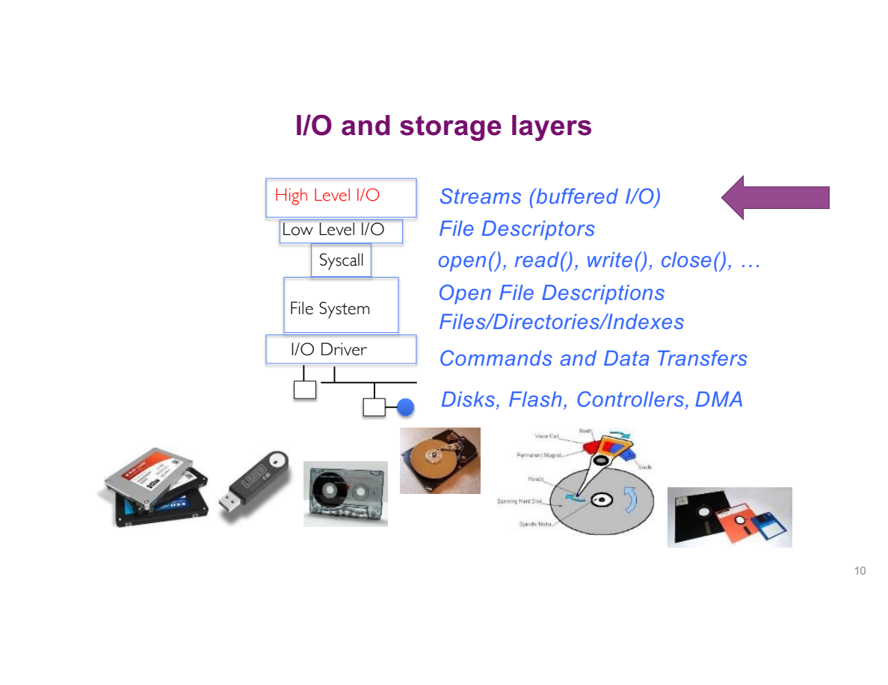

沿图从应用走向设备：

1. **应用调用 `fread`**：C 库管理 stream，并可能暂存一批数据。这是 high-level I/O，“高层”指库代做的工作更多。
2. **需要向内核取数据时，库使用 `read` 等下层接口**：这层用整数 fd 标识操作对象，是 low-level I/O。
3. **内核找到文件并处理请求**：文件系统组织文件数据，驱动负责与设备交互；已有缓存时不必每次访问设备。
4. **数据回到应用内存**：应用才能处理这些字节。

普通程序也可以直接调用 `read`，跳过 stdio 的 stream 管理；但它仍通过受控的 system call（系统调用）请求内核，不能自行执行磁盘操作。缓冲怎样减少系统调用，第五部分用具体次数解释。

## 2. 打开与读写

**核心问题：怎样用 C 读写文件，同时知道“打开了什么”和“读到哪里”？**

### 打开与关闭

打开文件不是把全部内容读进内存，而是**先建立一次访问关系**，供后续读取或写入使用。

这里的 **stream**（流）可以理解为 C 库管理的一条读写通道：它关联一个目标，记录读写状态，并管理缓冲。程序用 `FILE *` 找到这个管理对象。

<StudyDiagram id="lec05-files-4" />

下面这段代码放在 `main` 等函数内执行；`#include <stdio.h>` 放在文件开头，让编译器知道这些标准 I/O 函数和类型的声明。

```c
#include <stdio.h>

FILE *input = fopen("input.txt", "rb");
if (input == NULL) {
    perror("open input");
    return 1;
}
/* 在这里读取 input。 */
if (fclose(input) == EOF) {
    perror("close input");
    return 1;
}
```

逐项拆开第一行调用：

| 部分 | 含义 |
|---|---|
| `FILE` | C 库用来管理 stream 的类型；不是文件内容本身 |
| `*input` | 声明 input 是一个 pointer，指向库管理的 `FILE` 对象 |
| `"input.txt"` | 要打开的路径，这里相对于 CWD |
| `"rb"` | 以 binary read 模式打开已有文件 |
| `fopen(...)` 的结果 | 成功得到 `FILE *`，失败得到 `NULL` |

- `input` 保存对象地址；`fgetc(input)` 等函数知道如何通过这个对象管理 I/O。
- 不需要自己 `malloc(sizeof(FILE))`，也不能用 `free(input)` 代替 `fclose(input)`。
- `fclose` 会处理 stream 的待写数据并释放相关资源；之后不能继续使用该 stream。
- `perror` 输出提示以及当前错误原因，**它本身不会退出程序**，所以还需要 `return` 或其他错误处理。

### 从读一个字节开始

在上面代码的 `/* 在这里读取 input。 */` 处加入以下两句，也就是成功打开之后、关闭之前执行。假设文件内容是 `ABCDEF`：

```c
int first = fgetc(input);
int second = fgetc(input);
```

| 执行到哪里？ | 保存的数据 | 下一次准备读谁？ |
|---|---|---|
| 刚打开 | 还没读 | A |
| `first = fgetc(input)` 后 | first 中是字符 A 对应的整数值 | B |
| `second = fgetc(input)` 后 | second 中是字符 B 对应的整数值 | C |

把第一句从右向左读：

1. `fgetc(input)` 从这个 stream 取一个字节。
2. 函数用返回值把结果交出来。
3. `=` 把结果存进变量 `first`；它不是判断相等。
4. 下一次调用会接着读，不需要程序手动把“位置加 1”写进代码。

这里用 `int` 是因为返回值既要表示字节，也要表示 `EOF` 这样的结束或错误状态。第三部分会用完整循环说明怎么判断。

> 💡 **Pointer 与 position 不一样。** `input` 是内存中的对象地址；stream position 是文件里的读写进度。读取 B 后，通常变化的是 stream 管理的进度，而不是让 `input` 这个 C pointer 自己“走到字母 C”。

### 打开模式

打开模式回答两个问题：**这次允许读还是写？打开时是否改变原有内容？**

先对比最常用的两种：

- `fopen("input.txt", "rb")`：准备读取已有文件；不会清空它。
- `fopen("output.txt", "wb")`：准备写文件；不存在则创建，已经存在则在打开时清空。

**因此，复制文件需要两个 stream：一个读取源文件，一个写入目标文件。源路径与目标路径不能是同一个文件。**

**Mode 决定打开后的行为，不只是给函数贴一个标签：**

| Mode | 允许操作 | 文件不存在 | 已存在的内容 |
|---|---|---|---|
| `r` / `rb` | 读 | 失败 | 保留 |
| `w` / `wb` | 写 | 创建 | **打开时截断为零长度** |
| `a` / `ab` | 追加写 | 创建 | 保留，每次写入追加到末尾 |
| `r+` / `rb+` | 读、写 | 失败 | 保留 |
| `w+` / `wb+` | 读、写 | 创建 | **截断为零长度** |
| `a+` / `ab+` | 读、追加写 | 创建 | 保留，写入仍追加到末尾 |

- `+` 表示增加读写能力，不表示“追加”；追加由 `a` 决定。
- `b` 表示 binary mode。POSIX 系统通常不区分文本与二进制转换，但保留 `b` 有利于跨平台逐字节复制。

::: tip 基础补充
如果 `FILE *input` 与 `&input` 的区别仍不熟，可以结合 [C Pointers & API Parameters](../foundations/c-pointers.md) 理解。这里传给 `fgetc` 的是已经得到的 stream pointer，不是让 `fgetc` 改写 input 变量。
:::

### 标准流与组合

程序通常启动时就有三个 standard streams：

| Stream | 用途 | 常见初始连接 |
|---|---|---|
| `stdin` | 正常输入 | 终端输入 |
| `stdout` | 正常输出 | 终端显示 |
| `stderr` | 错误与诊断 | 终端显示 |

`printf("hello\n")` 使用 stdout；`fprintf(stderr, "failed\n")` 把诊断写到 stderr。

**为什么把输入输出表示为 stream 很有用？** 程序只关心从 stdin 读、向 stdout 写，shell 可以替它们接线：

```sh
cat hello.txt | grep 'World!'
```

<StudyDiagram id="lec05-files-5" />

1. `cat` 读取文件，将内容写到自己的 stdout。
2. `|` 让 shell 建立管道，把 cat 的输出连接到 grep 的输入。
3. `grep` 从自己的 stdin 取数据，输出匹配的行。
4. 普通 `|` 不会同时把 stderr 接过去，因此错误信息通常不会混进匹配的数据。

```sh
program < input.txt > output.txt 2> errors.txt
```

这里 `<` 改变 stdin，`>` 改变 stdout，`2>` 改变 stderr。它们是 **shell 语法**，不是写进 C 函数里的参数。

### 常用操作

**核心问题：想读取一个字节、一行或一批数据，分别需要提供什么？**

| 操作 | 典型调用 | 成功结果与边界 |
|---|---|---|
| 读一个 byte | `fgetc(fp)` | 返回 byte 转成的 int；EOF 表示结束或错误 |
| 写一个 byte | `fputc(c, fp)` | 返回写入字符；错误返回 EOF |
| 读一段行内容 | `fgets(buf, n, fp)` | 最多取 `n-1` 个字符，成功后添加 `\0`；遇换行可提前结束并保留换行 |
| 写 C string | `fputs(s, fp)` | 写到 `\0` 之前，不自动添加换行；成功返回非负值，失败 EOF |
| 读一批 elements | `fread(buf, size, count, fp)` | 返回完整读到的 element 数量 |
| 写一批 elements | `fwrite(buf, size, count, fp)` | 返回完整写出的 element 数量 |
| 格式化输出 | `fprintf(fp, "%d\n", value)` | 按格式把数值变成文本 |
| 格式化输入 | `fscanf(fp, "%d", &value)` | 解析文本；返回成功赋值的项目数，需要检查 |

`fgets(buf, 8, fp)` 不保证得到完整一行：如果该行很长，这次最多放入 7 个字符与一个结束符，剩余部分留给后续读取。更灵活的 POSIX `getline` 可以扩展行缓冲区，由调用者最终释放。

> 💡 **Byte 与 C string 不同。** `read` / `fread` 只按长度放入数据，不自动补 `\0`。`printf("%s", buf)` 则要一直寻找 `\0`。二者不能在没有检查空间与终止符的情况下直接连用。

## 3. 复制与定位

前面已经会打开 stream 和读取一个字节。现在把这些动作放进循环，完成真正的文件复制。

**核心问题：同一个复制任务，逐字符与分块代码到底怎样推进？**

### 逐字符复制

先看核心流程，假设 input、output 已成功打开。完整错误检查版位于 `demos/lec05/copy_chars.c`。

```c
int c;
c = fgetc(input);
while (c != EOF) {
    fputc(c, output);
    c = fgetc(input);
}
```

**`fputc` 的参数顺序是 `fputc(c, output)`：先要写的字符，再目的 stream。** 不要把二者颠倒。

假设 input 只有 `ABC`，两个 stream 的位置都从 0 开始：

| 步骤 | c | 执行什么？ | output 内容 |
|---|---|---|---|
| 初次读取 | `'A'` | 从 input 取一个 byte，输入位置变为 1 | 空 |
| 第 1 轮 | `'A'` | 写 A，再读到 B | `A` |
| 第 2 轮 | `'B'` | 写 B，再读到 C | `AB` |
| 第 3 轮 | `'C'` | 写 C，再次尝试读取得到 EOF | `ABC` |
| 判断循环条件 | EOF | `c != EOF` 为假，退出 | `ABC` |

这几行里容易漏掉的逻辑：

1. **为什么循环前先读一次？** 先知道有没有有效数据，再决定是否进入循环；空文件直接退出。
2. **为什么循环末尾还要读？** 更新 c，推进输入位置；漏掉它会反复写同一个字符。
3. **为什么 c 是 int，不是 char？** 要同时表示所有 unsigned char 值和额外的 EOF 状态。过早存入 char 可能丢失区分能力。
4. **EOF 是文件里某个特殊字符吗？** 不是。它是函数返回的状态值；实际文件字节 `0xff` 仍然是普通数据。
5. **遇到 EOF 就能宣布复制成功吗？** 不能，`fgetc` 遇到读取错误也返回 EOF，需要用 `ferror(input)` 区分。

**失败处理要放进流程：**

```c
if (fputc(c, output) == EOF) {
    perror("write output");
    /* 停止复制，记录失败，关闭已打开的 streams。 */
}
```

读取结束后检查 `ferror(input)`，最后检查 `fclose(output)`。输出可能曾停留在缓冲区，错误不一定在最初的 `fputc` 调用时就暴露。

> 💡 逐字符 API 不等于逐字符 system call。这个循环每次处理一个 byte，但 C 库可以一次向内核多取一些，先存入内部缓冲区。具体机制见后面的“为什么需要缓冲”。

### 分块复制

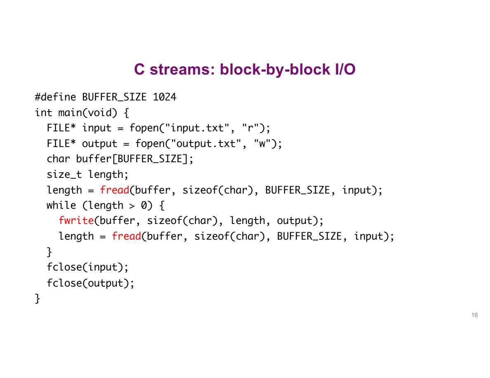

逐字符版本每次处理一个 byte。分块版本的思路没有变，只是**每次先装一批，再把这一批写出去**。

先把临时存放数据的数组声明出来：

```c
#define BUFFER_SIZE 1024
char buffer[BUFFER_SIZE];
size_t length;
```

- `#define` 给数值 1024 起一个名字，后面出现 `BUFFER_SIZE` 的地方使用这个值。
- `char buffer[1024]` 为 1024 个 char 留出内存空间；下标从 `buffer[0]` 到 `buffer[1023]`。
- **声明数组不等于读取文件**。调用 `fread` 后，数组才被填入本轮数据。
- `length` 是数量变量，用来记录这次实际拿到了多少个 byte。`size_t` 是适合表示大小和数量的整数类型。

先给四个对象定位：

- `input`：从哪里读。
- `output`：向哪里写。
- `buffer[1024]`：程序里的临时 byte 数组，存放本轮拿到的内容。
- `length`：本轮实际拿到多少，不是数组容量，也不是整个文件大小。

把读取调用拆开：

```c
length = fread(buffer, sizeof(char), BUFFER_SIZE, input);
```

| 参数或结果 | 本例值 | 含义 |
|---|---|---|
| `buffer` | 数组首元素的地址 | 把读到的内容放在哪里 |
| `sizeof(char)` | 1 | 一个 element 占多少 C bytes |
| `BUFFER_SIZE` | 1024 | 最多读多少个 elements |
| `input` | 输入 stream | 从哪里取数据 |
| `length` | 0 到 1024 | 实际完整读取的 element 数 |

一次 `fread` 有两个不同的结果：

<StudyDiagram id="lec05-files-6" />

例如文件只剩 `DEF`，那么 `buffer[0..2]` 被填入 D、E、F，而 `length` 是数字 3。**length 不会变成字符串 DEF。**

- 最大请求量为 `size × count`，即 `1 × 1024` bytes。
- **返回值是 element 数。** 这里 size 恰好为 1，所以它也等于 byte 数。
- 若改为 `fread(array, sizeof(int), 10, input)`，返回 3 表示读到 3 个完整 int 大小的数据块，不是 3 bytes，也不会自动把文本数字解析成整数。

核心循环写成下面这样，顺序更容易追踪：

```c
size_t length = fread(buffer, 1, BUFFER_SIZE, input);
while (length > 0) {
    size_t written = fwrite(buffer, 1, length, output);
    if (written != length) {
        /* 写入失败：停止复制并处理错误。 */
        break;
    }
    length = fread(buffer, 1, BUFFER_SIZE, input);
}
/* 再检查 ferror(input)，并关闭两个 streams。 */
```

**为什么读取请求用 BUFFER_SIZE，写入却必须用 length？**

假设文件有 2500 bytes：

| 轮次 | 最多请求 | 实际 length | 正确写入量 |
|---|---:|---:|---:|
| 1 | 1024 | 1024 | 1024 |
| 2 | 1024 | 1024 | 1024 |
| 3 | 1024 | 452 | **452** |
| 再读取 | 1024 | 0 | 不再进入循环 |

第三轮的内存状态是：

```text
buffer[0..451]      buffer[452..1023]
本轮读到的 452 bytes   不属于本轮数据，可能仍是旧内容
```

如果还写 1024 bytes，就把后面 572 bytes 也错误地当成文件内容写出，目标文件可能变成 3072 bytes。

**程序里的 `size_t` 与 `%zu`：** `size_t` 是用来表示大小、数量的无符号整数类型；`printf` 用 `%zu` 输出它。它不能像 `ssize_t` 一样用负数表达错误。

可运行版本把“读取并检查数量”合在循环条件中：

```c
while ((length = fread(buffer, 1, BUFFER_SIZE, input)) > 0) {
    /* 使用本轮 length 个 bytes。 */
}
```

从内向外读：先调用 fread，再把结果赋给 length，最后判断 length 是否大于 0。这里 `=` 是赋值，不是 `==` 比较。

实际运行 `copy_blocks.c` 复制 2500 bytes 时的输出：

```text
read = 1024
read = 1024
read = 452
```

已验证目标文件与源文件逐字节相同，包括含有 `\0` 和 `0xff` 的 binary 内容。遇到 `length == 0` 时仍需检查 `ferror`，不能把所有零返回都当正常 EOF。

### 用字节追踪返回值

**核心问题：读完了多少数据、返回了多少、是否已经观察到 EOF，是不是同一个问题？**

先看文件中的 6 bytes：`A B C D E \n`。调用 `fgets(buf, 4, fp)` 时，数组容量为 4，但最多接收 3 个输入字符，最后一格留给字符串结束符 `\0`。

| 调用 | 得到的字符串内容 | 原因 |
|---|---|---|
| 第一次 | `ABC` | 达到 3 个字符的上限，尚未读到换行 |
| 第二次 | `DE\n` | 读入换行后停止，换行保留在数组内 |
| 第三次 | 返回 NULL | 已经没有字符可读；再区分 EOF 与 error |

`\0` 是 C 库补上的字符串结束符，不是从文件多读出的字符。长行可能分成多次 fgets，因此一次调用不一定等于一整行。

再看只含 `ABCDE` 的 5-byte 文件。`fread(buf, 2, 3, fp)` 请求 3 个、每个 2 bytes 的 element：

1. `AB` 是第 1 个完整 element，`CD` 是第 2 个。
2. 最后只剩 `E`，不足以组成第 3 个完整 element。
3. 返回值是 **2**，不是 5，也不是 3；读取过程已经到达文件末尾，不能认为没计入完整 element 的那个 byte 一定还留在文件里。
4. 部分 element 的内容不能作为完整记录使用。复制任意文件时使用 `size=1`，能让返回值直接表示有效 byte 数。[fread](https://man7.org/linux/man-pages/man3/fread.3.html)

**EOF indicator 记录发生过什么，不预测下一次。** 若文件恰好有 6 bytes，第一次请求并成功读到全部 6 bytes，`feof` 仍可能为 0；下一次继续读、发现没有数据时，才设置 EOF indicator。循环应以读取的返回值决定是否继续，而不是写成 `while (!feof(fp))` 后无条件使用 buffer。

`fscanf` 又是另一种语义。例如文件含字符 `12 34`，`fscanf(fp, "%d%d", &a, &b)` 返回 2，表示成功赋值两个字段；a 和 b 得到数值 12、34。Fread 不解析十进制数字，只复制它们的字符编码。

可以运行 `demos/lec05/stream_boundaries.c` 验证这三种接口：

```sh
cc -std=c11 -Wall -Wextra -Werror demos/lec05/stream_boundaries.c -o /tmp/os-stream-boundaries
/tmp/os-stream-boundaries
```

本机实际输出：

```text
fgets 1: ABC, length=3
fgets 2: DE\n, length=3
partial: elements=2, position=5, eof=1
exact: bytes=6, eof=0
next: bytes=0, eof=1
formatted: assigned=2, a=12, b=34
```

其中 `DE\n` 用可见符号表示换行；length=3 表示 D、E、换行共 3 个字符，不包含补上的 NUL。程序使用临时文件，并对读取结果做检查。

### 移动位置

**核心问题：连续读会自动向后，想再读一遍或跳过一段怎么办？**

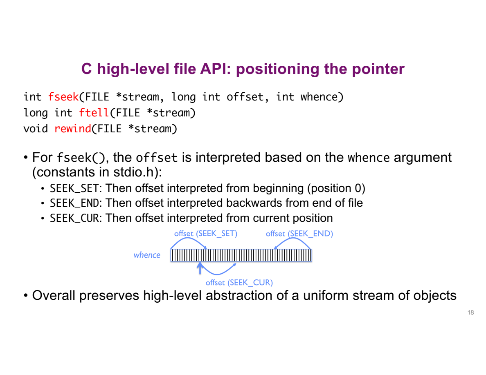

把文件看成一排 byte，position 表示**下一次准备读取的位置**。箭头表示相对于哪个起点移动：

```c
fseek(fp, offset, whence);
```

| whence | 计算方式 | 例子 |
|---|---|---|
| `SEEK_SET` | 起点 0 + offset | `fseek(fp, 2, SEEK_SET)` 到 offset 2 |
| `SEEK_CUR` | 当前 position + offset | 当前为 3，offset 为 -1，则到 2 |
| `SEEK_END` | 文件末尾位置 + offset | 长度为 5，offset 为 -1，则到 4 |

- `SEEK_END` 不表示“offset 自动向后倒数”。**方向由 offset 的正负决定**，从末尾向前一格要写 `-1`。
- `ftell(fp)` 查询 stream position；失败返回 `-1L`。
- `fseek` 成功返回 0，失败返回非零，并非返回新位置。
- `rewind(fp)` 回到开头，同时清除 stream 的 EOF/error 状态；它没有返回值。需要检查定位是否成功时使用可检查结果的定位函数。

对内容为 `ABCDE` 的 binary regular file：

```text
byte offset: 0 1 2 3 4     5
content:     A B C D E     EOF 位置
```

`demos/lec05/seek_demo.c` 的真实输出：

```text
SET +2: before=2, char=C, after=3
CUR -1: before=2, char=C, after=3
END -1: before=4, char=E, after=5
```

第一行：先定位到 2，读取 C 后自动到 3。第二行：相对于当前 3 后退 1，再读一次 C。第三行：从末尾 5 后退 1，读取 E。

这里讲的是可定位的普通二进制文件。Pipe/socket 没有这种随机访问能力；跨平台 text stream 的位置规则也不能简单套成任意 byte 算术。

## 4. 文件描述符

前面用的是 C 库管理的 stream。现在用相同的“打开 → 读 → 写 → 关闭”流程，学习内核接口这一层的用法。

**核心问题：不用 `FILE *`，只拿到一个整数，怎样还能读写文件？**

### Open 与 flags

前面 `fopen` 返回一个 `FILE *`。换成 `open` 后，返回的是整数 **file descriptor（文件描述符，简称 fd）**。

先用一个假设的成功结果理解：

<StudyDiagram id="lec05-files-extra-51" />

- 3 不是文件内容、文件大小或读取位置，只是用来查找打开对象的编号。
- 编号只在当前进程的上下文里解释；另一个进程的 3 可以对应完全不同的文件。
- 为什么一个编号就够用？内核保存了“这个进程的编号 → 打开对象”的对应关系，第六部分再展开它的结构。

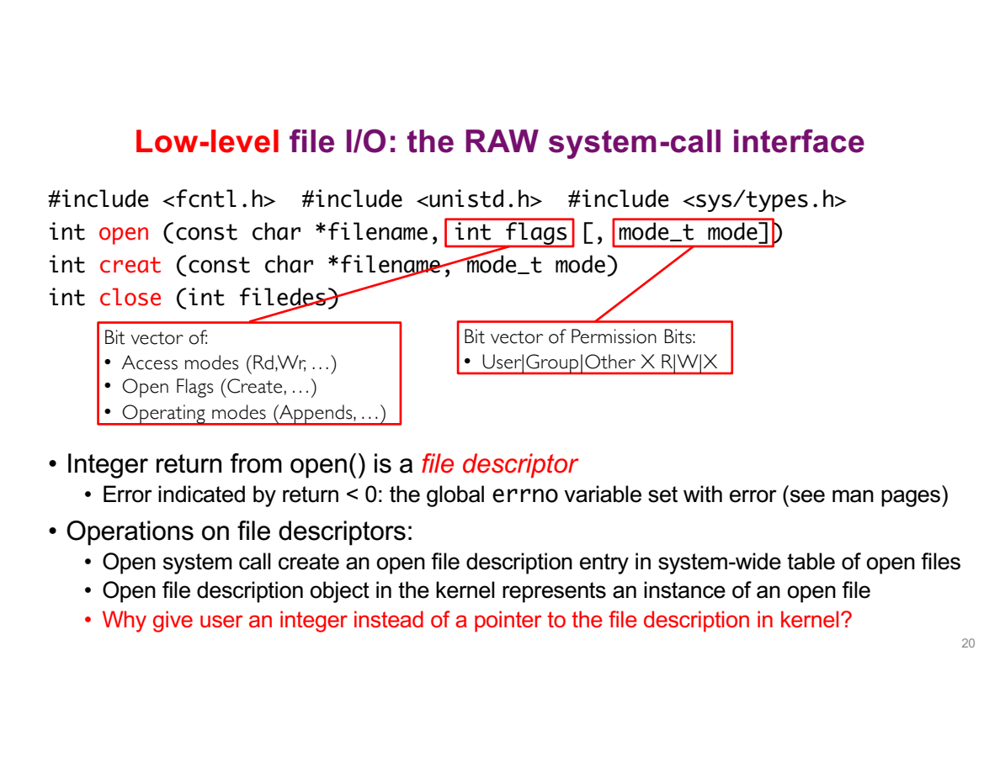

```c
#include <fcntl.h>
#include <unistd.h>

int fd = open("input.txt", O_RDONLY);
if (fd == -1) {
    perror("open input");
    return 1;
}
```

- `fd` 是 **file descriptor**，一个非负整数；`0` 也是合法值，不能用 `fd <= 0` 判断失败。
- 这个整数是当前进程的 fd table 中的索引，不是内存地址，也不是全系统统一的文件编号。
- 成功时返回当前可用的最小编号。若 0、1、2 已占用，下一次常得到 3，但代码不能假设永远是 3。
- 失败返回 `-1`，并设置 `errno` 说明原因；errno 是每线程的错误状态，应该在函数报告失败后读取，成功并不保证它被清零。

**为什么不直接返回指向内核对象的 pointer？**

1. 真正保存打开状态的对象由 kernel 管理。
2. 用户程序只需提交“操作本进程的第 fd 项”的请求。
3. 内核检查编号是否有效、打开模式是否允许操作，再访问自己的对象。
4. 程序即使把 fd 改成另一个整数，也不能凭空创建访问权限；无效编号会被拒绝。

> 💡 保护依靠硬件权限与内核检查，不是依靠用户“不知道内核地址”。即使知道地址，也不能用普通用户态指针直接读写受保护的内核内存。

**flags 与 mode 是两个问题：**

```c
int fd = open("output.txt", O_WRONLY | O_CREAT | O_TRUNC, 0644);
```

| 部分 | 解决的问题 |
|---|---|
| `O_WRONLY` | 本次打开允许写，不允许读 |
| `O_CREAT` | 文件不存在时创建 |
| `O_TRUNC` | 已有普通文件被截断为零长度 |
| `\|` | Bitwise OR，把这些选项组合起来；不是逻辑 OR `\|\|` |
| `0644` | 新文件请求的 permission bits，前面的 0 表示八进制 |

`0644` 表示 owner 可读写（4+2），group 可读（4），others 可读（4）；创建时还会受 `umask` 限制。它不是“允许本次调用读写”的 access mode，也不用于重设一个已有文件的权限。

- Access mode 从 `O_RDONLY`、`O_WRONLY`、`O_RDWR` 中选择一种；不要把前两者 OR 起来当作 `O_RDWR`。
- `O_APPEND` 让每次写入追加到文件末尾；它不等同于只在打开时 seek 到末尾。
- 使用 `O_CREAT` 时必须提供 mode 参数；不创建文件的常见调用只写两个参数。
- `creat(path, mode)` 是历史接口，等价于使用 `O_WRONLY | O_CREAT | O_TRUNC` 打开。

### Read 与 write

```c
ssize_t read(int fd, void *buffer, size_t maxsize);
ssize_t write(int fd, const void *buffer, size_t size);
```

先看同一个 buffer 在两次调用中的不同角色：

<StudyDiagram id="lec05-files-13" />

例如文件内容为 `ABCDEF`，已成功打开并且尚未读取：

```c
char buf[4];
ssize_t n = read(fd, buf, 4);
```

假设本次成功读到 4 bytes：

| 代码中的东西 | 调用后的含义 |
|---|---|
| `fd` | 仍是文件编号，不变成 4，也不变成 ABCD |
| `buf` | 前四个位置存了 A、B、C、D |
| `n` | 数字 4，表示实际读到的 byte 数 |
| 文件读取进度 | 从 0 前进到 4，下次从 E 开始 |

这里数组名 `buf` 作为参数时提供首元素地址，read 按这个地址把数据放入数组。数据通过参数所指的内存交回来，数量通过返回值交回来。

`void *` 允许传入不同类型的存储区域。`const void *` 表示 write 不需要通过这个 pointer 修改你的源数据。

| 调用结果 | `read(fd, buf, n)`，n > 0 | `write(fd, buf, n)` |
|---|---|---|
| 正数 k | 实际读到 k bytes | 实际接受了 k bytes |
| 0 | 普通文件到达 EOF；pipe 等有各自的结束条件 | 没有写出 byte，不能当作已完成整个请求 |
| -1 | 失败，检查 errno | 失败，检查 errno |

**Requested count 不等于 actual count。** 文件剩余内容较少、pipe 当前可提供的数据有限、中断等情况，都可能使读取少于请求；写入也可能只完成一部分。

- `size_t` 表示非负大小；`ssize_t` 能表示正的 byte 数，也能表示 `-1`。
- 必须先检查 `rd < 0`，再把 rd 当作长度。把 `-1` 转成 size_t 会成为一个巨大的无符号数。
- `read` 读到的数据已经放进 buf；函数返回的是数量，**不是把整个文件作为返回值交出来**。
- `close(fd)` 释放这项 descriptor，成功返回 0，失败 -1；关闭后的旧编号可能被新的 open 复用。

低层定位函数是：

```c
off_t pos = lseek(fd, 0, SEEK_CUR);
```

这里移动量为 0，因此可用于查询当前 kernel offset；成功返回新位置，失败返回 `(off_t)-1`。这与 `fseek` 的“成功返回 0”不同。

### 逐行读代码

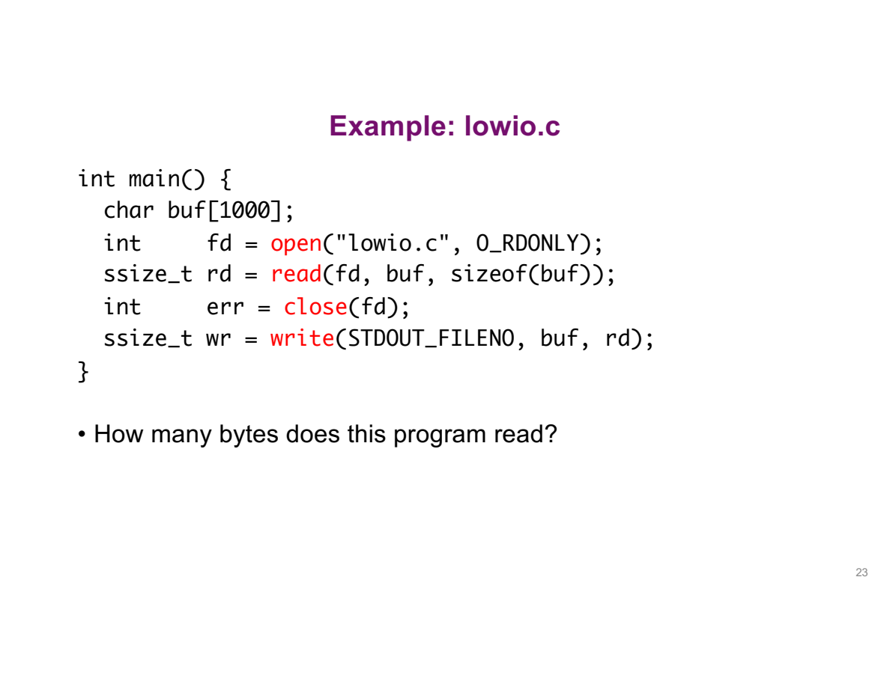

先按成功路径读这段核心代码，完整检查版位于 `demos/lec05/lowio.c`：

```c
char buf[1000];
int fd = open("lowio.c", O_RDONLY);
ssize_t rd = read(fd, buf, sizeof(buf));
int err = close(fd);
ssize_t wr = write(STDOUT_FILENO, buf, rd);
```

| 行 | 执行以后发生什么？ |
|---|---|
| `char buf[1000]` | 为最多 1000 bytes 准备用户态数组；还没有从文件读数据 |
| `open(...)` | 找到文件、检查访问、建立打开状态，把编号存到 fd |
| `read(...)` | 从当前 offset 读入 buf，rd 保存实际读取量 |
| `close(fd)` | 关闭输入 descriptor，不销毁已经读入 buf 的内容 |
| `write(...)` | 把 buf 中前 rd 个 bytes 交给 stdout，wr 是实际写出量 |

**为什么 close 以后还能输出？** 数据已经复制进程序的 buf。关闭输入文件入口，不会把这个 local array 清空。

**究竟读多少？** 一次最多 1000 bytes，可能更少，也可能失败。代码只有一次 read，因此不会自动读取长文件的剩余部分。

**为什么不用 `printf("%s", buf)`？** buf 中不保证有 `\0`。`write` 明确接收长度，能够输出含零字节的 binary 内容；`%s` 则按 C string 处理。

**`sizeof(buf)` 为什么是 1000？** 此处 buf 就是本地数组，sizeof 得到整个数组的 byte 数。如果函数参数写成 `char *buf`，在那个函数里 `sizeof(buf)` 得到的是 pointer 大小，不能再拿它当数组容量。

完整版本把输入路径改为命令行参数。输入是 `ABCDEFGHIJKL` 时，实际输出同样是：

```text
ABCDEFGHIJKL
```

输出本身不附加换行。输入超过 1000 bytes 时，已验证只输出前 1000 bytes。

**写出全部数据，不能只调用一次 write 后就不看结果：**

```c
size_t sent = 0;
while (sent < (size_t)rd) {
    ssize_t wr = write(STDOUT_FILENO, buf + sent, (size_t)rd - sent);
    if (wr == -1 && errno == EINTR) continue;
    if (wr <= 0) {
        /* 停止并报告失败，不无限循环。 */
        break;
    }
    sent += (size_t)wr;
}
```

先认清循环里的几个符号：

| 写法 | 怎样理解？ |
|---|---|
| `sent < (size_t)rd` | 已写数量还小于要写的总量，就继续；前提是已经检查 rd 非负 |
| `(size_t)rd` | 把已确认有效的数量转换成 size_t 类型，不是再次读取文件 |
| `buf + sent` | 跳过已经写出的部分，从剩余数据的首地址继续 |
| `wr == -1 && errno == EINTR` | 两个条件同时成立：调用失败，并且原因是被信号中断 |
| `continue` | 跳到下一轮，重试尚未完成的部分 |
| `break` | 结束循环；这里后续应报告失败 |
| `sent += (size_t)wr` | 等价于 sent = sent + wr，累计本次实际完成的数量 |

假设 rd 是 10，第一次只写出 6：

1. `sent` 从 0 变为 6。
2. `buf + sent` 指向 `buf[6]`，即还没写出的第一个 byte。
3. 剩余长度是 `10 - 6 = 4`。
4. 下一次只请求剩余的 4 个，避免重新写出前 6 个。
5. `EINTR` 表示调用被信号中断且这次没有成功返回传输量，可以重试；如果已返回正数，则先累计这部分进度。

这里的循环补齐**一次 read 所取得的数据**。要复制整个文件，还需要外层 read 循环，直到正常 EOF。

### 标准 fd 与 stream

| High-level stream | Low-level descriptor macro | 数值 |
|---|---|---:|
| `stdin` | `STDIN_FILENO` | 0 |
| `stdout` | `STDOUT_FILENO` | 1 |
| `stderr` | `STDERR_FILENO` | 2 |

`stdout` 是 `FILE *`，`STDOUT_FILENO` 是整数。`fputs("hello", stdout)` 与 `write(STDOUT_FILENO, "hello", 5)` 不能随意交换参数类型。

## 5. 为什么需要缓冲

两套接口都能完成复制，区别不只在函数名字。C 库多管理的一层 buffer，会改变请求内核的次数，也会影响输出出现的时机。

**核心问题：两套 API 都能读写，为何 high-level API 还要在用户态保存一份数据？**

### 减少系统调用

**Buffer（缓冲区）就是暂存数据的一块内存。** 这里讨论 C 库内部的缓冲，它可以先多取一些，之后再按程序需要分次交出。

以读取 `ABCDEF` 为例，假设库一次预取了这六个字节：

1. 程序第一次调用 `fgetc` 只要 A；库从内核取到 ABCDEF，把 A 返回给程序。
2. B 到 F 暂存在库的缓冲里，没有丢弃。
3. 第二次调用 `fgetc` 要 B，库直接从已有缓冲中取 B，暂时不需要再次请求内核。
4. 缓冲里的数据用完，库才需要继续向下层请求。

**程序调用读取函数的次数，因此可以多于进入内核读取的次数。** 下面把这个过程换成数字来比较。

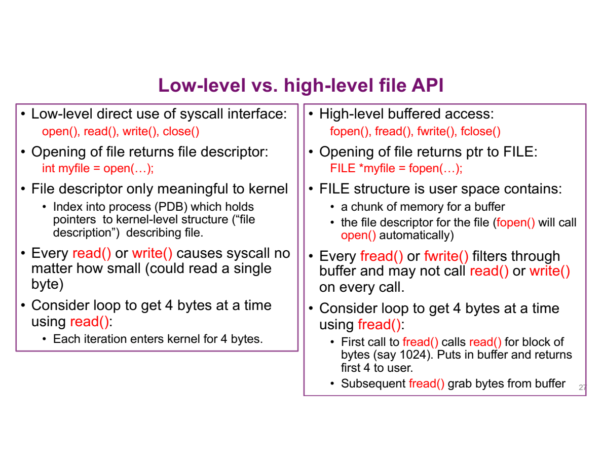

假设应用每次只要 4 bytes，而 stream 内部一次预读 1024 bytes。1024 是教学示例，真实库不保证每次都用这个大小。

| 请求 | 每次直接 `read(fd, buf, 4)` | 通过 buffered stream 每次取 4 bytes |
|---|---|---|
| 第 1 次 | 进入内核，取得 4 bytes | 缓冲为空，向内核取一批，交出前 4 bytes |
| 第 2 次 | 再进内核取 4 bytes | 从用户态已有缓冲取接下来的 4 bytes |
| 后续请求 | 每次都需系统调用 | 缓冲仍足够时无需再进入内核 |
| 缓冲耗尽 | 不适用 | 再向内核补充数据 |

在“每次都取得请求量且缓冲行为如假设”的例子中，读完 1024 bytes，前者需要 256 次 read，后者可以靠一次批量 read 支持这 256 次小请求。

**那逐字符复制一定比块复制慢很多吗？** 两者都可利用 stdio 缓冲，所以不能把两者误认为“一个 byte 就读一次磁盘”与“批量读磁盘”。分块版本仍能减少函数调用、循环等用户态开销；具体速度需要实测。

也可以自己用低层 `read(fd, buf, 65536)` 批量读。**低层接口并不必然慢，频繁的小 system calls 才是这里要避免的成本。** 固定的 MB/s 数字不能当成所有机器上的性能上限。

### 两条执行路径

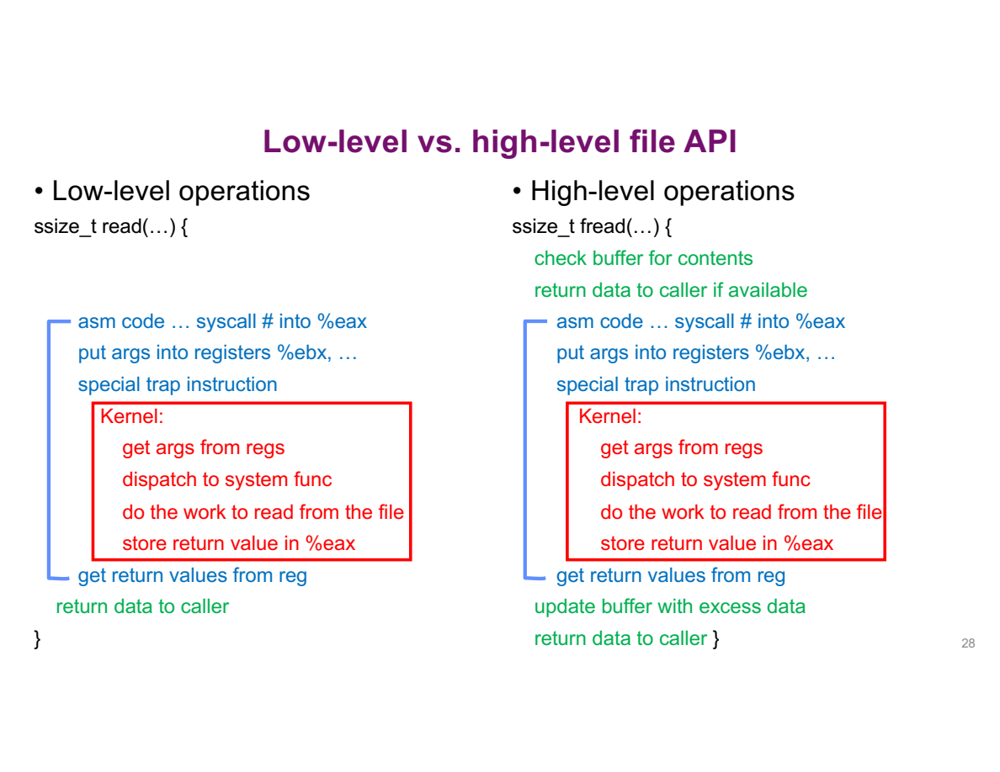

左边每次 read 的路径：

1. 用户态封装准备 syscall number 和参数。
2. 执行受控的系统调用指令，进入 kernel。
3. 内核按 fd 找到打开对象，执行读取，向指定 buffer 交付数据。
4. 返回数量或错误，执行回到用户态。

右边 fread 多了一条短路径：

1. 先看自己的 buffer 是否已能满足请求。
2. **满足时**，在用户态复制所需内容并更新 stream 状态，直接返回。
3. **不满足时**，才通过下层读取补充数据；有剩余就留在缓冲中供后续使用。

- 图中的 `%eax`、`%ebx` 是特定体系结构下的示意，不是所有 CPU 通用的 syscall 参数寄存器。
- 图右侧表达的是控制流程，真正 `fread` 的返回类型是 `size_t`，不是低层 `read` 的 `ssize_t`。
- **进入 kernel 是 mode switch，不一定发生线程切换。** 若 I/O 已能立即满足，仍可能由同一线程返回；需要等待设备时，调度器才可能运行其他线程。

### 两层缓冲

**用户态已经 buffer，为什么 kernel 还 buffer？两者省的不是同一种成本。**

```text
程序自己的 buffer[]
        ↕ fread / fwrite
C library 的 stream buffer          用户空间
        ↕ read / write
Kernel cache / buffer               内核空间
        ↕ driver / device I/O
Storage device
```

- **程序数组**：例如 `char buffer[1024]`，保存这次交给应用处理的数据。
- **Stream buffer**：库内部管理，合并小请求，减少穿过 user/kernel 边界的次数。
- **Kernel cache**：减少真实设备访问，协调块设备与 byte-oriented 接口，并可在不同访问者间复用缓存。
- **设备传输单位**：磁盘等常按 block 处理；应用请求 4 bytes，并不要求硬件只传 4 bytes。

因此，low-level I/O 只是绕过 **stdio 的用户态缓冲**，不表示绕过所有缓存，也不表示每次 read 都访问物理磁盘。

如果缓存里没有所需数据，线程可能阻塞等待设备，CPU 可以运行其他任务。这正好接上第三讲的 I/O overlap；若缓存命中，则可能不需要这次设备等待。

### 输出何时出现

比较两种写法，假设 stdout 连到普通交互终端，采用常见的 line buffering：

```c
/* Low-level */
write(STDOUT_FILENO, "Beginning of line ", 18);
sleep(1);
write(STDOUT_FILENO, "and end of line\n", 16);
```

```c
/* High-level */
printf("Beginning of line ");
sleep(1);
printf("and end of line\n");
```

1. 第一段第一条 write 就把字节交给 kernel，通常能在 sleep 之前看到前半句。
2. 第二段第一次 printf 没有换行，内容可能留在 line buffer。
3. sleep 只让线程等待，**不会自动 flush stdio buffer**。
4. 后一句带 `\n`，line-buffered stdout 因而提交待写内容，看起来整句一起出现。

常见模式要分清：

| Buffering mode | 常见触发提交的条件 |
|---|---|
| Line buffered | 换行、缓冲满、显式 fflush 等 |
| Fully buffered | 缓冲满、显式 fflush、关闭等，换行不一定触发 |
| Unbuffered | 不把数据留在 stdio 缓冲中等待批量提交 |

stdout 重定向到文件或 pipe 时通常是 fully buffered，所以不能一概认为 `\n` 必然刷新。stderr 通常不缓冲，标准至少要求它不是 fully buffered。

需要前半句及时提交时，可以写：

```c
printf("Beginning of line ");
if (fflush(stdout) == EOF) {
    perror("fflush");
    return 1;
}
sleep(1);
printf("and end of line\n");
```

`demos/lec05/buffering.c` 显式设置 line buffering，避免输出被测试工具重定向后改变条件。本机实际观察到：

| 模式 | 第一次收到输出 | 第二次收到输出 |
|---|---|---|
| `low` | 前半句 | 约 1 秒后收到后半句 |
| `line` | 约 1 秒后收到整句 | 无 |
| `flush` | 前半句 | 约 1 秒后收到后半句 |

这验证的是输出提交时机，不是磁盘性能基准。

**“写成功”有不同层次，不能只看一个返回值：**

| 操作完成 | 已能说明什么？ | 不能直接说明什么？ |
|---|---|---|
| `fwrite` 接受数据 | Stream 接受了相应 elements | 不保证都已交给 kernel |
| `fflush` 成功 | 待写的用户态缓冲已通过下层提交 | 不保证存储设备已持久化 |
| 普通文件 `write` 成功 | Kernel 接受了返回值所计的 bytes | 不保证断电后仍保留 |
| `fclose` 成功 | Stream 已关闭，待写数据已提交给下层 | 不等于持久化保证 |

> 💡 **可见性与持久性不同。** 数据仍在 stdio buffer 时，另一进程可能还看不到；普通文件的数据被 kernel 接受后，其他进程通常可从系统缓存读到，即使尚未写入物理介质。不能把“未落盘”理解成“别人必然读不到”。需要持久化保证时，还涉及 `fsync` 等操作以及文件系统、设备语义。

### 代价与选择

课堂讨论的重点不只是“buffer 更快”，还要问**省下调用以后，多维护了什么状态**：

| 收益 | 对应代价 |
|---|---|
| 合并小请求，减少 syscall overhead | 占用额外内存，可能预读不需要的内容 |
| 提供按行、格式化等方便操作 | 程序需要理解刷新时机 |
| 应用不必手工管理每次小读写 | 多个访问者的 stream 状态需要协调 |

例如，“读到换行”为止需要识别 `\n`。C 库可以批量取字节后在用户态寻找换行；kernel 不必理解每一种应用的文本格式。

**并发下的两种情况不要混在一起：**

- 多个线程使用**同一个** `FILE *`：共享该 stream；POSIX stdio 通常对单次调用做内部锁定，但“多次调用组成的整体操作”不因此自动成为原子操作。
- 多个独立 streams 或 fork 后的 stream 副本访问同一文件：可能分别保存缓冲和位置相关状态，不能假设自动同步。
- 改用低层 read/write 可去掉 stdio 这一层状态，但**不会自动解决所有并发问题**，也不保证多次调用组成的记录不会交错。

如果主要做顺序文本、按行或格式化 I/O，stdio 通常方便；如果要控制 descriptor、重定向、pipe 或精确的系统调用行为，就需要低层接口。选择依据是需要哪种语义与控制，而不是“high-level 总快”或“low-level 天生线程安全”。

## 6. 内核状态与 fork

前面解释了数据怎样传递。接下来单独看“读取进度由谁保存”，这样才能判断两个进程是在各读各的，还是共用一份进度。

**核心问题：read 没有传入“从哪里开始读”，为什么第二次却知道接着上次的位置？**

### 读取进度存在哪里

先从已经见过的代码提出问题：

```c
read(fd, buffer1, 100);
read(fd, buffer2, 100);
```

两句都只传了“文件编号、存放地址、请求数量”，没有指定从文件的第几个 byte 开始。第二次却能接着第一次读，说明**系统替这次打开保存了一份进度**。

这份打开状态叫 **open file description（OFD）**，可以先理解成内核为“一次打开”保存的记录：

<StudyDiagram id="lec05-files-16" />

`offset` 是从开头算起的字节位置；100 表示下一次从编号 100 的字节开始。它不是 `fd` 的值，也不是数据在内存中的地址。

先分清名称相似的三个东西：

| 对象 | 在哪里？ | 保存什么？ |
|---|---|---|
| `FILE` stream object | 用户空间，由 C 库管理 | 缓冲、stream 状态，以及关联的 fd 等 |
| File descriptor table | 内核维护，每进程一张 | 编号到打开对象的引用关系 |
| Open file description（OFD） | 内核 | 当前 offset、访问/状态信息，以及找到实际文件的引用等 |

<StudyDiagram id="lec05-files-17" />

- `fd` 是 **descriptor**，OFD 是 **description**，不要因为只差几个字母就当同一个对象。
- OFD 表示“一次打开的状态”，不是文件字节内容的完整副本。
- 同一个磁盘文件可以被多次 open，对应不同 OFDs；这些打开实例可拥有不同 offset。
- inode 等文件系统对象承载更底层的文件信息。这里先抓住两个作用：**到哪里找数据，以及这次打开目前读到哪里。**

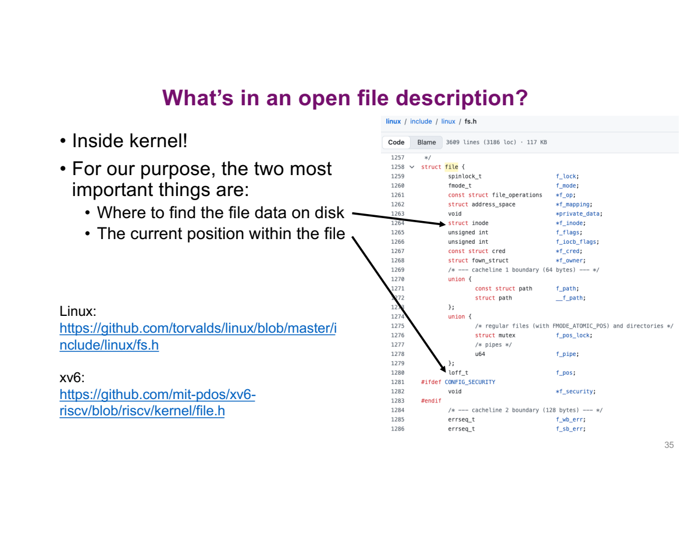

内核对象也有具体的数据结构，不是只能记住名字的黑箱。这里的 `struct file` 示例中：

- `struct inode *f_inode`：一个指向 inode 的 pointer，联系到实际文件的底层信息；不是把文件全部内容直接放进这个字段。
- `loff_t f_pos`：保存当前文件 offset 的数值。它表示位置，不是指向某个字符的 C pointer。
- `f_flags` 等其他字段：保存与这次打开有关的状态；实际字段随内核实现与版本变化。
- 两条箭头分别对应“找到哪个文件”和“读到哪个位置”。同一文件的不同打开实例可以联系同一底层文件，却有不同的 f_pos。

无需先掌握整套 Linux struct 定义，就可以利用这两个字段理解后面的 read 与 fork。

### 打开、读取、关闭

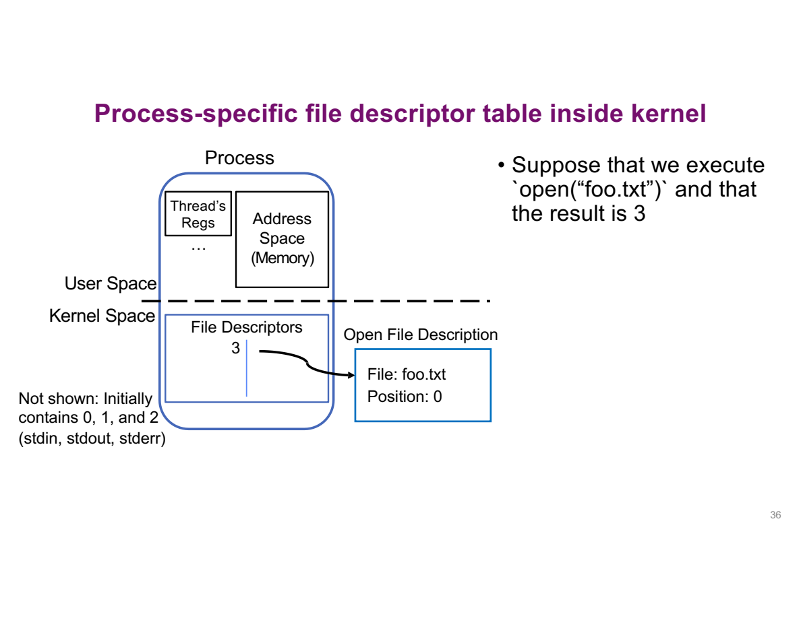

图中的虚线划分 user space 与 kernel space。虚线下的表属于这个进程的内核管理状态，**不是用户代码可以随意改写的一块数组**。

假设 0、1、2 已使用，`open("foo.txt", O_RDONLY)` 成功返回 3：

1. 用户变量 fd 得到整数 3。
2. 本进程 fd table 的第 3 项关联到一个新 OFD。
3. OFD 关联 foo.txt，初始 offset 为 0。
4. 黑色箭头表达“引用这个打开对象”，不是把文件内容复制进表项。

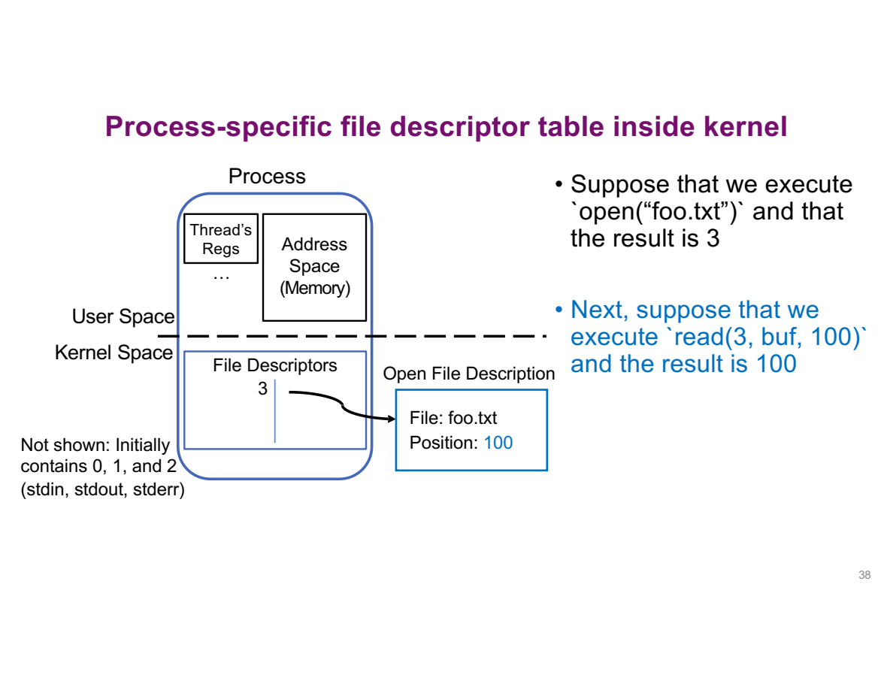

随后执行：

```c
char buffer1[100];
char buffer2[100];
int fd = open("foo.txt", O_RDONLY);
read(fd, buffer1, 100);
read(fd, buffer2, 100);
```

先假设两次读取都成功返回 100，且没有其他访问者移动这个 OFD 的位置：

| 步骤 | 读之前 offset | 交给应用的数据范围 | 读之后 offset |
|---|---:|---|---:|
| 第一次 read | 0 | bytes 0..99 → buffer1 | 100 |
| 第二次 read | 100 | bytes 100..199 → buffer2 | 200 |

两个 buffer 是两个用户态数组；读取位置保存在 OFD，不由 buffer 地址决定。若第一次实际只读到 60，offset 只前进 60，不会因为请求了 100 就跳过 40。

执行 `close(fd)` 后：

- 当前进程失去这项 descriptor 引用，编号可重新分配。
- 没有其他引用时，这个打开对象可被释放。
- **文件本身不会因为 close 就被删除**；已读进 buffer1 的数据也不会消失。

### Fork 共享什么

**核心问题：父子进程的内存隔离，为什么还能互相影响文件读取位置？**

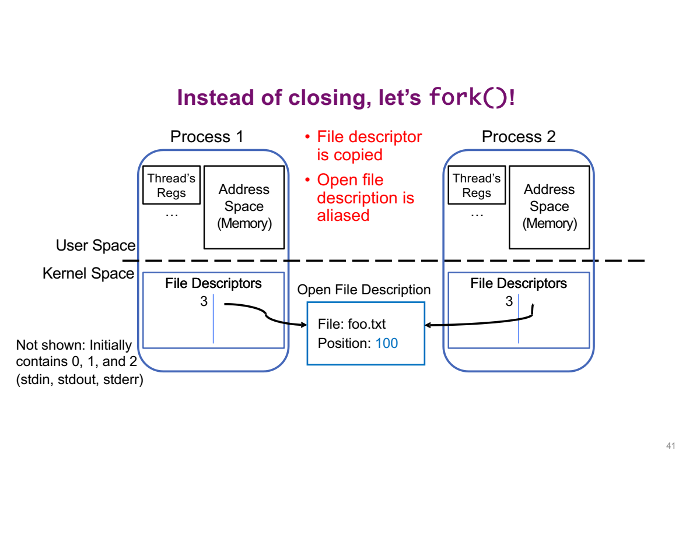

这里在 offset 已到 100 时执行 fork。把图拆成三层看：

1. **上方两块 address space**：父子各自的用户态内存。buf、fd 变量等通常各自有一份逻辑副本。
2. **下方两张 descriptor tables**：子进程继承父进程的打开 descriptors，父子的编号都可能是 3。
3. **中间只有一个 OFD**：两条箭头指向同一个打开对象，因此只有一个共享 offset，当前仍是 100。

<StudyDiagram id="lec05-files-18" />

**复制了引用关系，不是深拷贝整个 OFD。** 共享状态位于内核，两个进程都只能通过受控 API 操作它，并没有因此获得直接访问对方用户内存的能力。

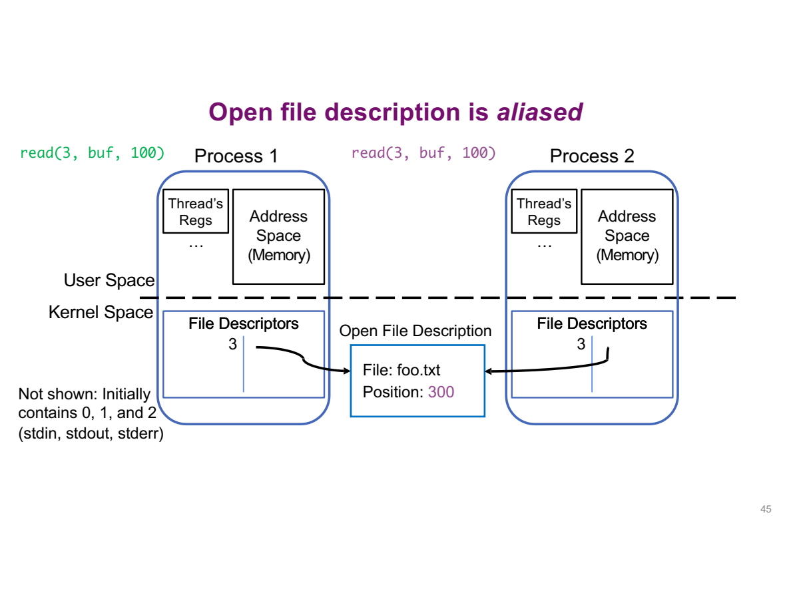

假设父先读、子再读，且每次都读到 100 bytes：

| 顺序 | 执行者 | 本次取得的范围 | 共同 offset |
|---|---|---|---:|
| fork 完成 | 两者 | 尚未再读 | 100 |
| 第一次 | 父 | 100..199 | 200 |
| 第二次 | 子 | **200..299** | 300 |

**子进程不会因为自己的 fd 数值还是 3，就重新读 100..199。** fd 负责找对象，真正的进度在被共同引用的 OFD 中。

如果不约束父子运行顺序，哪一方先拿到哪一段会取决于调度；不能仅凭源代码中父分支写在前面就断言父先读。下面的实验使用 waitpid 固定顺序，让结果便于验证。

### 关闭一方以后

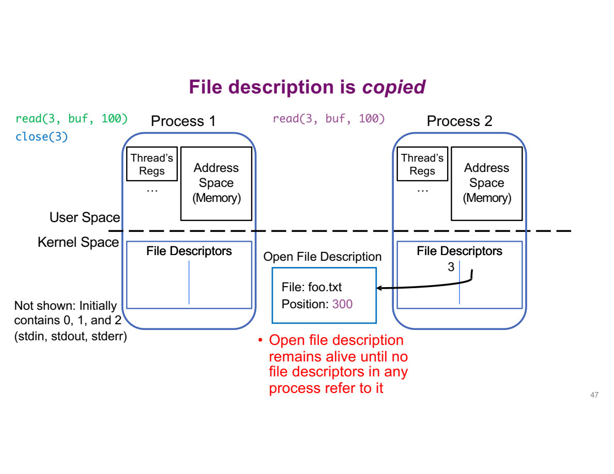

这张图中父进程已经 close(3)，所以左侧引用消失，但右侧引用仍存在：

- 子进程仍能通过自己的 3 访问这个 OFD。
- OFD 中的 offset 不会因父进程 close 而重置为 0。
- 最后一个相关 descriptor 引用关闭后，打开对象才可被回收；更一般的内核引用生命周期在后续实现中讨论。

图标题容易产生歧义：这里不是“父 close 时又复制了一份 description”，而是**原本共享的 description 仍被子进程引用**。

为什么 fork 选择继承同一个打开对象？它保留了“正在使用同一条输入输出通道”的关系，支持父子协作、shell 重定向等用途。需要独立进度时，程序可以分别 open；不同需求应由不同操作明确表达。

### 跟着代码验证

完整程序是 `demos/lec05/fork_offset.c`。为了集中观察 offset，输入准备为 `ABCDEFGHIJKL`，每次读 3 bytes。

先理解这个读取动作的简化版，假设本次正好返回 3：

```c
char buf[4] = {0};
ssize_t n = read(fd, buf, 3);
/* 先验证 n，再使用数据。 */
printf("%s\n", buf);
```

- `buf[4]` 预留 4 个 char，初始化为 0。
- read 最多改写前 3 个；最后一个保留 `\0`，因此这些示例字母可当 C string 输出。
- 这里多留一个位置，是为了演示 `%s`；一般 binary 数据不能靠 `%s` 显示全部内容。
- 完整版 take3 用循环处理短读取，并检查 EOF、错误；不足 3 bytes 就报告输入不足。

主流程可以读成：

```c
int fd = open(path, O_RDONLY);     // 成功后，offset = 0
/* 读取 3 bytes：ABC；offset = 3 */
pid_t pid = fork();
if (pid == 0) {
    /* 子读取 3 bytes：DEF；共享 offset = 6 */
    close(fd);
    _exit(0);
} else if (pid > 0) {
    waitpid(pid, &status, 0);
    /* 父读取 3 bytes：GHI；共享 offset = 9 */
    close(fd);
} else {
    /* fork 失败，处理错误。 */
}
```

逐步追踪，不要把两个分支当作同一个进程顺序执行：

1. fork 前只有一个进程，先读 ABC，把 OFD 的 offset 推到 3。
2. fork 成功后，子进程得到返回值 0，进入子分支；父得到子 PID，进入父分支。
3. 父先执行 waitpid，暂停等待子结束，所以这里保证子先做下一次读取。
4. 子通过继承的 fd 读 DEF，修改的是共享 OFD 的 offset。
5. 子 close 自己的 fd 并退出；父的 fd 仍有效。
6. waitpid 返回后，父从共享 offset 6 接着读 GHI。
7. 程序最后独立 open 同一路径，得到新的打开实例，再次从 ABC 开始。

本机实际运行输出：

```text
before fork: ABC, offset=3
child: DEF, offset=6
parent after child close: GHI, offset=9
independent open: ABC, offset=3
```

两个细节保证实验可解释：

- 每次输出后显式 `fflush(stdout)`，避免打印缓冲掩盖先后；fork 前也没有尚未提交的这部分输出。
- 子进程正常路径使用 `_exit`，不再额外 flush 继承的 stdio 状态。这里已经显式提交了实验输出。

## 7. 边界与补充

**核心问题：基本例子成立之后，哪些变体需要额外处理？**

### 读写混合模式

- `a+` 的初始读取位置存在实现差异。需要从头读时，明确定位，不依赖默认位置。
- 使用 `+` 模式交替读写时需协调：从写转读先 `fflush` 或定位；从读转写通常先定位，前次读取遇到 EOF 的情况例外。本讲复制程序使用两个单向 stream，先不混用。

### 两套接口的衔接

两层之间有接口，但不应把它们当成互不影响的两套状态：

- `fileno(fp)`：取得 stream 底层的 fd，不创建新的 descriptor。
- `fdopen(fd, "r")`：为已有 fd 建立 stream，不是重新按路径 open；mode 必须与 fd 的访问模式兼容。
- `fdopen` 成功后，`fclose(fp)` 也会关闭这个 fd，不要再把同一编号当作仍然打开而重复 close。
- 同一打开对象上随意交替 `fread` 与 `read`、`fseek` 与 `lseek`，会绕过 stream 的缓冲管理。学习示例尽量选择一层；确需混用时必须按接口规则协调。

### 为什么会有两个“当前位置”

**核心问题：程序才取出 2 bytes，内核怎么可能已经读了 6 bytes？**

以内容 `ABCDEF` 为例，假设 C 库这次选择预读全部 6 bytes：

| 时刻 | 应用已经消费 | 用户态输入 buffer 中剩余 | 底层 OFD offset |
|---|---|---|---|
| 刚打开 | 无 | 无 | 0 |
| 第一次 fgetc 返回 A | A | BCDEF | 6 |
| 第二次 fgetc 返回 B | AB | CDEF | 6 |

应用的 stream 逻辑位置在 B 后面，而底层 fd 已经在第 6 byte 后面。此时绕过 stream 直接 read 底层 fd，不能指望得到 C；C 还在 C 库的 buffer 中。表中的预读量只是解释用的假设，具体库不必一次读 6 bytes。

这也解释了为什么 fork 后不能只追踪共享 OFD：父子用户态 buffer 是各自的副本，底层 offset 却可能共享。两种状态一起影响读取结果。

**把重定向也连起来。** 假设 `open` 得到 fd 3，执行 `dup2(3, 1)` 后，fd 1 和 fd 3 引用同一个 OFD；再关闭 fd 3，fd 1 仍然有效。随后程序向 stdout 对应的 fd 1 写入，就进入该文件。改变的是 descriptor table 的引用，不是给 printf 更换函数。真正程序还必须检查 open、dup2 的失败，并处理 open 恰好返回 fd 1 的情况，避免误关目标。

### 更多共享情况

| 操作 | Descriptor / OFD 的变化 | Offset 是否共享？ |
|---|---|---|
| 同一 fd 连续 read | 始终引用同一 OFD | 沿同一个 offset 前进 |
| `int b = a` | 只复制 C 整数，没有创建新 descriptor | a、b 是同一编号的两个变量 |
| `dup(a)` | 新建 descriptor，引用同一 OFD | 共享 |
| fork 继承 fd | 父子各有表项，引用同一 OFD | 共享 |
| 独立 `open` 同一路径两次 | 两个打开实例，各自有 OFD | 通常各自维护 offset |

`int b = a; close(a);` 之后，b 不会让 descriptor 多活一份；如果确实需要第二个引用，应使用 dup 等接口。

还有一个与 buffer 结合的推论：

- fork 时，用户态 `FILE` 对象及缓冲内容也属于被复制的内存状态。
- 未提交的输出可能同时留在父子各自的 buffer，若两者后来都 flush，会造成重复输出。
- 输入预读也可能使 stream 的逻辑位置与共享 kernel offset 不一致。不能把前面的低层 read 实验原样换成 buffered fread，就假设行为不变。
- 因而需要在 fork 与后续 I/O 之间协调 stream 状态；不要把“内核 OFD 共享”误解为“父子的用户态 buffer 自动共享同步”。

### 后续接口

这些接口本讲只建立用途，后续再展开完整编程：

| 接口 / 机制 | 作用 |
|---|---|
| `dup(fd)` | 分配一个新 descriptor，引用同一 OFD |
| `dup2(oldfd, newfd)` | 让指定 newfd 引用 oldfd 对应的打开对象，必要时替换原 newfd；可用于重定向 |
| `pipe(pipefd)` | 建立管道，向 `pipefd[1]` 写的数据由 `pipefd[0]` 读出 |
| File locking | 协调对文件内容的访问，规则取决于锁的类型 |
| Memory mapping | 把文件内容映射到地址空间，通过内存访问操作 |
| Asynchronous I/O | 发起 I/O 后不必一直阻塞等待，用其他机制获知完成 |

## 8. 运行与自检

### 运行示例

所有命令从项目根目录执行。以下在新建的临时目录写实验文件，避免覆盖笔记或原始材料；复制程序的 INPUT 与 OUTPUT 必须是不同文件，OUTPUT 若已存在会被截断。

```sh
demo_dir=$(mktemp -d)
cc -std=c11 -Wall -Wextra -Werror demos/lec05/copy_chars.c -o "$demo_dir/copy_chars"
cc -std=c11 -Wall -Wextra -Werror demos/lec05/copy_blocks.c -o "$demo_dir/copy_blocks"
cc -std=c11 -Wall -Wextra -Werror demos/lec05/lowio.c -o "$demo_dir/lowio"
cc -std=c11 -Wall -Wextra -Werror demos/lec05/seek_demo.c -o "$demo_dir/seek_demo"
cc -std=c11 -Wall -Wextra -Werror demos/lec05/buffering.c -o "$demo_dir/buffering"
cc -std=c11 -Wall -Wextra -Werror demos/lec05/fork_offset.c -o "$demo_dir/fork_offset"

printf 'ABCDEFGHIJKL' > "$demo_dir/input.txt"
"$demo_dir/copy_chars" "$demo_dir/input.txt" "$demo_dir/chars.txt"
"$demo_dir/copy_blocks" "$demo_dir/input.txt" "$demo_dir/blocks.txt"
cmp "$demo_dir/input.txt" "$demo_dir/chars.txt"
cmp "$demo_dir/input.txt" "$demo_dir/blocks.txt"
"$demo_dir/lowio" "$demo_dir/input.txt"
"$demo_dir/seek_demo"
"$demo_dir/buffering" line
"$demo_dir/buffering" flush
"$demo_dir/fork_offset" "$demo_dir/input.txt"
```

- `cc` 编译 C 文件；`-o` 后面指定 executable 的位置。
- `"$demo_dir/..."` 运行刚生成的程序；后面的路径成为 main 的 `argv[1]`、`argv[2]`。
- `cmp` 成功且没有输出，表示两个文件逐字节相同。
- 这些 demo 已在本机编译运行；复制还检查了空文件、1 byte、1024、1025、2500 bytes，以及不存在的输入文件。计时与调度细节会因运行环境不同而变化。

### Self-check

1. 相同的 `fopen("data/input.txt", "r")` 为什么可能在一个目录成功，在另一个目录失败？它是否相对于源文件目录？
2. 2500-byte 文件用 1024-byte 数组复制，为什么最后一轮只写 452？如果 `fread` 的 size 改为 4，返回 3 又表示什么？
3. 逐字符 fgetc 是否每次都进入 kernel？为什么 `fflush` 成功也不等于数据已持久化？
4. lowio 中 close 后为什么还能用 buf 输出？为什么 read 的返回值不应该未经检查就转成 size_t？
5. fork 前读了 100 bytes，父子之后依次各读 100。子从哪里开始？父 close 后子还能读吗？如果两者独立 open 又怎样？
6. `FILE *`、fd table 与 OFD 分别保存什么？`int b = fd` 和 `dup(fd)` 有什么区别？

7. Fgets 的数组容量为 4，读 `ABCDE\n` 时为什么需要两次才能取得这行？
8. 5 bytes 用 `fread(buf, 2, 3, fp)` 读取，返回多少？能否假定下次还会读到 E？
9. 恰好读完文件全部 bytes 后，feof 为什么可能仍为 0？
10. Stream 已消费 2 bytes，底层 offset 为什么可能为 6？

**A1.** 相对路径从进程 CWD 开始查找，不是自动从源文件位置开始。CWD 不同，相同字符串可能找到不同位置；绝对路径从根开始，不依赖 CWD。

**A2.** 数组有 1024 bytes 的容量，但第三轮实际只有 452 bytes 新数据。写容量会把本轮无效的尾部也写出。fread 返回 element 数；size 为 4、返回 3 表示 3 个完整的 4-byte elements，共 12 bytes。

**A3.** 不一定。Fgetc 可从 C 库用户态缓冲中取数据，只在需要时补充读取。Fflush 负责提交用户态待写数据，内核仍可能缓存，持久化还需要另外的保证。

**A4.** Read 已把数据放进程序的 buf；close 释放输入 descriptor，不销毁数组。Read 失败返回 -1，直接转成无符号 size_t 会成为巨大长度，后续 write 可能越界读取内存。

**A5.** Fork 后共享 OFD 的 offset。父先读 100..199 后 offset 为 200，子再读 200..299。父 close 只去掉自己的引用，子仍可读。独立 open 一般创建各自 OFD，offset 各自推进。

**A6.** FILE 管理用户态 stream 缓冲与状态；fd table 维护本进程编号到打开对象的映射；OFD 保存 offset、状态标志与实际文件的引用。整数赋值不创建 descriptor，dup 才创建新的引用，且仍共享原 OFD。

**A7.** 每次最多读 3 个输入字符，剩下一格放 NUL；第一次 ABC，第二次 DE 和换行。

**A8.** 返回 2 个完整 element；最后部分 element 已可能被读取，不能假定 E 留给下次。

**A9.** EOF indicator 需要一次读取观察到末尾；成功满足全部请求不一定需要再探测后面是否有数据。

**A10.** 库先预读 6 bytes，再逐个交给应用。未消费的 4 bytes 在用户态 buffer，不能只用 kernel offset 代表 stream 逻辑进度。

### 参考资料（可选）

正文已经解释使用本讲所需的机制与例子；以下只用于核对接口细节。

- Stream 返回值与模式：[fread / fwrite](https://man7.org/linux/man-pages/man3/fread.3.html)、[fopen / fdopen](https://man7.org/linux/man-pages/man3/fopen.3.html)。
- Descriptor、短读短写与打开状态：[open](https://man7.org/linux/man-pages/man2/open.2.html)、[read](https://man7.org/linux/man-pages/man2/read.2.html)、[write](https://man7.org/linux/man-pages/man2/write.2.html)。
- 缓冲提交与继承规则：[fflush](https://man7.org/linux/man-pages/man3/fflush.3.html)、[fork](https://man7.org/linux/man-pages/man2/fork.2.html)。
