# Lecture 6 · Sockets 与 Pipes

**TL;DR**

- IPC（Inter-process communication）让独立进程交换数据；socket 和 pipe 都能使用 fd、`read`、`write`、`close`。
- TCP socket 提供双向、有序的 byte stream；服务器用 listening socket 接待，用 connected socket 传输数据。
- Pipe 提供简单的本机单向通道；理解 `fork` 后的引用共享、阻塞和 EOF，才能正确安排读写与关闭。

从一个具体问题开始：**程序 A 得到了 `hello`，怎样让程序 B 收到，再回一句 `hello`？**

<StudyDiagram id="lec06-sockets-pipes-extra-48" />

| 阅读顺序 | 需要弄清的问题 |
|---|---|
| 1–2 | fd 背后是什么？为什么通信用队列比不断追加普通文件自然？ |
| 3–4 | Socket 怎样传数据？为什么读写次数不一定对应？ |
| 5–7 | 怎样找到对方、建立连接、运行 echo 程序？ |
| 8–9 | 服务器怎样隔离不同客户端，又怎样同时处理它们？ |
| 10–12 | Pipe 如何连接父子进程？何时等待、何时结束？ |
| 13–14 | 如何选择 IPC 机制，以及如何用问题检查理解？ |

## 1. File descriptors 与 fork 后的共享

**核心问题：复制了进程，为什么文件读取位置仍可能互相影响？为什么一方 close 不会让另一方也失去 fd？**

### 1.1 区分编号、打开状态与数据

<StudyDiagram id="lec06-sockets-pipes-extra-49" />

- **File descriptor（fd）**：进程使用的非负整数编号。
- **File descriptor table**：每个进程的 fd 表，记录编号引用什么对象。
- **Open file description**：一次打开对应的内核状态，包含访问文件所需的信息、current offset、状态标志等。
- **File data**：真正存储的字节，与“这次打开读到了哪里”分开。

对普通文件，可以把 offset 理解为书签。`read` 把内容复制到用户 buffer，并推进书签；它不会删掉磁盘上读过的内容。

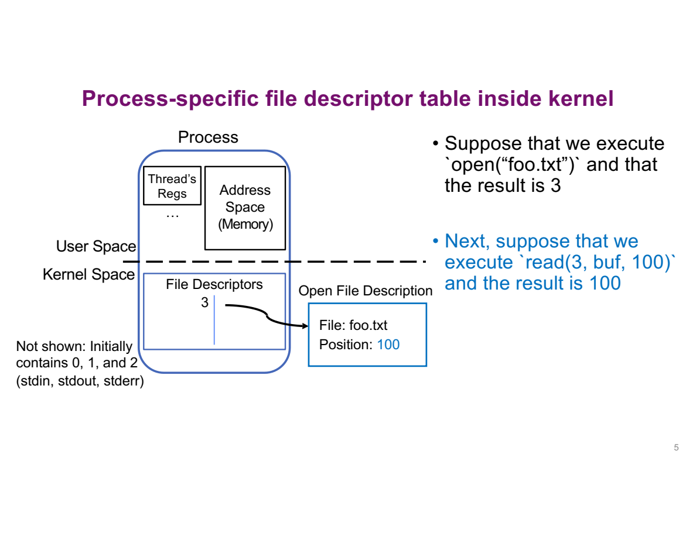

沿一次 `read(3, buf, 100)` 跟踪执行：

1. 程序交出 fd 3、目标 buffer 地址、最多要读的字节数。
2. 内核在**当前进程**的 fd table 中找到表项，再找到打开状态。
3. 根据文件和 current offset 读取数据，复制到 `buf`。
4. 成功读了多少就返回多少，并按实际读取量推进 offset。

`buf` 是用户内存里的数据，offset 是内核里的进度。即使稍后把 `buf` 清零，也不会让 offset 自动回到 0。

假设文件至少有 300 bytes，下面每次 `read` 都成功返回 100：

| 操作 | 发生了什么 | Current offset |
|---|---|---:|
| `open(...)` 返回 `3` | fd 3 指向新的打开状态 | 0 |
| `read(3, buf, 100)` | 将 bytes 0–99 复制进 buf | 100 |
| `fork()` | 子进程继承 fd 3，引用原来的打开状态 | 100 |
| Parent 再读 100 bytes | 读到 bytes 100–199 | 200 |
| Child 随后读 100 bytes | 读到 bytes 200–299 | 300 |

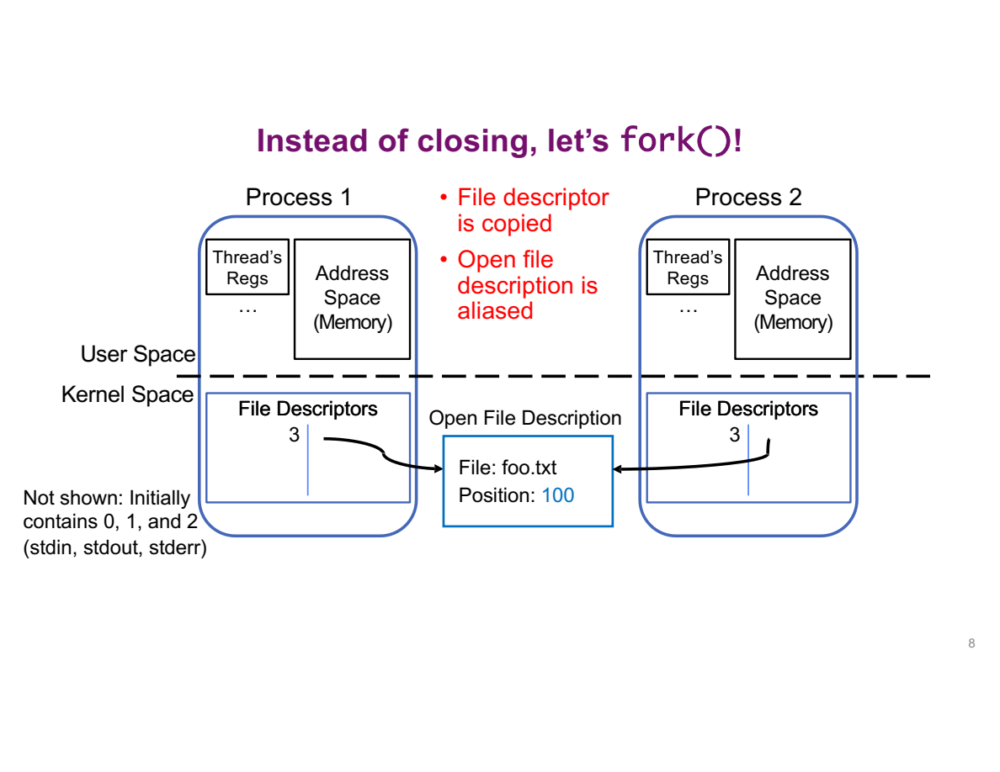

这里的 **aliased** 指“多个引用指向同一个对象”。普通用户内存中的 `buf` 各有一份，但内核中的 open file description 被共享。

> 💡 **fd table 被复制，open file description 被共享。** 不要把 `fork` 理解成复制一切，也不要把“父子进程的 fd 数字相同”当作共享的原因。真正的原因是继承的表项引用同一个对象。两个无关进程都使用 fd 3，不一定访问同一个资源。

如果两个进程分别 `open` 同一个文件，通常会产生两个 open file descriptions，各有独立 offset。它们仍可访问同一份文件数据，但不共享这两次打开的阅读进度。

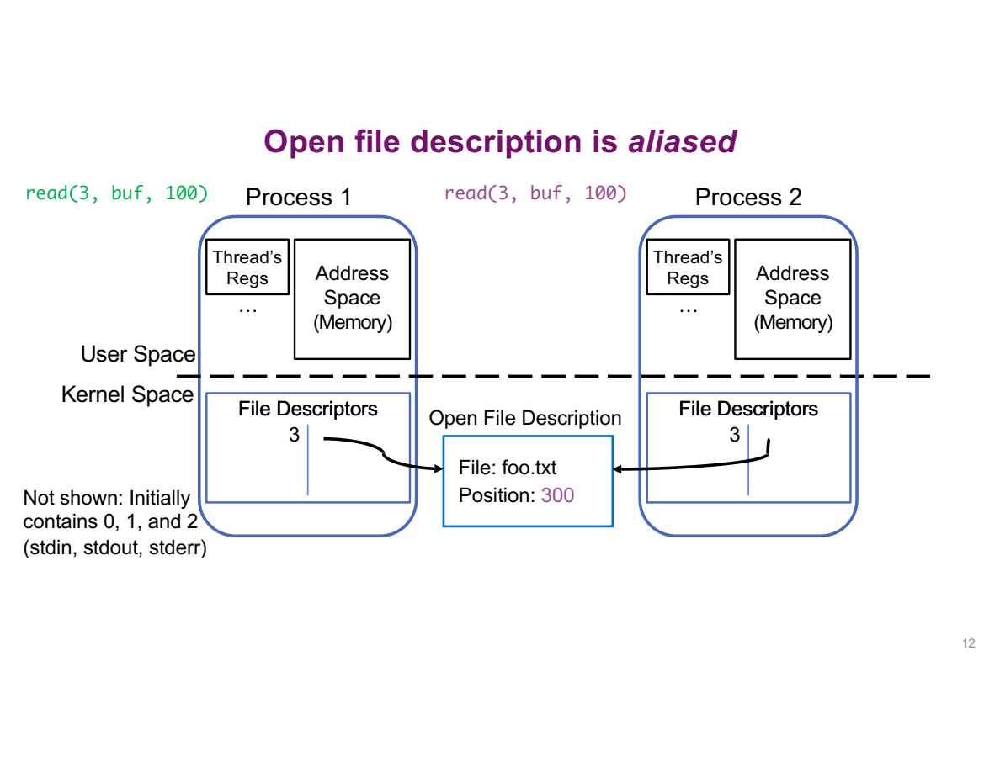

再换一种调度顺序：如果 Child 先读，Child 得到 bytes 100–199，Parent 得到 bytes 200–299。**共享 offset 决定它们接着同一个位置读取；调度顺序决定谁先拿到哪一段。** 上面的顺序表是在明确“Parent 先读”的前提下推导的。

另一个分支也要区分：如果没有 `fork`，只有原进程一个引用，那么它 `close(3)` 后对应打开状态就可以释放。`close` 后继续使用这个编号是错误的；未来新打开的资源可能重新使用编号 3，原来的 fd 数字不会永久代表原文件。

### 1.2 close 关闭的是哪一层？

Parent 执行 `close(3)` 后：

```text
Parent fd 3：移除引用
Child  fd 3：仍然引用原来的 open file description
```

只要 Child 还持有引用，它就能继续访问。只有相关引用都释放后，内核才会回收对应的打开状态。

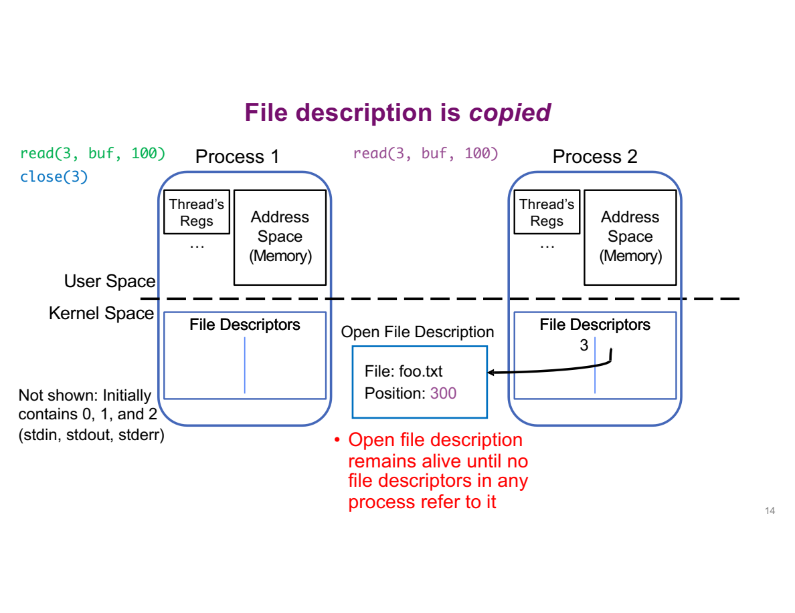

这里复制的是 descriptor 表项；两个进程并没有各自独立的 offset。`close` 也不会删除磁盘文件。

### 1.3 为什么父子进程都能输出到同一个 terminal？

通常启动时已经有：

| fd | 名称 | 通常的用途 |
|---|---|---|
| 0 | Standard input，stdin | 读取键盘输入 |
| 1 | Standard output，stdout | 输出正常结果 |
| 2 | Standard error，stderr | 输出错误信息 |

`fork()` 后，这些 fd 也被继承。因此父子进程的 `printf` 通常都输出到同一个 terminal。若某一方关闭 fd 0，只会移除自己的引用，另一方的 stdin 仍然可用。

<StudyDiagram id="lec06-sockets-pipes-3" />

这里说的是各自的 fd 可用性，不是保证两个 Reader 各收到一份相同键盘输入。若双方都读同一 terminal，会竞争消费输入，应用需要决定谁负责读取。

这三个 fd 也能被重定向到文件或 pipe，并不永远对应键盘、屏幕。有关用户态 `stdio` buffer 与 fd 的区别，可回看 [Files & I/O](./lec05-files.md)。

## 2. 从普通文件到通信队列

**核心问题：两个进程为什么不直接用一个文件交换所有消息？**

### 2.1 普通文件可以通信，但需要安排时序

设 A 是 producer，B 是 consumer：

```text
A：write(file_fd, message, length)
B：read(file_fd, buffer, capacity)
```

要让 B 读到正确内容，还需要约定：

- 文件在哪里，谁负责创建？
- B 什么时候读，如何知道 A 已经写完？
- B 从哪个 offset 开始，哪些数据已经处理过？
- 旧消息是否保留，谁清理不断增大的文件？

普通文件的优势是持久保存：A 可以先写完退出，B 很久之后再打开读取。但对于“写一次、消费一次”的实时消息，永久保留全部历史往往没有必要。

### 2.2 Queue 更符合持续通信

<StudyDiagram id="lec06-sockets-pipes-5" />

Queue 把生产和消费暂时分开：发送方可以先交出数据，接收方稍后取走；消费后的空间可以继续使用。

- **Buffering**：用有限空间暂存数据，适应双方速度差异。
- **Blocking**：条件不满足时让调用线程等待，例如队列暂时为空。
- **Ephemeral**：通信数据不作为普通磁盘文件长期保存。

这仍可以使用熟悉的 `read`、`write` 接口。**统一的是访问方式，并不是把所有资源都变成磁盘文件。**

### 2.3 Request–response protocol

Client 发起请求，Server 处理请求并返回响应。例如“查询某个值”或“原样返回这些字节”。

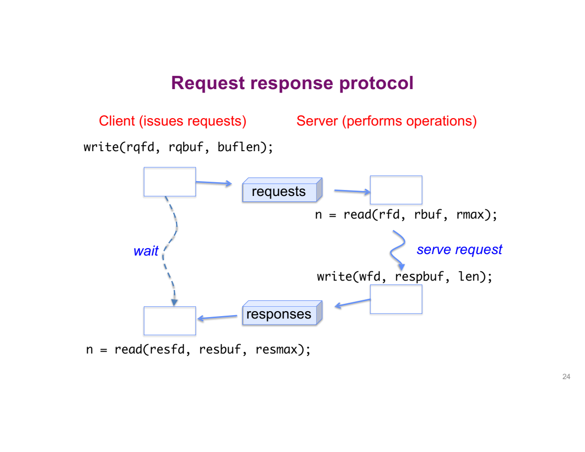

一次交互分为四步：

1. Client 写出 request。
2. Server 读取 request，执行操作。
3. Server 写出 response。
4. Client 读取 response，再决定下一步。

Client 等待 response 时，Server 可能还在等待请求到达，或正在计算。二者不是同一条执行流，需要靠通信协议配合。

## 3. Socket 与双向 byte stream

**核心问题：跨机器通信，怎样在程序中表现为一个可以读写的对象？**

### 3.1 Endpoint 和 connection

**Socket is an endpoint for communication.** 一个 socket 是通信的一端，不是整条连接。

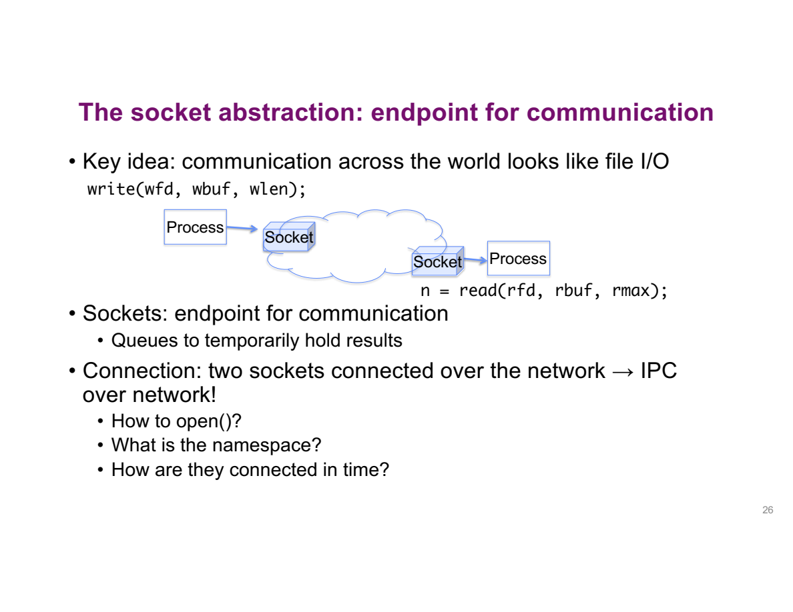

<StudyDiagram id="lec06-sockets-pipes-6" />

本讲主要讨论 TCP socket：

- 两端可以在同一台机器，也可以在不同机器。
- 双方不需要通过 `fork()` 建立亲属关系。
- 建立连接后，一个 connected socket fd 同时支持读取和写入。
- Socket 也适用于 UNIX domain、UDP 等通信，不能把所有 socket 都等同于 TCP。

Socket API 最早引入于 4.2 BSD Unix，POSIX 对相关接口进行了标准化；不同系统也提供 socket 接口，即使其他 I/O 设计不完全相同。其价值是让应用不必针对每一种底层网络重新设计读写方式。

Linux、macOS、Windows 都提供 socket 编程能力。其支持范围不限于今天常用的 TCP/IP、UDP/IP；历史上的 OSI、AppleTalk、IPX 也体现了同一种 endpoint 抽象可以适配不同协议。

**同一组接口形状，不保证所有平台的细节完全一致。** 本文的 fd、`read/write/close` 用法遵循 UNIX/POSIX 风格。

### 3.2 发送与接收缓冲区分别做什么？

<StudyDiagram id="lec06-sockets-pipes-7" />

- `write(fd, buf, n)`：把用户内存中的字节交给发送路径。
- `read(fd, buf, max)`：从本端接收缓冲区取出可用字节，复制进用户内存。
- 网络传输与对方调用 `read` 可以发生在稍后的时间。

一个连接有两个传输方向；每端在实现上还有各自的发送和接收缓冲区。不要把“双向”理解为应用必须创建一个发送 socket 和一个接收 socket。

> 💡 **成功 write 不等于对方应用已经处理。** 它表示本次接受了多少字节用于发送。对方可能尚未读取；如果需要确认业务操作完成，必须让对方发送 application-level response。

### 3.3 为什么不能 lseek？

TCP socket 提供的是持续到来的 byte stream。已读数据不会为应用保留成可以任意回放的文件。

- 不能用 `lseek(fd, 0, SEEK_SET)` 重新读取全部对话。
- 需要历史记录时，应用自己保存到内存或文件。
- 底层为重传暂存数据，不代表应用能随意访问这些内部数据。

## 4. Echo、blocking 与消息边界

**核心问题：接口只是 read 和 write，为什么代码仍然容易读错、等住或提前退出？**

### 4.1 一次 echo 的执行顺序

Echo server 收到什么，就返回什么。它是练习传输的最小协议，不等于已经实现 HTTP web server。

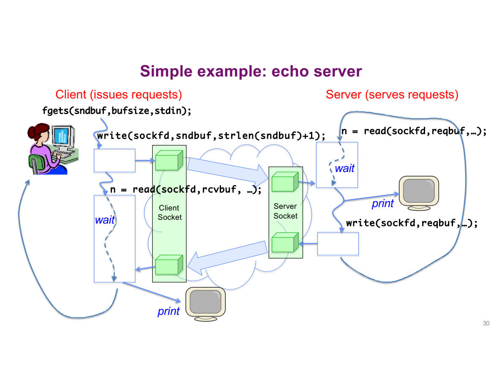

| 步骤 | Client | Server |
|---|---|---|
| 1 | `fgets` 等待用户输入 | `read` 等待网络数据 |
| 2 | `write` 发送字节 | 数据到达后，`read` 返回 |
| 3 | `read` 等待回复 | 可输出收到的字节，再 `write` 回传 |
| 4 | `read` 返回，输出回复 | 回到 `read` 等待下一批数据 |

同一个 Server connected fd 上，`read` 接收 Client 发来的数据，`write` 将数据发回 Client。它不会把自己刚写出去的数据再读回来。

**把两端放在一起读代码：** `sndbuf` 是 Client 的发送数据，`rcvbuf` 是 Client 的接收空间；`reqbuf` 位于 Server。它们是不同进程中的不同内存。

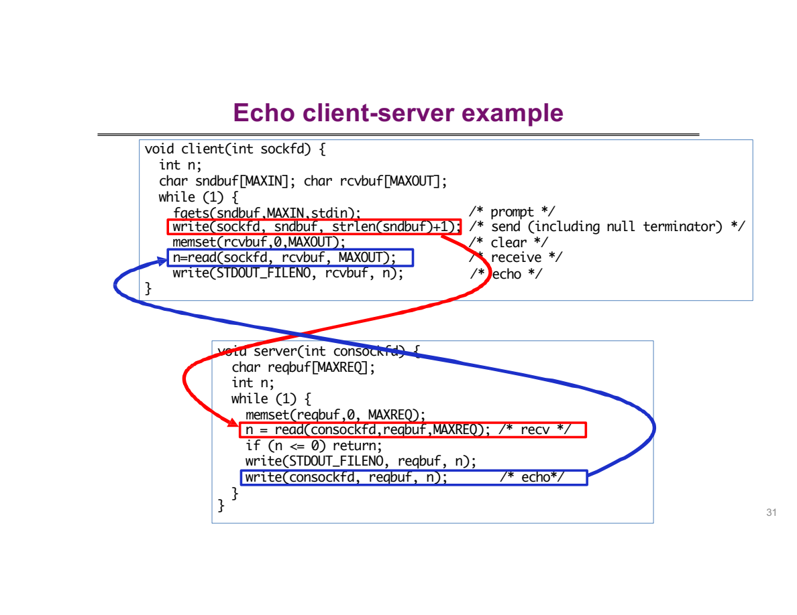

下面拆开一次交互。先假设每个调用成功且完整处理本条消息；随后几节解除这个假设：

```c
/* Client: sockfd is already connected. */
fgets(sndbuf, MAXIN, stdin);                  // 1. Keyboard -> sndbuf
write(sockfd, sndbuf, strlen(sndbuf) + 1);   // 2. sndbuf -> network
memset(rcvbuf, 0, MAXOUT);                   // 3. Clear local receive space
n = read(sockfd, rcvbuf, MAXOUT);            // 4. Network -> rcvbuf
write(STDOUT_FILENO, rcvbuf, n);             // 5. rcvbuf -> terminal
```

```c
/* Server: conn_fd is the accepted connection, not the listener. */
memset(reqbuf, 0, MAXREQ);
n = read(conn_fd, reqbuf, MAXREQ);           // Receives step 2's bytes
if (n <= 0) return;                          // Leaves this service function
write(STDOUT_FILENO, reqbuf, n);             // Local display on server
write(conn_fd, reqbuf, n);                   // Supplies step 4's bytes
```

逐行读时注意三个容易混淆的地方：

- `STDOUT_FILENO` 是 fd 1。Server 向它写入，只是在 Server 的 terminal 上显示，不会自动回复 Client。真正的回复是最后一行对 `conn_fd` 的写入。
- `return` 离开当前服务函数，不必然结束整个服务器。若外层还有 `accept` 循环，外层仍可接待下一位。
- 两端的 fd 数字无需相同。Client 的 fd 3 与 Server 的 fd 4 可以是同一条连接的两个端点。

这个调用片段用于解释数据方向，不是可直接替代完整程序的错误处理：`fgets` 可能返回 `NULL`，`read` 可能失败，正返回值也可能只是部分数据。**只有 `n > 0` 时，才把它作为本次收到的字节数使用。** 不能把负的 `n` 当作 `write` 的长度。

### 4.2 Blocking 不是反复空转检查

普通 blocking socket 的接收缓冲区为空、连接尚未结束时：

<StudyDiagram id="lec06-sockets-pipes-8" />

- `while (1) { read(...); ... }` 不必然是 busy waiting；循环内的 `read` 可以阻塞。
- 多线程程序中，通常只是调用 `read` 的线程被阻塞。
- 非阻塞模式另有规则，本讲主线使用 blocking I/O。

### 4.3 read 返回值要分三类

假设请求读取的长度大于 0：

| 返回值 | 含义 | 程序处理 |
|---|---|---|
| `n > 0` | 成功获得 n bytes | 只处理这 n bytes |
| `n == 0` | End of stream，EOF | 对方正常结束发送，且之前的数据已读完 |
| `n == -1` | Error | 查看 `errno`，决定重试、报告或关闭 |

**“现在没数据”不等于 EOF。** 连接仍开放时，blocking `read` 通常等待；不会因为对方停顿一下就返回 0。

正常 TCP 结束通过协议状态通知接收端，最终使应用读到 EOF。EOF 不是塞进应用 buffer 的特殊字符，也不是字符串结尾 `\0`。错误返回也不能一概解释为“对方关闭”：例如 `EINTR` 是调用被信号中断，通常可以重试。见 [read(2)](https://man7.org/linux/man-pages/man2/read.2.html) 与 [recv(2)](https://man7.org/linux/man-pages/man2/recv.2.html)。

一个简化的 `if (n <= 0) return;` 把正常结束与错误合并成“停止处理当前连接”。读代码时要知道它省略了错误分类。

### 4.4 TCP 保序，但不保留 write 的边界

假设发送方依次写：

```c
write(fd, "hello", 5);
write(fd, "world", 5);
```

接收方最终得到的字节顺序是 `helloworld`，但每次 `read` 的结果可能不同：

```text
情况 A："hello" + "world"
情况 B："hel" + "loworld"
情况 C："helloworld"
```

- `read(fd, buf, 100)` 的 100 是上限，不是必须凑满的长度。
- 一次 `write` 可能由多次 `read` 才接收完整。
- 多次 `write` 的内容也可能合在一次 `read` 中出现。

> 💡 **底层 packet 乱序，与应用读到的 byte stream 乱序，是不同层次的问题。** 网络可能丢包、乱序，TCP 负责重传和重组，向应用提供有序字节流；连接仍然可能失败，应用要处理错误，但不能因此说 TCP 的正常读取会任意打乱字节顺序。见 [tcp(7)](https://man7.org/linux/man-pages/man7/tcp.7.html)。

### 4.5 应用怎样识别完整 message？

常见 framing 方法：

| 方法 | 示例 | 接收方如何判断完整 |
|---|---|---|
| 固定长度 | 每条记录恰好 16 bytes | 累计读满 16 bytes |
| Delimiter | `hello\n` | 读到换行 |
| Length prefix | 长度 5，后面跟 `hello` | 先读长度，再收满正文 |
| Terminator | `hello\0` | 读到约定的 NUL byte |

采用 delimiter 时，一次 `read` 可能得到半条、整条或多条消息。应用需要保存未完成部分，也要留住最后一条完整消息之后的余量。

Socket 只运输字节，不自动理解请求含义。**Serialization** 把参数编码成字节，接收端再解析；**RPC（Remote Procedure Call）** 在此之上提供远程调用的外观。例如把 `add(2, 3)` 编码成请求，远端执行后返回结果 5。网络错误和等待仍然存在，只是被接口封装起来。

### 4.6 strlen、换行、NUL 与 memset

输入 `hello` 后按 Enter，正常情况下 `fgets` 得到：

```text
内存： h e l l o \n \0
索引： 0 1 2 3 4  5  6
```

- `strlen(buf)` 为 6，包含换行，不包含末尾 NUL。
- 发送 `strlen(buf)`：发送 6 bytes。
- 发送 `strlen(buf) + 1`：发送 7 bytes，把 NUL 也传过去。
- `read` 不会自动补 NUL。不能读完后直接假设 `printf("%s", buf)` 安全。

`memset(buf, 0, sizeof buf)` 只是清空本地 buffer，不会等待消息，也不会补齐尚未到达的字节。如果之后的 `read` 填满整个 buffer，仍可能完全没有 NUL。

**按长度输出**最直接：`write(STDOUT_FILENO, buf, n)` 使用实际读取长度；若要把数据当 C string，需预留一个字节，并在成功读取后设置 `buf[n] = '\0'`。指针与数组参数可参考 [C Pointers & API Parameters](../foundations/c-pointers.md)。

### 4.7 真正收到一个 NUL-terminated message

**核心问题：知道要“循环读到 `\0`”，具体该如何判断消息完成？**

假设双方约定每条消息以 NUL byte 结束，收到的流为：

<StudyDiagram id="lec06-sockets-pipes-11" />

下面的教学实现每次读 1 byte，方便看清状态；它避免提前读走下一条消息，但系统调用次数较多。实际高吞吐程序会分块读取并保留余量。

```c
/* 1 = complete message; 0 = EOF between messages;
   -1 = I/O error; -2 = EOF inside message; -3 = too long. */
int read_nul_message(int fd, char *buf, size_t cap) {
    if (cap == 0) { errno = EINVAL; return -1; }
    size_t used = 0;
    buf[0] = '\0';
    for (;;) {
        char c;
        ssize_t n = read(fd, &c, 1);
        if (n == 1) {
            if (c == '\0') return 1;
            if (used + 1 >= cap) return -3;
            buf[used++] = c;
            buf[used] = '\0';
        } else if (n == 0) {
            return used == 0 ? 0 : -2;
        } else if (errno != EINTR) {
            return -1;
        }
    }
}
```

| 收到的内容 | `used` 的变化 | 下一步 |
|---|---|---|
| `h`、`e` | 0 → 1 → 2 | buffer 是 `he`，继续读 |
| 暂时没有后续数据 | 保持 2 | 阻塞，不宣布消息完成 |
| `l`、`l`、`o` | 2 → 5 | 仍然继续读 |
| NUL byte | 保持 5 | 一条消息完成，返回 1 |
| 开始下一次调用 | 重置为 0 | 读取 `next`，不是重复读取 `hello` |

`used + 1 >= cap` 为结尾 NUL 保留一个位置。返回 `-3` 时消息尚未完整消费，简单程序可关闭连接；不能不处理剩余数据就直接把后续字节当作新消息。

如果收到 `abc` 后连接结束，`read` 返回 0，但应用应识别为**消息被截断**，而不是把 `abc` 当成合法完整消息。传输层 EOF 和应用层消息完成是两套条件。

`demos/lec06/nul_framing.c` 用 pipe 这个 byte stream 验证了相同的解析规则，真实结果：

```text
message 1: rc=1, text=hello
message 2: rc=1, text=next
after messages: rc=0 (clean EOF)
missing terminator: rc=-2
capacity exceeded: rc=-3
```

这里的 NUL framing 与后面的 TCP echo demo 有意采用不同的完成条件：前者读到 NUL，后者按已发送长度收齐回声。**不同协议都能正确工作，但两端必须遵守同一个约定。**

## 5. IP、port 与 connection identity

**核心问题：两个没有共同祖先的进程，怎样知道该与谁连接？**

### 5.1 三种名字各负责什么

| 名称 | 作用 | 示例 |
|---|---|---|
| Hostname | 方便人使用的主机名称，可解析为地址 | `example.com` |
| IP address | 标识网络接口/端点地址 | IPv4 为 32 bits，IPv6 为 128 bits |
| Port number | 在某个地址和传输协议下区分服务端点 | HTTP 常用 80，HTTPS 常用 443 |

Port 不是 PID。一个进程可以持有多个 socket；同一个 server port 也可以服务很多连接。Hostname 不是完整 URL，URL 还可能包括 scheme、路径等。

IPv4 常写成 4 个十进制数，每部分表示 8 bits，因此每部分范围是 0–255；IPv6 使用十六进制分组表示 128 bits。Port 是 16-bit 数值，范围为 0–65535。使用 `bind` 时请求 port 0，通常表示让 OS 选择可用端口，而不是约定一个常规的“0 号服务”。

- `127.0.0.1` 是 IPv4 loopback，表示当前机器的本地网络回环。
- `::1` 是 IPv6 loopback。
- 在自己的机器上连接 `127.0.0.1`，不会连接到另一台机器的服务。

### 5.2 Port 分类

| 范围 | 名称 | 理解方式 |
|---|---|---|
| 0–1023 | System / well-known ports | 常见服务约定；许多 UNIX 配置下绑定低端口需要相应权限 |
| 1024–49151 | Registered / user ports | 可为服务登记使用 |
| 49152–65535 | Dynamic / private ports | 动态、私有用途的登记分类 |

Client 的本地 source port 经常由 OS 自动选择，称为 ephemeral port；具体自动分配范围由系统配置决定，不必恰好等于上述分类范围。Server 端口可以是已知服务端口，也可以是双方约定的自定义端口。

### 5.3 同一个 server port 如何区分多个连接？

TCP 连接可用 5-tuple 描述：

```text
(source IP, source port, destination IP, destination port, protocol)
```

例如同一客户端机器发起两条连接：

<StudyDiagram id="lec06-sockets-pipes-14" />

两条连接都到达 B:9000，但 source port 不同，所以可区分。`accept` 得到的两个 connected sockets 通常保留同一个 server 本地端口，不需要给每位客户端另开一个服务端口。

## 6. 建立连接的完整流程

**核心问题：为什么打开普通文件只需要 open，网络服务却要 socket、bind、listen、accept？**

文件路径已经指向命名空间中的对象。网络程序还需要决定地址、建立对端关系，并处理同时到来的多个连接。

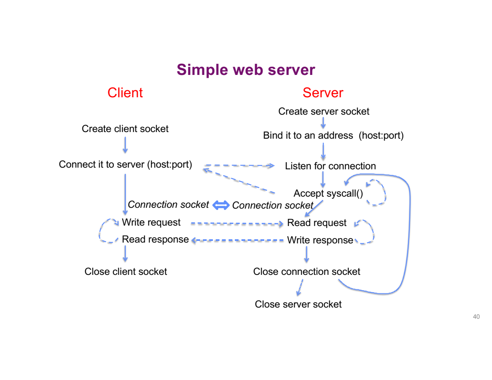

先把建连阶段的三个问题分开：

| 问题 | 普通文件 | TCP client-server |
|---|---|---|
| 如何命名目标？ | Path | Host/IP + port + protocol |
| 用什么获得可用 fd？ | `open` | Client 用 `socket/connect`，Server 用监听流程和 `accept` |
| 对方何时准备好？ | 文件可先存在，写方可早已退出 | 建连时需要可响应的 listener，传输时通过缓冲与阻塞协调 |

Client 主动知道目标服务在哪里；Server 通常不预先知道下一位 Client 的地址。Server 先绑定自己的地址等待，再接收具体 Client 的连接。因此**建立连接的角色不对称，连接建立后的读写能力却是双向的**。

### 6.1 Client：找到地址，创建，连接

```c
struct addrinfo hints = {0};
struct addrinfo *server;

hints.ai_family = AF_UNSPEC;
hints.ai_socktype = SOCK_STREAM;
int rc = getaddrinfo(host_name, port_name, &hints, &server);
```

这一步只准备地址信息，还没有连接对方：

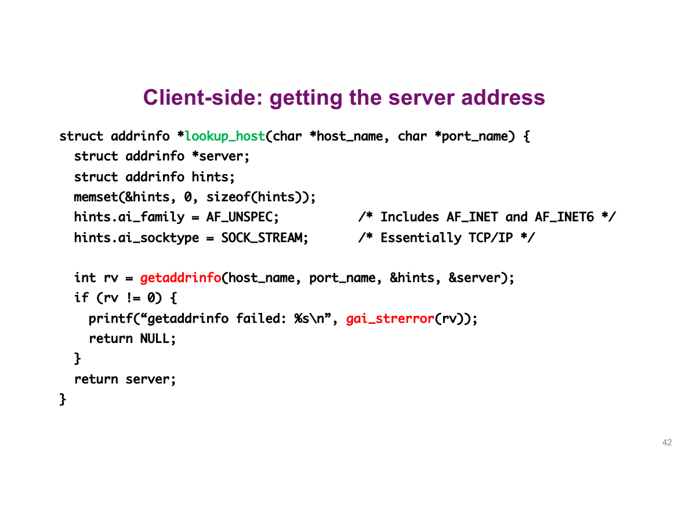

- `AF_UNSPEC`：不预先限定 IPv4 或 IPv6。
- `SOCK_STREAM`：请求 stream 类型；在这里的 IP 场景使用 TCP。
- `port_name`：可传数字字符串，例如 `"9000"`。
- `&server`：让函数通过输出参数返回地址结果链表。
- 成功 `rc == 0`；失败用 `gai_strerror(rc)` 解释，不能直接套所有系统调用的 `-1/errno` 规则。

接着，假设地址查询成功，并使用一个候选结果：

```c
int sock_fd = socket(server->ai_family,
                     server->ai_socktype,
                     server->ai_protocol);
connect(sock_fd, server->ai_addr, server->ai_addrlen);
run_client(sock_fd);
close(sock_fd);
freeaddrinfo(server);
```

这段用于看清调用顺序，省略了错误处理。完整程序应检查 `socket`、`connect`；地址查询可能返回多个候选，常需逐个尝试。`getaddrinfo` 负责准备地址，`connect` 才尝试建立连接。

**`struct addrinfo *server` 到底指向什么？** 它指向本地内存中的地址描述结构，不是远程 Server 进程，也不是 socket fd。

| 字段 | 内容 | 交给哪个调用 |
|---|---|---|
| `ai_family` | `AF_INET` 或 `AF_INET6` 等 address family | `socket` 的第 1 个参数 |
| `ai_socktype` | 例如 `SOCK_STREAM` | `socket` 的第 2 个参数 |
| `ai_protocol` | 与地址和类型匹配的 protocol | `socket` 的第 3 个参数 |
| `ai_addr` | 指向编码好 IP 和 port 的 socket address | `connect` 或 `bind` |
| `ai_addrlen` | 上述地址结构的长度 | 与 `ai_addr` 一起传递 |
| `ai_next` | 下一个候选结果 | 当前候选失败时继续尝试 |

<StudyDiagram id="lec06-sockets-pipes-15" />

`server->ai_addr` 的 `->` 表示通过结构体指针取字段。`getaddrinfo(..., &server)` 使用指针的地址，是因为它需要把结果指针写回调用方。

`memset(&hints, 0, sizeof hints)` 与这里的 `struct addrinfo hints = {0}` 都用于将这个结构初始化为零值；否则未设置的字段可能含不确定值。查询失败时不能继续解引用 `server`；使用完结果链表要 `freeaddrinfo`。

### 6.2 Server：准备本地地址

服务器常见写法：

```c
struct addrinfo hints = {0};
struct addrinfo *server;
hints.ai_family = AF_UNSPEC;
hints.ai_socktype = SOCK_STREAM;
hints.ai_flags = AI_PASSIVE;
getaddrinfo(NULL, port_name, &hints, &server);
```

**`NULL + AI_PASSIVE` 通常返回用于绑定的 wildcard address，不是“只允许本机连接”。**

| 绑定地址 | 含义 |
|---|---|
| `127.0.0.1` | 只监听 IPv4 loopback，适合本地实验 |
| `0.0.0.0` | IPv4 wildcard，监听本机各 IPv4 接口 |
| `::` | IPv6 wildcard；是否同时接收 IPv4 取决于配置 |

Wildcard 省去指定某一个本地接口的需要。其他机器能否访问，还取决于网络、路由与防火墙。见 [getaddrinfo(3)](https://man7.org/linux/man-pages/man3/getaddrinfo.3.html)。

### 6.3 Server：建立监听，再接收连接

省略错误处理的顺序示意：

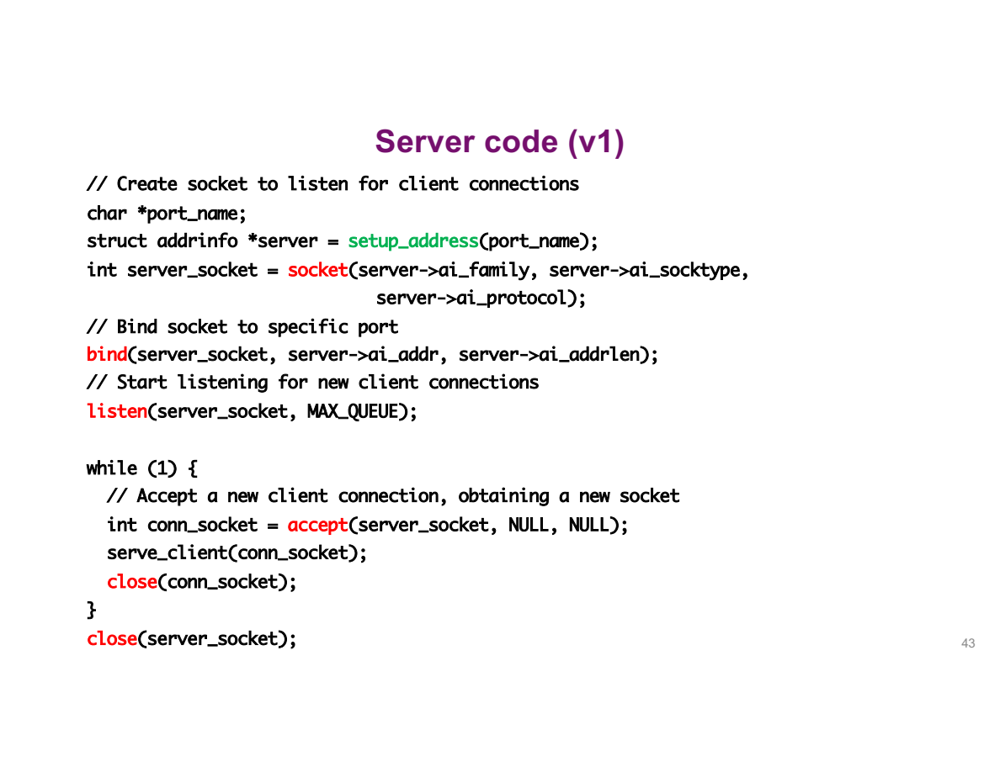

```c
int listen_fd = socket(...);
bind(listen_fd, ...);
listen(listen_fd, backlog);

while (1) {
    int conn_fd = accept(listen_fd, NULL, NULL);
    serve_client(conn_fd);
    close(conn_fd);
}
```

| 调用 | 作用 | 成功返回 |
|---|---|---|
| `socket` | 创建通信端点 | 非负 fd |
| `bind` | 绑定本地地址、端口 | 0 |
| `listen` | 把 socket 设为监听状态 | 0 |
| `accept` | 从待接收连接中取出一个，获得已连接 socket | 新的非负 fd |
| `connect` | Client 请求连接到指定地址 | 0 |

这些调用失败通常返回 `-1` 并设置 `errno`。fd 0 也可能是合法成功结果，因此不能写成 `if (fd <= 0)` 判断创建失败。

`listen` 的 backlog 与等待接收的连接队列有关，不是工作线程数，也不是整个服务器一生能服务的客户端总数。

### 6.4 两个 fd 必须分清

<StudyDiagram id="lec06-sockets-pipes-16" />

- Listening socket 不用来传输客户端的业务内容。
- `accept` 返回新的 fd，不会把原来的 listening fd 替换掉。
- 关闭 `conn_fd_A` 不会关闭 listening socket。
- 关闭 listening socket 也不等于把已经建立的所有连接同时关闭。

> 💡 **accept 不会自动创建 process 或 thread。** 它创建的是 connected socket。调用它的线程仍按顺序执行后面的 `serve_client`。内核可以把其他到来的连接放进队列，但应用是否并发处理，要由后续代码决定。见 [accept(2)](https://man7.org/linux/man-pages/man2/accept.2.html)。

没有待接收连接时，普通 blocking `accept` 会等待。有连接已排队时，它可以直接返回。TCP 握手可在内核中推进，不应把客户端 `connect` 成功理解成“服务器应用已经开始执行 serve_client”。

### 6.5 几个相似的参数和循环，含义不同

- `accept(listen_fd, NULL, NULL)` 的两个 `NULL` 表示不要求返回对端地址。它们不表示“没有 Client 地址”，也不是 wildcard binding。
- `getaddrinfo(NULL, port, &hints, &server)` 中的第一个 `NULL`，在设置 `AI_PASSIVE` 时用于准备本地 wildcard binding address。这是另一种完全不同的用法。
- `server_socket`、`listen_fd` 常是同一角色的不同变量名；`conn_socket`、`consockfd`、`conn_fd` 则表示已经接收的连接。判断用途要跟着创建它的调用走。

**服务器有两个层次的循环：**

```text
outer loop: accept Client A
    inner loop: read A -> echo A -> read A -> echo A ...
    A ends -> return from serve_client -> close A
outer loop: accept Client B
    inner loop: read B -> echo B ...
```

外层按 connection 循环，内层按本连接到达的数据循环。一个 connection 可以传很多条消息，不等于“一次消息就建立一次连接”。

无 `break` 的 `while (1)` 之后写 `close(listen_fd)`，正常情况下不会执行到。若希望正常退出，应另设退出条件或关闭流程；不能仅因为函数末尾出现 `close`，就认为每次循环都会关闭 listener。

## 7. 运行一个 TCP echo server

**核心问题：从调用顺序到真实程序，怎样判断建立连接和数据传输都成功了？**

完整可运行代码位于仓库的 `demos/lec06/tcp_echo.c`。这里使用一个程序的 `server`、`client` 两种模式；server 绑定 `127.0.0.1`，方便在本机实验。

### 7.1 两个 terminal 分别扮演两端

在仓库根目录编译：

```sh
cc -std=c11 -Wall -Wextra demos/lec06/tcp_echo.c -o /tmp/lec06_echo
```

Terminal A 启动 Server：

```sh
/tmp/lec06_echo server 9000
```

Terminal B 启动 Client：

```sh
/tmp/lec06_echo client 127.0.0.1 9000
```

输入一行文本按 Enter，Client 会显示回传内容。终端本身也可能显示键盘输入，注意区分本地回显与程序收到的回复。

也可以不用交互输入，直接执行：

```sh
printf 'hello\n' | /tmp/lec06_echo client 127.0.0.1 9000
printf 'hello2\n' | /tmp/lec06_echo client 127.0.0.1 9000
```

两次 Client 的实际输出分别是：

```text
hello
```

```text
hello2
```

本机实验中，Server 对应的输出如下。单次 `read` 的分块不是协议保证，换一次运行也可能分成更小块：

```text
accepted client
server read 6 bytes
client EOF
accepted client
server read 7 bytes
client EOF
```

`hello\n` 是 6 bytes，`hello2\n` 是 7 bytes。本例不发送字符串末尾的 NUL，不能把字节数与使用 `strlen + 1` 的程序直接混为一谈。

### 7.2 Server 怎样处理 short read？

核心循环如下，完整文件还包括错误处理：

```c
for (;;) {
    ssize_t n = read(conn_fd, buf, sizeof buf);
    if (n > 0) {
        write_all(conn_fd, buf, (size_t)n);
    } else if (n == 0) {
        break;
    } else {
        /* Retry EINTR; report other errors. */
    }
}
```

Echo 的工作只是逐字节返回，因此每次收到多少就返回多少，不需要等整句话才开始回传。若服务是“解析并计算一条请求”，就需要先收齐该请求。

Client 知道自己刚发了多少字节，所以循环累计回复，直到收到同样的总长度。它没有假设一次 `read` 足够。

`write_all` 解决另一个对称问题：一次 `write` 也可能只完成部分数据。

<StudyDiagram id="lec06-sockets-pipes-21" />

不能把整个 buffer 再写一次，否则前 4 bytes 会重复。完整 demo 也处理 `EINTR`，并将 `SIGPIPE` 转成可以报告的写入错误；它仍是学习用 blocking server，没有实现生产环境的超时和资源上限。默认使用 serial 模式，三种连接处理方式的对比见 §8.6。

### 7.3 常见运行结果如何解释？

| 现象 | 原因与排查 |
|---|---|
| 未启动 Server，Client 报 `Connection refused` | 本地目标端口没有对应 listener；先启动 Server |
| Client 使用另一个未监听的端口 | 地址中的 port 不匹配，即使 IP 正确也连不上 |
| Server 启动后没有继续输出 | 可能正常阻塞在 `accept`，不是程序没运行 |
| Client 已连接但不输入内容 | Server 可能阻塞在 `read` |
| Client 退出后 Server 仍运行 | 只关闭了当前 connected socket，外层循环继续 `accept` |

未启动 Server 的本机实际输出：

```text
connect/socket: Connection refused
```

连接失败并不总是立即 refused；其他网络环境还可能出现超时、不可达等错误。本实验也验证了 5001 bytes 输入和分段发送的回传，返回内容与发送内容一致。

交互终端中，在空输入行按 Ctrl-D 通常会使 Client 的 stdin 读到 EOF。Client 代码随后结束并关闭 socket，Server 才能观察到网络流结束。**Ctrl-D 本身不是直接发送给 Server 的“结束字符”。** 结束实验时在 Server 终端按 Ctrl-C。

## 8. 从串行处理到并发进程服务器

**核心问题：某个 Client 很慢甚至出错，如何避免它阻碍其他 Client？**

### 8.1 最简单的循环为何是串行的？

<StudyDiagram id="lec06-sockets-pipes-23" />

如果 A 的会话持续很久，`serve A` 不返回，应用就走不到下一次 `accept`。B 的连接可能已经在内核队列里，但应用还没有处理它的数据。

因此，**连接已经排队**、**accept 已返回**、**正在处理业务**是三个不同阶段。

还要注意等待的持续时间：如果 `serve_client` 里的循环读到 EOF 才返回，那么 A 即使已经收到第一句 echo，只要一直不关闭连接，就可能继续占用这个顺序 Server。判断是否“服务完成”要看函数的退出条件，不能只看一条消息是否已经处理。

### 8.2 一个连接交给一个 child process

<StudyDiagram id="lec06-sockets-pipes-24" />

独立 address space 可以限制普通内存错误的影响范围。一个子进程的错误指针通常不会直接改坏父进程的用户内存。

但这不是完整安全沙箱：子进程仍可能拥有相同文件权限、继承 fd，也可能通过共享文件影响其他进程。真正的隔离还取决于权限和资源约束。

### 8.3 fork 后为什么要交叉关闭 fd？

刚完成 `accept` 并 `fork` 时：

| Process | `listen_fd` | `conn_fd` |
|---|---|---|
| Parent | 持有 | 持有 |
| Child | 继承 | 继承 |

两边的表项分别引用同一个 listener 和同一个 connected socket。分工后只保留所需引用：

| Process | 关闭什么 | 保留什么 | 原因 |
|---|---|---|---|
| Parent | `conn_fd` | `listen_fd` | 继续接待其他 Client |
| Child | `listen_fd` | `conn_fd` | 只服务当前 Client |

> 💡 **close 的含义仍然是“释放当前进程的引用”。** Parent 关闭 `conn_fd` 后，Child 的 `conn_fd` 仍可读写；Child 关闭 `listen_fd` 后，Parent 仍能接待。

Parent 若忘记关闭自己的 connected fd，Child 退出后连接仍可能因 Parent 的引用而没有按预期结束，并且泄漏 fd。这不仅是代码整洁问题。

假设 Parent 的 listener 是 fd 3，接收 Client A 后得到 fd 4，分工可以逐步写成：

```text
accept A 后：Parent [3: listener, 4: connection A]
fork A 后： Parent [3: listener, 4: connection A]
            Child A[3: listener, 4: connection A]
关闭后：    Parent [3: listener]
            Child A[4: connection A]
```

Parent 下一次 `accept B` 可能再次得到整数 4，因为它自己的 fd 4 已经空闲。这时 Parent 的 4 指向 B，而 Child A 的 4 仍指向 A。**fd 数字只在所在进程的 fd table 中有意义。**

如果 Parent 和 Child 都去读取原来共享的 connection A，也不是各拿到请求的一份副本，而会竞争同一输入流。明确读写责任，比“多留一份总没坏处”更可靠。

### 8.4 fork 后立即 wait：有隔离，仍然串行

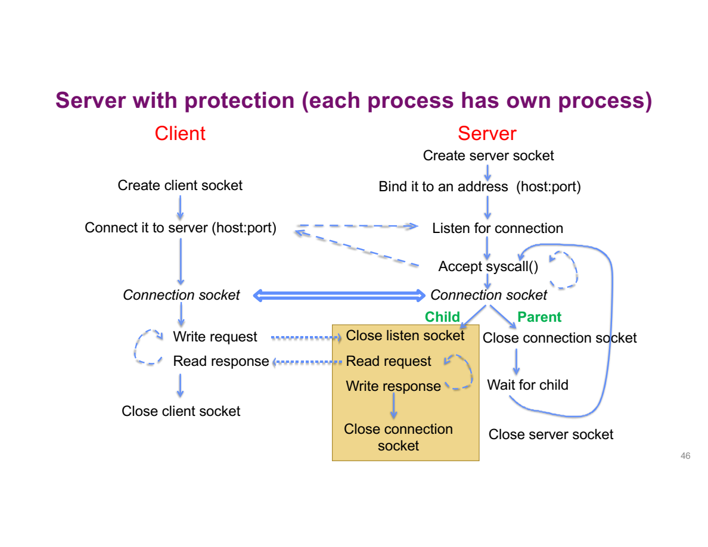

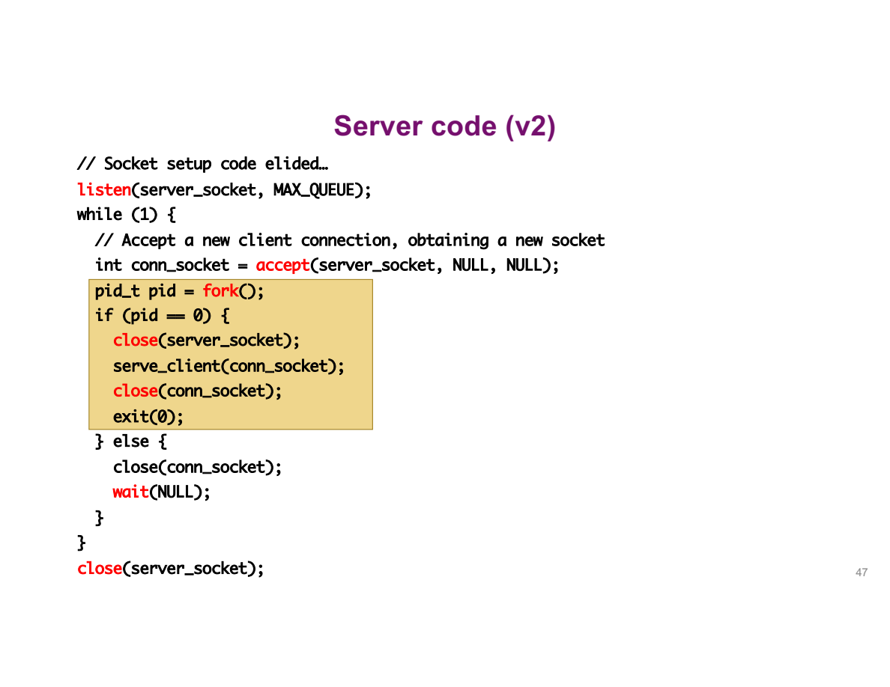

核心循环如下，假设 `listen` 已成功；这里补上创建失败的分支，其余清理策略从简：

```c
while (1) {
    int conn_fd = accept(listen_fd, NULL, NULL);
    if (conn_fd == -1) continue;

    pid_t pid = fork();
    if (pid == -1) {
        close(conn_fd);
        continue;
    }
    if (pid == 0) {                 // Child
        close(listen_fd);
        serve_client(conn_fd);
        close(conn_fd);
        exit(0);
    } else {                        // Parent
        close(conn_fd);
        while (waitpid(pid, NULL, 0) == -1 && errno == EINTR) {}
    }
}
```

`fork` 成功返回两次：Parent 得到 Child PID，Child 得到 0，双方从同一调用的下一句继续。因此条件分支决定谁执行接待逻辑、谁执行服务逻辑。

Child 中的 `exit(0)` 也很重要：`serve_client` 的 `return` 只返回到当前调用者。若 Child 不退出，就可能继续走回外层接待循环，而它的 listener 已经关闭。

执行顺序：

<StudyDiagram id="lec06-sockets-pipes-26" />

这个模式与 shell 等待 foreground command 结束相似。Child A 活着时，Parent 不会继续进入下一轮 `accept`。

**Process isolation 回答“互相能破坏什么”；concurrency 回答“能否交错推进多项工作”。创建子进程并不自动保证应用层并发。**

### 8.5 并发的关键：Parent 及时回到 accept

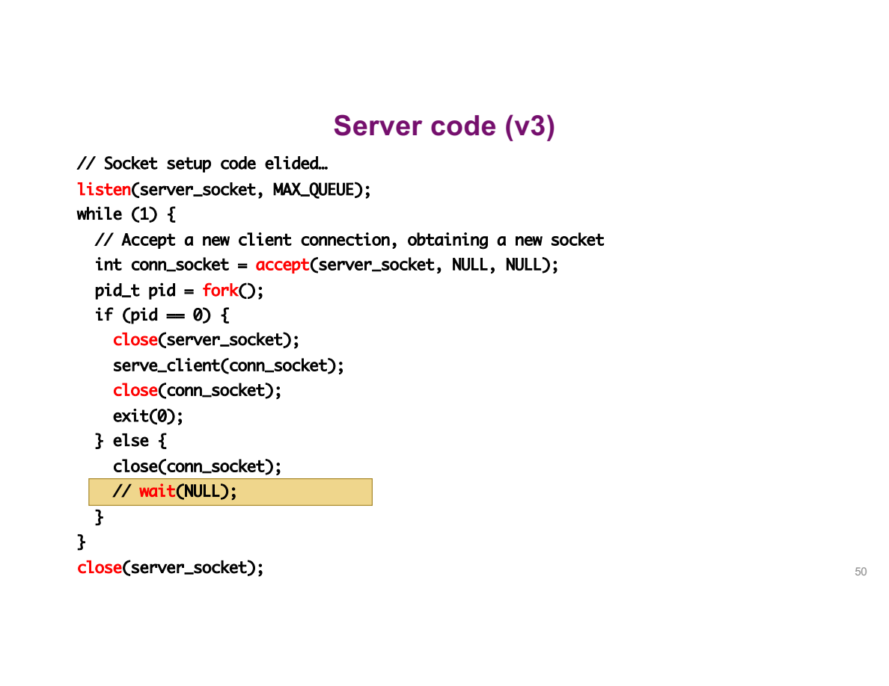

在已安排异步回收 Child 的前提下，核心循环变为：

```c
while (1) {
    int conn_fd = accept(listen_fd, NULL, NULL);
    if (conn_fd == -1) continue;
    pid_t pid = fork();
    if (pid == -1) { close(conn_fd); continue; }
    if (pid == 0) {
        close(listen_fd);
        serve_client(conn_fd);
        close(conn_fd);
        _exit(0);
    }
    close(conn_fd);              // Parent releases its copy
    // No blocking wait here: loop immediately returns to accept.
}
```

这里用 `_exit` 直接结束 Child，避免再次刷新从 Parent 继承的 `stdio` 输出缓冲；理解并发性的关键仍是 Parent 不在此处阻塞等待。完整示例中的 `SIGCHLD` 处理器负责回收退出的 Child。

<StudyDiagram id="lec06-sockets-pipes-27" />

Parent 不在每次接收连接后立刻等待刚创建的 Child，便能继续接待。多项服务可以交错进行，是否在多个 CPU core 上真正同时执行则取决于调度和硬件。

还需要处理三件事：

- **Child reaping**：退出的 Child 仍需要被回收。可以在合适位置用非阻塞 `waitpid(..., WNOHANG)` 配合 `SIGCHLD` 等机制，不能只删掉所有 `wait` 就当作完整服务器。
- **Fork failure**：`fork()` 返回 `-1` 时要关闭已接收的连接或按策略处理，不能按成功分支继续。
- **Shared resources**：独立进程仍可能同时修改同一文件、数据库或共享内存，需要相应同步。

### 8.6 实验：A 不断开，B 能得到回复吗？

`demos/lec06/tcp_echo.c` 支持三种 Server 模式。Client 行为保持不变，只改变 Server 的调度方式：

```sh
cc -std=c11 -Wall -Wextra demos/lec06/tcp_echo.c -o /tmp/lec06_echo
/tmp/lec06_echo server 9000 serial
```

将最后的 `serial` 换成 `fork-wait` 或 `fork` 即可比较；更换模式前先结束前一个 Server，或使用不同端口。

实验步骤：

1. A 连接，发送 `A\n`，确认收到回声，随后保留连接。
2. B 再连接，发送 `B\n`。
3. 观察 A 尚未断开时 B 能否收到回声。
4. 关闭 A，再观察 B；最后用第三个 Client 检查 listener 是否仍可用。

本机真实结果：

| Server 模式 | A 未断开时，B 得到回声 | A 断开后，B 得到回声 | 第三个 Client |
|---|---|---|---|
| `serial` | 否，观察窗口内无回复 | 是 | 正常 |
| `fork-wait` | 否，观察窗口内无回复 | 是 | 正常 |
| `fork` | 是 | 已经收到 | 正常 |

前两个模式不是 B 的数据神秘丢失，而是应用尚未轮到处理 B。实验用 0.7 秒接收超时观察“未回复”，再通过关闭 A 后确实收到原回复，验证等待与数据丢失的区别。

这个实验只验证服务顺序，不是吞吐量基准测试。

## 9. Threads 与 thread pool

**核心问题：每个连接都创建新进程，会不会太贵？一直创建线程又是否足够？**

### 9.1 Thread per connection

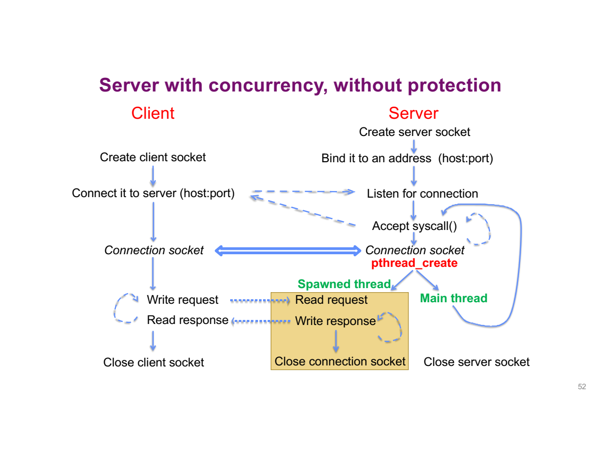

<StudyDiagram id="lec06-sockets-pipes-28" />

相较于创建独立进程，线程通常有较低的创建与切换开销，并能直接访问同一 address space 的数据。但具体性能取决于程序和系统，并不是所有场景都一定更快。

代价是：

- 各线程共享进程的 address space；错误访问内存可能影响整个服务。
- 共享可变数据可能发生 data race，需要锁或其他同步。
- 线程需要 `pthread_join` 或适当 detach，避免退出后相关资源长期未回收。

### 9.2 为什么不能照搬 fork 版本的 close？

`fork` 后各进程拥有自己的 fd 表，而同一个进程中的 threads 共享 fd 表。

<StudyDiagram id="lec06-sockets-pipes-29" />

正确分工是移交 connected fd 的使用责任，由 Worker 完成服务后关闭。Main 继续保留 listening fd。

传参数也要小心：若 Main 每次都把同一个循环变量 `&conn_fd` 传给新线程，下一轮可能在 Worker 读取前覆盖它。需要给每个任务稳定的参数存储和明确的释放责任。

用一个具体交错就能看见问题：

```text
Main:   conn_fd = 4; create Worker A with &conn_fd
Main:   conn_fd = 5; create Worker B with &conn_fd
A:      finally reads *argument -> 5, not the intended 4
```

一种常见安排是为每个任务分配独立参数对象，Worker 先取出 fd 值，再释放参数对象；服务结束后关闭 fd。另一种是把 fd 值作为任务存进受同步保护的 queue。

`pthread_create` 与 `fork` 也不同：Worker 从指定的 worker function 开始，而不是像 fork 的 Child 一样从创建调用之后返回 0。

### 9.3 Echo 为什么可能不需要给每个 buffer 加锁？

假设每个 Worker：

- 拥有自己的连接 fd；
- 在自己的调用栈中创建局部 `char buf[128]`；
- 只对这个连接读写，不修改公共业务数据。

那么不同 Worker 没有同时修改同一个业务 buffer，不必为了“用了线程”就给所有局部变量加锁。

但只要加上下面的内容，就要重新分析共享访问：

```c
total_requests++;       // shared counter
update_shared_cache(); // shared mutable structure
```

局部 buffer 无冲突，不代表整个服务没有共享资源。公共日志、连接队列和统计信息都可能需要协调。线程栈虽然各有一份，但都在同一进程 address space 中，也不是彼此受到硬件保护的区域。

### 9.4 为什么 thread pool 有用？

如果 10000 个连接就创建 10000 个线程，会消耗栈空间、调度资源和其他内核资源。线程更多并不保证 throughput 更高；过多争用和切换反而可能拖慢处理。

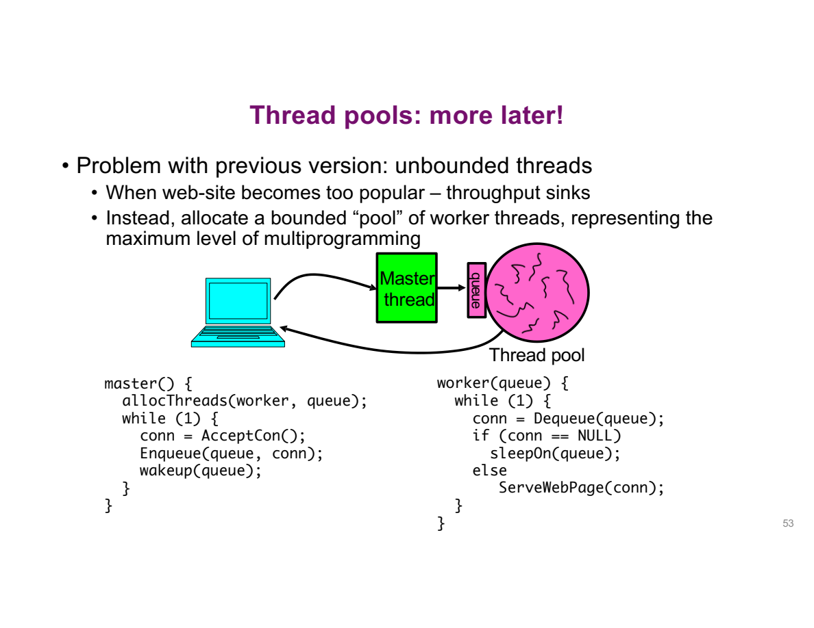

Thread pool 把“接待”与“服务”分开：

1. 预先创建有限数量的 Worker，例如 4 个。
2. Main 接受新连接，放入任务 queue。
3. 空闲 Worker 取出一个连接并服务。
4. 完成后取下一个；没有任务则等待。

<StudyDiagram id="lec06-sockets-pipes-31" />

如果 4 个 Worker 都忙，第 5 个任务先排队。**限制的是正在处理任务的 worker 数量，不必等于已建立连接的总数。** 队列也不能无限增长，完整系统还要设置队列容量及过载策略。

> 💡 Dequeue、sleep、wakeup 表达工作分工，并不是可以直接拼起来的线程安全实现。检查“队列为空”与进入等待之间若没有正确同步，可能丢失唤醒。实际通常使用 mutex + condition variable，并在循环中重新检查条件。

**把 Master 与 Worker 的伪代码分别走一遍：**

```text
Master:
    start a fixed set of workers
    repeat:
        conn = accept a connection
        enqueue conn
        notify a waiting worker

Worker:
    repeat:
        wait until the task queue is nonempty
        conn = dequeue one task
        serve conn
        close conn
```

假设只有两个 Worker，A、B 已开始服务，C、D 又到达：

| 时刻 | Worker 1 | Worker 2 | Task queue |
|---|---|---|---|
| A、B 正在处理 | A | B | 空 |
| C 到达 | A | B | C |
| D 到达 | A | B | C、D |
| B 先结束 | A | C | D |
| A 随后结束 | D | C | 空 |

任务按队列规则领取，但完成顺序取决于每个任务耗时。`wakeup` 是通知等待条件可能改变，不是创建新线程；没有空闲 Worker 时，任务先保留在队列里。队列暂时为空也不是服务器永久结束，Worker 应等待未来任务。

**不要把三类 queue 混在一起：**

| Queue / buffer | 存放什么 | 谁取走 |
|---|---|---|
| Listener 的待接收连接队列 | 等待应用 accept 的连接 | Main 的 `accept` |
| Connected socket 的接收缓冲区 | 已到达的业务字节 | 对应连接的 `read` |
| Thread pool 的 task queue | 已接收、等待 Worker 服务的任务 | Worker 的 dequeue |

`listen(backlog)`、接收 buffer 容量、Worker 数量分别控制不同环节，不能互相代替。

### 9.5 把几种版本放在一起

| 模型 | 当前 Client 未结束时能否服务新 Client | 主要隔离边界 | 主要成本或风险 |
|---|---|---|---|
| 单线程顺序处理 | 否 | 无额外连接隔离 | 一个慢连接阻碍后续处理 |
| Fork + 立即 wait | 否 | 独立 address spaces | 进程开销，仍然串行 |
| Fork + Parent 继续 accept | 可以 | 独立 address spaces | 回收 Child、进程数量、共享外部资源 |
| 每连接一个 thread | 可以 | 共享 address space | 数据竞争、线程数量 |
| Bounded thread pool | 可以，受 Worker 数限制 | 共享 address space | 队列同步、排队延迟、过载处理 |

## 10. Pipe 的创建与方向

**核心问题：如果只是本机进程之间传递数据，是否需要完整的 IP 寻址和 TCP 连接流程？**

### 10.1 一个调用，两个 fd

```c
int pipe_fd[2];
if (pipe(pipe_fd) == -1) {
    /* Creation failed. */
}
```

成功时返回 0，并把两个 fd 写入数组：

<StudyDiagram id="lec06-sockets-pipes-33" />

- `pipe_fd[0]` 是读端。
- `pipe_fd[1]` 是写端。
- 数组下标 0、1 不是实际 fd 编号。实际值可能是 3、4，也可能是其他可用编号。
- Pipe 不需要路径，也不需要显式提供 IP、port。
- Pipe 是有限容量的 byte stream，没有普通文件 offset，也不支持 `lseek`。

### 10.2 同一个进程也能使用 pipe

```c
char msg[] = "hello";
char buf[16];
int p[2];
pipe(p);
write(p[1], msg, 5);
ssize_t n = read(p[0], buf, sizeof buf);
```

这段只展示成功路径。即使只有一个进程，数据也会经过内核 pipe，再读回用户 buffer。它有助于理解方向，也可用于同进程内线程之间通信。

需要检查返回值，并打印真正读到的 `buf`。如果打印的是原来已经存在的 `msg`，即使读取失败，也可能看到相同字符串，无法证明数据经过了 pipe。

此外，同一个线程若先写入远超容量的数据，再打算读取，可能在写满时阻塞，永远走不到后面的读取。小消息实验不能推广成无限容量。

### 单进程示例里的几个变量怎样对应？

| 变量 | 存的是什么 | 不是哪一种东西 |
|---|---|---|
| `pipe_fd` / `p` | 两个 fd 的数组 | 不是装消息的缓冲区 |
| `msg` | 准备发送的字节 | 不是 read 写入的目标 |
| `buf` | 接收空间 | 内容不自动与 msg 相同 |
| `writelen` | write 实际接受的字节数 | 不必自动等于请求长度 |
| `readlen` | read 实际返回的字节数 | 不必自动等于 buffer 容量 |

`pipe(p)` 的返回值用于判断成功或失败，端点编号由输出数组 `p` 获得。这与 `socket()` 直接返回一个 fd 不同。将 `pipe` 的成功返回值 0 当作读端 fd，会把创建结果和数组内容混淆。

若发送 `strlen(msg) + 1`，发送方把 NUL 一起送入通道；即使如此，接收方也要确认已收齐 NUL 才能安全按完整 C string 使用。

### 10.3 能否交换两个端点的读写方向？

**Portable rule：始终写 `[1]`，读 `[0]`。** Linux 的普通 pipe 是单向的；部分系统可能提供扩展，不能依赖这些扩展写可移植程序。见 [pipe(7)](https://man7.org/linux/man-pages/man7/pipe.7.html)。

仓库中的 `demos/lec06/pipe_direction.c` 检查了真正的系统调用返回值。本机运行：

```text
write(p[0]) = -1, errno = 9 (Bad file descriptor)
```

这表明当前环境下不能往读端写入。`Bad file descriptor` 也可表示 fd 不支持当前请求的读写模式，不只表示这个编号不存在。

**交换发送者和接收者是另一回事。** 可以让 Child 写 `[1]`、Parent 读 `[0]`；这是交换进程角色，管道方向仍未改变。

## 11. Pipe 与父子进程通信

**核心问题：父子进程的普通内存分开，为什么却能访问同一条 pipe？**

### 11.1 先 pipe，再 fork

```c
int p[2];
pipe(p);
pid_t pid = fork();
```

内核先创建一条 pipe，随后 Child 继承指向这条 pipe 的读、写 fd：

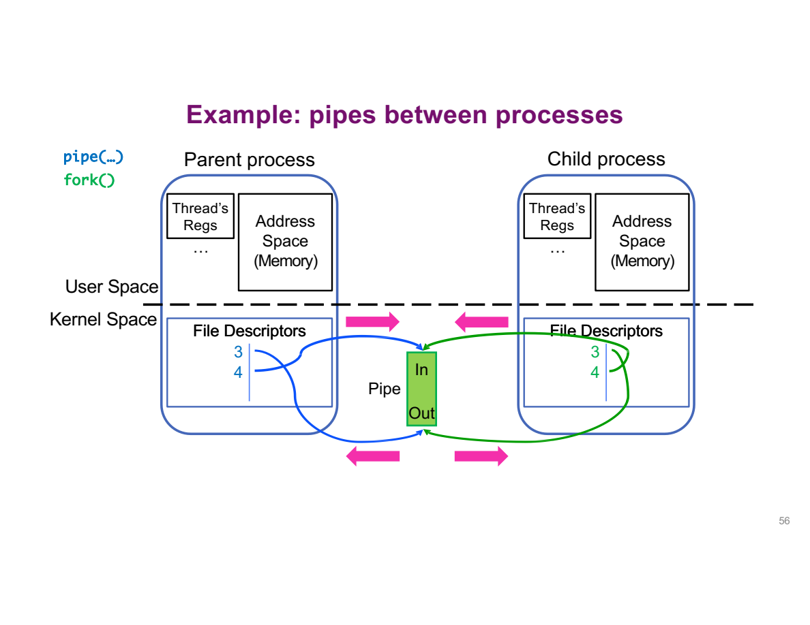

- 有两份 fd 表，但只有原来那条 pipe。
- 数组 `p` 的值随进程内存复制，指向的内核资源通过 fd 引用共享。
- 如果先 `fork`，再让 Parent 和 Child 各自 `pipe()`，它们创建的是两条独立 pipe，不会自动接通。

### 11.2 Parent → Child 的引用变化

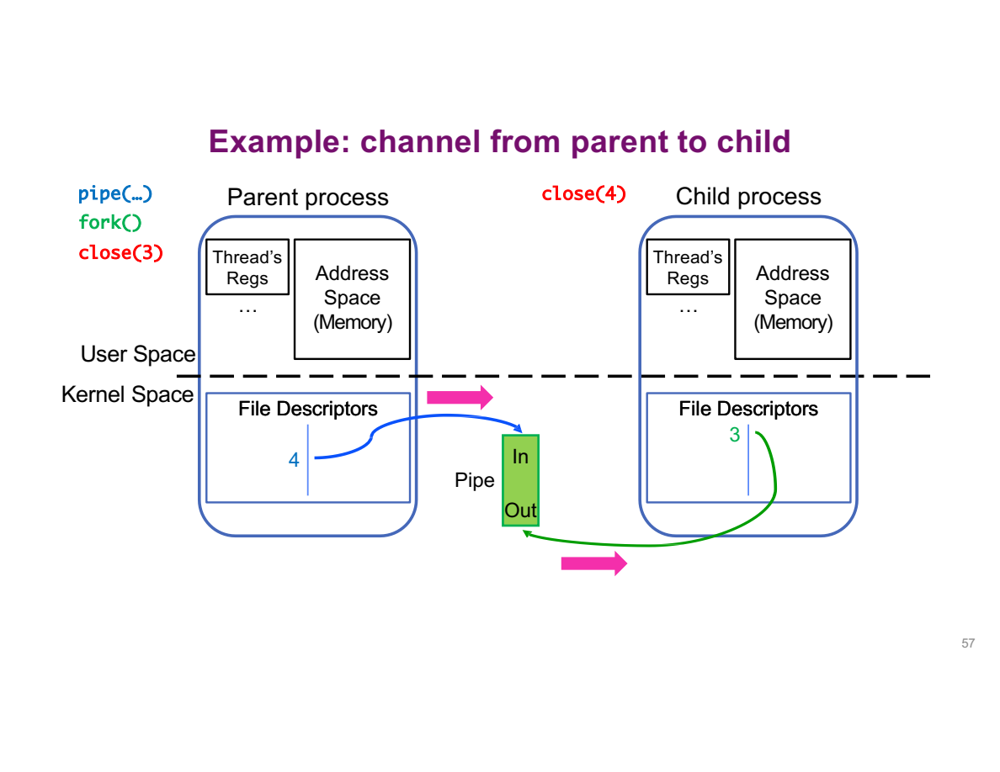

| 阶段 | Parent | Child |
|---|---|---|
| `fork` 刚返回 | 读端、写端都在 | 读端、写端都在 |
| 分工后 | `close(p[0])`，保留写端 | `close(p[1])`，保留读端 |
| 传输中 | `write(p[1], ...)` | `read(p[0], ...)` |
| 结束 | 关闭写端，等待 Child | 读完剩余数据，遇到 EOF，关闭读端 |

普通 buffer 没有跨进程共享。实际的数据路径是：

<StudyDiagram id="lec06-sockets-pipes-35" />

### 11.3 一段代码，分成两条执行路径

下面省略失败处理，用来跟踪分工；完整版本在 `demos/lec06/pipe_parent_child.c`：

```c
int p[2];
pipe(p);
pid_t pid = fork();

if (pid == 0) {                // Child
    close(p[1]);
    char buf[3];
    ssize_t n;
    while ((n = read(p[0], buf, sizeof buf)) > 0) {
        printf("child read %zd bytes: %.*s\n", n, (int)n, buf);
    }
    close(p[0]);
} else if (pid > 0) {          // Parent
    close(p[0]);
    write(p[1], "hello", 5);
    close(p[1]);
    waitpid(pid, NULL, 0);
}
```

完整版本处理 `EINTR`、写入进度和 `fork` 错误。可以编译运行：

```sh
cc -std=c11 -Wall -Wextra demos/lec06/pipe_parent_child.c -o /tmp/lec06_pipe
/tmp/lec06_pipe
```

真实输出：

```text
child read 3 bytes: hel
child read 2 bytes: lo
child read 0: EOF
```

这里 Child buffer 只有 3 bytes，所以一个 5-byte 写入被分两次读取。输出中的 `%.*s` 用实际字节数限制字符串打印，不依赖 buffer 自带 NUL。

Parent 和 Child 谁先被调度并不确定，但不影响这个例子的正确性：

- Child 先运行：空 pipe 的 `read` 等待，Parent 写入后继续。
- Parent 先运行：数据暂存在 pipe，Child 随后读取。
- Parent 写完关闭写端：数据不会立即消失，Child 仍先读完缓存，再读到 EOF。

## 12. EOF、close 与 pipe 的等待条件

**核心问题：发送完一句话，为什么接收方有时一直等不到结束？**

### 12.1 EOF 需要两个条件同时满足

对非零长度的读取请求，在普通 blocking pipe 上：

| Buffer 状态 | 是否还有任何写端引用 | read 行为 |
|---|---|---|
| 有数据 | 有或没有 | 返回读到的 bytes |
| 空 | 有 | 等待可能到来的数据 |
| 空 | 没有 | 返回 0，即 EOF |

因此：

```text
EOF = 缓冲区已读空 + 所有进程中的写端引用均已关闭
```

不是“Parent 写完一条消息”，也不是“等了一会儿没收到新内容”。

### 12.2 Child 忘关自己的写端会发生什么？

假设 Child 只读，但没有执行 `close(p[1])`：

1. Parent 写出 `hello`，关闭自己的写端。
2. Child 读完 `hello`，再次调用 `read`。
3. 内核发现 Child 仍保留一个写端引用。
4. 内核无法判断 Child 将来不会写，所以 `read` 继续等待。

> 💡 **不打算使用某个 fd，与已经 close，是两种状态。** 内核只能根据仍然存在的引用判断是否还有发送者，无法根据程序员的意图判断。关闭不用的端点直接关系到 EOF 和资源生命周期。

若 Parent 此时还在 `waitpid` 等 Child 退出，就会形成：Parent 等 Child，Child 等可能的数据，双方都不能完成。

反过来，若程序只做一次 `read`，读到一小段内容就退出，暂时不关冗余写端也可能看起来能运行。这个现象并不推翻 EOF 规则：它只是尚未执行“继续读到 EOF”的那一步。

排查等待问题时，画出**全部进程**持有的端点，而不只检查“真正发送数据的那个进程有没有 close”。

### 12.3 write 也可能等待或失败

- Pipe 满且仍有 Reader 时，blocking `write` 可能等待 Reader 腾出空间。
- 所有读端都关闭后，再写会触发 `SIGPIPE`；默认动作通常会终止进程。
- 若忽略 `SIGPIPE`，写入会以 `-1` 失败，`errno` 为 `EPIPE`。

不能把“不用的读端一直留着”也当成无害：这可能让写方误以为仍有 Reader，写满后一直等，而不是及时获知已经无人读取。

这些规则见 [pipe(7)](https://man7.org/linux/man-pages/man7/pipe.7.html)。消息边界、多个发送者的协调和业务顺序仍由程序处理；pipe 并不自动消除所有同步问题。

### 12.4 为什么 Parent 应先写，再 wait？

<StudyDiagram id="lec06-sockets-pipes-38" />

同理，父子双方需要双向通信时，通常建立两条 pipe，并约定谁先发请求、谁回响应。若双方都先等对方读完或先无限写入，也可能互相阻塞。

### 12.5 File、pipe、TCP socket 读不到数据时有何区别？

| 当前状态 | 普通文件 | Pipe | 已连接的 TCP socket |
|---|---|---|---|
| 有可读字节 | 按 offset 读取 | 消费 pipe 中的字节 | 消费本端接收字节 |
| 暂时没有字节 | 在当前文件末尾通常返回 0，不等待未来追加 | 有写端时 blocking read 等待 | 对方发送方向未结束时 blocking read 等待 |
| 流已结束 | 到达当前文件末尾 | 所有写端关闭且缓存读空 | 对方有序结束发送且缓存读空 |

表中请求长度均大于 0，并使用普通 blocking 模式；错误是另一条返回路径。TCP 的 EOF 说明对方不再发送，不必然代表本端已经关闭自己的发送方向。

“统一 read 接口”不意味着“对所有对象，空了以后都一样等待”。这也是为什么用普通文件通信时，往往还要额外约定生产进度和完成标记。

## 13. IPC 选择与系统编程的整体关系

**核心问题：有这么多通信机制，选择时应该先判断什么？**

### 13.1 先看通信范围和数据寿命

| 场景 | 常见机制 | 原因 |
|---|---|---|
| 同一个 thread 内部 | Function call | 同一执行流，可以直接传参数、返回结果 |
| 同一进程的不同 threads | Shared memory + synchronization | 共享 address space，但需协调可变数据 |
| 有共同祖先的本机 processes | Anonymous pipe | 可通过继承 fd 获得同一通道 |
| 同机、无关 processes | UNIX domain socket、文件、named shared memory 等 | 需要双方能找到的端点或对象 |
| 不同机器的 processes | Network socket 等网络通信接口 | 需要网络地址和传输机制 |

Pipe 不只限于直接父子进程。例如 Parent 创建 pipe 后让两个 Child 分别继承所需端点，也能通信。本讲讨论 anonymous pipe；有路径名的 FIFO 是相关但不同的创建方式。

### 13.2 为什么本机父子通信常用 pipe？

相较于本讲的 TCP client-server 建连方式：

- 不需要 IP、port、地址解析和 `connect/accept` 配对。
- 创建后通过 `fork` 继承端点即可使用。
- 不需要 TCP 的网络协议处理。

这不是说 socket 无法被继承。`fork` 同样继承 socket fd，多进程服务器正是这样把连接交给 Child；本地 `socketpair` 也可直接创建成对端点。**简洁与否取决于所选 socket 类型和使用方式。**

相较于普通文件：

- 不需要命名并维护持久文件。
- 不用自行管理文件 offset 与旧消息的清理。
- 空时等待、满时等待等基本流控由内核提供。

若确实需要跨时间保存记录，文件反而适合。若需要双向本地通信、更多端点组织方式，可以考虑 UNIX domain socket。不要把选型表理解成“每个场景只允许一种机制”。

### 13.3 Everything is a file 到底统一了什么？

<StudyDiagram id="lec06-sockets-pipes-extra-50" />

统一接口让上层代码复用读写逻辑，但建立和定位资源的方式仍然不同：

| Resource | 创建或打开 | 是否支持普通文件式定位 |
|---|---|---|
| Regular file | `open(path, ...)` | 通常支持 `lseek` |
| Connected TCP socket | `socket` + `connect`，或 `accept` | 不支持 |
| Pipe | `pipe` | 不支持 |

统一也不表示 fd 直接等于指针、所有操作都有相同语义，或所有资源都在磁盘上。

### 13.4 Process 的两个方面

- **Threads provide execution / concurrency**：保存并推进执行状态。
- **Address space provides memory isolation / protection**：限定普通用户代码能访问的内存。

因此，对“创建进程”的讨论要分别追问：需要另一条执行流，还是需要独立的内存隔离？这正是 process server 与 thread server 的选择差异。

在典型内核线程模型中，一个用户线程涉及 user stack 与 kernel stack：

<StudyDiagram id="lec06-sockets-pipes-40" />

User stack 保存用户函数的局部状态、返回关系；kernel stack 支持内核执行系统调用和保存相关状态。两者的保护级别不同，不是用户代码可以随意互换使用的两块 buffer。“两个 stacks”也不代表应用因此多出第二个可独立调度的用户线程。

把它和 blocking read 连起来：

1. 用户函数在 user stack 上保存局部变量，例如接收数组 `buf`。
2. `read` 进入内核，内核在受保护的执行环境中检查 fd 并处理 I/O。
3. 如果需要等待，内核保存必要的执行状态，让调度器运行其他线程。
4. 数据到达后，当前线程恢复内核中的处理，再带着返回值回到原用户函数。

有时会把内核维护的线程执行状态、kernel stack 及相关支持统称为内核侧线程实现。不要因此混淆“用户线程在内核中的执行”与“只运行内核任务的独立 kernel thread”；后者不是本程序多创建出来的普通 Worker。

下一步学习 synchronization，就是回答：当执行流并发推进、又必须访问共享状态时，怎样保证程序的逻辑仍然正确？

## 14. Self-check

**核心问题：能否不看代码注释，仅根据 fd 引用、执行顺序与返回值判断程序行为？**

### Questions

1. Parent 打开普通文件并读到 offset 100 后 `fork`。Parent 再成功读 100 bytes，Child 随后成功读 100 bytes。Child 从哪里读？如果 Parent 接着 `close(fd)`，Child 还能读吗？分别重新 `open` 又有什么不同？
2. Server 已经 `listen`，执行 `conn_fd = accept(listen_fd, ...)`。这两个 fd 各做什么？`accept` 是否创建新线程？为什么第二个 Client 可能已经连接，却迟迟收不到回复？
3. Client 分两次发送 `hello`、`world`。Server 一次 `read(..., 100)` 只返回 3，是否代表出错或 TCP 乱序？`0`、`-1`、`\0` 又分别是什么？
4. Fork server 为什么 Parent 关闭 connected fd、Child 关闭 listening fd？每次 fork 后立即 wait 有什么影响？如果换成 threads，Main 能否同样立即 close connected fd？
5. Parent 想把 `hello` 发给 Child：pipe 与 fork 谁先？双方分别关闭哪端？Child 为什么必须关闭自己的写端？能否改为 Child 发送？如果 Parent 一开始就 wait 会怎样？
6. Thread pool 有 4 个 Worker，却有 10 个连接，是否意味着只能建立 4 条连接？每个 Worker 有局部 buffer，是否意味着整个服务器都不需要同步？

7. 采用 NUL framing 时，先收到 `he`，后来收到 `llo\0next\0`。完整消息有几条？若只收到 `hello` 就遇到 EOF，应当报告完整消息还是截断？
8. `getaddrinfo` 返回的 `server` 是 socket 吗？`ai_family`、`ai_addr` 分别交给什么函数？两个 `NULL` 出现在 `accept` 和 `getaddrinfo` 时含义相同吗？
9. Child 在 `serve_client` 中执行 `return` 后，是否已经退出进程？Parent 关闭自己的 fd 4 后，再 accept 得到 fd 4，为什么不会覆盖 Child 原来的连接？
10. 两个 Worker 正服务 A、B，C、D 在 queue 中。B 先结束后谁处理 C？`wakeup` 是否意味着新建 Worker？如果 TCP 字节已经在接收 buffer 中，是不是业务一定处理过了？

### Answers

**A1.** Child 从 offset 200 开始读 bytes 200–299，之后共享 offset 为 300。Parent 关闭自己的 fd 不影响 Child 保留的引用。若两者独立 `open`，通常各有独立 open file description 和 offset，虽然文件数据仍然相同。

**A2.** `listen_fd` 负责接收新连接；`conn_fd` 与某个 Client 传输数据。`accept` 不创建线程或进程。顺序 Server 若还在服务第一个 Client，就不会进入下一轮处理第二个；第二个连接可以先在内核队列中等待。

**A3.** 返回 3 表示成功收到 3 bytes，可能只是消息前缀，应保存并继续读取。TCP 保持应用字节顺序，不保证 read 与 write 的分块一致。请求长度大于 0 时，`read` 返回 0 表示 EOF，返回 -1 表示错误；`\0` 是值为零的实际字节，可被应用约定为字符串或消息结束，不是 EOF 返回值。

**A4.** Parent 只负责接待，Child 只负责当前连接，关闭各自不需要的引用能正确管理生命周期。立即 wait 会让 Parent 等当前 Child 退出再接待，仍是串行服务。Threads 共享 fd 表，Main 不能在 Worker 仍要用该 fd 时关闭它，应把关闭责任交给 Worker。

**A5.** 先 `pipe` 再 `fork`，才能继承同一条 pipe。Parent 关 `[0]`、写 `[1]`；Child 关 `[1]`、读 `[0]`。Child 若留下写端，读空后内核仍认为可能有发送者，无法交付 EOF。可以交换进程角色，但仍写 `[1]`、读 `[0]`。Parent 若先 wait，Child 等数据、Parent 等 Child，就可能互相阻塞。

**A6.** 4 个 Worker 限制同时服务的任务数，其余连接可以按策略排队，队列容量也应受控。局部 buffer 不互相冲突，但 queue、counter、cache 等共享可变状态仍需要同步；还要确保任务参数、fd 和线程退出资源的生命周期正确。


**A7.** 两条，分别为 `hello` 与 `next`。读取边界不等于消息边界。若 `hello` 后没有 NUL 就 EOF，则该协议下消息被截断；不能把传输结束自动当作协议约定的 NUL。

**A8.** `server` 是指向本地地址结果结构的指针。`ai_family` 等字段用于创建 socket，`ai_addr` 与 `ai_addrlen` 用于 connect 或 bind。`accept` 的两个 NULL 表示不接收对端地址输出；设置 AI_PASSIVE 后，`getaddrinfo` 的 hostname 为 NULL 用于准备 wildcard 本地地址。

**A9.** return 只离开当前函数，Child 仍会继续执行调用后的代码，需要 exit、_exit 或从 main 返回才能结束进程。父子各有自己的 fd table；Parent 新获得的 fd 4 与 Child 仍持有的 fd 4 可以引用不同连接，编号复用不会跨进程覆盖表项。

**A10.** 原来服务 B 的 Worker 取出 C，D 继续等待；不需要为 C 创建新线程。wakeup 通知已有的等待线程检查任务条件。TCP 收到字节只表示它们到达了内核接收缓冲区，业务处理要等 Worker 执行 read 并解释内容。
